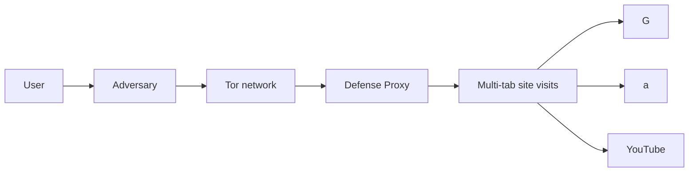
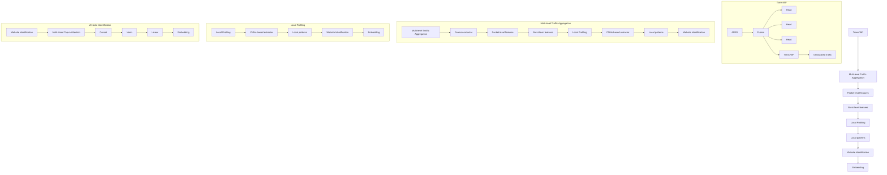
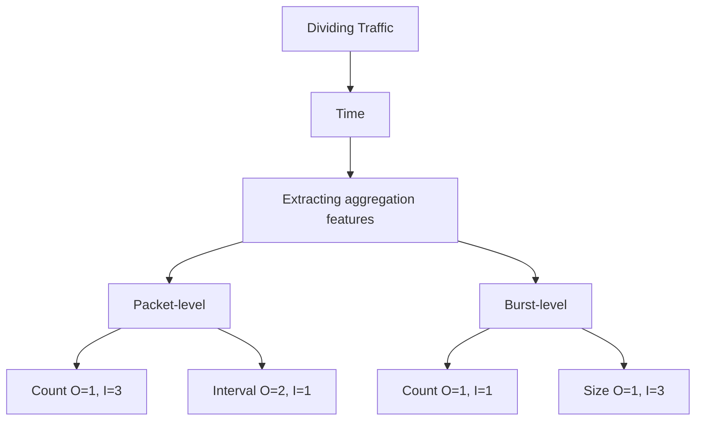
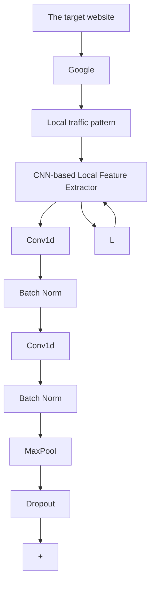

# Toward Robust Multi-Tab Website Fingerprinting

Xinhao Deng , Xiyuan Zhao , Qilei Yin , Zhuotao Liu , Senior Member, IEEE, Qi Li , Senior Member, IEEE, Mingwei Xu , Senior Member, IEEE, Ke Xu , Fellow, IEEE, and Jianping Wu, Fellow, IEEE

Abstract—Website fingerprinting enables an eavesdropper to determine which websites a user is visiting over an encrypted connection. State-of-the-art website fingerprinting (WF) attacks have demonstrated effectiveness even against Tor-protected network traffic. However, existing WF attacks have critical limitations on accurately identifying websites in multi-tab browsing sessions, where the holistic pattern of individual websites is no longer preserved, and the number of tabs opened by a client is unknown a priori. In this paper, we propose ARES, a novel WF framework natively designed for multi-tab WF attacks. ARES formulates the multi-tab attack as a multi-label classification problem and solves it using the novel Transformer-based models. Specifically, ARES extracts local patterns based on multi-level traffic aggregation features and utilizes the improved self-attention mechanism to analyze the correlations between these local patterns, effectively identifying websites. We implement a prototype of ARES and extensively evaluate its effectiveness using our large-scale datasets collected over multiple months. The experimental results illustrate that ARES achieves optimal performance in several realistic scenarios. Further, ARES remains robust even against various WF defenses.

Index Terms—Website fingerprinting attack, deep learning, traffic analysis.

## I. INTRODUCTION

A NONYMOUS communication techniques are designedto prevent the content and metadata of network communications from being leaked and/or tampered by

Received 8 December 2024; revised 5 July 2025 and 13 December 2025; accepted 12 February 2026; approved by IEEE TRANSACTIONS ON NETWORKING Editor Y. Liu. Date of publication 23 February 2026; date of current version 3 March 2026. This work was supported in part by Beijing–Tianjin–Hebei Natural Science Foundation Cooperation Project under Grant 25JJJJC0003; in part by the National Natural Science Foundation of China under Grant 62132011, Grant 62425201, Grant 62221003, Grant 62502473, and Grant 62472247; in part by the Fundamental and Interdisciplinary Disciplines Breakthrough Plan of the Ministry of Education of China under Grant JYB2025XDXM114; and in part by the Ant Group Postdoctoral Program. A preliminary version of this manuscript has been published in the proceedings of the 2023 IEEE Symposium on Security and Privacy (SP) [DOI: 10.1109/SP46215.2023.10179464]. (Corresponding author: Qi Li.)

Xinhao Deng is with the Institute for Network Sciences and Cyberspace, Tsinghua University, Beijing 100084, China, and also with Ant Group, Hangzhou 310000, China (e-mail: dengxinhao@tsinghua.edu.cn).

Xiyuan Zhao, Zhuotao Liu, Qi Li, Mingwei Xu, and Jianping Wu are with the Institute for Network Sciences and Cyberspace, Tsinghua University, Beijing 100084, China (e-mail: zhaoy23@mails.tsinghua.edu.cn; zhuotaoliu@ tsinghua.edu.cn; qli01@tsinghua.edu.cn; xumw@tsinghua.edu.cn; jianping@cernet.edu.cn).

Qilei Yin is with Zhongguancun Laboratory, Beijing 100094, China (e-mail: yinql@zgclab.edu.cn).

Ke Xu is with the Department of Computer Science and Technology, Tsinghua University, Beijing 100084, China (e-mail: xuke@tsinghua.edu.cn). Digital Object Identifier 10.1109/TON.2026.3666721

malicious activities, such as eavesdropping and man-inthe-middle attack. With millions of daily users [2], the Onion Router (Tor) is one of the most popular anonymous communication tools used to protect web browsing privacy. Tor hides user activities by establishing browsing sessions through Tor circuits with randomly selected Tor relays, where data communication in each Tor circuit is encrypted via ephemeral keys and forwarded in fix-sized cells [3].

Although Tor mitigates the privacy threat to some extent, an adversary can still observe the encrypted traffic of a Tor browsing session and utilize its network traffic patterns (e.g., the packet size and interval statistics) to infer the websites visited by the Tor client. This technique is referred to as the Website Fingerprinting (WF) attack. The rationale behind the WF attack is that the content of each website results in a unique traffic pattern distinguishable from other websites. Prior works [4], [5], [6], [7], [8], [9] demonstrated the effectiveness of WF attack, with best attack accuracy exceeding 95%. In general, these works formulate the WF attack as a classification problem and solve it based on machine learning or deep learning algorithms, such as Support Vector Machine (SVM), Random Forest, and Convolutional Neural Networks (CNN).

The effectiveness of existing WF attacks relies on a common yet unrealistic assumption. In particular, they assume that the client only visits a single web page in one browsing session [10], [11], [12]. This single-page assumption does not always hold in practice since normal clients often open multiple browser tabs simultaneously (or within a very short period) [10], [11], [13]. A multi-tab browsing session contains the network traffic generated by different web pages such that their patterns are mixed and become more difficult to be identified. Prior work [10] shows that the performance of the traditional WF attacks decreases drastically on multi-tab browsing scenarios. To relax this assumption, a series of multitab WF attacks have been proposed [11], [12], [14], [15], [16], [17].

Most existing multi-tab WF attacks (e.g., [11], [12], [14], [15]) share a similar design architecture: they first divide the whole browsing sessions into multiple clean traffic chunks, where each chunk only contains the traffic of a single website, and then infer the visited websites based on each chunk. However, this architecture has three critical drawbacks. (i) They require prior knowledge of how many tabs are opened by clients. Existing multi-tab WF models are trained given a fixed number of tabs, e.g., 2 tabs in [12]. Yet, their models are not generic enough to handle other tab numbers. Consequently, these methods often yield very limited accuracy in practice when the number of opened tabs is dynamic and unknown a priori. (ii) Even in such a restricted setting, these methods are not resilient to the WF defense mechanisms. WF defenses are designed to perturb the original network traffic patterns by either delaying packet transmissions or padding dummy packets. Prior work [15] shows that lightweight WF defenses [18], [19] can significantly limit the effectiveness of existing multi-tab WF attacks. (iii) Further, their effectiveness further decreases as clients open more browser tabs. The capability of existing multi-tab WF attacks depends on the quality of clean traffic chunks, such as the number of clean chunks and the amount of clean traffic in these chunks. As clients open more browser tabs, it is more difficult to extract clean chunks from a browsing session. Recent studies [16], [17] explore WF attacks without explicitly dividing the obfuscated traffic into individual chunks. However, these attacks still require prior knowledge of the maximum number of tabs and exhibit significant performance degradation under WF defenses.

Our Work. To address these limitations, we propose a new multi-tab website fingerprinting attack mechanism, ARES. The core idea of ARES is formulating the multi-tab WF attack as a multi-label classification problem to fundamentally relax the required prior knowledge on the number of tabs opened in a browsing session. Towards this end, we design ARES based on a novel multi-tab WF attack framework containing multiple classifiers. Different from the existing end-to-end WF attacks, we transform the complex multi-label classification problems into the multiple binary classification problem, where each classifier is responsible for calculating the possibility that whether a specific monitored website is visited. Afterwards, ARES regularizes and ranks these possibilities, and then outputs the complete label set for all monitored websites based on a pre-determined threshold. Besides the architectural innovation, we also develop a new Transformer model, Trans-WF, as the robust individual classifier used in ARES, as described below.

The key observation for designing Trans-WF is that although a website’s clean and holistic traffic pattern is no longer preserved in multi-tab browsing sessions (or simply due to the dummy packets padded by WF defenses), it is still possible to extract multiple local patterns for the website from multiple short traffic segments. Thus, Trans-WF can build signatures for different websites by analyzing the relevance among these local traffic patterns. In its design, Trans-WF employs a multi-level traffic aggregation module to divide a browsing session into multiple traffic segments, and separately extract packet-based and burst-based aggregation features from these segments. These aggregation features effectively capture the robust patterns of different websites within obfuscated traffic. Then Trans-WF utilizes a local profiling module to accurately extract the local patterns from aggregation features. Moreover, Trans-WF designs an improved attention mechanism to further reduce the impact of noises on calculating the relevance among local patterns.

We extensively evaluate ARES based on large-scale datasets from over 500 thousand multi-tab Tor browsing sessions collected from May 2021 to December 2021 and from June 2022 to November 2022. In addition to multi-tab browsing, we consider various real-world complexities in WF attacks, including (i) multiple Tor versions co-exist, (ii) clients may visit sub-pages beyond the main page in each website, and (iii) the vantage points for collecting traffic could vary (not just at client-side). To the best of our knowledge, our datasets are by far the largest multi-tab WF datasets.

The contributions of our work are three-fold:

We develop ARES, a novel WF attack mechanism specifically designed for the generic multi-tab browsing setting where the number of open tabs is dynamic and unknown a priori.  
• ARES employs a one-vs-all framework containing parallel classifiers to formulate the multi-tab WF attack as a multi-label classification problem. At its core, each classifier is powered by a novel Trans-WF design that can accurately identify a specific website without depending on a clean and holistic traffic pattern from the website.  
• We implement a prototype of ARES and extensively evaluate it on our large-scale multi-tab browsing datasets. The experimental results illustrate that ARES effectively achieves the best MAP@k exceeding 0.9. Furthermore, ARES is more resilient against defenses than existing WF attacks and achieves an average performance improvement of 112.74% over baselines under the realistic WTF-PAD defense.

## II. BACKGROUND

## A. WF Attacks and Defenses

In general, the fingerprint of a website is a combination of network traffic patterns, such as the statistics of packet sizes and intervals when accessing this website. The Website Fingerprinting (WF) attack is a technique that can identify the websites accessed by a client only by analyzing the client’s browsing traffic, even in encrypted form. When applied by adversaries, the WF attack could compromise normal users’ online privacy. Yet WF could also assist in crime tracking on the dark web.

Technically, the WF attack is formulated as a classification problem solvable using machine learning (ML) algorithms. The existing researches have developed various types of features, e.g., the data volume and packet intervals, to profile the encrypted traffic. A series of ML-based classifiers (e.g., SVM and Random Forest) are used to perform WF attack [4], [5], [6], [11], [20]. In particular, with the emergence of deep learning (DL), DL-based WF attacks achieve automatic feature extraction and higher accuracy [8], [9]. Further, a study [9] shows DL-based WF attacks can effectively bypass the existing WTF-PAD defense [18]. However, DL-based WF attacks require a large amount of training data. Sirinam et al. [21] proposed the triple networks based WF attack to solve this problem. Still, the above WF attacks assume the client’s browsing traffic is purely generated by a single website. The multi-tab attacks [11], [12], [14], [15] relaxed this assumption.

flowchart

Fig. 1. The threat model of ARES. Users open multiple tabs to visit different websites, and the middle nodes of the Tor network may be a defense proxy.

They propose to divide the network traffic to obtain clean traffic chunks to facilitate website fingerprinting. Moreover, the latest multi-tab attacks [16], [17] leverage Transformer to directly identify obfuscated traffic. However, existing multitab WF attacks are not resilient to the WF defenses. Even worse, they require prior knowledge of the number of tabs (or the maximum number of tabs) opened by the user, which is challenging in practice.

Website fingerprinting defenses are designed as countermeasures against WF attacks. Existing WF defenses mainly fall into three categories: padding-based, mimicry and regularization defense. Padding-based defenses (such as WTF-PAD [18] and Front [19]) disorder the original traffic pattern by randomly adding dummy packets. Mimicry defenses confuse the traffic pattern, causing the classifiers of WF attacks to falsely identify a website as another one [22], [23], [24]. For example, Decoy [23] loads a decoy website along with the real website. Regularization defenses make the traffic pattern of all websites fixed by adding dummy packets and delaying packets [25], [26], yet these defenses typically impose high overhead.

## B. Multi-Class and Multi-Label Classification

In machine learning, the Multi-Class classification means that the total number of class labels is greater than two [27] (otherwise, it is a Binary classification). For example, an adversary has a monitoring set with 100 different websites (i.e., class labels) and tries to classify a client’s browsing session (i.e., an instance) into one of these websites.

Regardless of the number of class labels, the Single-Label classification [28] only assigns one class label to an instance, e.g., classifying the species of an animal. By contrast, the Multi-Label classification [29] may assign one or more class labels to one instance simultaneously. Thus, it is more suitable for the multi-tab web browsing scenario, where each encrypted session contains multiple websites.

## III. THREAT MODEL

In our threat model, clients access websites using privacyenhancing techniques like Tor to hide their online activities. Each client could open several browser tabs to load multiple pages from different websites simultaneously (or within a short period of time). As a result, a client’s browsing session may contain encrypted network packets from multiple websites. Further, the client’s browser or on-path Tor relay nodes could have deployed some WF defense mechanisms, such that the traffic patterns of individual websites are no longer preserved. Figure 1 illustrates our threat model.

We consider a privacy-hungry adversary that primarily focuses on de-anonymizing a client’s online activities by inferring the websites visited by the client through website fingerprinting. Therefore, the adversary could deploy multiple traffic mirroring points to record the client’s encrypted network traffic, even before the traffic enters the entry node of the Tor network. Yet, actively delaying or even discarding the client’s network traffic is out of the scope of our threat model.

Compared with the original multi-tab WF threat models [11], [12], [14], [15], [16], our model is more realistic, yet more challenging, for the following three reasons. (i) We consider that the client could have deployed existing WF defenses. As a result, the traffic pattern of individual websites could have been perturbed by these anti-WF techniques. (ii) We consider that the number of tabs opened by the client is dynamic and unknown a priori. Prior WF mechanisms assume that the clients always open a fixed number of tabs (e.g., two tabs in [15]) since their models have to be trained and tested under the same specific setting. This is restrictive and unrealistic. (iii) We consider critical real-world complexities in WF attacks. Existing WF attacks [6], [8], [9], [21], [30] are evaluated using over-simplified scenarios, where clients use the same version of Tor Browser, clients only browse the homepage of websites, and network traffic is collectible at the client-side, etc. These assumptions are largely incorrect in practice. Therefore, our design considers a more practical threat model, where multiple versions of Tor Browsers can coexist, clients can visit the sub-pages of websites, and different vantage points for traffic collection other than at the client side are evaluated.

Similar to existing arts [6], [8], [9], [21], our model contains two attack scenarios: closed-world and open-world. The closed-world scenario assumes that clients will only visit a small set of websites (e.g., the Alexa Top 100 websites). In this case, the adversary has the resources to collect data from all these websites (referred to as monitored websites). In the open-world scenario, clients can visit arbitrary websites, and therefore the adversary may only possess training data for a subset of the websites.

## IV. DESIGN OF ARES

In this section, we present the design details of ARES. We start with an overview of ARES before delving into its individual components.

## A. Overview

As discussed in Section I, prior multi-tab WF attacks require prior knowledge of the number of tabs opened in a browsing session. To fundamentally relax this limitation, ARES regards the multi-tab attack as a multi-label classification problem.

It is challenging to solve the multi-label classification problem because the traffic from different websites is mixed together and the number of visited websites is unknown and dynamic. In particular, due to the high-dimensional features, mixed website traffic, and noises generated by WF defenses, the performance of existing WF attacks degrades significantly. Therefore, ARES builds a multi-tab WF attack framework with multiple classifiers, and each classifier is utilized to calculate the possibility of whether a specific website is accessed. Then, ARES integrates the results of individual classifiers to generate the complete label set for all monitored websites without prior knowledge of the number of tabs. Moreover, we develop a novel Transformer [31] model called Transformer for Website Fingerprinting (Trans-WF), as the classifier used in ARES. The design of Trans-WF is based on a key observation that a website’s local patterns are still extractable from multiple short traffic segments, even when the entire traffic pattern is no longer preserved in a multi-tab browsing session and under defenses. Thus, Trans-WF can build robust signatures for different websites based on these local patterns.

flowchart

Fig. 2. The overview of ARES.

Figure 2 illustrates the overall architecture of ARES. At a high level, ARES consists of a single Trans-WF and N linear-layer-based heads, where N corresponds to the number of monitored websites. The i-th head predicts the probability that traffic from the i-th monitored website is present in the obfuscated traffic. ARES fuses the outputs of all heads to generate a label set for all monitored websites. Specifically, the Trans-WF model comprises three modules, including multi-level traffic aggregation, local analysis, and website identification.

Multi-level Traffic Aggregation. The multi-level traffic aggregation module extracts features containing local website information from obfuscated traffic. Although global website information within the obfuscated traffic is disrupted, sufficient local website information is retained within its sub-segments. Therefore, Trans-WF first divides the traffic and then extracts packet-level and burst-level aggregation features from each segment to preserve local website information. The details of this module will be described in Section IV-B.

Local Profiling. The local profiling module utilizes a convolutional neural network (CNN) to extract local traffic patterns that represent key elements of the specific website. The obfuscated traffic generated by multi-tab browsing is dynamic, resulting in local traffic patterns having variable positions within the traffic. By leveraging the translation invariance of CNNs, Trans-WF can effectively extract local traffic patterns that appear in any position, thus supporting website identification. We will describe this module in Section IV-C.

Website Identification. The website identification module robustly identifies obfuscated traffic through an improved self-attention mechanism. Noise packets generated by multitab browsing and WF defenses pose significant challenges for website identification. However, there are correlations among different local patterns within obfuscated traffic. Trans-WF utilizes the top-m self-attention mechanism that mitigates the interference of noise packets and effectively analyzes correlations between local patterns. We will present the details of website identification in Section IV-D.

## B. Multi-Level Traffic Aggregation

The multi-level traffic aggregation module aims to extract traffic features containing website information from multi-tab obfuscated traffic while maintaining robustness even under WF defenses. Extracting effective website features from obfuscated traffic is challenging because noise packets introduced by multi-tab browsing or WF defenses disrupt the global traffic patterns of websites. The motivation behind this module is that sub-segments of obfuscated traffic still contain sufficient local patterns associated with key elements of the website. Therefore, the multi-level traffic aggregation module focuses on extracting meaningful local features from short traffic segments. These local features preserve sufficient information to characterize individual websites while being resilient to the noise and variability introduced by multi-tab browsing and WF defenses.

To further assess the effectiveness of various traffic features under obfuscation, we utilize mutual information [32], [33] to quantify the amount of website-relevant information that an adversary can infer from specific feature representations. In the closed-world scenario, the mutual information I(F ; C) is defined as:

$$
I (F; C) = H (C) - H (C \mid F), \tag {1}
$$

where C represents the monitored websites, F denotes the extracted features, and H(·) indicates entropy.

Figure 3 illustrates the mutual information values for four types of traffic features. As the number of open tabs increases, the mutual information associated with traditional sequential features (i.e., packet direction and timestamp sequences) decreases markedly. This degradation occurs because the interleaving of traffic disrupts the global patterns that typically characterize individual websites. Despite obfuscation, local patterns encoding website-specific characteristics often remain in traffic sub-segments. Segmenting the traffic and aggregating multi-level statistics enables more effective recovery of website-relevant information.

bar chart

| Number of tabs | Packet sequence | Packet-level aggregation | Burst-level aggregation | Multi-level aggregation |
| --------------- | --------------- | ------------------------ | ----------------------- | ----------------------- |
| 2               | 3.0             | 4.0                      | 4.0                     | 4.0                     |
| 3               | 1.5             | 3.0                      | 3.0                     | 3.0                     |
| 4               | 1.0             | 2.5                      | 2.5                     | 2.5                     |
| 5               | 0.5             | 2.0                      | 2.0                     | 2.0                     |

Fig. 3. Mutual information analysis of four feature types: packet sequence, packet-level aggregation, burst-level aggregation, and multi-level aggregation.

flowchart

Fig. 4. Dividing obfuscated traffic and extracting multi-level traffic aggregation features involving packet-level and burst-level features.

Notably, aggregated segment-based features consistently yield higher mutual information than raw packet sequences, especially under stronger obfuscation. Furthermore, combining both packet-level and burst-level statistics into a hierarchical feature representation achieves the highest overall information retention. Packet-level features capture fine-grained temporal dynamics, such as the frequency and timing of individual packets, whereas burst-level features characterize broader transmission patterns, such as the grouping and volume of packets in the same direction. Together, they provide a comprehensive and noise-resilient description of traffic behavior.

As shown in Figure 4, we illustrate the process of multilevel traffic aggregation. The module begins by partitioning the obfuscated traffic trace into fixed-length sub-segments based on a uniform time interval t. Each segment is expected to encapsulate coherent local traffic patterns relevant to the website. This segmentation reduces the impact of global noise and facilitates targeted feature extraction. For each subsegment, Trans-WF separately extracts aggregation features for incoming and outgoing traffic, encompassing both packetlevel and burst-level metrics. Packet-level features include the total number of packets and the average inter-packet interval, capturing micro-level timing behaviors that are often unique to particular websites. In contrast, burst-level features (i.e., the total number of bursts and the average burst size) reflect macro-level traffic patterns that remain relatively stable even under obfuscation. Each sub-segment is thus represented by a compact feature vector of eight values, encapsulating the essential characteristics of bidirectional traffic within that time window. These vectors are subsequently concatenated and passed to the local profiling module for further analysis.

flowchart

Fig. 5. Profiling the traffic pattern generated from each website. The local traffic pattern is correlated with the key elements in a website, which can be extracted by CNN due to its invariant translation.

The proposed multi-level traffic aggregation strategy offers several advantages. By dividing traffic into short segments, the module isolates informative local patterns while minimizing the disruptive effects of global traffic interleaving. The use of both packet and burst-level features ensures that the extracted representation captures a spectrum of behaviors, from fine-grained timing signals to coarse-grained transmission dynamics. This multi-scale approach enhances robustness against noise and temporal perturbations introduced by both WF defenses and concurrent browser activity. Furthermore, the selected features strike a practical balance between discriminative power and computational overhead, making the module efficient for real-world deployment. We provide detailed ablation studies on the contribution of each feature type in Section V-I.

In summary, the multi-level traffic aggregation module empowers Trans-WF to derive accurate and resilient website fingerprints even in the presence of multi-tab interference and active traffic obfuscation. By isolating and aggregating robust local patterns, the module ensures that website fingerprinting attacks remain effective under complex and adversarial network conditions.

## C. Profiling Local Patterns

The local profiling module is applied to profile the local patterns of a monitored website by extracting the local feature vectors from multi-level aggregation features. This is challenging for the following two reasons: (i) the locations of the packet sequences representing different local patterns are not fixed; (ii) the irreverent packets in the same segment generated from other websites or WF defenses create nontrivial noises. To overcome this challenge, we design our local profiling module based on Convolutional Neural Networks (CNN). CNN has the characteristic of invariant translation [34], i.e., it can profile the input data into the same embedding vectors regardless of how the input data is shifted. Moreover, prior WF attacks have demonstrated that CNN is more resilient against noises [9], [35].

As shown in Figure 5, the local profiling module contains L blocks and each block consists of two one-dimensional convolution layers (Conv1d), two batch normalization layers (BN) with the ReLU activation function (ReLU) and a max-pooling layer. Besides, we introduce two additional regularization techniques to further enhance our module. (i) Residual connection. It propagates the intermediate output of lower layers to higher layers through skip connections to prevent gradient vanishing. (ii) Dropout. It randomly drops some units (along with their connections) from the neural network during training to alleviate over-fitting.

In each block, the input is first fed into two convolution layers and two batch normalization layers, to extract the local features. These local feature vectors (i.e., the output of the last batch normalization layer) are connected with their original input via the residual connection, and then they will be fed into the max-pooling layer, for the purpose of retaining the most representative features while progressively reducing their sizes. Thus, the small perturbations in the input traffic segments can be filtered by the max-pooling layer.

## D. Identifying Websites

The website identification module is in charge of analyzing the relevance among local patterns to identify whether a monitored website is visited in the multi-tab browsing session. The self-attention mechanism proposed in the transformer model [31] is a reasonable choice for this goal. The selfattention mechanism is widely applied in natural language processing and computer vision [31], [36], [37], [38], which can capture the dependencies within a sequence. Therefore, the self-attention mechanism can effectively analyze the dependencies of multiple local patterns, and thus identify the target website. Since the number of tabs opened by the client is dynamic, we use a multi-head self-attention mechanism to capture the information of the target website under the different numbers of tabs. Furthermore, we design the top-m attention, an improved self-attention mechanism, to enhance the model robustness under WF defenses.

The attention mechanism is a function that computes the relevance between a query and a set of key-value pairs, where the query, key, and value are all vectors projected from the input data individually [31]. In particular, the attention function first calculates the weight of each value using a compatibility function of the query and its corresponding key, and then produces a weighted sum of all values as the output that represents the relevance between the query and key-value pairs. When we apply this mechanism to correlate different segments of the same sequence, namely the self-attention [31], it can convert the sequence into a new representation that reveals its internal relevance. Thus, we can take the local feature vectors as the input of the self-attention function, and utilize the corresponding output as the fingerprint of a monitored website.

We illustrate this procedure using the vanilla attention mechanism [31] at first. Let Q, K, and V donate the query, key, and value matrices, respectively. As shown in Equation (2), these matrices can be achieved via linear projections of a batch of input data X (i.e., the local feature vectors), where $\pmb { X } \in \mathbb { R } ^ { b \times d _ { m } }$ , b is the number of local features (i.e., batch size) and $d _ { m }$ represents the dimension of a local feature:

$$
Q = X W ^ {Q}, K = X W ^ {K}, V = X W ^ {V}, \tag {2}
$$

where $\boldsymbol { W } ^ { Q } , \boldsymbol { W } ^ { K } , \boldsymbol { W } ^ { V } \in \mathbb { R } ^ { d _ { m } \times d }$ are the matrices for projections and d is the dimension of an output vector. Note that these projection matrices will be learned during model training. Then, the output of this attention function can be computed via Equation (3):

$$
\operatorname{Attention} (\boldsymbol {Q}, \boldsymbol {K}, \boldsymbol {V}) = \operatorname{softmax} \left(\frac {\boldsymbol {Q} \boldsymbol {K} ^ {T}}{\sqrt {d}}\right) \boldsymbol {V}. \tag {3}
$$

In general, this equation computes the dot products of each√ query with all keys, scales these results by dividing ${ \sqrt { d } } ,$ and applies a softmax function to obtain the weights of each value.

However, when identifying a monitored website under multi-tab browsing scenarios, the vanilla self-attention mechanism has a severe shortcoming in that it is not resilient to the traffic noises generated by other websites and WF defenses. In particular, this mechanism contains a fully-connected attention layer such that the output vector for an input vector (i.e., a local feature vector) depends on the relevance between this input with all other inputs (i.e., all other local feature vectors). As a result, the local features extracted from noisy traffic inevitably reduce the accuracy of the output.

To handle this issue, we design an improved attention layer, namely top-m attention, based on [39]. This layer calculates the output for an input vector based on the top-m weight values computed by its corresponding query and all keys, rather than all weight values. In general, the traffic of the monitored website is less correlated with the traffic generated by other websites or WF defenses than itself. This means that the monitored website’s local features and the local features from other websites tend to have smaller attention-based weight values. Thus, we can filter out the interference from the traffic noises via the top-m selection strategy. Let Q, K, and V donate the query, key, and value matrices, respectively. We formally describe this new attention layer design in Equation (4):

$$
\begin{array}{l} A t t e n t i o n ^ {T o p - m} (\boldsymbol {Q}, \boldsymbol {K}, \boldsymbol {V}) \\ = \text { softmax } \left(\Gamma \left(\frac {\boldsymbol {Q} \boldsymbol {K} ^ {T}}{\sqrt {d}}\right)\right) \boldsymbol {V}, \tag {4} \\ \end{array}
$$

$$
[ \Gamma (A) ] _ {i j}
$$

$$
= \left\{ \begin{array}{l l} A _ {i j}, & A _ {i j} \text {   is   the   top - m   largest   elements   in   row   j }, \\ \epsilon , & \text { otherwise }, \end{array} \right. \tag {5}
$$

where Γ(·) defines a row-wise top-m selection operation and  is a small enough constant. In our website identification module, we replace the vanilla attention layer with our new design.

As the number of tabs opened by the client is unknown and dynamic, the correlation between local patterns varies with the number of tabs. Therefore, we parallel multiple top-m attention layers to compose a multi-head top-m attention layer. As shown in Figure 6, it allows Trans-WF to jointly capture the relevance among the local features even in the dynamic number of tabs, such that the relevance representations can be enriched to achieve even more accurate website identifications. For the i-th head, its output is computed via Equation (6):

$$
\text { head } _ {i} = \text { Attention } ^ {\text { Top - m }} (\boldsymbol {Q} \boldsymbol {W} _ {i} ^ {Q}, \boldsymbol {K} \boldsymbol {W} _ {i} ^ {K}, \boldsymbol {V} \boldsymbol {W} _ {i} ^ {V}), \tag {6}
$$

flowchart

```mermaid
graph TD
  A["Linear"] --> B["Concat"]
  B --> C["Multi-head"]
  C --> D["Top-m Attention"]
  D --> E["..."]
  E --> F["..."]
  F --> G["..."]
  G --> H["..."]
  H --> I["..."]
  I --> J["..."]
  J --> K["..."]
  K --> L["..."]
  L --> M["..."]
  M --> N["..."]
  N --> O["..."]
  O --> P["..."]
  P --> Q["..."]
  Q --> R["..."]
  R --> S["..."]
  S --> T["..."]
  T --> U["..."]
  U --> V["..."]
  V --> W["..."]
  W --> X["..."]
  X --> Y["..."]
  Y --> Z["..."]
  Z --> AA["..."]
  AA --> AB["..."]
  AB --> AC["..."]
  AC --> AD["..."]
  AD --> AE["..."]
  AE --> AF["..."]
  AF --> AG["..."]
  AG --> AH["..."]
  AH --> AI["..."]
  AI --> AJ["..."]
  AJ --> AK["..."]
  AK --> AL["..."]
  AL --> AM["..."]
  AM --> AN["..."]
  AN --> AO["..."]
  AO --> AP["..."]
  AP --> AQ["..."]
  AQ --> AR["..."]
  AR --> AS["..."]
  AS --> AT["..."]
  AT --> AU["..."]
  AU --> AV["..."]
  AV --> AW["..."]
  AW --> AX["..."]
  AX --> AY["..."]
  AY --> AZ["..."]
  AZ --> BA["..."]
  BA --> BB["..."]
  BB --> BC["..."]
  BC --> BD["..."]
  BD --> BE["..."]
  BE --> BF["..."]
  BF --> BG["..."]
  BG --> BH["..."]
  BH --> BI["..."]
  BI --> BJ["..."]
  BJ --> BK["..."]
  BK --> BL["..."]
  BL --> BM["..."]
  BM --> BN["..."]
  BN --> BO["..."]
  BO --> BP["..."]
  BP --> BQ["..."]
  BQ --> BR["..."]
  BR --> BS["..."]
  BS --> BT["..."]
  BT --> BU["..."]
  BU --> BV["..."]
  BV --> BW["..."]
  BW --> BX["..."]
  BX --> BY["..."]
  BY --> BZ["..."]
  BZ --> CA["..."]
  CA --> CB["..."]
  CB --> CC["..."]
  CC --> CD["..."]
  CD --> CE["..."]
  CE --> CF["..."]
  CF --> CG["..."]
  CG --> CH["..."]
  CH --> CI["..."]
  CI --> CJ["..."]
  CJ --> CK["..."]
  CK --> CR["..."]
  CR --> CS["..."]
  CS --> CT["..."]
  CT --> CU["..."]
  CU --> CV["..."]
  CV --> CW["..."]
  CW --> CX["..."]
  CX --> CY["..."]
  CY --> CZ["..."]
  CZ --> DA["..."]
  DA --> DB["..."]
  DB --> DC["..."]
  DC --> DD["..."]
  DD --> DE["..."]
  DE --> DF["..."]
  DF --> DG["..."]
  DG --> DH["..."]
  DH --> DI["..."]
  DI --> DJ["..."]
  DJ --> DK["..."]
  DK --> DL["..."]
  DL --> DJ
```

Fig. 6. The multi-head top-m attention method correlates local traffic patterns for website fingerprinting even in the presence of noise interference. Different from the full connection of the original Transformer, Trans-WF keeps only the top-m attention.

where $\boldsymbol { W } _ { i } ^ { Q } , \boldsymbol { W } _ { i } ^ { K } , \boldsymbol { W } _ { i } ^ { V } \ \in \ \mathbb { R } ^ { d \times d _ { h } }$ are the weight matrices specific to this head, where $d _ { h }$ is the dimension of the output vector of each head. Let h denotes the number of heads, and we set $d _ { h } \ = \ d / h$ . Note that each head performs its own task individually. Then, the results of each head will be concatenated and transformed by a linear projection. Let Λ(X) denote the output of our multi-head top-m attention layer. Finally, we can produce Λ(X) via Equation (7).

$$
\Lambda (\boldsymbol {X}) = \operatorname{Concat} \left(\text {head} _ {1}, \dots , \text {head} _ {h}\right) \boldsymbol {W} ^ {O}, \tag {7}
$$

where $W ^ { O } \in \mathbb { R } ^ { h d _ { h } \times d }$ is the weight matrix. With the output of the attention layer, we utilize a batch normalization layer and a Multilayer perceptron (MLP) to identify the existence of a target website. Also, we apply the techniques of residual connection and dropout to avoid the problems of gradient vanishing and over-fitting, respectively. The identification result Φ(X) of a target website can be computed as follows:

$$
\Phi (\boldsymbol {X}) = \boldsymbol {M L P} (\boldsymbol {L N} (\boldsymbol {X} + \text { Dropout } (\Lambda (\boldsymbol {X})))), \tag {8}
$$

$$
\boldsymbol {L} \boldsymbol {N} (\boldsymbol {X}) = \frac {\boldsymbol {g}}{\sqrt {\sigma^ {2} + \epsilon}} \odot (\boldsymbol {X} - \mu) + \boldsymbol {b}, \tag {9}
$$

where LN is the layer normalization, g, b are the gain and bias parameters, µ, σ are the mean and the variance of X, is the element-wise multiplication between two vectors, and  is a small constant to prevent division by zero. The MLP utilizes the common softmax function.

To mitigate the potential over-fitting of Trans-WF, we thus use Droppath [40] in Trans-WF. The Droppath randomly drops some training instances in the residual connection during training, causing these instances to skip part of the training. In particular, the Droppath achieves differential model training, which can alleviate the over-fitting.

## V. EVALUATION

In this section, we evaluate the effectiveness of ARES with real-world multi-tab datasets. We also compare the performance of our work with the state-of-the-art WF attacks.

## A. Experimental Setup

Implementation. We prototype ARES using PyTorch with over 1,500 lines of code [41]. Table I presents the default parameter values of ARES, and we further study the impact of parameter choice in Section V-H. In the conference version of ARES [1], an independent Trans-WF classifier had to be trained for each monitored website. In contrast, the current version of ARES employs a single parameter-shared Trans-WF model equipped with multiple linear heads, thereby substantially reducing the overall training cost.

TABLE I PARAMETER SETTINGS IN OUR EVALUATION

<table><tr><td>Module Part</td><td>Design Details</td><td>Value</td></tr><tr><td rowspan="2">Traffic Aggregation</td><td>Input dimension  $d$ </td><td>8000</td></tr><tr><td>Interval  $t$ </td><td>20 ms</td></tr><tr><td rowspan="4">Local Profiling</td><td>Number of blocks</td><td>4</td></tr><tr><td>Kernel size</td><td>7</td></tr><tr><td>Pool size</td><td>8</td></tr><tr><td>Output dimension</td><td>256</td></tr><tr><td rowspan="3">Website Identification</td><td>Number of heads</td><td>2</td></tr><tr><td>Number of layers  $n$ </td><td>4</td></tr><tr><td>Value of  $m$ </td><td>20</td></tr></table>

Datasets. We develop an automated Tor browsing tool with over 1,000 lines of code (LOC) based on the Tor Browser and Selenium framework [42]. We deploy our tool on 40 different cloud servers located in different regions to simulate Tor clients located across the globe. Our data collection is divided into two phases from May 2021 to December 2021 and from June 2022 to November 2022. We utilize various methods to filter out noise traffic and improve the quality of datasets. For example, We enhanced datasets by employing a ResNet-based image classification model to filter failed page loads. Further details of the dataset construction can be found in [1]. Our datasets comprise seven categories of data.

Closed-world multi-tab dataset: We selected the Alexa top 100 websites as monitored websites and collected multi-tab browsing traffic for different website combinations. The dataset contains over 230,000 instances of obfuscated traffic with the number of tabs ranging from 2 to 5.  
Open-world multi-tab dataset: In addition to the 100 monitored websites, we randomly selected websites from the Alexa Top 20,000 websites as non-monitored websites and collected over 250,000 instances of multi-tab obfuscated traffic involving simultaneous browsing of monitored and non-monitored websites, with the number of tabs ranging from 2 to 5.  
• Dataset with Random defense: Randomly padding dummy packets is a common defense strategy to minimize the data overhead of the defense. This dataset contains over 50,000 instances of 2-tab obfuscated traffic with the Random defense.  
• Dataset with WTF-PAD defense: The WTF-PAD [18] defense effectively disrupts traffic patterns through adaptive padding with dummy packets. A circuit-level variant of the WTF-PAD defense has been deployed in Tor [43]. This dataset contains over 50,000 instances of 2-tab obfuscated traffic with the WTF-PAD defense.  
• Dataset with Front defense: The Front [19] defense generates insertion times for dummy packets based on

the Rayleigh distribution, aiming to obscure website information contained in the front of traffic. This dataset contains over 50,000 instances of 2-tab obfuscated traffic with the Front defense.

• Dataset with RegulaTor defense: The RegulaTor [24] defense combines dummy packet padding and packet delays to obscure burst patterns in the traffic. It employs distinct strategies for upload and download traffic. This dataset contains over 50,000 instances of 2-tab obfuscated traffic with the RegulaTor defense.  
• Dataset with Dynamic Settings: In realistic scenarios, the number of tabs and the deployed defenses are unknown and dynamic. Therefore, we randomly sample and combine traffic from different numbers of tabs to create a dataset with the dynamic number of tabs. Furthermore, we randomly sample and combine obfuscated traffic with four defenses to construct a dataset with dynamic defenses. This dataset contains over 100,000 instances.

Stronger WF defenses have been studied [25], [44], [45], but these defenses are not practically deployable due to the excessive overhead. High overhead could cause functionality issues in Tor relay nodes. Therefore, following previous attacks [9], [41], [46], we select four representative defenses.

Baselines. We use seven representative WF attacks as our baseline methods, divided into three categories.

• Single-tab WF attacks: We select two classical singletab WF attacks: Var-CNN [47] and NetCLR [48]. Var-CNN leverages deep learning to automatically extract website fingerprints. NetCLR incorporates data augmentation and contrastive learning to enable more realistic WF attacks.  
WF attacks resilient to defenses: We select three stateof-the-art (SOTA) single-tab WF attacks that are resilient to WF defenses: DF [9], Tik-Tok [35], and RF [46]. To bypass WF defense, DF proposes more sophisticated DL-based models. Tik-Tok and RF extract features based on timing and aggregation information, respectively, significantly enhancing the robustness of WF attacks.  
• Multi-tab WF attacks: We choose two state-of-the-art (SOTA) multi-tab WF attacks: BAPM [16] and TMWF [17]. BAPM and TMWF effectively utilize self-attention mechanisms to effectively identify multi-tab obfuscated traffic.

Note that we follow prior works [16] to extend the baselines for adaptation to multi-tab WF attacks. Specifically, we replace the loss of three single-tab WF attacks with the binary crossentropy loss and use the sigmoid layer as their output layer to optimize the model training. This is a minor extension of models and enables multi-tab WF attacks. Particularly, we replace the adaptive pooling layer in the RF model with a linear layer. The adaptive pooling layer mixes information from all websites in the obfuscated traffic, preventing the RF model from being successfully trained. Furthermore, TMWF and BAPM require prior knowledge of the maximum number of tabs that the user browses. To eliminate this dependency, we fuse the model’s predictions across all tabs and train the model using binary cross-entropy loss.

Metrics. We use three widely-used multi-label classification metrics: AUC [49], P@K and MAP@K [50]. These metrics evaluate the predicted label set of each instance individually so that we can calculate the average results for all testing instances. Recall that y is the true label vector for an instance x and if x browses the i-th website, then $\mathbf y _ { i } = 1$ . Otherwise, $\mathbf { y } _ { i } ~ = ~ 0$ . For $^ { x , }$ yˆ indicates the predicted label vector (i.e., the probability of each website). P@K and MAP@K are two metrics for measuring the k websites with top-k highest probabilities in ${ \hat { y } } .$ In particular, P@K measures how many browsed websites existed in the top-k predicted websites.

We calculate P@K for x via Equation (10), where $r _ { k } ( \hat { y } )$ is the set of websites with top-k highest probabilities in yˆ.

$$
\mathrm{P} @ \mathrm{k} = \frac {1}{k} \sum_ {l \in r _ {k} (\hat {y})} \mathbf {y} _ {l}. \tag {10}
$$

The MAP@K metric extends P@K, to further evaluate whether the browsed websites have higher probabilities than the non-browsed websites in the top-k prediction result. Since a MAP@K score integrates the P@K scores with different k values, it is not necessary to change the k value for a specific tab setting. We can compute MAP@K as follows: according to Equation (11).

$$
\operatorname{MAP} @ \mathrm{k} = \frac {\sum_ {i = 1} ^ {k} P @ i}{k}. \tag {11}
$$

Furthermore, we use two metrics, i.e., Precision and Recall to evaluate the prediction results for each website. Based on prediction results, we can calculate the numbers of true positive instances (TP), false positive instances (FP), true negative instances (TN), and false negative instances (FN) for each website, respectively. These three metrics for each website can be computed as: Precision $\begin{array} { r l } { = } & { { } \frac { T P } { T P + F P } } \end{array}$ T PT P+F P , and $\begin{array} { r } { \mathsf { R e c a l l } = \frac { T P } { T P + F N } } \end{array}$ T PT P +F N . We can compute the average results for all websites.

## B. Multi-Tab WF Attacks in the Closed-World

We first evaluate ARES in the closed-world scenario. Table II shows the AUC, P@k, MAP@k results for multitab WF attacks. ARES achieves the best performance across different multi-tab settings. Specifically, ARES achieves a P@2 of 0.904 in the 2-tab setting, outperforming NetCLR, BAPM, DF, DF, Tik-Tok, Var-CNN, and TMWF, whose P@2 are 0.345, 0.528, 0.601, 0.641, 0.647, 0.655, and 0.722, respectively. Even in the most challenging 5-tab setting, ARES achieves a P@5 of 0.869 and a MAP@5 of 0.909, representing an average improvement of 190.83% and 135.02% over the baselines, respectively. We observe that as the number of tabs increases, the performance of existing attacks declines significantly, whereas ARES maintains greater stability. Compared to the baselines, ARES exhibits higher prediction probabilities for visited websites, effectively identifying all the visited sites within obfuscated traffic.

We further evaluate multi-tab attacks using the AUC metric. The results show that when the number of tabs is 2, 3,

TABLE II COMPARISONS WITH PRIOR ARTS WITH THE MULTI-TAB OBFUSCATED TRAFFIC IN THE CLOSED-WORLD SCENARIO

<table><tr><td rowspan="2"></td><td colspan="3">2-tab</td><td colspan="3">3-tab</td><td colspan="3">4-tab</td><td colspan="3">5-tab</td></tr><tr><td>AUC</td><td>P@2</td><td>MAP@2</td><td>AUC</td><td>P@3</td><td>MAP@3</td><td>AUC</td><td>P@4</td><td>MAP@4</td><td>AUC</td><td>P@5</td><td>MAP@5</td></tr><tr><td>NetCLR</td><td>0.849</td><td>0.345</td><td>0.415</td><td>0.740</td><td>0.211</td><td>0.269</td><td>0.698</td><td>0.187</td><td>0.235</td><td>0.655</td><td>0.161</td><td>0.196</td></tr><tr><td>BAPM</td><td>0.935</td><td>0.528</td><td>0.622</td><td>0.872</td><td>0.384</td><td>0.492</td><td>0.839</td><td>0.354</td><td>0.452</td><td>0.800</td><td>0.307</td><td>0.393</td></tr><tr><td>DF</td><td>0.944</td><td>0.601</td><td>0.712</td><td>0.864</td><td>0.424</td><td>0.566</td><td>0.830</td><td>0.374</td><td>0.510</td><td>0.776</td><td>0.308</td><td>0.434</td></tr><tr><td>RF</td><td>0.948</td><td>0.641</td><td>0.729</td><td>0.880</td><td>0.471</td><td>0.596</td><td>0.859</td><td>0.434</td><td>0.561</td><td>0.798</td><td>0.338</td><td>0.446</td></tr><tr><td>Tik-Tok</td><td>0.958</td><td>0.647</td><td>0.754</td><td>0.876</td><td>0.451</td><td>0.597</td><td>0.839</td><td>0.387</td><td>0.529</td><td>0.781</td><td>0.311</td><td>0.438</td></tr><tr><td>Var-CNN</td><td>0.961</td><td>0.655</td><td>0.752</td><td>0.906</td><td>0.512</td><td>0.654</td><td>0.881</td><td>0.471</td><td>0.605</td><td>0.842</td><td>0.394</td><td>0.522</td></tr><tr><td>TMWF</td><td>0.972</td><td>0.722</td><td>0.788</td><td>0.946</td><td>0.635</td><td>0.720</td><td>0.931</td><td>0.607</td><td>0.685</td><td>0.893</td><td>0.500</td><td>0.586</td></tr><tr><td>ARES</td><td>0.995</td><td>0.904</td><td>0.938</td><td>0.990</td><td>0.873</td><td>0.916</td><td>0.989</td><td>0.884</td><td>0.922</td><td>0.988</td><td>0.869</td><td>0.909</td></tr></table>

  
Fig. 7. Precision-recall curves of multi-tab WF attacks in the closed-world scenario.

4, and 5, ARES achieves an average AUC improvement of 6.25%, 14.48%, 18.6%, and 25.71% over the baselines, respectively. These findings demonstrate that ARES can more effectively differentiate obfuscated traffic from various websites, reducing misidentifications. Furthermore, as the number of tabs increases, the performance advantage of ARES over the baselines becomes more obvious.

By default, ARES adopts a threshold of 0.5 to determine whether obfuscated traffic includes visits to monitored websites. This threshold effectively balances precision and recall in most scenarios. Increasing the threshold improves precision, as the model becomes more conservative and requires higher confidence to identify a website. However, this comes at the cost of reduced recall. Conversely, decreasing the threshold increases recall but may lead to a drop in precision. Figure 7 shows the precision-recall curves for all WF attacks under various multi-tab settings. These curves illustrate the average precision and recall across all monitored websites at different threshold levels. A curve closer to the top-right corner indicates better overall attack performance. Experimental results show that ARES consistently achieves higher precision and recall than baselines across different thresholds, highlighting its superior performance in detecting monitored websites within multi-tab obfuscated traffic.

Remark. Overall, the above evaluation results demonstrate that ARES can accurately identify the browsed websites in multi-tab scenarios. Moreover, it validates the performance advantage of our work over all existing WF attacks, especially when clients open more tabs. The main reason is that ARES can build robust signatures for different websites based on the local features extracted from obfuscated traffic.

  
Fig. 8. Comparison of AUC of monitored websites $\mathsf { A U C } _ { M }$ and non-monitored websites $\mathsf { A U C } _ { N }$ with different tab settings in the open-world scenario.

## C. Multi-Tab WF Attack in the Open-World

Now we evaluate the performance of ARES in the openworld scenario. Recall that the open-world experiments regard all non-monitored websites as one website category, while each monitored website is viewed as an individual category. As a result, the number of instances in the non-monitored website category is much larger than that of each monitored category. To avoid the data imbalance problem, we follow the settings in the prior arts [8], [9] that mix all closed and open-world instances collected from the same tab setting in our evaluation. For instance, we combine the 2-tab closed and open-world instances to run the 2-tab open-world experiment.

TABLE III COMPARISON OF MAP@K FOR MULTI-TAB WF ATTACKS UNDER DIFFERENT TAB SETTINGS IN THE OPEN-WORLD SCENARIO

<table><tr><td></td><td>MAP@2</td><td>MAP@3</td><td>MAP@4</td><td>MAP@5</td></tr><tr><td>NetCLR</td><td>0.418</td><td>0.278</td><td>0.229</td><td>0.205</td></tr><tr><td>BAPM</td><td>0.609</td><td>0.480</td><td>0.441</td><td>0.396</td></tr><tr><td>DF</td><td>0.690</td><td>0.563</td><td>0.514</td><td>0.442</td></tr><tr><td>RF</td><td>0.714</td><td>0.598</td><td>0.565</td><td>0.488</td></tr><tr><td>Tik-Tok</td><td>0.736</td><td>0.597</td><td>0.526</td><td>0.450</td></tr><tr><td>Var-CNN</td><td>0.745</td><td>0.681</td><td>0.634</td><td>0.515</td></tr><tr><td>TMWF</td><td>0.776</td><td>0.682</td><td>0.676</td><td>0.621</td></tr><tr><td>ARES</td><td>0.927</td><td>0.918</td><td>0.916</td><td>0.914</td></tr></table>

We measure the AUC scores for monitored and nonmonitored websites individually, indicated by $\mathsf { A U C } _ { M }$ and $\mathsf { A U C } _ { N }$ . Figure 8 demonstrates that ARES achieves the best performance across all tab settings in the open-world scenario. For instance, under the 5-tab setting, ARES achieves the highest $\mathsf { A U C } _ { M }$ of 0.9893 and $\mathsf { A U C } _ { N }$ of 0.9936, representing average improvements of 25.14% in $\mathsf { A U C } _ { M }$ and 16.95% in AUCN over the baselines. Furthermore, Table III lists the MAP@k results for WF attacks in the open-world scenario, where k represents the number of open tabs. In the 2-tab setting, ARES achieves the best MAP@2 of 0.927. Even in the most complex 5-tab setting, ARES maintains a MAP@5 above 0.91, with improvements of 345.85%, 130.81%, 106.79%, 87.3%, 103.11%, 77.48%, and 47.18% over NetCLR, BAPM, DF, RF, Tik-Tok, Var-CNN, and TMWF, respectively.

As the number of tabs increases, the $\mathsf { A U C } _ { M }$ and $\mathsf { A U C } _ { N }$ of existing attacks decrease significantly. In contrast, ARES demonstrates robustness in the open-world scenario. The reason is that ARES utilizes the top-m self-attention mechanism to effectively distinguish monitored websites from non-monitored websites within obfuscated traffic.

Remark. The experimental results in the open-world scenarios demonstrate that ARES is able to accurately identify the monitored websites browsed by the clients even if the complete set of potentially visited websites is unknown a priori.

## D. Multi-Tab WF Attack Under Defenses

Next, we evaluate the attack performance under WF defenses. Table IV lists the experimental results. ARES achieves robust WF attack performance in the majority of the scenarios and outperforms all baselines. Under the Random defense, ARES achieves the best MAP@2 of 0.938, significantly outperforming other WF attacks, all of which have MAP@2 values below 0.79. Against the practical WTF-PAD defense, ARES achieves the P@2 of 0.846 and the MAP@2 of 0.893, representing average improvements of 112.74% in P@2 and 89.73% in MAP@2 over the baselines. When facing the SOTA lightweight WF defense, Front, ARES achieves the best MAP@2 of 0.9, whereas the MAP@2 scores of other WF attacks are less than 0.68. We observe that all WF attacks have obvious performance degradation against the RegulaTor defense. Note that it is difficult to deploy RegulaTor in the real Tor network due to the data and time overhead. Even against this defense, ARES still outperforms all baselines with non-trivial margins. For example, ARES achieves the best MAP@2 of 0.773, with improvements of 490.08%, 140.06%, 155.96%, 77.29%, 102.36%, 137.85%, and 62.05% over NetCLR, BAPM, DF, RF, Tik-Tok, Var-CNN, and TMWF, respectively.

ARES significantly outperforms previous robust WF attacks and multi-tab WF attacks. This superiority is due to the multilevel traffic aggregation of ARES, which effectively extracts robust local features from obfuscated multi-tab traffic under defenses.

Remark. To sum up, these experimental results demonstrate that ARES can perform accurate multi-tab WF attacks even when various WF defenses are present. Compared with the SOTA robust WF attacks, ARES is more resilient against WF defenses. The robustness of ARES is attributed to our Trans-WF model. It builds robust website fingerprints based on local traffic patterns with less noises and proposes several designs to offset the impacts of noises.

## E. Multi-Tab Attack Under Dynamic Settings

Next, we evaluate the effectiveness of ARES in the following dynamic settings. (i) Dynamic multi-tab setting: the adversary cannot know the number of tabs opened by the client in advance. (ii) Dynamic defense setting: the adversary has no prior knowledge about the deployed WF defense. We use AUC, P@k, and MAP@k to evaluate the performance of multi-tab WF attacks in this section. As listed in Table V, the performance of ARES is superior to all baselines under the dynamic settings. Under dynamic multi-tab settings, ARES achieves an AUC score of 0.945, while other attacks have AUC scores below 0.85. Moreover, ARES demonstrates average improvements of 123.35% in P@5 and 108.56% in MAP@5 compared to the baselines. For dynamic defense settings, ARES achieves the best performance with an AUC score of 0.987 and a MAP@2 of 0.864. Compared to NetCLR, BAPM, DF, RF, Tik-Tok, Var-CNN, and TMWF, ARES achieves improvements in MAP@2 of 1100%, 182.35%, 263.03%, 245.6%, 209.68%, 133.51%, and 72.46%, respectively. We observe that the performance of NetCLR is significantly lower than other attacks. The reason is that the data augmentation of NetCLR relies on single-tab clean traffic, which is ineffective for multi-tab obfuscated traffic.

Moreover, the number of monitored websites may increase over time. ARES supports incremental expansion of the monitored website set without requiring full retraining of the model. When incorporating a new website, ARES requires only the introduction and training of a lightweight, site-specific linear-layer head while keeping the shared backbone fixed. To evaluate this capability, we expand the number of monitored websites from 96 to 100 and report P@2 on the original 96 websites. As the number of monitored websites increases from 96 to 97, 98, 99, and 100, the corresponding P@2 values are 0.8770, 0.8887, 0.8745, 0.8843, and 0.8885, respectively. Although minor fluctuations occur, the overall performance remains stable, demonstrating the scalability and practicality of ARES in dynamic monitoring scenarios.

TABLE IV AUC, P@K, AND MAP@K OF WF ATTACKS ON FOUR REPRESENTATIVE DEFENSES IN THE 2-TAB SETTING

<table><tr><td rowspan="2"></td><td colspan="3">Random</td><td colspan="3">WTF-PAD</td><td colspan="3">Front</td><td colspan="3">RegulaTor</td></tr><tr><td>AUC</td><td>P@2</td><td>MAP@2</td><td>AUC</td><td>P@2</td><td>MAP@2</td><td>AUC</td><td>P@2</td><td>MAP@2</td><td>AUC</td><td>P@2</td><td>MAP@2</td></tr><tr><td>NetCLR</td><td>0.684</td><td>0.085</td><td>0.092</td><td>0.758</td><td>0.189</td><td>0.220</td><td>0.662</td><td>0.061</td><td>0.064</td><td>0.697</td><td>0.117</td><td>0.131</td></tr><tr><td>BAPM</td><td>0.893</td><td>0.384</td><td>0.464</td><td>0.883</td><td>0.364</td><td>0.439</td><td>0.874</td><td>0.345</td><td>0.416</td><td>0.830</td><td>0.269</td><td>0.322</td></tr><tr><td>DF</td><td>0.762</td><td>0.196</td><td>0.242</td><td>0.889</td><td>0.436</td><td>0.544</td><td>0.736</td><td>0.149</td><td>0.177</td><td>0.804</td><td>0.250</td><td>0.302</td></tr><tr><td>RF</td><td>0.601</td><td>0.100</td><td>0.115</td><td>0.921</td><td>0.555</td><td>0.640</td><td>0.594</td><td>0.072</td><td>0.081</td><td>0.863</td><td>0.367</td><td>0.436</td></tr><tr><td>Tik-Tok</td><td>0.779</td><td>0.221</td><td>0.268</td><td>0.916</td><td>0.504</td><td>0.619</td><td>0.752</td><td>0.172</td><td>0.207</td><td>0.849</td><td>0.315</td><td>0.382</td></tr><tr><td>Var-CNN</td><td>0.796</td><td>0.273</td><td>0.329</td><td>0.941</td><td>0.579</td><td>0.679</td><td>0.659</td><td>0.193</td><td>0.236</td><td>0.834</td><td>0.273</td><td>0.325</td></tr><tr><td>TMWF</td><td>0.962</td><td>0.657</td><td>0.730</td><td>0.946</td><td>0.569</td><td>0.641</td><td>0.952</td><td>0.605</td><td>0.678</td><td>0.904</td><td>0.409</td><td>0.477</td></tr><tr><td>ARES</td><td>0.994</td><td>0.888</td><td>0.925</td><td>0.990</td><td>0.846</td><td>0.893</td><td>0.991</td><td>0.857</td><td>0.900</td><td>0.971</td><td>0.709</td><td>0.773</td></tr></table>

TABLE V AUC, P@K AND MAP@K OF MULTI-TAB WF ATTACKS UNDER DYNAMIC SETTINGS

<table><tr><td rowspan="2"></td><td colspan="3">Multi-tab</td><td colspan="3">Defense</td></tr><tr><td>AUC</td><td>P@5</td><td>MAP@5</td><td>AUC</td><td>P@2</td><td>MAP@2</td></tr><tr><td>NetCLR</td><td>0.667</td><td>0.127</td><td>0.168</td><td>0.654</td><td>0.068</td><td>0.072</td></tr><tr><td>BAPM</td><td>0.779</td><td>0.226</td><td>0.338</td><td>0.832</td><td>0.257</td><td>0.306</td></tr><tr><td>DF</td><td>0.763</td><td>0.239</td><td>0.393</td><td>0.769</td><td>0.199</td><td>0.238</td></tr><tr><td>RF</td><td>0.788</td><td>0.271</td><td>0.431</td><td>0.752</td><td>0.212</td><td>0.250</td></tr><tr><td>Tik-Tok</td><td>0.769</td><td>0.241</td><td>0.393</td><td>0.793</td><td>0.228</td><td>0.279</td></tr><tr><td>Var-CNN</td><td>0.809</td><td>0.289</td><td>0.467</td><td>0.833</td><td>0.305</td><td>0.370</td></tr><tr><td>TMWF</td><td>0.841</td><td>0.303</td><td>0.457</td><td>0.905</td><td>0.429</td><td>0.501</td></tr><tr><td>ARES</td><td>0.945</td><td>0.503</td><td>0.707</td><td>0.987</td><td>0.820</td><td>0.864</td></tr></table>

Remark. The significant performance improvements above demonstrate the applicability of ARES in practical deployment. This is attributed to our novel architecture of ARES, which can effectively learn the patterns of various websites simultaneously. Thus, ARES achieves more robust website fingerprints regardless of how many tabs are opened or what type of defenses is deployed.

## F. Multi-Tab Attack Under Different Overlap Ratios

We further evaluate the performance of multi-tab WF attacks under varying traffic overlap ratios. The overlap ratio is defined as the proportion of overlapping time between the loading processes of two web pages relative to the total page load duration. To precisely control this ratio, we adopt the methodology proposed in prior studies [16], [17], generating synthetic 2-tab obfuscated traffic with predetermined overlap ratios (i.e., 10%, 20%, 30%, 40%, and 50%) based on clean single-tab traces. Specifically, we randomly select pairs of websites from the Alexa Top 100 and construct obfuscated traffic traces corresponding to each specified overlap ratio, yielding a dataset of over 30,000 instances.

Table VI shows the performance of ARES and baseline methods in terms of P@2 and MAP@2 across different overlap settings. The results demonstrate that ARES consistently outperforms all baselines. Notably, even under a high overlap ratio of 50%, ARES achieves a MAP@2 of 0.914, while all baselines remain below 0.86, highlighting the robustness of ARES in identifying heavily obfuscated traffic. Furthermore, at overlap ratios of 10%, 20%, 30%, 40%, and 50%, ARES improves P@2 by an average of 19.08%, 20.49%, 24.14%, 23.98%, and 24.70%, respectively, compared to the baselines. These results suggest that the performance advantage of ARES becomes increasingly pronounced as the overlap ratio increases.

Remark. ARES consistently demonstrates superior performance across all overlap ratios. This advantage can be attributed to its multi-level traffic aggregation module, which effectively extracts robust features even from heavily obfuscated traffic, as well as its Top-m self-attention mechanism, which enhances the accuracy of website fingerprinting under multi-tab obfuscation.

## G. Generalization of Multi-Tab Attack

To evaluate the generalization capability of multi-tab WF attacks, we train models on datasets with 2, 3, 4, and 5 tabs, respectively, and test their performance on datasets with different tab settings. As shown in Table VII, we present the AUC scores of multi-tab WF attacks under mismatched training and testing tab settings. We observe that ARES maintains high AUC scores even under mismatched training and testing tab settings. It significantly outperforms the baselines in such scenarios. For example, when the number of tabs in the training dataset is 2, 3, 4, or 5, ARES achieves average AUC improvements over the baselines of 14.09%, 14.2%, 16.93%, and 17.07%, respectively. While existing attacks experience a performance decline when the number of tabs in the testing dataset exceeds that in the training dataset, ARES shows the smallest degradation. This demonstrates that ARES can effectively generalize across different tab settings. Based on its performance in current scenarios, ARES is expected to exhibit better generalization on obfuscated traffic with more than 5 tabs compared to baselines.

Remark. This evaluation highlights the strong generalization capability of ARES. This is mainly due to its multi-level traffic aggregation and top-m self-attention mechanism, which enable ARES to extract stable features under varying tab settings, ensuring excellent performance across diverse scenarios.

TABLE VI P@2 AND MAP@2 OF MULTI-TAB ATTACKS UNDER DIFFERENT OVERLAP RATIOS IN THE 2-TAB SETTING

<table><tr><td rowspan="2"></td><td colspan="2">10%</td><td colspan="2">20%</td><td colspan="2">30%</td><td colspan="2">40%</td><td colspan="2">50%</td></tr><tr><td>P@2</td><td>MAP@2</td><td>P@2</td><td>MAP@2</td><td>P@2</td><td>MAP@2</td><td>P@2</td><td>MAP@2</td><td>P@2</td><td>MAP@2</td></tr><tr><td>NetCLR</td><td>0.590</td><td>0.690</td><td>0.590</td><td>0.679</td><td>0.524</td><td>0.620</td><td>0.485</td><td>0.571</td><td>0.502</td><td>0.590</td></tr><tr><td>BAPM</td><td>0.797</td><td>0.856</td><td>0.761</td><td>0.820</td><td>0.720</td><td>0.789</td><td>0.703</td><td>0.772</td><td>0.676</td><td>0.747</td></tr><tr><td>DF</td><td>0.893</td><td>0.935</td><td>0.860</td><td>0.908</td><td>0.836</td><td>0.894</td><td>0.813</td><td>0.878</td><td>0.782</td><td>0.858</td></tr><tr><td>RF</td><td>0.880</td><td>0.915</td><td>0.845</td><td>0.890</td><td>0.811</td><td>0.862</td><td>0.792</td><td>0.850</td><td>0.762</td><td>0.824</td></tr><tr><td>Tik-Tok</td><td>0.891</td><td>0.932</td><td>0.856</td><td>0.903</td><td>0.831</td><td>0.886</td><td>0.810</td><td>0.874</td><td>0.782</td><td>0.854</td></tr><tr><td>Var-CNN</td><td>0.898</td><td>0.938</td><td>0.862</td><td>0.910</td><td>0.843</td><td>0.898</td><td>0.814</td><td>0.878</td><td>0.781</td><td>0.854</td></tr><tr><td>TMWF</td><td>0.903</td><td>0.925</td><td>0.864</td><td>0.895</td><td>0.842</td><td>0.880</td><td>0.824</td><td>0.870</td><td>0.798</td><td>0.851</td></tr><tr><td>ARES</td><td>0.975</td><td>0.984</td><td>0.954</td><td>0.968</td><td>0.934</td><td>0.953</td><td>0.899</td><td>0.926</td><td>0.884</td><td>0.914</td></tr></table>

TABLE VII EVALUATING THE GENERALIZATION OF MULTI-TAB ATTACKS. WE COMPARE THE AUC SCORES OF MULTI-TAB WF ATTACKS UNDER MISMATCHED NUMBERS OF TABS BETWEEN THE TRAINING AND TESTING DATASETS

<table><tr><td rowspan="2"># of tabs (Test)</td><td colspan="3">2-tab (Train)</td><td colspan="3">3-tab (Train)</td><td colspan="3">4-tab (Train)</td><td colspan="3">5-tab (Train)</td></tr><tr><td>3-tab</td><td>4-tab</td><td>5-tab</td><td>2-tab</td><td>4-tab</td><td>5-tab</td><td>2-tab</td><td>3-tab</td><td>5-tab</td><td>2-tab</td><td>3-tab</td><td>4-tab</td></tr><tr><td>NetCLR</td><td>0.687</td><td>0.631</td><td>0.602</td><td>0.750</td><td>0.629</td><td>0.596</td><td>0.699</td><td>0.653</td><td>0.589</td><td>0.670</td><td>0.630</td><td>0.600</td></tr><tr><td>BAPM</td><td>0.748</td><td>0.670</td><td>0.632</td><td>0.825</td><td>0.695</td><td>0.644</td><td>0.745</td><td>0.728</td><td>0.640</td><td>0.688</td><td>0.686</td><td>0.664</td></tr><tr><td>DF</td><td>0.756</td><td>0.680</td><td>0.639</td><td>0.850</td><td>0.694</td><td>0.646</td><td>0.808</td><td>0.741</td><td>0.642</td><td>0.793</td><td>0.718</td><td>0.672</td></tr><tr><td>RF</td><td>0.755</td><td>0.680</td><td>0.628</td><td>0.850</td><td>0.705</td><td>0.639</td><td>0.803</td><td>0.744</td><td>0.639</td><td>0.790</td><td>0.715</td><td>0.672</td></tr><tr><td>Tik-Tok</td><td>0.766</td><td>0.688</td><td>0.647</td><td>0.863</td><td>0.707</td><td>0.657</td><td>0.816</td><td>0.749</td><td>0.647</td><td>0.800</td><td>0.723</td><td>0.677</td></tr><tr><td>Var-CNN</td><td>0.794</td><td>0.717</td><td>0.664</td><td>0.891</td><td>0.740</td><td>0.679</td><td>0.844</td><td>0.778</td><td>0.665</td><td>0.835</td><td>0.762</td><td>0.713</td></tr><tr><td>TMWF</td><td>0.758</td><td>0.672</td><td>0.631</td><td>0.837</td><td>0.713</td><td>0.657</td><td>0.759</td><td>0.729</td><td>0.650</td><td>0.729</td><td>0.689</td><td>0.667</td></tr><tr><td>ARES</td><td>0.865</td><td>0.777</td><td>0.711</td><td>0.923</td><td>0.817</td><td>0.740</td><td>0.891</td><td>0.854</td><td>0.762</td><td>0.873</td><td>0.817</td><td>0.790</td></tr></table>

bar chart

| Value of t | MAP@2 |
| ---------- | ----- |
| 10         | 0.88  |
| 20         | 0.90  |
| 30         | 0.89  |
| 40         | 0.88  |
| 50         | 0.87  |

(a) Time interval

bar chart

| Value of d | Value |
| :--- | :--- |
| 2k | 0.85 |
| 4k | 0.89 |
| 6k | 0.90 |
| 8k | 0.91 |
| 10k | 0.90 |

(b) Input dimension

bar chart

| Value of m | Frequency |
| :--- | :--- |
| 5 | 0.9 |
| 10 | 0.9 |
| 15 | 0.9 |
| 20 | 0.9 |
| 25 | 0.9 |

(c) Top-m attention

bar chart

| Value of n | Value |
|---|---|
| 1 | 0.9 |
| 2 | 0.91 |
| 3 | 0.91 |
| 4 | 0.91 |
| 5 | 0.91 |

(d) # of attention layers  
Fig. 9. Evaluation of ARES with different parameter settings.

## H. Parameter Analysis

We further study the impact of different parameter values on the performance of ARES. We select four key parameters from the multi-level traffic aggregation module and website identification module, including the aggregation time interval t, input dimension d, m for top-m attention, and the number of attention layers n. We evaluate ARES using the 2-tab dataset with the WTF-PAD defense.

As shown in Figure 9, we observe that the performance of ARES is not sensitive to parameter settings. When the time interval t is between 10 ms and 50 ms, the MAP@2 for ARES varies only between 0.871 and 0.903. Similarly, the differences in MAP@2 for different values of m and n are minimal, with only a 0.83% and 1.78% variation, respectively. Note that the input dimension d has the most significant impact on ARES. When the input dimension d is 2000, ARES achieves a MAP@2 of only 0.852, which is due to insufficient website information in the input. As the input dimension d increases, the performance of ARES gradually improves.

Remark. In general, the performance of ARES is not sensitive to parameter choices. The good performance of ARES is attributed to our design rather than carefully crafted parameters.

## I. Ablation Analysis

Next, we perform the ablation analysis of ARES. We evaluate ARES’s performance using the 2-tab dataset with the WTF-PAD defense. Table VIII shows the results of the ablation analysis for the three core modules. We observe that removing any single module leads to a significant drop in

TABLE VIII ABLATION ANALYSIS OF MULTI-LEVEL TRAFFIC AGGREGATION MODULE, LOCAL ANALYSIS MODULE, AND WEBSITE IDENTIFICATION MODULE IN ARES

<table><tr><td>Traffic aggregation</td><td>Local profiling</td><td>Website identification</td><td>MAP@2</td></tr><tr><td>✗</td><td>√</td><td>√</td><td>0.828</td></tr><tr><td>√</td><td>✗</td><td>√</td><td>0.706</td></tr><tr><td>√</td><td>√</td><td>✗</td><td>0.851</td></tr><tr><td>√</td><td>√</td><td>√</td><td>0.903</td></tr></table>

TABLE IX ABLATION ANALYSIS OF THE FOUR AGGREGATION FEATURES IN THE MULTI-LEVEL TRAFFIC AGGREGATION MODULE, INCLUDING PACKET COUNT, AVERAGE PACKET INTERVAL, BURST COUNT, AND AVERAGE BURST SIZE

<table><tr><td>Packet count</td><td>Packet interval</td><td>Burst count</td><td>Burst size</td><td>MAP@2</td></tr><tr><td>√</td><td>✗</td><td>✗</td><td>✗</td><td>0.870</td></tr><tr><td>✗</td><td>√</td><td>✗</td><td>✗</td><td>0.713</td></tr><tr><td>✗</td><td>✗</td><td>√</td><td>✗</td><td>0.838</td></tr><tr><td>✗</td><td>✗</td><td>✗</td><td>√</td><td>0.858</td></tr><tr><td>√</td><td>√</td><td>√</td><td>√</td><td>0.903</td></tr></table>

ARES’s performance. Specifically, when the multi-level traffic aggregation features are replaced with the packet direction sequence, the MAP@2 of ARES drops by 8.31%. When the local profiling module is removed, ARES’s MAP@2 decreases by 21.82%, as the top-m self-attention mechanism relies on the local traffic patterns extracted by the local profiling module. Furthermore, replacing the website identification module with an MLP model causes ARES’s MAP@2 to drop from 0.903 to 0.851.

As shown in Table IX, we analyze the importance of the four aggregation features obtained from the traffic aggregation module. When only packet count, average inter-packet interval, burst count, and average burst size are used as inputs, ARES achieves MAP@2 values of 0.87, 0.713, 0.838, and 0.858, respectively. When all four features are used, ARES achieves the superior MAP@2 of 0.903.

Remark. In summary, all three modules of ARES contribute to its performance. For the multi-level traffic aggregation features, using all four aggregation features provides better robustness compared to using a single aggregation feature.

## J. Latency Analysis

To evaluate the impact of the number of monitored websites on the latency performance of ARES, we measure its training and inference latency for varying numbers of monitored websites. Specifically, training latency is defined as the average time required to process a single batch during one epoch, whereas inference latency refers to the average time needed to perform inference on one batch. All experiments are conducted using an Nvidia RTX 4090 GPU to ensure consistent acceleration.

bar chart

| Number of monitored websites | Training latency (ms) | Inference latency (ms) |
|---|---|---|
| 20 | 20.78 | 5.08 |
| 40 | 22.05 | 5.15 |
| 60 | 23.37 | 5.26 |
| 80 | 24.37 | 5.54 |
| 100 | 26.15 | 5.86 |

Fig. 10. Training and inference latency for varying numbers of monitored websites.

Figure 10 shows the experimental results. As the number of monitored websites increases, ARES exhibits a modest rise in training latency, while inference latency remains largely stable. For example, when the number of monitored websites increases from 20 to 100, training latency increases from 20.78 ms to 26.15 ms, and inference latency rises slightly from 5.08 ms to 5.86 ms. These findings indicate that the latency of ARES is only minimally affected by the number of monitored websites. This latency stability is primarily attributed to the unified multi-label framework of ARES, which leverages a shared model architecture and a one-vs-all loss function. By avoiding the need for multiple independent classifiers, this design significantly reduces computational overhead. Moreover, efficient batch processing further enables ARES to scale effectively to a larger number of monitored websites while maintaining stable latency.

Remark. ARES demonstrates strong scalability and latency robustness across varying numbers of monitored websites, owing to its unified and efficient multi-label classification framework.

## VI. DISCUSSION

Handling Extreme Multi-label Classification. Similar to the existing attacks [5], [9], [21], our attack considers fingerprinting roughly hundreds of monitored websites. If the number of monitored sites increases to tens of thousands or even millions, the multi-tab WF attack problem studied in the paper becomes an extreme multi-label classification (XMLC) problem [51]. The existing WF attack methods are unable to solve this problem due to the difficulty of training a holistic model to accurately identify millions of categories. The label tree architecture [52], [53] may potentially solve this problem since it can hierarchically divide the significantly large label space into smaller subspaces. Currently, we do not apply the label tree learning in ARES because its native form cannot well handle the pattern dynamics of different websites. We leave this to our future work.

Improving Training Performance. ARES requires a relatively large time to train classifiers. For example, we need around 60 minutes to train one Trans-WF with NVIDIA RTX 2080Ti. Fortunately, the community has studied the Transformer training optimization in both natural language processing and computer vision domains [54], [55] We can directly apply existing tools, such as Lightseq [55] and TurboTransformers [54], to accelerate training in ARES.

Countermeasures against ARES. The key to reduce the effectiveness of ARES is to reduce the relevance among the website’s local patterns. One possible design is as follows. When the Tor exit node loads the page of a website, it first computes the relevance among different HTML elements in the page (e.g., by applying Transformer), chooses the elements that are most relevant to others, regularizes them $( e . g .$ , add dummy data to make them into the same size), and then sends the page’s modified traffic to the Tor relay node. Regularizing the most relevant elements blurs the signatures that can be used by ARES. Moreover, it imposes less overhead than regularizing the whole traffic. We leave in-depth exploration of this design to future work.

## VII. RELATED WORK

Traditional WF Attacks. Website fingerprinting (WF) attacks that identify websites visited by clients according to encrypted channels have been extensively studied. Traditional WF attacks can be classified into two categories: manual feature engineering [4], [5], [6], [20], [35], [56] and automated traffic profiling [7], [8], [9], [47]. The first category utilizes carefully chosen features and traditional machine learning algorithms. For example, Wang et al. [4] utilized more than 3,000 features to perform the WF attack via the k-Nearest Neighbors (k-NN) classifier. The CUMUL approach [5] utilized 104 features and an SVM-based classifier to perform the Internet-scale WF attack. The k-FP attack [6] applied the random forest algorithm to achieve better attack performance than either kNN or CUMUL approach. The attacks in the second category apply deep learning technologies to construct attacks. For instance, Abe and Goto [7] proposed a Stacked Denoising Autoencoder (SDAE) based WF attack, and Rimmer et al. [8] utilized both Convolutional Neural Network (CNN) and Long Short-Term Memory (LSTM) to perform WF attacks. All these existing attacks are unable to accurately fingerprint websites if the monitored traffic includes noises generated by multi-tab browsing or WF defenses.

Robust WF Attacks. Recently, a series of WF attacks [9], [35], [41], [46], [57], [58] have been proposed to improve the robustness of WF attacks. For example, Sirinam et al. [9] leveraged sophisticated CNN networks to defeat paddingbased defenses, $e . g .$ , WTF-PAD [18]. Rahman et al. [35] proposed Tik-Tok that utilized the features related to the time interval and direction of packets to achieve a robust attack. RF [46] and LASERBEAK [57] further improved feature representation by aggregating traffic features, thereby defeating more advanced defenses. Mitseva and Panchenko [58] enhanced the robustness of WF attacks by jointly analyzing traffic from multiple subpages of the same website. Moreover, Holmes [41] leveraged the spatiotemporal distribution of traffic to achieve robust attacks during the early stages of webpage loading. However, these attacks require a strong assumption that all traffic originates from a single tab, and cannot identify multi-tab obfuscated traffic.

Multi-Tab WF Attacks. Recently, multi-tab WF attacks have been widely studied [12], [15], [16], [17], [59], [60] to address the challenges posed by traffic obfuscation when users access multiple websites simultaneously. Most attacks [12], [15], [59] divided the monitored traffic into chunks and fingerprinted the traffic by analyzing the clean chunks without noise. BAPM [16] and TMWF [17] leverage Transformers to further enhance the performance of multi-tab WF attacks. Furthermore, Oscar [60] employs multi-label metric learning to transform traffic features, effectively enabling fine-grained multi-tab WF attacks. Unfortunately, they assume that the attacker has prior knowledge about the traffic, $e . g .$ , the number of tabs (or the maximum number of tabs) in the traffic, which is not practical. Moreover, the performance of existing multitab WF attacks significantly degrades under WF defenses. ARES well addresses these issues, and achieves effective WF attacks in the wild, while being robust to various defenses.

## VIII. CONCLUSION

In this paper, we propose ARES, a novel WF attack specifically designed for multi-tab browsing sessions. To fundamentally relax the limitations of existing arts that require prior knowledge on the number of tabs opened in a browsing session, ARES formulates the multi-tab WF attack as a multilabel classification problem. To solve this problem, ARES builds a multi-classifier framework where each classifier is responsible for identifying one specific monitored website. The classifier is designed based on a novel transformer model that can accurately identify websites using local patterns extracted from multiple traffic segments. We implemented a prototype of ARES. Experimental results demonstrate that ARES significantly improves the performance of multi-tab WF attacks and remains robust even against various WF defenses.

## REFERENCES

[1] X. Deng et al., “Robust multi-tab website fingerprinting attacks in the wild,” in Proc. IEEE Symp. Secur. Privacy (SP), May 2023, pp. 1005–1022.  
[2] A. Mani, T. Wilson-Brown, R. Jansen, A. Johnson, and M. Sherr, “Understanding tor usage with privacy-preserving measurement,” in Proc. Internet Meas. Conf., Oct. 2018, pp. 175–187.  
[3] R. Dingledine, N. Mathewson, and P. Syverson, “TOR: The secondgeneration onion router,” Naval Res. Lab, Washington, DC, USA, Tech. Rep. ADA465464, 2004, doi: 10.21236/ADA465464.  
[4] T. Wang, X. Cai, R. Nithyanand, R. Johnson, and I. Goldberg, “Effective attacks and provable defenses for website fingerprinting,” in Proc. 23rd USENIX Secur. Symp. (USENIX Secur.), 2014, pp. 143–157.  
[5] A. Panchenko et al., “Website fingerprinting at internet scale,” in Proc. Netw. Distrib. Syst. Secur. Symp., 2016, pp. 1–15.  
[6] J. Hayes and G. Danezis, “K-fingerprinting: A robust scalable website fingerprinting technique,” in Proc. 25th USENIX Secur. Symp., 2015, pp. 1187–1203.  
[7] K. Abe and S. Goto, “Fingerprinting attack on tor anonymity using deep learning,” in Proc. Asia–Pacific Adv. Netw., vol. 42, 2016, pp. 15–20.  
[8] V. Rimmer, D. Preuveneers, M. Juarez, T. V. Goethem, and W. Joosen, “Automated website fingerprinting through deep learning,” in Proc. Netw. Distrib. Syst. Secur. Symp., Feb. 2018, pp. 1–15.  
[9] P. Sirinam, M. Imani, M. Juarez, and M. Wright, “Deep fingerprinting: Undermining website fingerprinting defenses with deep learning,” in Proc. ACM SIGSAC Conf. Comput. Commun. Secur., Oct. 2018, pp. 1928–1943.  
[10] M. Juarez, S. Afroz, G. Acar, C. Diaz, and R. Greenstadt, “A critical evaluation of website fingerprinting attacks,” in Proc. ACM SIGSAC Conf. Comput. Commun. Secur., Nov. 2014, pp. 263–274.  
[11] T. Wang and I. Goldberg, “On realistically attacking tor with website fingerprinting,” Proc. Privacy Enhancing Technol., vol. 2016, no. 4, pp. 21–36, Oct. 2016.  
[12] Y. Xu, T. Wang, Q. Li, Q. Gong, Y. Chen, and Y. Jiang, “A multi-tab website fingerprinting attack,” in Proc. 34th Annu. Comput. Secur. Appl. Conf., Dec. 2018, pp. 327–341.  
[13] F. D. Smith, F. H. Campos, K. Jeffay, and D. Ott, “What TCP/IP protocol headers can tell us about the Web,” in Proc. ACM SIGMETRICS Int. Conf. Meas. Model. Comput. Syst., Jun. 2001, pp. 245–256.  
[14] W. Cui, T. Chen, C. Fields, J. Chen, A. Sierra, and E. Chan-Tin, “Revisiting assumptions for website fingerprinting attacks,” in Proc. ACM Asia Conf. Comput. Commun. Secur., Jul. 2019, pp. 328–339.  
[15] Q. Yin et al., “An automated multi-tab website fingerprinting attack,” IEEE Trans. Dependable Secure Comput., vol. 19, no. 6, pp. 3656–3670, Nov. 2022.  
[16] Z. Guan, G. Xiong, G. Gou, Z. Li, M. Cui, and C. Liu, “BAPM: Block attention profiling model for multi-tab website fingerprinting attacks on Tor,” in Proc. Annu. Comput. Secur. Appl. Conf., Dec. 2021, pp. 248–259.  
[17] Z. Jin, T. Lu, S. Luo, and J. Shang, “Transformer-based model for multitab website fingerprinting attack,” in Proc. ACM SIGSAC Conf. Comput. Commun. Secur., Nov. 2023, pp. 1050–1064.  
[18] M. Juarez, M. Imani, M. Perry, C. Diaz, and M. Wright, “Toward an efficient website fingerprinting defense,” 2015, arXiv:1512.00524.  
[19] J. Gong and T. Wang, “Zero-delay lightweight defenses against website fingerprinting,” in Proc. 29th USENIX Secur. Symp. (USENIX Secur.), 2020, pp. 717–734.  
[20] D. Herrmann, R. Wendolsky, and H. Federrath, “Website fingerprinting: Attacking popular privacy enhancing technologies with the multinomial na¨ıve-Bayes classifier,” in Proc. ACM workshop Cloud Comput. Secur., Nov. 2009, pp. 31–42.  
[21] P. Sirinam, N. Mathews, M. S. Rahman, and M. Wright, “Triplet fingerprinting: More practical and portable website fingerprinting with N-shot learning,” in Proc. ACM SIGSAC Conf. Comput. Commun. Secur., Nov. 2019, pp. 1131–1148.  
[22] M. Nasr, A. Bahramali, and A. Houmansadr, “Defeating DNN-based traffic analysis systems in real-time with blind adversarial perturbations,” in Proc. 30th USENIX Secur. Symp., 2021, pp. 2705–2722.  
[23] A. Panchenko, L. Niessen, A. Zinnen, and T. Engel, “Website fingerprinting in onion routing based anonymization networks,” in Proc. 10th Annu. ACM Workshop Privacy Electron. Soc., Oct. 2011, pp. 103–114.  
[24] J. K. Holland and N. Hopper, “RegulaTor: A straightforward website fingerprinting defense,” Proc. Privacy Enhancing Technol., vol. 2022, no. 2, pp. 344–362, Apr. 2022.  
[25] X. Cai, R. Nithyanand, T. Wang, R. Johnson, and I. Goldberg, “A systematic approach to developing and evaluating website fingerprinting defenses,” in Proc. ACM SIGSAC Conf. Comput. Commun. Secur., Nov. 2014, pp. 227–238.  
[26] K. P. Dyer, S. E. Coull, T. Ristenpart, and T. Shrimpton, “Peek-a-boo, I still see you: Why efficient traffic analysis countermeasures fail,” in Proc. IEEE Symp. Secur. Privacy, May 2012, pp. 332–346.  
[27] T. Wu, C. Lin, and R. C. Weng, “Probability estimates for multi-class classification by pairwise coupling,” J. Mach. Learn. Res., vol. 5, no. 5, pp. 975–1005, Aug. 2004.  
[28] N. Ghamrawi and A. McCallum, “Collective multi-label classification,” in Proc. 14th ACM Int. Conf. Inf. Knowl. Manag., 2005, pp. 195–200.  
[29] G. Tsoumakas and I. Katakis, “Multi-label classification: An overview,” Int. J. Data Warehousing Mining, vol. 3, no. 3, pp. 1–13, 2007.  
[30] T. Wang, “High precision open-world website fingerprinting,” in Proc. IEEE Symp. Secur. Privacy (SP), May 2020, pp. 152–167.  
[31] A. Vaswani, “Attention is all you need,” in Proc. Adv. Neural Inf. Process. Syst., 2017, pp. 5998–6008.  
[32] S. Li, H. Guo, and N. Hopper, “Measuring information leakage in website fingerprinting attacks and defenses,” in Proc. ACM SIGSAC Conf. Comput. Commun. Secur., Oct. 2018, pp. 1977–1992.  
[33] A. Veicht, C. Renggli, and D. Barradas, “DeepSE-WF: Unified security estimation for website fingerprinting defenses,” Proc. Privacy Enhancing Technol., vol. 2023, no. 2, pp. 188–205, Apr. 2023.  
[34] O. Semih Kayhan and J. C. van Gemert, “On translation invariance in CNNs: Convolutional layers can exploit absolute spatial location,” in Proc. IEEE/CVF Conf. Comput. Vis. Pattern Recognit. (CVPR), Jun. 2020, pp. 14262–14273.  
[35] M. S. Rahman, P. Sirinam, N. Mathews, K. G. Gangadhara, and M. Wright, “Tik-tok: The utility of packet timing in website fingerprinting attacks,” Proc. Privacy Enhancing Technol., vol. 2020, no. 3, pp. 5–24, Jul. 2020.  
[36] K. Han, A. Xiao, E. Wu, J. Guo, C. Xu, and Y. Wang, “Transformer in transformer,” 2021, arXiv:2103.00112.  
[37] W. Wang et al., “Pyramid vision transformer: A versatile backbone for dense prediction without convolutions,” 2021, arXiv:2102.12122.  
[38] Z. Liu et al., “Swin transformer: Hierarchical vision transformer using shifted windows,” 2021, arXiv:2103.14030.  
[39] P. Wang et al., “KVT: K-NN attention for boosting vision transformers,” 2021, arXiv:2106.00515.  
[40] G. Huang, Y. Sun, Z. Liu, D. Sedra, and K. Q. Weinberger, “Deep networks with stochastic depth,” in Proc. Eur. Conf. Comput. Vis., 2016, pp. 646–661.  
[41] X. Deng, Q. Li, and K. Xu, “Robust and reliable early-stage website fingerprinting attacks via spatial–temporal distribution analysis,” in Proc. ACM SIGSAC Conf. Comput. Commun. Secur., Dec. 2024, pp. 1997–2011.  
[42] (2021). Selenium: A Browser Automation Framework and Ecosystem. [Online]. Available: https://github.com/SeleniumHQ/selenium  
[43] (2023). Circuit-Level Padding. [Online]. Available: https:// spec.torproject.org/padding-spec/circuit-level-padding.html  
[44] J. Gong, W. Zhang, C. Zhang, and T. Wang, “Surakav: Generating realistic traces for a strong website fingerprinting defense,” in Proc. IEEE Symp. Secur. Privacy (SP), May 2022, pp. 1558–1573.  
[45] M. Shen et al., “Real-time website fingerprinting defense via traffic cluster anonymization,” in Proc. IEEE Symp. Secur. Privacy (SP), May 2024, pp. 3238–3256.  
[46] M. Shen, J. Zhang, L. Zhu, K. Xu, and X. Du, “Subverting website fingerprinting defenses with robust traffic representation,” in Proc. 32nd USENIX Secur. Symp., 2023, pp. 607–624.  
[47] S. Bhat, D. Lu, A. Kwon, and S. Devadas, “Var-CNN: A data-efficient website fingerprinting attack based on deep learning,” Proc. Privacy Enhancing Technol., vol. 2019, no. 4, pp. 292–310, Oct. 2019.  
[48] A. Bahramali, A. Bozorgi, and A. Houmansadr, “Realistic website fingerprinting by augmenting network traces,” in Proc. ACM SIGSAC Conf. Comput. Commun. Secur., Nov. 2023, pp. 1035–1049.  
[49] C. X. Ling, J. Huang, and H. Zhang, “AUC: A statistically consistent and more discriminating measure than accuracy,” in Proc. 18th Int. Joint Conf. Artif. Intell., 2003, pp. 519–524.  
[50] J. Liu, W.-C. Chang, Y. Wu, and Y. Yang, “Deep learning for extreme multi-label text classification,” in Proc. 40th Int. ACM SIGIR Conf. Res. Develop. Inf. Retr., Aug. 2017, pp. 115–124.  
[51] W. Liu, H. Wang, X. Shen, and I. W. Tsang, “The emerging trends of multi-label learning,” IEEE Trans. Pattern Anal. Mach. Intell., vol. 44, no. 11, pp. 7955–7974, Nov. 2022.  
[52] Q. Wu, M. Tan, H. Song, J. Chen, and M. K. Ng, “ML-FOREST: A multi-label tree ensemble method for multi-label classification,” IEEE Trans. Knowl. Data Eng., vol. 28, no. 10, pp. 2665–2680, Oct. 2016.  
[53] R. You, Z. Zhang, Z. Wang, S. Dai, H. Mamitsuka, and S. Zhu, “Attentionxml: Label tree-based attention-aware deep model for high-performance extreme multi-label text classification,” 2018, arXiv:1811.01727.  
[54] J. Fang, Y. Yu, C. Zhao, and J. Zhou, “TurboTransformers: An efficient GPU serving system for transformer models,” in Proc. 26th ACM SIG-PLAN Symp. Princ. Pract. Parallel Program., Feb. 2021, pp. 389–402.  
[55] X. Wang, Y. Xiong, Y. Wei, M. Wang, and L. Li, “LightSeq: A high performance inference library for transformers,” in Proc. Conf. North Amer. Chapter Assoc. Comput. Linguistics, Human Lang. Technol., Ind. Papers, Jun. 2021, pp. 113–120.  
[56] S. E. Oh, S. Sunkam, and N. Hopper, “P1-FP: Extraction, classification, and prediction of website fingerprints with deep learning,” Proc. Privacy Enhancing Technol., vol. 2019, no. 3, pp. 191–209, Jul. 2019.  
[57] N. Mathews, J. K. Holland, N. Hopper, and M. Wright, “Laserbeak: Evolving website fingerprinting attacks with attention and multi-channel feature representation,” IEEE Trans. Inf. Forensics Security, vol. 19, pp. 9285–9300, 2024.  
[58] A. Mitseva and A. Panchenko, “Stop, don’t click here anymore: Boosting website fingerprinting by considering sets of subpages,” in Proc. 33rd USENIX Secur. Symp. (USENIX Secur.), 2024, pp. 4139–4156.  
[59] X. Gu, M. Yang, and J. Luo, “A novel website fingerprinting attack against multi-tab browsing behavior,” in Proc. IEEE 19th Int. Conf. Comput. Supported Cooperat. Work Design (CSCWD), May 2015, pp. 234–239.  
[60] X. Zhao et al., “Towards fine-grained webpage fingerprinting at scale,” in Proc. ACM SIGSAC Conf. Comput. Commun. Secur., Dec. 2024, pp. 423–436.

Xinhao Deng received the Ph.D. degree from Tsinghua University, Beijing, China, in 2025. He is currently an Algorithm Expert with Ant Group and a Joint Post-Doctoral Researcher with Tsinghua University. His research explores the intersection of AI and network security, particularly agent security and website fingerprinting. His work has appeared in leading conferences and journals, such as S&P, CCS, NDSS, KDD, WWW, INFOCOM, IEEE TRANS-ACTIONS ON INFORMATION FORENSICS AND SECURITY, and IEEE/ACM TRANSACTIONS ON NETWORKING.

Xiyuan Zhao received the B.E. degree from Tsinghua University in 2023, where she is currently pursuing the master’s degree. Her research interests include machine learning for security and network security.

Qilei Yin received the Ph.D. degree in information security from the University of Chinese Academy of Sciences in 2020. He is currently an Associate Research Fellow at Zhongguancun Laboratory. Previously, he was with the Institute for Network Sciences and Cyberspace, Tsinghua University. His research interests include network security, with a particular focus on malicious traffic detection.

Zhuotao Liu (Senior Member, IEEE) received the Ph.D. degree from the University of Illinois Urbana–Champaign, USA. He is currently an Associate Professor with Tsinghua University. Before joining Tsinghua University, he was the Technical Lead of Google, managing one of the world’s largest software-defined datacenter networks. His research interests include data/AI security and privacy, blockchain and applied cryptography, and secure internet architecture.

Qi Li (Senior Member, IEEE) received the Ph.D. degree from Tsinghua University. Currently, he is an Associate Professor with the Institute for Network Sciences and Cyberspace, Tsinghua University. His research interests include network and system security, particularly internet security, mobile security, and machine learning security. He is an Editorial Board Member of IEEE TRANSACTIONS ON DEPENDABLE AND SECURE COMPUTING, ACM Transactions on Privacy and Security, and ACM Digital Threats: Research and Practice, and has served on the organization or program committees of various premier conferences.

Mingwei Xu (Senior Member, IEEE) received the B.S. and Ph.D. degrees from Tsinghua University, Beijing, China. He is currently a Full Professor with the Department of Computer Science, Tsinghua University. He is a winner of the National Science Foundation for Distinguished Young Scholars of China.

Ke Xu (Fellow, IEEE) received the Ph.D. degree from the Department of Computer Science and Technology, Tsinghua University, Beijing, China. He is currently a Full Professor with the Department of Computer Science and Technology, Tsinghua University. He has published more than 200 technical articles and holds more than ten U.S. patents in the research areas of nextgeneration internet, blockchain systems, the Internet of Things, and network security. He is a member of ACM. He has won the IWQoS 2024 Best Paper Award and the Distinguished Paper Award from USENIX Security 2023 and 2024.

Jianping Wu (Fellow, IEEE) was an Academician of Chinese Academy of Engineering in 2015, an International Fellow of the Royal Academy of Engineering of U.K., in 2019, and the Chair Professor with Tsinghua University. He is currently a Computer Network Expert. He is also the Director of the National Engineering Research Center of Next Generation Internet Core Technologies, China, the Director of the CERNET National Network Center, and the Chair of the CERNET Technical Board. He is one of the pioneers of the internet development and cyberspace security engineering in China. He received one award of the Second Prize of the National Award for Technological Invention and three awards of the Second Prize of the National Award for the Advancement in Science and Technology. He was selected as the Outstanding Youth by the National Natural Science Foundation of China in 1998. In 2000, he received the Chair Professorship Award for the Cheung Kong Scholars Program jointly established and sponsored by the Ministry of Education and Cheung Kong Infrastructure Holdings Ltd., Hong Kong. He received the Prize for Scientific and Technological Progress of the Ho Leung Ho Lee Foundation in 2008. In 2010, he received the Jonathan B. Postel Service Award from ISOC and was inducted into the Internet Hall of Fame in 2017. He was honored with the National Award for Excellence in Innovation in 2017 and the Tsinghua University Award for Outstanding Contributions in 2021.