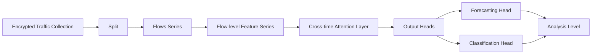

# Time Will Tell: Criss-cross Transformer for Encrypted Traffic Analysis

Hua Ding, Lixing Chen, Member, IEEE, Bo Zhang, Shenghong Li, Senior Member, IEEE, Hao Peng, Zhe Qu, Member, IEEE, and Yang Bai, Member, IEEE

Abstract—The widespread adoption of encryption across webbased services is compelling both malicious attackers and network defenders to tailor their tool repositories to encrypted traffic. For various security applications in encrypted networks, the analysis of encrypted traffic lies as the fundamental basis. Due to the inherent concealment of content-related information in encrypted packets, the dynamics of encrypted traffic emerge as the discernible variable warranting comprehensive analysis. This paper explores inherent temporal correlations within the encrypted traffic and proposes a novel algorithm called Crisscross Traffic Transformer (CTT), tailored to address unique challenges in encrypted traffic analysis. CTT distinguishes itself by employing a specialized time series Transformer that innovatively utilizes patching and criss-cross attention module (CAM) to dissect and interpret encrypted traffic, with the “criss” part mining the long-/short-term temporal correlations across time, and the “cross” part capturing temporal correlations across multiple feature dimensions of encrypted traffic. CTT provides a unified framework capable of accommodating diverse analytical granularities, including packet-level, flow-level, and packet-toflow level. Notably, CTT not only encompasses encrypted traffic classification but also extends to encrypted traffic forecasting, an area that remains largely underexplored in existing literature. We evaluate CTT in the context of fingerprinting attacks and malware detection over 5 real-world datasets against 13 benchmarks. The results indicate that CTT achieves up to 15.56% performance improvement over SOTA solutions for encrypted traffic classification. Particularly, CTT demonstrates over 92.5% forecasting accuracy, which is comparable to SOTA performances in the seen-and-classify scenario. Our code is available at https:// github.com/Amanda-HuaDing/Criss-cross Traffic Transformer.

Index Terms—Encrypted traffic classification, encrypted traffic forecasting, time-series transformer, cross-time cross-dimension attention.

# I. INTRODUCTION

A MIDST escalating cyber threats, encrypted Internet traf-fic has become essential for safeguarding sensitive data against unauthorized access and interception. As reported in [1], over 80% of Firefox services and 95% of Google services are now encrypted, ensuring the secure transmissions of confidential information and enhancing user privacy. On the other hand, traffic encryption is also misused by cybercriminals to obfuscate malicious activities. Empirical evidence

H. Ding, L. Chen, B. Zhang, S. Li, and Y. Bai are with the School of Electronic Information and Electrical Engineering, Shanghai Jiao Tong University, Shanghai 200240, China. E-mail: dinghua623@sjtu.edu.cn; lxchen@sjtu.edu.cn; bozhangiit@sjtu.edu.cn; shli@sjtu.edu.cn; ybai@sjtu.edu.cn.

H. Peng is with the School of Computer Science and Technology, Zhejiang Normal University, Jinhua 321004, China. E-mail: hpeng@zjnu.edu.cn.

Z. Qu is with the School of Computer Science and Engineering, Central South University, Changsha 410083, China. E-mail: zhe qu@csu.edu.cn.

[2] indicates that 85% of cyberattacks are conducted via encrypted traffic. For example, encryption is often employed for propagating commands and payloads of malware, and is also frequently seen in data exfiltration activities where stolen intellectual property is encrypted to evade detection by data loss prevention measures. With the prevalence of encryption on the Internet, both malicious attackers and network defenders are tailoring their tool repositories to encrypted traffic. From the perspective of malicious attackers, novel cyberattacks are emerging specifically designed to target encrypted traffic. For example, website/application fingerprinting attacks [3] have been developed to compromise user privacy by inferring service usage behavior through the analysis of encrypted traffic. From the perspective of network defenders, developing sophisticated defense tools to counter cyberattacks with encryption has become imperative. For example, intrusion detection [4], [5] and malware detection methods [6] are increasingly shifting their focus from non-encrypted traffic to encrypted traffic.

Upon removing extraneous layers, the majority of the aforementioned security applications in encrypted networks essentially pertain to problems of encrypted traffic analysis [7]. Consequently, the efficacy of encrypted traffic analysis serves as a critical determinant of encrypted network security. Encrypted traffic analysis distinguishes itself from traditional traffic analysis methods [8], [9] by the capability to operate despite the concealment of content-related information in encrypted packets. Early studies of encrypted traffic analysis [3] leverage residual plaintext in encrypted traffic to construct fingerprints for analysis. Nevertheless, these approaches demonstrate limited efficacy in practice due to the sparse availability of plaintext. Traditional machine learning (ML) techniques like Support Vector Classifier (SVC) and Random Forest have also been employed for encrypted traffic analysis [10], [11], achieving reasonable accuracy in traffic classification tasks. However, their heavy reliance on handcrafted features restricts their generalization capabilities. Deep learning (DL) techniques [12], [13], owing to their exceptional capability of automatic feature extraction, have become the primary focus in encrypted traffic analysis. Given the concealment of content-related information in encrypted traffic, the temporal correlations and dynamics of encrypted traffic represent one of the few analyzable variables. State-of-the-art methods [14], [15] utilize Recurrent Neural Networks (RNNs) [13] and Long Short-Term Memory (LSTM) [16] to generate the temporal insights within the encrypted traffic. While these methods demonstrate success in capturing local correlations, they struggle to identify long-term temporal dependencies due to their limited scope of adjacent traffic. Besides, the majority of these state-of-the-art approaches are confined to classification paradigms—assigning labels to observed traffic retrospectively. This “detect-after-the-fact” nature is inherently reactive and fails to anticipate evolving traffic states.

flowchart

Fig. 1: Overview of Criss-Cross Traffic Transformer for Encrypted Traffic Analysis.

To illustrate the temporal correlations in encrypted traffic, we conduct a case study on real-world data, with empirical observations detailed in Section V-B. The results reveal both short- and long-term temporal correlations within univariate feature series and across multiple feature dimensions. These temporal correlations provide critical insights into regular activities and anomalies in encrypted networks, making their understanding essential for interpreting security issues.

In response to the above observations, this paper introduces a novel algorithm named Criss-Cross Traffic Transformer (CTT) for encrypted traffic analysis in security applications. An overview of CTT is depicted in Fig. 1. CTT is a specialized time series Transformer [17], [18] tailored to efficiently capture both short-term and long-term temporal correlations within encrypted traffic. Besides, CTT is equipped with the capability to explore and extract time dependencies across feature dimensions, thereby enhancing analytical performance for encrypted traffic with multiple feature variates. CTT is designed to deliver a unified framework that accommodates various analytical levels for encrypted traffic analysis, including packet-level, flow-level, and packet-to-flow (p2f) level, offering generalized and granularity-adaptable solutions for diverse security applications. Particularly noteworthy is that CTT presents an innovative long-term forecasting functionality for encrypted traffic by leveraging its exceptional capability of capturing long-term temporal correlations. To the best of our knowledge, this paper makes an initial endeavor towards forecasting encrypted traffic patterns. The contributions of this work are summarized as follows:

1) Criss-cross Traffic Transformer (CTT) for Encrypted Traffic Analysis. CTT first performs channel-independent patching to segment each feature series of encrypted traffic into overlapping patches. These patches are then fed to the Crisscross Attention Module (CAM), a pivotal component of CTT. The “criss” part of CAM identifies short-/long-term temporal correlations within individual feature series, and the “cross” part of CAM captures temporal correlations across multiple feature series of encrypted traffic. CTT converts multivariate feature series of encrypted traffic to feature representations enriched with temporal insights, which are subsequently utilized for completing downstream tasks.

2) Unified Classification and Forecasting Framework for Encrypted Traffic. We investigate classification and forecasting tasks for encrypted traffic based on CTT. The classification task involves predicting a label series for encrypted traffic, while the forecasting task aims to forecast a sequence of labels for forthcoming encrypted traffic based on currently observed traffic. Particularly, we emphasize long-term forecasting scenarios, where the forecasted sequence extends beyond 20 time steps. We develop dedicated components known as the classification head and forecasting head, which accomplish classification and forecasting tasks, respectively. Notably, classification and forecasting share the same upstream process and can be performed simultaneously.

3) Comprehensive Multi-level Analysis and Systematic Evaluations. CTT exhibits adaptability and generality across various analytical levels in encrypted traffic analysis. We cover flow level (i.e., analyzing entire traffic flows), packet level (i.e., analyzing individual packets), and packet-to-flow level (i.e., analyzing traffic flow using packet-level information) within a uniform framework. We systematically evaluate the performance of CTT on all 3 analytical levels, using 5 realworld datasets in the context of 2 security applications, and against 13 benchmarks. The experimental results show that CTT achieves up to 15.56% improvement over SOTA solutions for encrypted traffic classification. Additionally, CTT demonstrates over 92.5% forecasting accuracy, comparable to SOTA performances in seen-and-classify scenarios.

# II. RELATED WORKS

Encrypted Traffic Analysis for Security Applications: Existing works have extensively investigated encrypted traffic analysis for security applications. These works can be categorized into three main domains: (1) website/application fingerprinting attack, (2) malicious attack detection, and (3) user privacy protection [19]. Studies in fingerprinting attacks focus on identifying user activity [3], [10], thereby compromising the anonymity of encrypted networks. Works in malicious attack detection target network intrusion detection [4], [5] and malware detection [6], [20], safeguarding network security by uncovering potential attacks hidden within encrypted traffic. Meanwhile, studies in user privacy protection aim to monitor mobile application characteristics [21], [22], empowering users to control their personally identifiable information. In the context of industrial deployment, Anderson et al. [11] underscored the significant challenges arising from non-stationarity and label noise in practical encrypted malware detection. Moreover, Bernighausen et al. [23] emphasized the imperative of real-time classification capabilities to accommodate the high throughput characteristic of modern network infrastructures.

While prior methodologies have addressed various application scenarios, they predominantly focus on encrypted traffic classification. In contrast, the proposed CTT not only encompasses encrypted traffic classification tasks but also enables the exploration of encrypted traffic forecasting. Several studies have explored the task of traffic forecasting. For instance, Huo et al. [24] applied an enhanced Seasonal and Trend decomposition algorithm to decompose traffic data, employing LSTM to forecast future network volume. Furthermore, Fang et al. [25] integrated Graph Neural Networks (GNNs) with LSTM to extract spatiotemporal features from mobile network traffic, enhancing the accuracy of traffic volume prediction. Montieri et al. [26] concentrated on fine-grained, packetlevel mobile traffic characteristics prediction, emphasizing the explainability of their models. However, CTT differs from these works in task definition and application scope. First, most existing works focus on predicting specific traffic features or traffic volume, whereas CTT is designed to forecast the labels of future traffic. Second, these works focus on mobile communication scenarios without specific emphasis on encrypted traffic.

ML Solutions for Encrypted Traffic Analysis: Traditional ML techniques have found extensive applications in encrypted traffic analysis. Taylor et al. [10] proposed Appscanner, employing statistical features to train an SVC for identifying Android apps. Ede et al. [3] proposed Flowprint, which leverages temporal correlations among destination-related features to achieve traffic classification through clustering. The efficiency of ML-based methods heavily depends on the quality of feature selection and necessitates judicious feature extraction and selection for different scenarios.

DL has gained popularity in encrypted traffic analysis due to its ability for autonomous feature extraction. Sirinam et al. [27] introduced DF, leveraging CNN to capture patterns in packet size and direction. To compensate for the loss of inter-variable information caused by encryption, RNN is used to capture temporal patterns in the traffic. Liu et al. [14] proposed FS-Net based on RNN to learn temporal dependencies from packet sequences. Lin et al. [28] proposed TSCRNN, leveraging a combination of CNN and stacked bidirectional LSTM. While RNN-based methods have shown performance improvement compared to CNN-based methods, they have limited capability to capture long-term time dependencies [29], suggesting that there is still room for improvement.

Transformers have shown great modeling ability for longrange dependencies in sequential data in Computer Vision (CV) [30] and Natural Language Processing (NLP) [31], and thus are appealing to encrypted traffic analysis. Recent advancements have utilized Transformer-based models, adapting language or vision processing techniques for traffic feature extraction. ET-BERT [15] interprets traffic bytes as linguistic tokens, pre-training a Transformer for traffic feature learning. Zhao et al. [32] model network traffic as gray images and adopt a vision Transformer to extract multi-level flow rep-

TABLE I: Comparison with existing methods. 

<table><tr><td rowspan="2" colspan="2">Methods</td><td colspan="3">Analysis granularity</td><td rowspan="2">Pre-train</td><td rowspan="2">Forecast</td></tr><tr><td>flow</td><td>packet</td><td>p2f</td></tr><tr><td rowspan="2">ML-based</td><td>Appscanner [10]</td><td>√</td><td>√</td><td>×</td><td>Not Req.</td><td>×</td></tr><tr><td>Flowprint [3]</td><td>√</td><td>×</td><td>×</td><td>Not Req.</td><td>×</td></tr><tr><td rowspan="4">CNN/RNN-based</td><td>DF [27]</td><td>×</td><td>×</td><td>√</td><td>Not Req.</td><td>×</td></tr><tr><td>Deeppacket [34]</td><td>√</td><td>√</td><td>×</td><td>Not Req.</td><td>×</td></tr><tr><td>FS-Net [14]</td><td>×</td><td>×</td><td>√</td><td>Not Req.</td><td>×</td></tr><tr><td>TSCRNN [28]</td><td>×</td><td>×</td><td>√</td><td>Not Req.</td><td>×</td></tr><tr><td rowspan="4">Transf.-based</td><td>ET-BERT [15]</td><td>√</td><td>√</td><td>×</td><td>Required</td><td>×</td></tr><tr><td>YaTC [32]</td><td>×</td><td>×</td><td>√</td><td>Required</td><td>×</td></tr><tr><td>AN-Net [33]</td><td>×</td><td>×</td><td>√</td><td>Not Req.</td><td>×</td></tr><tr><td>CTT (ours)</td><td>√</td><td>√</td><td>√</td><td>Not Req.</td><td>√</td></tr></table>

resentations. Deng et al. [33] introduced AN-Net, a model that processes traffic features independently before integrating them into a robust unified representation via a self-attention module. While Transformer-based methods have demonstrated performance gains over earlier approaches, they typically rely on extensive pre-training procedures, which are both timeconsuming and computationally demanding. Moreover, such methodologies are predominantly restricted to traffic classification paradigms and are inherently ill-suited for traffic forecasting. The absence of this predictive capability precludes the generation of early warnings essential for proactive network management and the preemption of advanced threats. Table I provides a qualitative comparison between CTT and existing approaches in terms of methodological characteristics.

# III. ENCRYPTED TRAFFIC ANALYSIS

# A. Preliminaries of Encrypted Traffic Analysis

As aforementioned, encrypted traffic analysis lies as the fundamental basis for various security applications in encrypted networks. Our work analyzes encrypted traffic with a specific focus on temporal dependencies, which exerts minimal prerequisites on the form of encrypted traffic, thereby offering broad applications across typical implementation scenarios. Here, we present two typical security applications based on encrypted traffic analysis from the perspectives of both malicious attackers (fingerprinting attack) and network defenders (malware detection). These two scenarios also align with the experiments carried out in Section V. The fingerprinting attack aims to identify the applications that the user is visiting in an encrypted connection. In this case, the malicious attacker eavesdrops on encrypted traffic between clients and the network services, and then utilizes the encrypted traffic analysis to identify the application service in use based on the collected encrypted traffic. In the context of malware detection, a network administrator collects encrypted traffic at gateways or routers and analyzes encrypted traffic to distinguish whether the encrypted traffic is issued by benign software or malware.

The above application scenarios can be described by a process of encrypted traffic analysis. The encrypted traffic analysis is carried out by a dedicated agent. This agent can be the malicious attacker in the fingerprinting attack or the network administrator in the malware detection scenario. The agent is tasked with two primary functions: (1) collecting encrypted packets during user communications, and (2) preprocessing collected encrypted packets and performing the designed encrypted analysis. This agent is deployable at intelligent switches, routers, and gateways, which are typical sites for implementing traffic collection tools such as Libpcap [35], TCPdump [35], etc. The enhanced computational capabilities of these high-end edge devices also allow for the execution of DL computations. During packet collection, the agent runs the traffic collection tool to capture encrypted packets.

# B. Analytical Levels/ Tasks for Encrypted Traffic

Upon acquiring encrypted packets, the traffic analysis agent pre-processes them with analyzers such as Wireshark [36], and Tranalyzer [37]. The processing of encrypted traffic can be adapted to various granularities contingent on the implementation scenario. Herein, we present three analytical levels, packet-level, flow-level, and packet-to-flow level, alongside two analytical tasks, namely classification and forecasting.

1) Analytical Levels: • Packet-level Traffic Analysis: This level is highly granular, facilitating near-real-time analysis for encrypted traffic, which fits application scenarios like real-time intrusion detection. In the context of packet-level analysis, encrypted traffic is characterized as a sequence of consecutive packets (pkt), denoted by $\mathrm { T r a f f i c } ~ = ~ \{ \mathrm { p k t } _ { \tau } \} _ { \tau = 1 } ^ { \infty } ,$ , and its processing centers on extracting packet features. Due to the encryption, observable features of encrypted packets are restricted. Common features include the source/destination IP, source/destination port, packet size, packet payload size, etc. The features associated with pktτ are encapsulated in a feature vector xpktτ ∈ RMpkt , $\mathbf { x } _ { \tau } ^ { \mathrm { p k t } } \in \mathbb { R } ^ { M ^ { \mathrm { p k t } } }$ where $M ^ { \mathrm { p k t } }$ is the number of extracted features. By applying feature extraction to each packet in $\{ \mathrm { p k t } _ { \tau } \} _ { \tau = 1 } ^ { \infty } .$ , a packet-level feature series $\{ \mathbf { x } _ { \tau } ^ { \mathrm { p k t } } \} _ { \tau = 1 } ^ { \infty }$ can be constructed. The packet-level analysis is conducted on the packet-level feature series, where each packet serves as a fundamental unit.

• Flow-level Traffic Analysis: This level analyzes encrypted traffic flows rather than individual packets to provide a higherlevel overview of network activity, making it suitable for security applications such as fingerprinting attacks. In the context of flow-level analysis, the encrypted traffic is represented as a sequence of successive flows (fl), denoted by $\mathtt { T r a f f i c } = \{ \mathtt { f l } _ { \tau } \} _ { \tau = 1 } ^ { \infty }$ . A flow is defined as a collection of packets sharing specific common attributes within a predefined time interval. Therefore, the features of flows often encompass statistics derived from the packets contained in the flow, including the packet count, maximum packet length, minimum interval time, etc. We let $\mathbf { x } _ { \tau } ^ { \mathrm { { f 1 } } } \in \mathbb { R } ^ { M ^ { \mathrm { { f 1 } } } }$ denote the feature vector of $\mathbf { f } \perp _ { \tau }$ , where $M ^ { \mathrm { f 1 } }$ is the number of extracted features. By applying feature extraction to each flow in $\{ \pm 1 _ { \tau } \} _ { \tau = 1 } ^ { \infty } .$ , we can obtain a flow-level feature series $\{ { \bf x } _ { \tau } ^ { \mathrm { f 1 } } \} _ { \tau = 1 } ^ { \infty }$ , on which flowlevel traffic analysis is performed. The fundamental unit in the flow-level analysis is traffic flow.

• Packet-to-flow Level Traffic Analysis: This approach facilitates examining encrypted traffic at the flow level by analyzing underlying packet-level attributes. It inspects fine-grained information to obtain a high-level pattern of encrypted traffic, which is advantageous in advanced threat detection systems for identifying sophisticated malware. The p2f-level analysis processes encrypted traffic in the unit of packets Traffic = $\{ \mathrm { p k t } _ { \tau } \} _ { \tau = 1 } ^ { \infty }$ . The packet sequence is segmented into flows $\{ ( \mathrm { p k t } _ { 1 } , \dots , \mathrm { p k t } _ { F } ) , ( \mathrm { p k t } _ { F + 1 } , \dots , \mathrm { p k t } _ { 2 \times F } ) , \dots \}$ , with F indicating the length of the segmented flow. Following similar procedures in packet-level analysis, a packet-level feature series $\{ \mathbf { x } _ { \tau } ^ { \mathrm { p k t } } \} _ { \tau = 1 } ^ { \infty }$ can be constructed. The p2f-level analysis receives $\{ \mathbf { x } _ { \tau } ^ { \mathrm { p k t } } \} _ { \tau = 1 } ^ { \infty }$ as input and generates analytical results for flows $\{ \mathbb { E } \mathbb { 1 } _ { j } \} _ { j = 1 } ^ { \infty }$ , where $\pounds 1 _ { j } = \big ( \mathtt { p k t } _ { ( j - 1 ) \times F + 1 } , \ldots , \mathtt { p k t } _ { j \times F } \big )$ denotes j-th flow.

2) Analytical Tasks: • Encrypted Traffic Classification: The classification task takes a finite feature series $\begin{array} { r l } { \vec { \bf x } } & { { } = } \end{array}$ $\{ \mathbf { x } _ { 1 } , \dotsc , \mathbf { x } _ { L } \}$ as input, where $\mathbf { x } _ { l }$ is either a flow-level feature vector ${ \bf x } _ { \tau } ^ { \mathrm { f 1 } }$ or a packet-level feature vector $\mathbf { x } _ { \tau } ^ { \mathrm { p k t } }$ and L denotes the length of the feature series. Notably, the feature vectors are continuous in time, i.e., with $\mathbf { x } _ { 1 } ~  ~ \mathbf { x } _ { t } .$ , the lth feature vector in $\vec { \bf x }$ satisfies $\mathbf { x } _ { l } \gets \mathbf { x } _ { t + l - 1 }$ . For flowlevel and packet-level classification, the goal of classification is to assign a label series $\widehat { \vec { \mathbf { y } } } ^ { } = \{ \hat { y } _ { 1 } , \dots , \hat { y } _ { L } \}$ to the input feature series x . Here, each label $\hat { y } _ { l } ~ \in ~ [ 1 , 2 , \ldots , C ]$ (C is the number of classes) represents the predicted class for the l-th flow/packet. The classification for p2f-level analysis follows a similar formulation but differs in the length of the predicted label series. Given the packet-level feature series ${ \vec { \mathbf { x } } } ,$ , p2f classification analyzes it in form of feature series segments, $\vec { \bf x } ~ = ~ \{ ( { \bf x } _ { 1 } , \ldots , { \bf x } _ { F } ) , \ldots , ( { \bf x } _ { L - F + 1 } , \ldots , { \bf x } _ { L } ) \}$ and generates a predicted label series $\widehat { \vec { \bf y } } = \{ \hat { y } _ { 1 } , \dots , \hat { y } _ { L / F } \}$ , where ${ \hat { y } } _ { f } , f \ = \ 1 , . . . , L / F ,$ denotes the predicted class of f -th segment (i.e., flow). This formulation has a mild implicit assumption that $L > F$ and $L = u \times F , u = 1 , 2 , . . .$ .

• Encrypted Traffic Forecasting: Compared to classification, traffic forecasting has received limited attention, largely due to the lack of effective supporting techniques. Traditional traffic forecasting works [25], [38] focus on low-level metrics such as traffic volume or throughput. In contrast, our work aims to predict semantic-level labels (e.g., application categories, malware families), offering significant advantages for both proactive network defense and quality of service (QoS) enhancement. For example, in malware detection scenarios, forecasting that an upcoming flow sequence is likely associated with a specific malware family enables the early deployment of mitigation strategies—such as preemptively blocking IPs or ports, dynamically adjusting firewall rules, isolating vulnerable resources, or prioritizing forensic analysis of suspected endpoints—before the malicious activity fully manifests. In this context, we outline the inputs and outputs involved in forecasting tasks. The forecasting task also operates on a finite flow-level or packet-level feature series $\vec { \bf x } = \{ { \bf x } _ { 1 } , \ldots , { \bf x } _ { L } \}$ , serving as input. The primary objective of forecasting is to predict a label series $\widehat { \vec { \mathbf { y } } } = \{ \bar { \hat { y } } _ { L + 1 } , \dots , \hat { y } _ { L + T } \}$ corresponding to forthcoming encrypted traffic (unseen) over $T$ time steps. We call L the look-back length, and T the forecasting length. The forecasted label $\hat { y } _ { L + t }$ can represent the class label of a packet in the packet-level analysis or the class label of a flow in flow-level analysis. To address the inherent challenge of unlabeled encrypted flows in real-world environments, CTT supports two workflows: direct label-free forecasting of future traffic solely from feature vectors ${ \vec { \mathbf { x } } } ,$ or alternatively, first classifying the lookback window to obtain predicted labels $\{ \hat { y } _ { 1 } , . . . , \hat { y } _ { L } \}$ which are then propagated through the forecasting pipeline to generate $\{ \hat { y } _ { L + 1 } , . . . , \hat { y } _ { L + T } \}$

```mermaid
graph TD
    subgraph Inputs
        A1["Input x_p"] --> X1["X^(m)"]
        X1 --> X2["X_p"]
        X2 --> X3["X_m"]
        X3 --> X4["X_m"]
        X4 --> X5["X_m"]
        X5 --> X6["X_m"]
        X6 --> X7["X_m"]
        X7 --> X8["X_m"]
        X8 --> X9["X_m"]
        X9 --> X10["X_m"]
        X10 --> X11["X_m"]
        X11 --> X12["X_m"]
        X12 --> X13["X_m"]
        X13 --> X14["X_m"]
        X14 --> X15["X_m"]
        X15 --> X16["X_m"]
        X16 --> X17["X_m"]
        X17 --> X18["X_m"]
        X18 --> X19["X_m"]
        X19 --> X20["X_m"]
        X20 --> X21["X_m"]
        X21 --> X22["X_m"]
        X22 --> X23["X_m"]
        X23 --> X24["X_m"]
        X24 --> X25["X_m"]
        X25 --> X26["X_m"]
        X26 --> X27["X_m"]
        X27 --> X28["X_m"]
        X28 --> X29["X_m"]
        X29 --> X30["X_m"]
        X30 --> X31["X_m"]
        X31 --> X32["X_m"]
        X32 --> X33["X_m"]
        X33 --> X34["X_m"]
        X34 --> X35["X_m"]
        X35 --> X36["X_m"]
        X36 --> X37["X_m"]
        X37 --> X38["X_m"]
        X38 --> X39["X_m"]
        X39 --> X40["X_m"]
        X40 --> X41["X_m"]
        X41 --> X42["X_m"]
        X42 --> X43["X_m"]
        X43 --> X44["X_m"]
        X44 --> X45["X_m"]
        X45 --> X46["X_m"]
        X46 --> X47["X_m"]
        X47 --> X48["X_m"]
        X48 --> X49["X_m"]
        X49 --> X50["X_m"]
        X50 --> X51["X_m"]
        X51 --> X52["X_m"]
        X52 --> X53["X_m"]
        X53 --> X54["X_m"]
        X54 --> X55["X_m"]
        X55 --> X56["X_m"]
        X56 --> X57["X_m"]
        X57 --> X58["X_m"]
        X58 --> X59["X_m"]
        X59 --> X60["X_m"]
        X60 --> X61["X_m"]
        X61 --> X62["X_m"]
        X62 --> X63["X_m"]
        X63 --> X64["X_m"]
        X64 --> X65["X_m"]
        X65 --> X66["X_m"]
        X66 --> X67["X_m"]
        X67 --> X68["X_m"]
        X68 --> X69["X_m"]
        X69 --> X70["X_m"]
        X70 --> X71["X_m"]
        X71 --> X72["X_m"]
        X72 --> X73["X_m"]
        X73 --> X74["X_m"]
        X74 --> X75["X_m"]
        X75 --> X76["X_m"]
        X76 --> X77["X_m"]
        X77 --> X78["X_m"]
        X78 --> X79["X_m"]
        X79 --> X80["X_m"]
        X80 --> Y
    end

    subgraph Outputs
        B["Dual Output Head"] & C["Cross-dimension Attention Layer"] & D["Patching Module"] & E["Projection & Position Encoding"] & F["Input"] & G["Label Series"] & H["Output y"]
    end

    subgraph Feature Sets
        I["Feature x^m"] --> J["MLP"]
    end

    subgraph Time
        K["Time x^m"] --> L["MSE, MLL, NLL, OLS, ODA, ODA^T, A(t=2)"]
    end

    subgraph Patches
        M["Feature x^m"] --> N["Channel-independent Patching"]
    end

    subgraph Embeddings
        O["Feature x^m"] --> P["Patches"]
    end

    subgraph Outputs
        Q["Dual Output Head"] & R["Classification Head"] & S["Cross-dimension Attention Layer"] & T["Cross-dimension Attention Layer"] & U["Projection & Position Encoding"] & V["Patching Module"] & W["Output y"]
    end
```

flowchart

Fig. 2: Diagram of CTT architecture.

# IV. CRISS-CROSS TRAFFIC TRANSFORMER

Criss-cross Traffic Transformer (CTT) is a specialized time series transformer designed specifically for encrypted traffic. Fig. 2 presents an overview of CTT, which encompasses three key components: Patching Module, Criss-cross Attention Module (CAM), and Dual Output Head.

Patching Module. The patching operation is a distinctive trait of CTT. Recall our objective is to understand the temporal correlations within encrypted traffic. However, an individual packet or flow offers restricted insight across time domain. Patching operations amalgamate time steps into subseries-level patches, thereby capturing comprehensive information that is not attainable through point-wise analysis. This approach enhances the locality of traffic data and facilitates the examination of short-term time correlations. Besides, patching enables the subsequent transformer to access longer historical traffic data, facilitating the analysis of long-term time correlations.

Criss-cross Attention Module. CAM is the core of CTT. Compared to the traditional Transformer, CAM utilizes a twostage attention framework to efficiently capture the cross-time correlations and cross-dimension correlations. CTT comprises Cross-time Attention Layers (CTALs) and Cross-dimension Attention Layers (CDALs). The CTALs are designed to mine short-term and long-term temporal dependencies within patches of an individual feature series, whereas the CDALs capture the time dependencies across multiple feature series.

Dual Output Head. CTT incorporates two distinct output heads tailored to classification and forecasting tasks. The classification head utilizes a CNN-based structure to reconstruct temporal information from patch-level to point-level, thus enabling CTT to generate classification results of each data point (i.e., each packet/flow). The forecasting head utilizes a straightforward flattening structure to forecast future label series based on the temporal correlations observed in the lookback series. This dual output head makes CTT a robust solution for various encrypted traffic analysis scenarios.

# A. Patching Module

The input feature series $\vec { \textbf { x } } = \{ \mathbf { x } _ { 1 } , \ldots , \mathbf { x } _ { L } \}$ is a finite multivariate series, where an element $\mathbf { x } _ { l } ~ \in ~ \mathbb { R } ^ { M \times 1 }$ in $\vec { \bf x }$ is the multi-dimension feature vector for a packet/flow. Therefore, $\vec { \bf x }$ can be decomposed into M univariate feature series. The m-th uni-variant feature series is denoted by ${ \vec { x } } ^ { ( m ) } =$ {x(m)1 , . $\{ x _ { 1 } ^ { ( m ) } , . . . , x _ { L } ^ { ( m ) } \}$ x(m)L }. To better mine the short-term and long-term dependencies within univariate feature series, CTT performs channel-independent patching. We employed an overlapped patching strategy, which generates feature patches based on the patch length P and stride S. Each subsequent patch is shifted backward by S steps relative to the previous one, resulting in an overlap between consecutive patches of length $( P - S )$ . For a univariate feature series $\vec { x } ^ { ( m ) }$ , the overlapped patching generates a sequence of N patch sequence $\mathbf { x } _ { \mathrm { 0 } } ^ { ( \bar { m } ) } =$ $\{ { x _ { ( n - 1 ) \times S + 1 } ^ { ( m ) } } , \dotsc , { x _ { ( n - 1 ) \times S + P } ^ { ( m ) } } ^ { \cdot } { } _ { n = 1 } ^ { N }$ , where $N { \overset { \cdot } { = } } \lfloor { \frac { ( L - { \overset { \cdot } { P } } ) } { S } } \rfloor + 2$ S is the total number of generated patches. To ensure that the length of the last patch is the same as the length of previous patches, we pad S repeated instances of the last value xL $\bar { x } _ { L } ^ { ( m ) } \in \bar { \mathbb { R } }$ (m) to the end of $\vec { x } ^ { ( m ) }$ . The patch length determines the granularity of the analysis. Longer patches capture broader temporal patterns but may miss finer details in brief intervals. Conversely, shorter patches enhance the resolution of analysis, detecting subtle variations but potentially overlooking wider trends. Additionally, the patch length and stride length jointly govern the overlap between patches. A larger patch overlap offers multiple contextual perspectives of the same data point across adjacent patches, thereby improving the capacity of CTT to learn nuanced features. The patch sequence x(mp $\dot { \mathbf { x } } _ { \mathrm { p } } ^ { ( m ) }$ is then fed into Transformer, with each patch corresponding to a token (an individual unit of input data in Transformer). Patching reduces the number of input tokens from L to approximately $L / S .$ . This implies the computational complexity of attention maps is quadratically decreased by S.

The patch sequence $\mathbf { x } _ { \mathrm { p } } ^ { ( m ) }$ x(m) is mapped to the latent space of dimension $d _ { \mathrm { m o d e 1 } }$ l through a learnable linear projection $\mathbf { W } ^ { \mathrm { p } } \in \mathbb { R } ^ { d _ { \mathrm { m o d e l } } \times \dddot { P } }$ and a learnable additive position encoding $\mathbf { W } ^ { \mathrm { p o s } } \in \mathbb { R } ^ { d _ { \mathrm { m o d e l } } \times N }$ for monitoring the temporal order of patches, which generates the embedding $\mathbf { x } _ { \mathrm { d } } ^ { ( m ) } \in \mathbb { R } ^ { d _ { \mathrm { m o d e l } } \times N }$ for patch sequence $\mathbf { \bar { x } } _ { \mathrm { p } } ^ { ( m ) } \colon \mathbf { x } _ { \mathrm { d } } ^ { ( m ) } = \mathbf { W } ^ { \mathrm { p } } \mathbf { x } _ { \mathrm { p } } ^ { ( \tilde { m } ) } + \mathbf { W } ^ { \mathrm { p o s } }$ . The patch sequence embedding $\mathbf { x } _ { \mathrm { d } } ^ { ( m ) }$ serves as the input to CAM.

Why channel-independent patching? CTT utilizes channel-independent patching. An alternative strategy is channel-mixing patching [17], which aggregates all features in each time step into input tokens. However, this strategy may encounter challenges due to potential inconsistencies of the temporal dependencies among univariate feature series. Mixing these feature series during patching could obscure the temporal correlation within each univariate feature series. Therefore, we adopt the channel-independent patching strategy to better retain temporal correlations within each univariate feature series. The temporal correlations across multiple feature series will be addressed by the subsequent CAM module.

# B. Criss-Cross Attention Module

Despite utilizing the channel-independent patching in CTT, it is noteworthy that the correlations among different feature series are not regarded as insignificant. To compensate for the information loss in cross-feature correlations, we propose the Criss-cross Attention Module (CAM). CAM strategically captures cross-time and cross-dimension temporal correlations through a two-stage process, which comprises two loosely coupled components Cross-Time Attention Layer (CTAL) and Cross-Dimension Attention Layer (CDAL). This sequential architecture is specifically designed to mitigate the computational complexity of CAM, as concurrent attention across both time and dimensions is computationally prohibitive.

Cross-time Attention Layer. CTAL directly applies the multi-head self-attention (MSA) mechanism [39] to capture temporal correlations within each feature series, as illustrated in Fig. 2 (c). It takes patch embedding of univariate feature series $\mathbf { x } _ { \mathrm { d } } ^ { ( m ) } , m = 1 , \hdots , M$ , as input. In the multi-head attention mechanism, each attention head, indexed by transforms x(md $\mathbf { x } _ { \mathrm { d } } ^ { ( m ) }$ Q( $\mathbf { Q } _ { h } ^ { ( m ) } \mathbf { \bar { \Psi } } = ( \mathbf { x } _ { \mathrm { d } } ^ { ( m ) } ) ^ { \top } \mathbf { W } _ { h } ^ { Q }$ = (x (m)d ) ⊤ W Qh , $h = 1 , \ldots , H$ , key matrices K(m)h $\mathbf { K } _ { h } ^ { ( m ) } \ = \ ( \mathbf { x } _ { \mathrm { d } } ^ { ( m ) } ) ^ { \top } \mathbf { W } _ { h } ^ { K }$ V(m) $\mathbf { V } _ { h } ^ { ( m ) } = ( \mathbf { x } _ { \mathrm { d } } ^ { ( m ) } ) ^ { \top } \mathbf { \bar { W } } _ { h } ^ { V } . \mathrm { H e r e } , \mathbf { \tilde { W } } _ { h } ^ { Q } , \mathbf { W } _ { h } ^ { K } , \in \mathbb { R } ^ { d _ { \mathrm { m o d e l } } \times d _ { k } } , \mathbf { W } _ { h } ^ { V } \in$ = (x(md $\mathbb { R } ^ { d _ { \mathrm { m o d e 1 } } \times d _ { \boldsymbol { v } } }$ , with $d _ { k } \ : = \ : d _ { v } \ : = \ : d _ { \mathrm { m o d e l } } / H$ h . Given the Query-Key-Value (QKV) matrices, each attention head utilizes the scaled dot-product attention to compute the attention scores, expressed as

$$
\begin{array}{l} \left(\mathbf {O} _ {h} ^ {(m)}\right) ^ {\top} = \text { attention } \left(\mathbf {Q} _ {h} ^ {(m)}, \mathbf {K} _ {h} ^ {(m)}, \mathbf {V} _ {h} ^ {(m)}\right) \\ = \operatorname{softmax} \left(\frac {\mathbf {Q} _ {h} ^ {(m)} (\mathbf {K} _ {h} ^ {(m)}) ^ {\top}}{\sqrt {d _ {k}}}\right) \mathbf {V} _ {h} ^ {(m)}, \tag {1} \\ \end{array}
$$

where $\mathbf { O } _ { h } ^ { ( m ) } \in \mathbb { R } ^ { d _ { k } \times N }$ is the output of the h-th attention head. The output of MSA can be represented as Eqn. (2), where $\mathbf { W } ^ { O }$ is a learnable linear projection in MSA.

$$
\begin{array}{l} \left(\mathbf {O} ^ {(m)}\right) ^ {\top} = \operatorname{MSA} _ {\text {time}} \left(\mathbf {Q} ^ {(m)}, \mathbf {K} ^ {(m)}, \mathbf {V} ^ {(m)}\right) \tag {2} \\ = \mathrm{concat} ((\mathbf {O} _ {1} ^ {(m)}) ^ {\top}, \ldots , (\mathbf {O} _ {H} ^ {(m)}) ^ {\top}) \mathbf {W} ^ {O}. \\ \end{array}
$$

All feature dimensions share the same $\mathtt { M S A } _ { \mathtt { t i m e } }$ . The multihead attention block also includes LayerNorm layers and a feed-forward network with residual connections, expressed as

$$
\hat {\mathbf {O}} ^ {(m)} = \text { LayerNorm } (\mathbf {x} _ {\mathrm{d}} ^ {(m)} + \mathbf {O} ^ {(m)}), \tag {3}
$$

$$
\mathbf {O} _ {\text { time }} ^ {(m)} = \text { LayerNorm } (\hat {\mathbf {O}} ^ {(m)} + \text { MLP } (\hat {\mathbf {O}} ^ {(m)})),
$$

where MLP denotes a multi-layer (two-layer in this paper) feed-forward network, and $\mathbf { O } _ { \mathrm { t i m e } } ^ { ( m ) }$ is the output of CTAL.

The computation complexity of the CTAL is $O ( M N ^ { 2 } )$ . After this stagthe feature dim $\mathbf { O } _ { \mathrm { t i m e } } ^ { ( \breve { m } ) } \in \mathbb { R } ^ { d _ { \mathrm { m o d e l } } \times N }$ ∈ Rdmodel×N . $\mathbf { O } _ { \mathrm { t i m e } } \in \mathbb { R } ^ { M \times \hat { d } _ { \mathrm { m o d e l } } \times N }$ cessing by CDAL.

Cross-dimension Attention Layer. CDAL needs to apply MSA to all feature dimensions. However, implementing this directly results in a computational complexity of $O ( M ^ { 2 } )$ , which becomes impractical for a large feature dimension M. To address this problem, we introduce the router mechanism [40]. As depicted in Fig.2 (d), a learnable vector serves as the router for n-th patch, denoted as $\mathbf { R } _ { n } \in \mathbb { R } ^ { c \times d _ { \mathrm { m o d e l } } } , c \ll M .$ , $n ~ = ~ 1 , \ldots , N$ . The router aggregates messages from all dimensions using ${ \mathbf { R } } _ { n }$ as query matrices in MSA, and vectors of all dimensions $\mathbf { O } _ { \mathrm { t i m e } _ { n } } \mathbf { \bar { \Psi } } \in \mathbf { \bar { \mathbb { R } } } ^ { M \times d _ { \mathrm { m o d e 1 } } }$ act as key and value matrices. Subsequently, ${ \mathbf { R } } _ { n }$ redistributes received messages among dimensions by utilizing vectors of dimensions $\mathbf { O } _ { \mathrm { t i m e } _ { n } }$ as queries and the aggregated messages as key and value. This establishes an all-to-all connection among M dimensions. The router mechanism can be expressed as:

$$
\mathbf {A} _ {n} = \operatorname{MSA} _ {\dim} ^ {1} \left(\mathbf {R} _ {n}, \mathbf {O} _ {\text {time} _ {n}}, \mathbf {O} _ {\text {time} _ {n}}\right), \quad n = 1, \dots , N. \tag {4}
$$

$$
\tilde {\mathbf {O}} _ {\dim_ {n}} = \operatorname{MSA} _ {\dim} ^ {2} \left(\mathbf {O} _ {\text {time} _ {n}}, \mathbf {A} _ {n}, \mathbf {A} _ {n}\right), \quad n = 1, \dots , N.
$$

Here, $\mathbf { O } _ { \mathrm { t i m e } _ { n } } \in \mathbb { R } ^ { M \times d _ { \mathrm { m o d e l } } }$ represents the vectors of all dimensions, $\mathbf { A } _ { n } \in \mathbb { R } ^ { c \times d _ { \mathrm { m o d e l } } }$ denotes the aggregated messages from all feature dimensions, and $\tilde { \mathbf { O } } _ { \mathrm { d i m } _ { n } }$ is the output of the router mechanism. The multi-head attention block also includes LayerNorm layers and a feed-forward network with residual connections, expressed as:

$$
\hat {\mathbf {O}} _ {\text {dim}} = \text {LayerNorm} (\mathbf {O} _ {\text {time}} + \tilde {\mathbf {O}} _ {\text {dim}}) \tag {5}
$$

$$
\mathbf {O} _ {\mathrm{dim}} = \operatorname{LayerNorm} \left(\hat {\mathbf {O}} _ {\mathrm{dim}} + \operatorname{MLP} \left(\hat {\mathbf {O}} _ {\mathrm{dim}}\right)\right)
$$

CAM comprises K $( K ~ = ~ 3$ in our work) criss-cross attention blocks (a combination of a CTAL and a CDAL). This process can be expressed as $\mathbf { Z } = \mathbb { C } \mathbb { A } \mathrm { M } \big ( \{ \mathbf { x } _ { \mathrm { d } } ^ { ( m ) } \} _ { m = 1 } ^ { M } \big )$ , where $\dot { \mathbf { Z } } \in \mathbb { R } ^ { M \times N \times d _ { \mathrm { m o d e l } } }$ is the output of CAM. Since the router mechanism reduces the complexity of CDAL from $O ( M ^ { 2 } N )$ to $O ( M N )$ . The overall computational complexity of CAM is ${ \cal O } ( M N ^ { 2 } + M N ) = { \cal O } ( M N ^ { 2 } )$ . After CAM, both temporal correlations within the univariate feature series and across multiple feature series are captured in Z.

# C. Dual Output Head

With temporal insights of encrypted traffic captured in Z, a dual output head is designed to realize classification and forecasting tasks. The dual output head includes a classification head and a forecasting head, whose architecture is depicted in Fig. 2 (e) and (f).

Classification Head. For classification tasks, a straightforward way to obtain label series is passing $\mathbf { Z } \in \mathbb { R } ^ { M \times N \times d _ { \mathrm { m o d e l } } }$ through an MLP network to aggregate temporal and crossdimension information, and then reshaping it to the desired format. However, in the phase of patching and CAM, temporal information is preserved and extracted among patches rather than individual data points, posing challenges for data point classification. Furthermore, applying MLP raises concerns regarding computational complexity. Specifically, the dimension of the input layer being $M \times N \times d _ { \mathrm { m o d e l } }$ is typically large, leading to elevated learning costs for MLP. To address these challenges, we propose a CNN-based output head for classification tasks. The architecture of the CNNbased head consists of two convolutional blocks, each comprising a convolution layer, an activation layer, and a pooling layer. The convolutional layers are utilized to reconstruct finegrained temporal information from Z by capturing features from different channels, while the pooling layers facilitate the extraction of dominant features. After two convolution blocks, the output vectors at the data point level and can be fed into an MLP layer to obtain predicted label series yˆ

Forecasting Head. As illustrated in Fig. 2(f), the forecasting head obtains the forecasting results by pushing Z through a flattening layer and an MLP. The flattening layer receives the output from the attention module, $\textbf { Z } \in \mathbb { R } ^ { \bar { M } \times N \times d _ { \mathrm { m o d e l } } }$ , and reshapes it into $\tilde { \mathbf { Z } } \in \mathbb { R } ^ { N \times \Delta }$ , where $\Delta = M \times d _ { \mathrm { m o d e l } }$ represents the flattened dimension of each patch. This process effectively consolidates the information from each patch into a unified vector $\tilde { \mathbf { Z } } _ { n } , n = 1 , \ldots , N$ . MLP then processes Z˜ to extract further insights and produce the forecasted outputs $\widehat { \vec { \mathbf { y } } } = ( \widehat { y } _ { L + 1 } , \ldots , \widehat { y } _ { L + T } )$ .

# D. Training CTT-based Classifier/Forecaster

1) Training CTT-based Classifier: As aforementioned, encrypted traffic can be characterized by flow-level or packetlevel multivariate feature series, denoted by $\mathcal { X } = \{ \mathbf { x } _ { \tau } \} _ { \tau = 1 } ^ { \infty }$ . Training of CTT-based traffic classifier also requires the ground-truth labels $\mathcal { V } = \{ y _ { \tau } \} _ { \tau = 1 } ^ { \infty }$ 1 for the feature series.

Packet/flow-level Traffic Classification. For packet-/flowlevel traffic classification, the mini-batch update is used to train CTT. In each training iteration, a mini-bacth of feature series $\mathcal { X } _ { \mathrm { b } } = \{ \vec { \bf x } _ { i } \} _ { i = 1 } ^ { B }$ is randomly sampled from X , where B is the batch size (i.e., number of sampled feature series) and $\vec { \bf x } _ { i } = \{ { \bf x } _ { i , 1 } , { \bf x } _ { i , 2 } , \ldots , { \bf x } _ { i , L } \}$ is the i-th feature series sample with its starting point $\mathbf { x } _ { i , 1 }$ randomly selected in X . We also obtain the ground-truth label series from Y for the sampled feature series mini-batch, denoted by $\mathcal { Y } _ { \mathrm { b } } = \{ \vec { \bf y } _ { i } \} _ { i = 1 } ^ { B }$ 1 where $\vec { \bf y } _ { i } = \{ y _ { i , 1 } , y _ { i , 2 } , . ~ . ~ . ~ , y _ { i , L } \}$ is ground-truth label series for $\overrightarrow { \mathbf { x } _ { i } } .$

CTT-based encrypted traffic classifier takes the mini-batch of feature series ${ \mathcal { X } } _ { \mathrm { b } } ,$ and generates a mini-batch of predicted label series $\hat { \mathcal { Y } } _ { \mathrm { b } } = \{ \widehat { \vec { y } } _ { i } \} _ { i = 1 } ^ { B }$ , where $\widehat { \vec { y } } _ { i } = \{ \hat { y } _ { i , 1 } , \hat { y } _ { i , 2 } , . ~ . ~ . , \hat { y } _ { i , L } \}$ is the predicted label series for $\vec { \bf x } _ { i }$ . The classification loss is quantified by a cross-entropy loss function $\ell = \sigma ( \mathcal { V } _ { \mathrm { b } } , \hat { \mathcal { V } } _ { \mathrm { b } } )$ , and parameters of CTT are trained toward minimizing loss.

Packet-to-flow Level Traffic Classification. For p2f-level traffic classification, the mini-batch of packet-level feature series ${ \mathcal X } _ { \mathrm { b } } ~ = ~ \{ \vec { \bf x } _ { i } \} _ { i = 1 } ^ { B }$ 1 and ground-truth label series $y _ { \mathrm { b } } ~ =$ $\{ \vec { \bf y } _ { i } \} _ { i = 1 } ^ { B }$ are constructed. The form of feature series sample $\vec { \bf x } _ { i } ~ = ~ \{ { \bf x } _ { i , 1 } , \ldots , { \bf x } _ { i , L } \}$ in p2f-level analysis is identical to the packet-level analysis. The key difference lies in the ground-truth label series which is expressed as $\begin{array} { r } { \vec { \bf y } _ { i } ~ = } \end{array}$ $\{ y _ { i , j } \} _ { j = 1 } ^ { L / F }$ , where $y _ { i , j }$ is the ground-truth label for the j-th#» flow, $( \mathbf { x } _ { i , ( j - 1 ) \times F + 1 } , \dotsc , \mathbf { x } _ { i , j \times F } )$ , in $\vec { \bf x } _ { i }$ and $F$ is the length of the segmented flow. In each training iteration, $\mathcal { X } _ { \mathrm { b } }$ is fed into a CTT-based classifier to obtain predicted p2f-level label series $\hat { \mathcal { Y } } _ { \mathrm { b } } = \{ \widehat { \vec { y } } _ { i } \} _ { i = 1 } ^ { B }$ . Similarly, a cross-entropy loss function $\ell = \sigma ( \mathcal { V } _ { \mathrm { b } } , \hat { \mathcal { V } } _ { \mathrm { b } } )$ is employed for the model training.

2) Training of CTT-based Forecaster: Training of the CTTbased forecaster also utilizes mini-batch updating. In each iteration, we construct a mini-batch of lookback feature series $\chi _ { \mathrm { b } } ~ = ~ \{ \vec { \bf x } _ { i } \} _ { i = 1 } ^ { B }$ . A sampled lookback feature series $\vec { \bf x } _ { i } ~ = ~ \{ { \bf x } _ { i , 1 } , . ~ . ~ . ~ , { \bf x } _ { i , L } \}$ has the same form as that in classification tasks. Differing from the CTT-based classifiers, CTT-based forecasters construct mini-batches for two types of ground-truth label series. The first type is the minibatch for ground-truth lookback label series #» $\mathcal { V } _ { \mathrm { b } } ^ { \prime } = \{ \vec { \bf { y } } _ { i } ^ { \prime } \} _ { i = 1 } ^ { B } ,$ where $\vec { \bf y } _ { i } ^ { \prime } = \{ y _ { i , 1 } , \dots , y _ { i , L } \}$ . The second type is the minii batch of forthcoming series $\mathcal { V } _ { \mathrm { b } } ^ { \prime \prime } ~ = ~ \{ \vec { \bf { y } } _ { i } ^ { \prime \prime } \} _ { i = 1 } ^ { B }$ where $\vec { \bf y } _ { i } ^ { \prime \prime } =$ $\{ y _ { i , L + 1 } , \dots , y _ { i , L + T } \}$ . The CTT-based forecaster can take two kinds of input: (1) a lookback feature series, $\vec { \bf x } _ { i } ; ( 2 )$ a lookback feature series combined with its ground-truth lookback label series, $\{ \vec { \bf x } _ { i } , \vec { \bf y } _ { i } ^ { \prime } \}$ . We have considered both cases in the experiments. Given $\mathcal { X } _ { \mathrm { b } }$ or $\{ \mathcal { X } _ { \mathrm { b } } , \mathcal { Y } _ { \mathrm { b } } ^ { \prime } \}$ , CTT-based forecaster outputs a mini-batch of forecasted label series $\hat { \mathcal { P } } _ { \mathrm { b } } = \{ \widehat { \vec { \bf y } } _ { i } \}$ , where $\widehat { \vec { \bf y } } _ { i } = \{ \hat { y } _ { i , L + 1 } , . . . , \hat { y } _ { i , L + T } \}$ . The loss function to be minimized by the CTT-based forecaster is also the crossentropy loss function $\ell = \sigma ( \mathcal { V } _ { \mathrm { b } } ^ { \prime \prime } , \hat { \mathcal { V } } _ { \mathrm { b } } , )$ .

# V. EXPERIMENTS AND EVALUATIONS

# A. Experimental Setups

Datasets and Preparations. We evaluate CTT’s performance using 5 real-world datasets: 3 for fingerprinting attacks and 2 for malware detection. These datasets are selected to enable consistent comparison with SOTA methods, particularly ET-BERT [15] and YaTC [32]. Statistical details of all datasets are provided in Supplementary Material C-A.

(1) ISCX-VPN2016 [41] investigates fingerprinting attacks, where adversaries attempt to classify encrypted VPN traffic into 7 user behavior categories (e.g., Browsing, Chat).   
(2) ISCX-Tor2016 [42] focuses on fingerprinting attacks within Tor-encrypted traffic, covering 8 behavior categories (e.g., Audio, Browsing, Chat).   
(3) CSTNET-TLS1.3 [15] is designed for website fingerprinting attacks over the TLS 1.3 protocol. It comprises traffic traces from 120 websites (e.g., apple.com) under CSTNET.   
(4) USTC-TFC2016 [43] supports malware detection from a defensive perspective, containing encrypted traffic from 20 software types—10 benign (e.g., BitTorrent, Facetime, FTP) and 10 malicious (e.g., Cridex, Geodo, Htbot).   
(5) CIC-IoT2022 [44] also targets malware detection. Following [32], we select 10 software categories due to limited traffic in some, comprising seven benign (e.g., Interactions Audio, Interactions Cameras) and three malicious (e.g., Attacks Flood, Attacks Hydra) categories.

We adopt two data processing approaches to evaluate the robustness of CTT under different preprocessing strategies comprehensively. For ISCX-VPN2016, ISCX-Tor2016, USTC-TFC2016, and CIC-IoT2022, we follow a unified pipeline consisting of 3 main steps: (1) constructing multivariate feature series with Tranalyzer2 [37], including session and flow identifiers; (2) mitigating class imbalance through stratified downsampling based on session or flow IDs; and (3) traintest-validation set split with a 70:20:10 ratio, ensuring that each session appears exclusively in one subset to prevent information leakage. For CSTNET-TLS1.3, we adopt a PCAPlevel processing strategy, where (1) entire PCAP files serve as the units for the train-test-validation set split with a 70:20:10 ratio. Subsequently, (2) multivariate feature construction and (3) class balancing are performed independently within each subset, following the same procedures as previously described. Detailed preprocessing procedures are provided in Supplementary Material C-B.

Evaluation Metrics and Implementation Details. Four widely recognized evaluation metrics, accuracy (ACC), recall (REC), precision (PRE), and F1-score (F1), are employed to assess the classification and forecasting performance. For CTT implementation, CAM is composed of 3 criss-cross attention blocks. Flow-level classification utilizes a lookback length $L = 6 4$ , balancing essential temporal pattern capture against performance degradation from irrelevant long-range dependencies at higher L values, while preventing insufficient long-term correlation capture at lower L. For p2f analysis, L = 32 is empirically selected to avoid excessive short-flow filtering and maintain dataset integrity. Training employed a batch size of 128 and an initial learning rate of $1 \times 1 0 ^ { - 4 }$ , dynamically adjusted via a OneCycle scheduler. To prevent overfitting, early stopping with a patience of 20 epochs is applied. All configurations are evaluated over five independent runs with randomized seeds, with average performance reported. Hyperparameters are summarized in Table II, and features are detailed in Supplementary Material C-C.

TABLE II: Hyper-parameters of CTT. 

<table><tr><td rowspan="2">Variable</td><td rowspan="2">Description</td><td colspan="2">Default Value</td></tr><tr><td>Classify</td><td>Forecast</td></tr><tr><td> $F$ </td><td>Length of flow</td><td>32</td><td>N/A</td></tr><tr><td> $P$ </td><td>Patch length</td><td>8</td><td>4</td></tr><tr><td> $S$ </td><td>Stride length</td><td>4</td><td>2</td></tr><tr><td> $H$ </td><td>Num. of attention heads</td><td>16</td><td>16</td></tr><tr><td> $d_{model}$ </td><td>Dimension of latent space</td><td>128</td><td>128</td></tr><tr><td> $c$ </td><td>Router dimension</td><td>10</td><td>10</td></tr></table>

# B. Observations of “Time” Impact

We present several empirical observations in Fig. 3 which are obtained during this work. We characterize real-world encrypted traffic in dataset ISCX-VPN2016 [41] by extracting features from its flows (minPktSz, maxPktSz, minIAT, numPktRevd), and generate a multivariate feature series.

Long-/Short-term temporal correlation in univariate feature series. Fig.3 (a) presents a visualization of a univariate feature series and its temporal correlations. The bottom part of Fig.3 (a) depicts the univariate feature series (minPktSz) of encrypted traffic. We compute pairwise correlations of arbitrary time frames within the feature series. The correlation scores, obtained using Scaled Dot-Product Attention [39] (detailed in Supplementary Material A), are presented in a correlation matrix in the upper part of Fig.3 (a). For a selected target time frame (colored in red), we identify time frames with high correlation scores as its relevant time frames (colored in gray). Notably, relevant time frames exhibit varying distances from the target time frame, some distant and others being proximate. This observation underscores the presence of both long-term and short-term temporal correlations within encrypted traffic.

Temporal correlation across feature dimensions. Fig. 3 (b) presents visualizations of multiple univariate feature series and the temporal correlations across different feature dimensions. The bottom part of Fig. 3 (b) depicts a multivariate feature series of the encrypted traffic. Within this context, we select a specific target frame in the minPktSz feature series and assess its temporal correlations with time frames in other feature dimensions. The upper part of Fig. 3 (b) depicts the correlation score, which demonstrates noticeable temporal correlations between time frames across multiple feature dimensions.

# C. Comparison with State-of-the-Art Methods

1) Traffic Classification: Baselines: We evaluate CTT against 11 state-of-the-art (SOTA) methods, categorized as follows: (1) ML-based methods: FlowPrint [3] and AppScanner [10]; (2) CNN/RNN-based methods: Deep Fingerprinting (DF) [27], FS-Net [14], Deeppacket [34], and TSCRNN [28]; (3) Transformer-based methods: ET-BERT [15], YaTC [32] and AN-Net [33]; (4) Multimodal methods: App-Net [45] and MIMETIC [46]. As established in [45] and [46], both App-Net and MIMETIC require two input modalities: traffic-featurebased time series and traffic payload. Since our datasets lack payload information, these models cannot be directly applied. To enable fair comparison, we introduce modified versions, AppNet-LSTM and MIMETIC-GRU, retaining only their RNN and GRU components respectively to capture temporal correlations. For further details on baselines, refer to Supplementary Material C-D. Additionally, as most SOTA methods are designed for specific analytical levels in traffic classification (see Table I), each baseline is compared only at its applicable analytical level.

heatmap

| Time Frame | Feature value |
| ---------- | ------------- |
| 0          | 0.014         |
| 10         | 0.015         |
| 20         | 0.016         |
| 30         | 0.017         |
| 40         | 0.018         |
| 50         | 0.019         |
| 60         | 0.018         |

(a)

line

| Time Frame | Dimension Index |
| ---------- | --------------- |
| 0          | 0.008           |
| 10         | 0.006           |
| 20         | 0.004           |
| 30         | 0.008           |
| 40         | 0.006           |
| 50         | 0.004           |
| 60         | 0.008           |

Fig. 3: Illustration of temporal correlations of encrypted traffic. (a) Temporal correlations within univariate feature series. (b) Temporal correlations across feature dimensions.

Results and Discussions: The comparative analysis of CTT and baselines at flow-level is summarized in Table III. CTT achieves superior performance in encrypted traffic classification across 3 datasets, with F1-scores of 0.9481, 0.9912, and 0.8829. Flow-level classification on ISCX-Tor2016 is omitted due to its limited size (469 flows) and severe class imbalance. On CSTET-TLS1.3, the scarcity of per-class samples, combined with ET-BERT’s stronger small-sample learning capability as a pre-training-based method, results in slightly better performance than CTT. The packet-level classification performance is presented in Table IV. CTT consistently achieves values exceeding 0.91 across all evaluation metrics over all 5 datasets, underscoring its robust capability in capturing temporal dependencies among packet sequences.

Classification performance at the p2f-level is detailed in Table V. Evaluation of the p2f-level in CSTNet-TLS1.3 is precluded due to severe class imbalance. CTT outperforms other methods on ISCX-VPN2016, ISCX-Tor2016, and USTC-TFC2016 datasets, achieving F1-scores of 0.9943, 0.9962, and 0.9948, respectively. However, CTT encounters challenges on the CIC-IoT2022 dataset due to significant category imbalance, resulting in comparatively lower performance on minority classes. Conversely, YaTC exhibits remarkable effectiveness in this scenario, benefiting from its robust transfer learning capabilities. The performance gaps observed in specific scenarios stem from the divergence between CTT’s “trainingfrom-scratch” approach and the “pre-training” paradigms of

TABLE III: Flow-level classification performance. 

<table><tr><td>Dataset</td><td>Method</td><td>ACC</td><td>PRE</td><td>REC</td><td>F1</td></tr><tr><td rowspan="5">ISCX-VPN2016</td><td>CTT</td><td>0.9810</td><td>0.9578</td><td>0.9394</td><td>0.9481</td></tr><tr><td>FlowPrint [3]</td><td>0.9473</td><td>0.8868</td><td>0.8799</td><td>0.8692</td></tr><tr><td>AppScanner [10]</td><td>0.5534</td><td>0.7480</td><td>0.2950</td><td>0.3504</td></tr><tr><td>Deeppacket [34]</td><td>0.7572</td><td>0.6640</td><td>0.6797</td><td>0.6300</td></tr><tr><td>ET-BERT [15]</td><td>0.8698</td><td>0.8894</td><td>0.8695</td><td>0.8765</td></tr><tr><td rowspan="5">USTC-TFC2016</td><td>CTT</td><td>0.9952</td><td>0.9913</td><td>0.9910</td><td>0.9912</td></tr><tr><td>FlowPrint [3]</td><td>0.9423</td><td>0.9395</td><td>0.9228</td><td>0.9282</td></tr><tr><td>AppScanner [10]</td><td>0.9334</td><td>0.9523</td><td>0.8619</td><td>0.9024</td></tr><tr><td>Deeppacket [34]</td><td>0.9210</td><td>0.9075</td><td>0.8905</td><td>0.8923</td></tr><tr><td>ET-BERT [15]</td><td>0.9342</td><td>0.9634</td><td>0.9436</td><td>0.9384</td></tr><tr><td rowspan="5">CIC-IoT2022</td><td>CTT</td><td>0.9967</td><td>0.9365</td><td>0.8424</td><td>0.8829</td></tr><tr><td>FlowPrint [3]</td><td>0.9982</td><td>0.6756</td><td>0.7271</td><td>0.6792</td></tr><tr><td>AppScanner [10]</td><td>0.9758</td><td>0.8182</td><td>0.4594</td><td>0.5320</td></tr><tr><td>Deeppacket [34]</td><td>0.9804</td><td>0.4684</td><td>0.3621</td><td>0.3648</td></tr><tr><td>ET-BERT [15]</td><td>0.8636</td><td>0.7667</td><td>0.7881</td><td>0.7640</td></tr><tr><td rowspan="5">CSTNET-TLS13</td><td>CTT</td><td>0.9399</td><td>0.9314</td><td>0.9210</td><td>0.9248</td></tr><tr><td>FlowPrint [3]</td><td>0.3720</td><td>0.3765</td><td>0.3186</td><td>0.2905</td></tr><tr><td>AppScanner [10]</td><td>0.6311</td><td>0.6226</td><td>0.5829</td><td>0.5672</td></tr><tr><td>Deeppacket [34]</td><td>0.5499</td><td>0.5350</td><td>0.4967</td><td>0.4701</td></tr><tr><td>ET-BERT [15]</td><td>0.9465</td><td>0.9455</td><td>0.9288</td><td>0.9322</td></tr></table>

1 Rows highlighted in gray represent the proposed method.

2 Bold values indicate the best performance across all methods.

TABLE IV: Packet-level classification performance. 

<table><tr><td>Dataset</td><td>Method</td><td>ACC</td><td>PRE</td><td>REC</td><td>F1</td></tr><tr><td rowspan="4">ISCX-VPN2016</td><td>CTT</td><td>0.9998</td><td>0.9992</td><td>0.9992</td><td>0.9992</td></tr><tr><td>AppScanner [10]</td><td>0.8398</td><td>0.7500</td><td>0.5931</td><td>0.6533</td></tr><tr><td>Deeppacket [34]</td><td>0.9858</td><td>0.9329</td><td>0.9826</td><td>0.9526</td></tr><tr><td>ET-BERT [15]</td><td>0.9860</td><td>0.9858</td><td>0.9861</td><td>0.9858</td></tr><tr><td rowspan="4">ISCX-Tor2016</td><td>CTT</td><td>0.9983</td><td>0.9979</td><td>0.9962</td><td>0.9970</td></tr><tr><td>AppScanner [10]</td><td>0.9890</td><td>0.8889</td><td>0.8629</td><td>0.8752</td></tr><tr><td>Deeppacket [34]</td><td>0.9721</td><td>0.9641</td><td>0.9123</td><td>0.9298</td></tr><tr><td>ET-BERT [15]</td><td>0.9843</td><td>0.9841</td><td>0.9843</td><td>0.984</td></tr><tr><td rowspan="4">USTC-TFC2016</td><td>CTT</td><td>0.9952</td><td>0.995</td><td>0.9950</td><td>0.9950</td></tr><tr><td>AppScanner [10]</td><td>0.9159</td><td>0.9519</td><td>0.8181</td><td>0.8725</td></tr><tr><td>Deeppacket [34]</td><td>0.9545</td><td>0.8666</td><td>0.8491</td><td>0.8544</td></tr><tr><td>ET-BERT [15]</td><td>0.9635</td><td>0.9728</td><td>0.9652</td><td>0.9652</td></tr><tr><td rowspan="4">CIC-IoT2022</td><td>CTT</td><td>0.9958</td><td>0.9178</td><td>0.9106</td><td>0.9127</td></tr><tr><td>AppScanner [10]</td><td>0.9838</td><td>0.9091</td><td>0.6777</td><td>0.7349</td></tr><tr><td>Deeppacket [34]</td><td>0.9718</td><td>0.7513</td><td>0.6235</td><td>0.6538</td></tr><tr><td>ET-BERT [15]</td><td>0.9842</td><td>0.7990</td><td>0.7792</td><td>0.8260</td></tr><tr><td rowspan="4">CSTNET-TLS1.3</td><td>CTT</td><td>0.9764</td><td>0.9631</td><td>0.9684</td><td>0.9648</td></tr><tr><td>AppScanner [10]</td><td>0.4798</td><td>0.5844</td><td>0.6118</td><td>0.5704</td></tr><tr><td>Deeppacket [34]</td><td>0.4251</td><td>0.5507</td><td>0.5420</td><td>0.5127</td></tr><tr><td>ET-BERT [15]</td><td>0.9647</td><td>0.9563</td><td>0.9567</td><td>0.9557</td></tr></table>

TABLE V: p2f-level classification performance. 

<table><tr><td>Dataset</td><td>Method</td><td>ACC</td><td>PRE</td><td>REC</td><td>F1</td></tr><tr><td rowspan="8">ISCX-VPN2016</td><td>CTT</td><td>0.9987</td><td>0.9935</td><td>0.9950</td><td>0.9943</td></tr><tr><td>DF [27]</td><td>0.6886</td><td>0.2102</td><td>0.2800</td><td>0.2358</td></tr><tr><td>FS-Net [14]</td><td>0.8949</td><td>0.8983</td><td>0.8590</td><td>0.8700</td></tr><tr><td>TSCRNN [28]</td><td>0.9769</td><td>0.9251</td><td>0.9700</td><td>0.9394</td></tr><tr><td>YaTC [32]</td><td>0.9650</td><td>0.9601</td><td>0.9370</td><td>0.9475</td></tr><tr><td>AN-Net [33]</td><td>0.9899</td><td>0.9612</td><td>0.9603</td><td>0.9607</td></tr><tr><td>AppNet-LSTM [45]</td><td>0.9805</td><td>0.8777</td><td>0.9048</td><td>0.8870</td></tr><tr><td>MIMETIC-GRU [46]</td><td>0.9825</td><td>0.8830</td><td>0.9073</td><td>0.8913</td></tr><tr><td rowspan="8">ISCX-Tor2016</td><td>CTT</td><td>0.9980</td><td>0.9969</td><td>0.9955</td><td>0.9962</td></tr><tr><td>DF [27]</td><td>0.5603</td><td>0.2473</td><td>0.3444</td><td>0.2761</td></tr><tr><td>FS-Net [14]</td><td>0.6024</td><td>0.4018</td><td>0.4608</td><td>0.4233</td></tr><tr><td>TSCRNN [28]</td><td>0.9327</td><td>0.7965</td><td>0.8001</td><td>0.7964</td></tr><tr><td>YaTC [32]</td><td>0.9863</td><td>0.9771</td><td>0.9881</td><td>0.9818</td></tr><tr><td>AN-Net [33]</td><td>0.9847</td><td>0.9781</td><td>0.9342</td><td>0.9509</td></tr><tr><td>AppNet-LSTM [45]</td><td>0.9151</td><td>0.8706</td><td>0.7793</td><td>0.7856</td></tr><tr><td>MIMETIC-GRU [46]</td><td>0.9248</td><td>0.9088</td><td>0.8285</td><td>0.8467</td></tr><tr><td rowspan="8">USTC-TFC2016</td><td>CTT</td><td>0.9961</td><td>0.9947</td><td>0.9950</td><td>0.9948</td></tr><tr><td>DF [27]</td><td>0.5337</td><td>0.2337</td><td>0.2684</td><td>0.2340</td></tr><tr><td>FS-Net [14]</td><td>0.8705</td><td>0.8761</td><td>0.8432</td><td>0.8384</td></tr><tr><td>TSCRNN [28]</td><td>0.9887</td><td>0.9714</td><td>0.9707</td><td>0.9708</td></tr><tr><td>YaTC [32]</td><td>0.9684</td><td>0.9761</td><td>0.9761</td><td>0.9761</td></tr><tr><td>AN-Net [33]</td><td>0.9854</td><td>0.9629</td><td>0.9488</td><td>0.9519</td></tr><tr><td>AppNet-LSTM [45]</td><td>0.9813</td><td>0.9813</td><td>0.9187</td><td>0.9260</td></tr><tr><td>MIMETIC-GRU [46]</td><td>0.9885</td><td>0.9614</td><td>0.9612</td><td>0.9603</td></tr><tr><td rowspan="8">CIC-IoT2022</td><td>CTT</td><td>0.9949</td><td>0.9241</td><td>0.9237</td><td>0.9198</td></tr><tr><td>DF [27]</td><td>0.9741</td><td>0.5630</td><td>0.5626</td><td>0.5617</td></tr><tr><td>FS-Net [14]</td><td>0.9704</td><td>0.7346</td><td>0.6076</td><td>0.6320</td></tr><tr><td>TSCRNN [28]</td><td>0.9877</td><td>0.7795</td><td>0.7462</td><td>0.7501</td></tr><tr><td>YaTC [32]</td><td>0.9532</td><td>0.9528</td><td>0.9309</td><td>0.9394</td></tr><tr><td>AN-Net [33]</td><td>0.9855</td><td>0.8581</td><td>0.8243</td><td>0.8264</td></tr><tr><td>AppNet-LSTM [45]</td><td>0.9842</td><td>0.8031</td><td>0.6997</td><td>0.7343</td></tr><tr><td>MIMETIC-GRU [46]</td><td>0.9856</td><td>0.7831</td><td>0.7631</td><td>0.7666</td></tr></table>

bubble

| Model | Training Speed (ms/iter) | F1 Score |
| :--- | :--- | :--- |
| DF | 1.75 | 0.25 |
| FS-Net | 2.05 | 0.9 |
| TSCRNN | 2.47 | 0.95 |
| CTT(ours) | 6.66 | 1.0 |
| YaTC | 3.748 | 0.95 |

bubble

| Model | Training Speed (ms/iter) | F1 Score |
| :--- | :--- | :--- |
| DF | 1.83 | 0.29 |
| FS-Net | 2.23 | 0.41 |
| TSCRNN | 2.55 | 0.81 |
| CTT(ours) | 6.63 | 0.97 |
| YaTC | 3.77 | 0.98 |

Fig. 4: Efficiency comparison at the p2f-level. Circle size is proportional to memory footprint. (a) VPN2016. (b) Tor2016.

baselines like ET-BERT and YaTC. Although pre-training improves robustness in data-scarce environments via prior knowledge, it necessitates significant computational resources.

Mitigation of Class Imbalance. To enhance CTT’s robustness against data imbalance in practical deployments, we evaluated two specific mitigation strategies on the highly imbalanced CIC-IoT2022 dataset (p2f-level): (1) Random Oversampling, which augments minority classes to the median sample frequency using random oversampling with replacement; and (2) FocalLoss [47], configured with $\alpha \ : = \ : 0 . 2 5$ and $\gamma \ : = \ : 2$ to focus learning on hard examples. The comparative results, summarized in Table VI, demonstrate that both strategies yield distinct performance gains compared to the baseline YaTC. These findings confirm that integrating sampling-based augmentation or specialized loss functions effectively improves CTT’s capability to handle imbalanced distributions, offering actionable solutions for real-world network environments.

Efficiency Analysis. We conduct a comprehensive comparison of classification performance, processing time (PT), memory footprint (MF), and CPU utilization between CTT and baseline models at the packet-to-flow (p2f) level. Processing time is measured using training speed per iteration. The results are summarized in Table VII, with a visual representation provided in Fig. 4. As shown in Table VII, CTT achieves a faster processing speed than other Transformer-based methods (YaTC) but remains slower than other deep learning-based approaches. Meanwhile, Transformer-based models (CTT and YaTC) exhibit superior classification performance compared to other baselines but entail a higher memory footprint and increased CPU utilization during training.

Significance Tests. Statistical significance tests are conducted on the ISCX-VPN2016 and ISCX-Tor2017 datasets to evaluate the performance of CTT in comparison to baseline methods at the packet-level. The evaluations on each dataset are performed over 10 independent runs with different random seeds. In addition to the 5 runs presented in the main results, 5 additional runs are conducted to enhance the robustness of the statistical analysis. Wilcoxon signed-rank tests are employed to compare CTT with each baseline, consistently demonstrating that CTT significantly outperforms all baseline methods (W = 55.0, p = 0.001) across both datasets. Paired performance plots, presented in Fig. 5, illustrate that CTT consistently outperforms the previous SOTA, ET-BERT, across varying random seeds. Furthermore, the Nemenyi test is employed, facilitating pairwise comparisons across multiple datasets. The calculated Critical Difference (CD) is 0.438 (p=0.05). CD diagrams illustrating the performance of CTT relative to each baseline on the two datasets are presented in Fig. 6. The ranking differences between CTT and each baseline exceed the CD threshold, thereby confirming that CTT demonstrates statistically significant superiority over all baseline methods.

TABLE VI: Performance comparison TABLE VII: Efficiency comparison on TABLE VIII: Classification performance under of imbalance mitigation strategies. ISCX-VPN2016 dataset. data scarcity. 

<table><tr><td>Method</td><td>ACC</td><td>PRE</td><td>REC</td><td>F1</td><td>Method</td><td>F1</td><td>PT(ms/iter)</td><td>MF(GB)</td><td>CPU(%)</td><td>Ratio</td><td>ACC(Gap)</td><td>PRE(Gap)</td><td>REC(Gap)</td><td>F1(Gap)</td></tr><tr><td>CTT (Origin)</td><td>0.9949</td><td>0.9241</td><td>0.9237</td><td>0.9198</td><td>CTT</td><td>0.9943</td><td>91.01</td><td>6.66</td><td>257.0</td><td>1%</td><td>0.922 (↓7.58%)</td><td>0.893 (↓10.41%)</td><td>0.854 (↓14.20%)</td><td>0.869 (↓12.74%)</td></tr><tr><td>FocalLoss</td><td>0.9971</td><td>0.9732</td><td>0.9439</td><td>0.9561</td><td>DF [27]</td><td>0.2358</td><td>8.90</td><td>1.75</td><td>57.4</td><td>2%</td><td>0.949 (↓4.88%)</td><td>0.892 (↓10.54%)</td><td>0.895 (↓10.05%)</td><td>0.893 (↓10.38%)</td></tr><tr><td>Oversample</td><td>0.9816</td><td>0.9816</td><td>0.9816</td><td>0.9816</td><td>FS-Net [14]</td><td>0.8700</td><td>46.50</td><td>2.05</td><td>86.5</td><td>5%</td><td>0.990 (↓0.84%)</td><td>0.973 (↓2.41%)</td><td>0.949 (↓4.71%)</td><td>0.959 (↓3.73%)</td></tr><tr><td>YaTC [32]</td><td>0.9532</td><td>0.9528</td><td>0.9309</td><td>0.9394</td><td>TSCRNN [28]</td><td>0.9394</td><td>47.10</td><td>2.47</td><td>63.2</td><td>10%</td><td>0.992 (↓0.6%)</td><td>0.970 (↓2.68%)</td><td>0.965 (↓3.07%)</td><td>0.968 (↓2.88%)</td></tr><tr><td></td><td></td><td></td><td></td><td></td><td>YaTC [32]</td><td>0.9475</td><td>108.20</td><td>3.75</td><td>100.3</td><td>100%</td><td>0.998</td><td>0.997</td><td>0.996</td><td>0.996</td></tr></table>

scatter

| Methods | F1-Score |
| ------- | -------- |
| CTT     | 0.998    |
| ET-BERT | 0.983    |

(a)

scatter

| Methods | F1-Score |
| ------- | -------- |
| CTT     | 0.998    |
| ET-BERT | 0.982    |

(b)   
Fig. 5: Paired performance plots of CTT and ET-BERT at packet-level. (a) ISCX-VPN2016. (b) ISCX-Tor2016.

line

| Average Rank | CTT   | AppScanner |
| ------------ | ----- | ---------- |
| 1.0          | 1.0   | 1.0        |
| 1.5          | 1.0   | 1.0        |
| 2.0          | 1.0   | 1.0        |

line

| Average Rank | CTT   | Deeppacket |
| ------------ | ----- | ---------- |
| 1.0          | 1.0   | 1.0        |
| 1.5          | 1.0   | 1.0        |
| 2.0          | 1.0   | 1.0        |

line

| Average Rank | CTT   | ET-BERT |
| ------------ | ----- | ------- |
| 1.0          | 1.0   | 1.0     |
| 1.5          | 1.0   | 1.0     |
| 2.0          | 1.0   | 1.0     |

Fig. 6: Critical Difference (CD) diagram at packet-level. (a) AppScanner. (b) Deeppacket. (c) ET-BERT.

Data Scalability Analysis. To assess CTT’s robustness under limited labeled data, we conducted additional experiments on ISCX-Tor2017 for packet-to-flow level traffic classification. We trained CTT using only 1%, 2%, 5%, and 10% of the original training data while keeping the validation and test sets unchanged, ensuring temporal continuity in the remaining training sequences. The results, presented in Table VIII, show that with 1% or 2% of labeled data, CTT’s F1-score declines by 12.74%. However, with 5% or 10%, performance remains stable, with a reduction of less than 5%. These findings underscore CTT’s robustness, demonstrating its ability to maintain competitive performance under data scarcity.

2) Traffic Forecasting: Baselines: In encrypted traffic forecasting, there appears to be a paucity of related works, to the best of our knowledge. To evaluate the effectiveness of CTT, we benchmark it against two SOTA time-series Transformers: PatchTST [18] and Crossformer [40]. Given the typically short packet inter-arrival times, forthcoming packets

TABLE IX: Forecasting performance of CTT and baselines. 

<table><tr><td rowspan="2">Forecast Length</td><td>Dataset</td><td colspan="2">ISCX-VPN2016</td><td colspan="2">USTC-TFC2016</td></tr><tr><td>Methods</td><td>ACC</td><td>F1</td><td>ACC</td><td>F1</td></tr><tr><td rowspan="3">8</td><td>CTT</td><td>0.9601</td><td>0.7407</td><td>0.9295</td><td>0.8880</td></tr><tr><td>PatchTST [18]</td><td>0.9922</td><td>0.6859</td><td>0.9247</td><td>0.8810</td></tr><tr><td>Crossformer [40]</td><td>0.9326</td><td>0.6680</td><td>0.9250</td><td>0.8895</td></tr><tr><td rowspan="3">12</td><td>CTT</td><td>0.9488</td><td>0.7101</td><td>0.9269</td><td>0.8818</td></tr><tr><td>PatchTST [18]</td><td>0.9072</td><td>0.5782</td><td>0.9241</td><td>0.8778</td></tr><tr><td>Crossformer [40]</td><td>0.9220</td><td>0.6167</td><td>0.9254</td><td>0.8805</td></tr><tr><td rowspan="3">24</td><td>CTT</td><td>0.9335</td><td>0.6695</td><td>0.9252</td><td>0.8786</td></tr><tr><td>PatchTST [18]</td><td>0.9111</td><td>0.5877</td><td>0.9217</td><td>0.8737</td></tr><tr><td>Crossformer [40]</td><td>0.9326</td><td>0.6305</td><td>0.9233</td><td>0.8736</td></tr></table>

may arrive before the forecasted results can be effectively utilized. Therefore, this experiment focuses on forecasting flow-level label sequences with a lookback length of $L = 2 4$ . The experiments are conducted with varying forecasting steps $( T = 8 , 1 2 , 2 4 )$ on the ISCX-VPN2016 and USTC-TFC2016 datasets. The selection of T is driven by the inherently bursty and non-stationary nature of encrypted network traffic, which imposes fundamental constraints on reliably predicting label sequences over extended horizons. Consequently, our evaluation prioritizes short-term traffic forecasting. Additionally, the limited number of flows in ISCX-Tor2016 and the imbalanced class distribution in CIC-IoT2022 pose significant challenges for forecasting tasks, leading to their exclusion from this part.

Results and Discussions: Table IX presents the forecasting performance of CTT in comparison to baselines. Specifically, on the ISCX-VPN2016 dataset, CTT achieves F1-scores of 0.7407, 0.7101, and 0.6695 at different forecasting steps, demonstrating a notable improvement over baselines. On the USTC-TFC2016 dataset, CTT shows comparable performance to baselines, with F1-scores of 0.888, 0.8818, and 0.8786 at evaluated forecasting steps. These results validate the efficacy of CTT on traffic forecasting tasks.

Efficiency Analysis. We further compare the efficiency of CTT with baselines for the traffic forecasting task. The results on the ISCX-VPN2016 dataset with T = 24 are summarized in Table X. While PatchTST achieves the best processing speed and memory efficiency, CTT outperforms the baselines in terms of CPU utilization and forecasting performance.

TABLE X: Efficiency comparison on forecasting tasks. 

<table><tr><td>Method</td><td>F1</td><td>PT(ms/iter)</td><td>MF(GB)</td><td>CPU(%)</td></tr><tr><td>CTT</td><td>0.6695</td><td>95.40</td><td>3.7</td><td>556.6</td></tr><tr><td>PatchTST [18]</td><td>0.5877</td><td>85.50</td><td>2.5</td><td>884.8</td></tr><tr><td>Crossformer [40]</td><td>0.6305</td><td>98.80</td><td>3.8</td><td>1039.0</td></tr></table>

Performance without Lookback Label. We also assess the forecasting performance of CTT under conditions where the lookback label series is unavailable. The F1-scores of CTT and baselines, with and without access to lookback label series on ISCX-VPN2016 and USTC-TFC2016 datasets, are illustrated in Fig. 7. As illustrated, the absence of ground-truth labels from the lookback traffic series does not significantly impair the performance of CTT. Notably, CTT maintains superior forecasting accuracy without lookback traffic labels, achieving F1-scores of 0.7361, 0.67, and 0.5955 for different forecasting lengths on ISCX-VPN2016, and 0.8831, 0.8739, and 0.8768 on USTC-TFC2016.

bar

| Methods | w/o label (%) | w/o label +10.5% | w/o label +3.9% | w/o label T=24 | w/o label T=8 | with label (%) | with label +7.6% | with label T=3.3% | with label +7.4% | with label +4.0% | with label T=1 |
| :--- | :--- | :--- | :--- | :--- | :--- | :--- | :--- | :--- | :--- | :--- | :--- |
| Crossformer | 52.56 | +10.5 | - | - | - | 57.76 | +7.6 | - | - | - | - |
| PatchTST | 51.15 | +7.6 | - | - | - | 54.99 | +7.6 | - | - | - | - |
| CTT | 59.55 | +7.4 | +10.5 | - | - | 67.00 | +7.4 | +3.3 | - | - | - |
| Overall F1 Scores: 73.61% (CT), 67.00% (CCT), 65.30% (PatchTST), 54.89% (Crossformer).

(a)

bar_stacked

| Methods | w/o label | with label |
| :--- | :--- | :--- |
| Crossformer | 84.87% | +2.5% |
| PatchTST | 86.05% | +2.0% |
| CT | 87.68% | +3.6% |
| T=24 | 87.60% | +1.3% |
| T=16 | 87.39% | +3.7% |
| T=8 | 88.31% | +3.7% |

(b)

Fig. 7: Forecasting performance (F1 score) w./w.o. lookback labels under varying forecasting lengths T . (a) ISCX-VPN2016. (b) USTC-TFC2016.   

bar

| Feature Configuration | ACC   | PRE   | REC   | F1    |
| --------------------- | ----- | ----- | ----- | ----- |
| Origin                | 1.00  | 1.00  | 1.00  | 1.00  |
| -pktIAT               | 0.99  | 0.96  | 0.99  | 0.98  |
| -pktLen               | 0.98  | 0.97  | 0.94  | 0.95  |
| -L4Len                | 0.99  | 0.98  | 0.98  | 0.98  |
| -L7Len                | 0.99  | 0.96  | 0.98  | 0.96  |

Fig. 8: Impact of individual feature omission.

line

| Forecast Length T | ACC    | PRE    | REC    | F1     |
| ----------------- | ------ | ------ | ------ | ------ |
| 8                 | 0.996  | 0.996  | 0.996  | 0.996  |
| 12                | 0.991  | 0.991  | 0.991  | 0.991  |
| 24                | 0.986  | 0.986  | 0.986  | 0.986  |
| 48                | 0.981  | 0.981  | 0.981  | 0.981  |
| 96                | 0.976  | 0.976  | 0.976  | 0.976  |

Fig. 9: Open-world binary forecasting performance.

Open-Set Forecasting Capability. To assess CTT’s robustness in dynamic, open-world environments, we conducted an open-set binary forecasting experiment on the USTC-TFC2016 dataset under a label-free setting. We established an openset protocol by training on a subset of 16 classes while reserving four categories—Facetime and Skype (Benign), alongside Htbot and Nsis-ay (Malicious)—exclusively for the test set as unseen classes. With a fixed lookback length of $L \ = \ 2 4$ , the performance across varying forecast horizons (T ) is illustrated in Fig. 9. Notably, CTT exhibits strong generalization capabilities, maintaining an F1-score of 0.977 even at an extended horizon of $T = 9 6$ . These results validate CTT’s effectiveness in distinguishing novel malicious threats from benign traffic without prior exposure.

# D. Ablation Studies

1) Component Ablation: Recall that CTT encompasses three key components: Channel-Independent Patching (CIP) mechanism, Criss-cross Attention Module (CAM), and Dual Output Heads (DOH). We conduct ablation studies on these components for the encrypted traffic classification task.

The experimental results for the traffic classification task are summarized in Table XI, with ET-BERT [15] serving as a baseline. In CTT without CI, channel-mixing patching replaces the channel-independent paradigm. This involves projecting each univariate feature series $\mathbf { X } _ { t }$ into a latent space, $\mathbf { x } _ { t } $ ${ \bf h } _ { t } , { \bf h } _ { t } \in \mathbb { R } ^ { d _ { \mathrm { m i x } } }$ , where $d _ { \operatorname* { m i x } { } } = 1 0$ (equal to c), preventing independent extraction of temporal correlations within each feature. Additionally, CTT without CI excludes CDAL in the attention module, meaning temporal correlations across multiple features are implicitly captured through channelmixing rather than explicitly via CDAL. CTT without CDAL retains only CTAL in the attention module, omitting CDAL. CTT without DOH replaces the CNN-based output head for traffic classification with an MLP head of equivalent depth.

bar

| Router Dimension | flow  | packet | p2f   |
| ---------------- | ----- | ------ | ----- |
| 5                | 0.93  | 0.99   | 0.99  |
| 10               | 0.95  | 0.99   | 0.99  |
| 20               | 0.95  | 0.99   | 0.99  |

bar

| Router Dimension | packet  | p2f    |
| ---------------- | ------- | ------ |
| 5                | 0.994   | 0.992  |
| 10               | 0.997   | 0.996  |
| 20               | 0.995   | 0.995  |

(b)

bar

| Router Dimension | flow   | packet | p2f    |
| ---------------- | ------ | ------ | ------ |
| 5                | 0.989  | 0.994  | 0.989  |
| 10               | 0.991  | 0.995  | 0.995  |
| 20               | 0.991  | 0.995  | 0.994  |

(c)

bar

| Router Dimension | flow  | packet | p2f   |
| ---------------- | ----- | ------ | ----- |
| 5                | 0.88  | 0.905  | 0.88  |
| 10               | 0.885 | 0.915  | 0.92  |
| 20               | 0.885 | 0.91   | 0.885 |

(d)   
Fig. 10: Classification performance (F1-score) of CTT with different router dimensions. (a) VPN2016. (b) Tor2016. (c) TFC2016. (d) IoT2022.

As illustrated in Table XI: (1) The absence of the channelindependent mechanism leads to performance degradation across all configurations, highlighting the crucial role of capturing temporal correlations within individual feature series. (2) Removing CDAL from CTT results in inferior performance in most configurations, emphasizing the importance of capturing temporal correlations across multiple features. (3) Replacing the CNN head with an MLP head in CTT configurations consistently results in performance degradation, indicating the superior capability of the CNN-based head to extract and utilize feature information effectively. (4) The integration of CIP, CAM, and DOH in CTT consistently yields superior classification results across most settings.

The effect of the patching strategy is presented in Supplementary Material D-B.

2) Impact of Specific Features: To elucidate the methodological source of CTT’s robustness, we conducted a feature study on the ISCX-Tor2016 dataset for the p2f level classification task. We systematically excluded key packetlevel features—specifically pktIAT, pktLen, L7Len, and L4Len—from the input to evaluate their individual contributions. The resulting performance variations are illustrated in Fig. 8. As observed, the omission of pktLen induces the most substantial decline in accuracy, highlighting its critical role in characterizing encrypted traffic. Nevertheless, CTT demonstrates remarkable resilience; despite varying impacts from different features, the model maintains robust performance even when individual key attributes are omitted.   
3) Impact of Hyperparameters: Router Dimensions. This experiment studies the impact of router dimension c on the classification performance. We fix the lookback length L to be 64 (32) at the flow/packet (packet-to-flow) level and vary

TABLE XI: Ablation study of CTT for encrypted traffic classification. 

<table><tr><td rowspan="2">Dataset</td><td rowspan="2">Method</td><td colspan="4">Flow level</td><td colspan="4">Packet level</td><td colspan="4">Packet-to-flow level</td></tr><tr><td>ACC</td><td>PRE</td><td>REC</td><td>F1</td><td>ACC</td><td>PRE</td><td>REC</td><td>F1</td><td>ACC</td><td>PRE</td><td>REC</td><td>F1</td></tr><tr><td rowspan="5">ISCX-VPN2016</td><td>ET-BERT [15]</td><td>0.8698</td><td>0.8894</td><td>0.8695</td><td>0.8765</td><td>0.9860</td><td>0.9858</td><td>0.9861</td><td>0.9858</td><td>N/A</td><td>N/A</td><td>N/A</td><td>N/A</td></tr><tr><td>CTT w.o. CI</td><td>0.9321</td><td>0.7161</td><td>0.6485</td><td>0.6676</td><td>0.9986</td><td>0.9942</td><td>0.9929</td><td>0.9935</td><td>0.9960</td><td>0.9899</td><td>0.9789</td><td>0.9841</td></tr><tr><td>CTT w.o. CDAL</td><td>0.9618</td><td>0.8841</td><td>0.8821</td><td>0.8816</td><td>0.9995</td><td>0.9980</td><td>0.9989</td><td>0.9985</td><td>0.9974</td><td>0.9824</td><td>0.9963</td><td>0.9891</td></tr><tr><td>CTT w.o. DOH</td><td>0.9528</td><td>0.8593</td><td>0.8682</td><td>0.8541</td><td>0.9992</td><td>0.9955</td><td>0.9985</td><td>0.9970</td><td>0.9984</td><td>0.9905</td><td>0.9954</td><td>0.9929</td></tr><tr><td>CTT</td><td>0.9810</td><td>0.9578</td><td>0.9394</td><td>0.9481</td><td>0.9998</td><td>0.9992</td><td>0.9992</td><td>0.9992</td><td>0.9987</td><td>0.9935</td><td>0.9950</td><td>0.9943</td></tr><tr><td rowspan="5">ISCX-Tor2016</td><td>ET-BERT [15]</td><td colspan="4">N/A</td><td>0.9843</td><td>0.9841</td><td>0.9843</td><td>0.9840</td><td>N/A</td><td>N/A</td><td>N/A</td><td>N/A</td></tr><tr><td>CTT w.o. CI</td><td rowspan="4" colspan="4">(Due to the limited number of flows, flow-level analysis is not performed on the ISCX-Tor2016 dataset.)</td><td>0.9892</td><td>0.9799</td><td>0.9742</td><td>0.9770</td><td>0.9843</td><td>0.9710</td><td>0.9523</td><td>0.9602</td></tr><tr><td>CTT w.o. CDAL</td><td>0.9728</td><td>0.9691</td><td>0.9489</td><td>0.9579</td><td>0.9920</td><td>0.9879</td><td>0.9790</td><td>0.9832</td></tr><tr><td>CTT w.o. DOH</td><td>0.9901</td><td>0.9873</td><td>0.9751</td><td>0.9808</td><td>0.9967</td><td>0.9942</td><td>0.9848</td><td>0.9893</td></tr><tr><td>CTT</td><td>0.9983</td><td>0.9979</td><td>0.9962</td><td>0.9970</td><td>0.9980</td><td>0.9969</td><td>0.9955</td><td>0.9962</td></tr><tr><td rowspan="5">USTC-TFC2016</td><td>ET-BERT [15]</td><td>0.9342</td><td>0.9634</td><td>0.9436</td><td>0.9384</td><td>0.9635</td><td>0.9728</td><td>0.9652</td><td>0.9652</td><td>N/A</td><td>N/A</td><td>N/A</td><td>N/A</td></tr><tr><td>CTT w.o. CI</td><td>0.9940</td><td>0.9891</td><td>0.9887</td><td>0.9888</td><td>0.9862</td><td>0.9740</td><td>0.9777</td><td>0.9758</td><td>0.9889</td><td>0.9723</td><td>0.9493</td><td>0.9552</td></tr><tr><td>CTT w.o. CDAL</td><td>0.9900</td><td>0.9885</td><td>0.9879</td><td>0.9881</td><td>0.9938</td><td>0.9902</td><td>0.9904</td><td>0.9902</td><td>0.9953</td><td>0.9895</td><td>0.9893</td><td>0.9892</td></tr><tr><td>CTT w.o. DOH</td><td>0.9934</td><td>0.9883</td><td>0.9865</td><td>0.9874</td><td>0.9944</td><td>0.9922</td><td>0.9923</td><td>0.9922</td><td>0.9958</td><td>0.9898</td><td>0.9909</td><td>0.9903</td></tr><tr><td>CTT</td><td>0.9952</td><td>0.9913</td><td>0.9910</td><td>0.9912</td><td>0.9952</td><td>0.9950</td><td>0.9950</td><td>0.9950</td><td>0.9961</td><td>0.9947</td><td>0.9950</td><td>0.9948</td></tr><tr><td rowspan="5">CIC-IoT2022</td><td>ET-BERT [15]</td><td>0.8636</td><td>0.7667</td><td>0.7881</td><td>0.7640</td><td>0.9842</td><td>0.7990</td><td>0.7792</td><td>0.8260</td><td>N/A</td><td>N/A</td><td>N/A</td><td>N/A</td></tr><tr><td>CTT w.o. CI</td><td>0.9941</td><td>0.8682</td><td>0.7564</td><td>0.7819</td><td>0.9909</td><td>0.9053</td><td>0.8639</td><td>0.8800</td><td>0.9928</td><td>0.8543</td><td>0.8335</td><td>0.8399</td></tr><tr><td>CTT w.o. CDAL</td><td>0.9948</td><td>0.8252</td><td>0.7752</td><td>0.7900</td><td>0.9939</td><td>0.9012</td><td>0.8951</td><td>0.8979</td><td>0.9950</td><td>0.8961</td><td>0.9000</td><td>0.8965</td></tr><tr><td>CTT w.o. DOH</td><td>0.9957</td><td>0.8783</td><td>0.7874</td><td>0.8235</td><td>0.9935</td><td>0.9034</td><td>0.9076</td><td>0.9051</td><td>0.9943</td><td>0.8889</td><td>0.8740</td><td>0.8723</td></tr><tr><td>CTT</td><td>0.9967</td><td>0.9365</td><td>0.8424</td><td>0.8829</td><td>0.9958</td><td>0.9178</td><td>0.9106</td><td>0.9127</td><td>0.9956</td><td>0.9192</td><td>0.9188</td><td>0.9175</td></tr></table>

the router dimension to be $c = [ 5 , 1 0 , 2 0 ]$ . The F1-scores under varying router dimensions are depicted in Fig. 10. As shown, F1-scores remain relatively stable in most settings with varying c, indicating that CTT exhibits insensitivity to changes in c within a certain range.

Stride Lengths. This experiment examines the effects of the stride length S. The traffic classification performance of CTT with varying stride length $( S = [ 1 , 2 , 3 , 4 ] )$ while the patch length P is fixed to 4 on USTC-TFC2016 and CIC-IoT2022 is summarized in Table XII. We can see that on the USTC-TFC2016 dataset, the performance of CTT does not vary significantly with varying stride lengths. Otherwise, the performance of CTT degrades slightly when the stride length extends. It can be concluded that the performance of CTT with varying S is relatively robust, and the effect can be varied under different network conditions. Further empirical analysis regarding the impact of stride length S and patch length P is provided in Supplementary Material D. Collectively, the results suggest that highly bursty traffic necessitates smaller P values to preserve local resolution, while traffic with rigid heartbeat patterns demonstrates distinct insensitivity to variations in patch size.

TABLE XII: Classification Performance with varying S. 

<table><tr><td rowspan="2">S</td><td colspan="4">USTC-TFC2016</td><td colspan="4">CIC-IoT2022</td></tr><tr><td>ACC</td><td>PRE</td><td>REC</td><td>F1</td><td>ACC</td><td>PRE</td><td>REC</td><td>F1</td></tr><tr><td>1</td><td>0.9967</td><td>0.9962</td><td>0.9963</td><td>0.9962</td><td>0.9978</td><td>0.9268</td><td>0.9162</td><td>0.9206</td></tr><tr><td>2</td><td>0.9961</td><td>0.9947</td><td>0.9950</td><td>0.9948</td><td>0.9949</td><td>0.9241</td><td>0.9237</td><td>0.9198</td></tr><tr><td>3</td><td>0.9965</td><td>0.9953</td><td>0.9952</td><td>0.9952</td><td>0.9969</td><td>0.9232</td><td>0.8870</td><td>0.8923</td></tr><tr><td>4</td><td>0.9964</td><td>0.9958</td><td>0.9962</td><td>0.9960</td><td>0.9956</td><td>0.8924</td><td>0.8753</td><td>0.8698</td></tr></table>

Lookback Lengths. We investigate the influence of lookback length L and forecasting length T on prediction performance. As shown in Fig. 11, the optimal lookback length depends on the forecast horizon: shorter L values are effective for short-term forecasting, while medium lengths offer more balanced performance across varying T . On the USTC-TFC2016 dataset, longer lookbacks yield certain advantages, whereas no such benefits are observed on ISCX-VPN2016. This indicates that optimal lookback length is shaped not only by the forecast horizon but also by intrinsic temporal characteristics of the traffic, such as autocorrelation, periodicity, and burstiness. It is observed that predictive performance naturally degrades as the forecasting horizon extends. This phenomenon is primarily driven by the inherent burstiness of encrypted traffic, which leads to the accumulation of uncertainty over longer time steps, posing challenges for long-term dependency modeling. An analysis of performance and resource utilization under varying L is provided in Supplementary Material D-D. Practically, the determination of L should integrate the temporal characteristics of the target traffic with prevailing resource limitations, refined via empirical tuning. In the absence of strong prior knowledge, a moderate L typically serves as a robust default. To facilitate the efficient identification of optimal configurations for diverse scenarios, we have integrated a dedicated automated grid search module for these hyperparameters into our open-source code implementation1.

surface_3d

| Forecast Length | Lookback Length | F1 Score |
| --------------- | ---------------- | -------- |
| 12              | 8                | 0.8      |
| 24              | 16               | 0.7      |
| 36              | 24               | 0.6      |
| 48              | 32               | 0.5      |
| 60              | 40               | 0.4      |

surface_3d

| Forecast Length | Lookback Length | F1 Score |
| --------------- | ---------------- | -------- |
| 12              | 8                | 0.84     |
| 24              | 16               | 0.86     |
| 36              | 24               | 0.88     |
| 48              | 32               | 0.90     |

(b)   
Fig. 11: Forecasting performance (F1-score) of CTT with varying lookback length L and forecasting length T . (a) ISCX-VPN2016. (b) USTC-TFC2016.

# VI. CONCLUSIONS AND FUTURE WORKS

This paper introduced CTT, a novel time series transformer model for encrypted network traffic analysis. The generalizability of CTT is demonstrated through its ability to analyze encrypted traffic at multiple granularities, which renders CTT particularly valuable in web service security contexts.

1https://github.com/Amanda-HuaDing/Criss-cross Traffic Transformer.

Limitations and Future Works. The primary limitations of CTT include challenges in long-term traffic forecasting, performance sensitivity in sparse data scenarios, and the reliance on a closed-set assumption. To mitigate data scarcity, we plan to incorporate active learning strategies alongside semisupervised paradigms. This involves developing mechanisms to intelligently identify and annotate the most informative unlabeled samples, thereby maximizing model performance while minimizing annotation costs. To alleviate performance degradation in long-term forecasting scenarios, we aim to investigate ensemble learning techniques and generative approaches with future-sequence attention, effectively mitigating error accumulation over extended horizons. Simultaneously, to overcome the closed-set constraint where unseen classes are inevitably mapped to known representations, we aim to evolve towards open-world scenarios. This involves integrating Open-Set Recognition and anomaly detection mechanisms to effectively distinguish novel threats from established traffic patterns. Regarding efficiency and scalability, future works include incorporating lightweight techniques—such as model pruning and quantization—to enhance efficiency for edge deployment. We also aim to integrate dynamic routing into the Cross-Dimension Attention Layer to adaptively handle high-dimensional data. Furthermore, we identify adaptive configuration as a critical research direction. Moving beyond our current reliance on empirical grid search, we aim to develop environment-aware strategies leveraging automated frameworks such as Bayesian optimization.

Application Scenarios. Beyond encrypted traffic analysis, CTT can be applied to real-world scenarios such as intrusion detection, anomaly detection, and threat intelligence analysis, where identifying subtle temporal patterns in network activity is crucial. Moreover, its forecasting capabilities can support predictive cybersecurity defenses, enabling proactive defense against threats such as encrypted botnet communications or web application abuse by anticipating anomalous encrypted traffic trends. Adapting and practically implementing CTT to diverse implementation scenarios within network security holds significant potential and warrants further exploration.

# REFERENCES

[1] Electronic Frontier Foundation. (2023) Year in review: The last mile of encrypting the web. [Online]. Available: https://www.eff.org/deeplinks/ 2023/12/year-review-last-mile-encrypting-web   
[2] Zscaler Security Research Team. (2022) 2022 encrypted attacks report. [Online]. Available: 2022EncryptedAttacksReport   
[3] T. Van Ede, R. Bortolameotti, A. Continella, J. Ren, D. J. Dubois, M. Lindorfer, D. Choffnes, M. Van Steen, and A. Peter, “Flowprint: Semi-supervised mobile-app fingerprinting on encrypted network traffic,” in NDSS, vol. 27, 2020.   
[4] C. Fu, Q. Li, K. Xu, and J. Wu, “Point cloud analysis for ml-based malicious traffic detection: Reducing majorities of false positive alarms,” in Proceedings of the 2023 ACM CCS, 2023, pp. 1005–1019.   
[5] K. Wolsing, E. Wagner, and M. Henze, “Facilitating protocolindependent industrial intrusion detection systems,” in Proceedings of the 2020 ACM CCS, 2020, pp. 2105–2107.   
[6] S. Zhu, J. Shi, L. Yang, B. Qin, Z. Zhang, L. Song, and G. Wang, “Measuring and modeling the label dynamics of online {Anti-Malware} engines,” in USENIX Security 20, 2020, pp. 2361–2378.   
[7] M. Shen, K. Ye, X. Liu, L. Zhu, J. Kang, S. Yu, Q. Li, and K. Xu, “Machine learning-powered encrypted network traffic analysis: a comprehensive survey,” IEEE Communications Surveys & Tutorials, vol. 25, no. 1, pp. 791–824, 2022.

[8] M. Roughan, S. Sen, O. Spatscheck, and N. Duffield, “Class-of-service mapping for qos: a statistical signature-based approach to ip traffic classification,” in Proceedings of the 4th ACM SIGCOMM, 2004, pp. 135–148.   
[9] D. Bonfiglio, M. Mellia, M. Meo, D. Rossi, and P. Tofanelli, “Revealing skype traffic: when randomness plays with you,” in Proceedings of the 2007 ACM SIGCOMM, 2007, pp. 37–48.   
[10] V. F. Taylor, R. Spolaor, M. Conti, and I. Martinovic, “Appscanner: Automatic fingerprinting of smartphone apps from encrypted network traffic,” in 2016 IEEE EuroS&P. IEEE, 2016, pp. 439–454.   
[11] B. Anderson and D. McGrew, “Machine learning for encrypted malware traffic classification: accounting for noisy labels and non-stationarity,” in Proceedings of the 23rd ACM SIGKDD, 2017, pp. 1723–1732.   
[12] A. Krizhevsky, I. Sutskever, and G. E. Hinton, “Imagenet classification with deep convolutional neural networks,” Advances in neural information processing systems, vol. 25, 2012.   
[13] W. Zaremba, I. Sutskever, and O. Vinyals, “Recurrent neural network regularization,” arXiv preprint arXiv:1409.2329, 2014.   
[14] C. Liu, L. He, G. Xiong, Z. Cao, and Z. Li, “Fs-net: A flow sequence network for encrypted traffic classification,” in IEEE INFOCOM 2019. IEEE, 2019, pp. 1171–1179.   
[15] X. Lin, G. Xiong, G. Gou, Z. Li, J. Shi, and J. Yu, “Et-bert: A contextualized datagram representation with pre-training transformers for encrypted traffic classification,” in Proceedings of the ACM Web Conference 2022, 2022, pp. 633–642.   
[16] A. Graves and A. Graves, “Long short-term memory,” Supervised sequence labelling with recurrent neural networks, pp. 37–45, 2012.   
[17] T. Zhou, Z. Ma, Q. Wen, X. Wang, L. Sun, and R. Jin, “Fedformer: Frequency enhanced decomposed transformer for long-term series forecasting,” in 2022 ICML. PMLR, 2022, pp. 27 268–27 286.   
[18] Y. Nie, N. H. Nguyen, P. Sinthong, and J. Kalagnanam, “A time series is worth 64 words: Long-term forecasting with transformers,” in ICLR, 2023.   
[19] E. Papadogiannaki and S. Ioannidis, “A survey on encrypted network traffic analysis applications, techniques, and countermeasures,” ACM Computing Surveys (CSUR), vol. 54, no. 6, pp. 1–35, 2021.   
[20] A. H. Lashkari, A. F. A. Kadir, H. Gonzalez, K. F. Mbah, and A. A. Ghorbani, “Towards a network-based framework for android malware detection and characterization,” in 2017 15th PST. IEEE, 2017, pp. 233–23 309.   
[21] M. Lastovi ˇ cka, S. ˇ Spa ˇ cek, P. Velan, and P. ˇ Celeda, “Using tls fingerprints ˇ for os identification in encrypted traffic,” in 2020 IEEE/IFIP NOMS. IEEE, 2020, pp. 1–6.   
[22] A. Sivanathan, H. H. Gharakheili, F. Loi, A. Radford, C. Wijenayake, A. Vishwanath, and V. Sivaraman, “Classifying iot devices in smart environments using network traffic characteristics,” IEEE Transactions on Mobile Computing, vol. 18, no. 8, pp. 1745–1759, 2018.   
[23] M. Priymak and R. Sinnott, “Real-time traffic classification through deep learning,” in Proceedings of the 2021 IEEE/ACM 8th International Conference on Big Data Computing, Applications and Technologies, 2021, pp. 128–133.   
[24] Y. Huo, Y. Yan, D. Du, Z. Wang, Y. Zhang, and Y. Yang, “Longterm span traffic prediction model based on stl decomposition and lstm,” in 2019 20th Asia-Pacific Network Operations and Management Symposium (APNOMS), 2019, pp. 1–4.   
[25] Y. Fang, S. Ergut, and P. Patras, “Sdgnet: A handover-aware spa- ¨ tiotemporal graph neural network for mobile traffic forecasting,” IEEE Communications Letters, vol. 26, no. 3, pp. 582–586, 2022.   
[26] A. Montieri, G. Bovenzi, G. Aceto, D. Ciuonzo, V. Persico, and A. Pescape, “Packet-level prediction of mobile-app traffic using mul- \` titask deep learning,” Computer Networks, vol. 200, p. 108529, 2021.   
[27] P. Sirinam, M. Imani, M. Juarez, and M. Wright, “Deep fingerprinting: Undermining website fingerprinting defenses with deep learning,” in Proceedings of the 2018 ACM CCS, 2018, pp. 1928–1943.   
[28] K. Lin, X. Xu, and H. Gao, “Tscrnn: A novel classification scheme of encrypted traffic based on flow spatiotemporal features for efficient management of iiot,” Computer Networks, vol. 190, p. 107974, 2021.   
[29] U. Khandelwal, H. He, P. Qi, and D. Jurafsky, “Sharp nearby, fuzzy far away: How neural language models use context,” in Proceedings of the 56th ACL, 2018, pp. 284–294.   
[30] X. Chen, S. Xie, and K. He, “An empirical study of training selfsupervised vision transformers,” in Proceedings of the IEEE/CVF ICCV, 2021, pp. 9640–9649.   
[31] J. Devlin, M.-W. Chang, K. Lee, and K. Toutanova, “Bert: Pretraining of deep bidirectional transformers for language understanding,” in Proceedings of the NAACL, 2019. [Online]. Available: https: //api.semanticscholar.org/CorpusID:52967399

[32] R. Zhao, M. Zhan, X. Deng, Y. Wang, Y. Wang, G. Gui, and Z. Xue, “Yet another traffic classifier: A masked autoencoder based traffic transformer with multi-level flow representation,” in Proceedings of the 2023 AAAI, vol. 37, no. 4, 2023, pp. 5420–5427.   
[33] X. Deng, Y. Wang, and Z. Xue, “An-net: An anti-noise network for anonymous traffic classification,” in Proceedings of the ACM Web Conference 2024, 2024, pp. 4417–4428.   
[34] M. Lotfollahi, M. Jafari Siavoshani, R. Shirali Hossein Zade, and M. Saberian, “Deep packet: A novel approach for encrypted traffic classification using deep learning,” Soft Computing, vol. 24, no. 3, pp. 1999–2012.   
[35] TCPdump Team. Tcpdump network debugger. [Online]. Available: https://www.tcpdump.org/   
[36] Wireshark Foundation. Wireshark. [Online]. Available: https://www. wireshark.org/   
[37] Anteater. Tranalyzer. [Online]. Available: https://tranalyzer.com/   
[38] C. Zhang, M. Fiore, and P. Patras, “Multi-service mobile traffic forecasting via convolutional long short-term memories,” in 2019 IEEE International Symposium on Measurements & Networking (M&N), 2019, pp. 1–6.   
[39] A. Vaswani, N. Shazeer, N. Parmar, J. Uszkoreit, L. Jones, A. N. Gomez, Ł. Kaiser, and I. Polosukhin, “Attention is all you need,” Advances in neural information processing systems, vol. 30, 2017.   
[40] Y. Zhang and J. Yan, “Crossformer: Transformer utilizing crossdimension dependency for multivariate time series forecasting,” in ICLR, 2023.   
[41] G. D. Gil, A. H. Lashkari, M. Mamun, and A. A. Ghorbani, “Characterization of encrypted and vpn traffic using time-related features,” in Proceedings of the 2nd ICISSP. SciTePress, 2016, pp. 407–414.   
[42] A. H. Lashkari, G. D. Gil, M. S. I. Mamun, and A. A. Ghorbani, “Characterization of tor traffic using time based features,” in Proceedings of the 3nd ICISSP, vol. 2. SciTePress, 2017, pp. 253–262.   
[43] W. Wang, M. Zhu, X. Zeng, X. Ye, and Y. Sheng, “Malware traffic classification using convolutional neural network for representation learning,” in 2017 ICOIN. IEEE, 2017, pp. 712–717.   
[44] S. Dadkhah, H. Mahdikhani, P. K. Danso, A. Zohourian, K. A. Truong, and A. A. Ghorbani, “Towards the development of a realistic multidimensional iot profiling dataset,” in Proceedings of the 19th PST. IEEE, 2022, pp. 1–11.   
[45] X. Wang, S. Chen, and J. Su, “App-net: A hybrid neural network for encrypted mobile traffic classification,” in IEEE INFOCOM 2020-IEEE Conference on Computer Communications Workshops. IEEE, 2020, pp. 424–429.   
[46] G. Aceto, D. Ciuonzo, A. Montieri, and A. Pescape, “Mimetic: Mobile \` encrypted traffic classification using multimodal deep learning,” Computer networks, vol. 165, p. 106944, 2019.   
[47] T.-Y. Lin, P. Goyal, R. Girshick, K. He, and P. Dollar, “Focal loss for ´ dense object detection,” IEEE Transactions on Pattern Analysis and Machine Intelligence, vol. 42, no. 2, pp. 318–327, 2020.

natural_image

Portrait of a woman in formal attire against a blue background (no text or symbols visible)

Hua Ding received the B.S. degree from Dalian University of Technology, Dalian, China, in 2022. She is currently pursuing the PhD degree with the School of Electronic Information and Electrical Engineering, Shanghai Jiao Tong University, Shanghai, China. Her research interests include encrypted network service, network security, and machine learning for networks.

natural_image

Portrait photo of a young man in a light blue shirt (no text or symbols visible)

Lixing Chen (Member, IEEE) received the BS and ME degrees from the College of Information and Control Engineering, China University of Petroleum, Qingdao, China, in 2013 and 2016, respectively, and the PhD degree in electrical and computer engineering from the University of Miami, in 2020. He is a tenure-track assistant professor with the Institute of Cyber Science and Technology, Shanghai Jiao Tong University, China. His primary research interests include mobile edge computing and machine learning for networks.

  
Bo Zhang received the B.S. degree from Hohai University, the M.Sc. degree from Southeast University, Nanjing, China, in 2007 and 2012, respectively, and the PhD from Nanjing University of Science & Technology, Nanjing, China, in 2018. He is currently a postdoc at Shanghai Jiao Tong University, China. His research interests include cybersecurity in smart grid and network security situation awareness.

natural_image

Portrait of a man wearing glasses and a white shirt with a black tie against a blue background (no text or symbols visible)

Shenghong Li (Senior Member, IEEE) received the B.S. and M.S. degrees in electrical engineering from the Jilin University of Technology, Changchun, China, in 1993 and 1996, respectively, and the Ph.D. degree in radio engineering from the Beijing University of Posts and Telecommunications, Beijing, China, in 1999. Since 1999, he has been with Shanghai Jiao Tong University, Shanghai, China, as a Research Fellow, an Associate Professor, and a Professor, successively. He has published over 80 papers, co-authored four books, and held ten granted   
patents. His current research interests include information security, signal and information processing, and artificial intelligence.

  
Hao Peng received the Ph.D. degree in Computer Science and Technology from Shanghai Jiaotong University in 2012. He is currently a full professor at the School of Computer Science and Technology, Zhejiang Normal University. His main research interests include AI security, IoT security, software and system security, data-driven security, and big data mining and analysis. He has published more than 100 papers in prestigious journals and conferences. He served as the program committee for more than 10 international conferences.

  
Zhe Qu (Member, IEEE) received the B.S. degree in automation from Xiamen University, Xiamen, China, in 2015, the M.S. degree in electrical and computer engineering from the University of Delaware, Newark, USA, in 2017, and the Ph.D. degree in electrical engineering from the University of South Florida, Tampa, USA, in 2022. Currently, he is a Tenure-Track Associate Professor with the School of Computer Science and Engineering, Central South University, Changsha, China. His research interests include network and mobile system security, and   
machine learning for networks.

natural_image

Portrait photo of a woman in professional attire against a blue background (no text or symbols visible)

Yang Bai (Member, IEEE) received the B.S. degree from Northeastern University, Shenyang, China, the M.S. degree and the PhD degree from the College of Engineering, University of Miami, USA, in 2015 and 2021, respectively. She is an assistant professor in the Department of Automation, School of Electronic Information and Electrical Engineering, Shanghai Jiao Tong University, China. Her primary research interests include intelligent edge systems and industrial IoT.