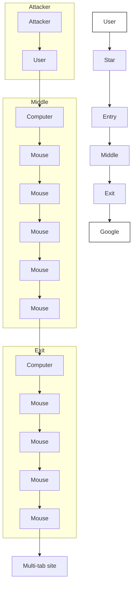

# DEMUX: Boundary-Aware Multi-Scale Traffic Demixing for Multi-Tab Website Fingerprinting

Yali Yuan, Yaosheng Liu, Qianqi Niu, Guang Cheng

Abstract—Website fingerprinting (WF) attacks infer the websites visited by users from encrypted traffic in anonymous networks such as Tor. Existing deep learning methods achieve high accuracy under the single-tab assumption but degrade substantially when users open multiple tabs concurrently, producing interleaved traffic that transforms WF into an implicit demixing problem. We identify three structural requirements for effective multi-tab demixing, namely signal integrity at segment boundaries, multi-scale local modeling, and relative temporal association of dispersed fragments, and show that no prior method satisfies all three simultaneously. We propose DEMUX, a designed framework that addresses these requirements through three tightly coupled components. A Boundary Preserving Aggregation Module employs overlapping window partitioning with joint packet-level and burst-level feature extraction. A Multi-Scale Parallel CNN captures heterogeneous temporal patterns via parallel branches. A two-stage Transformer encoder with Rotary Positional Embedding enables robust cross-window fragment association. The Boundary Preserving Aggregation Module additionally serves as a plug-and-play preprocessor that consistently improves existing baselines without architectural modification. Extensive experiments across closed-world, openworld, defense-augmented, dynamic-tab, and cross-configuration settings demonstrate that DEMUX achieves state-of-the-art performance. In the challenging closed-world 5-tab setting, DEMUX attains a P@5 of 0.943 and MAP@5 of 0.961, outperforming the strongest baseline by 9.2 and 6.2 percentage points respectively, confirming its strong robustness in complex multi-tab demixing scenarios.

Index Terms—Website fingerprinting, Tor, Traffic analysis, Multi-tab, Deep learning, Transformer.

# I. INTRODUCTION

W ITH the rapid expansion of Internet technologies, net-work communication has become integral to daily life. work communication has become integral to daily life. However, the inherent openness of the Internet introduces significant privacy and security risks, driving the development and widespread adoption of anonymous communication systems such as The Onion Router (Tor) [1]. Although Tor employs multi-layer encryption to protect user anonymity, it remains susceptible to the analysis of encrypted traffic patterns [2]. By exploiting observable features such as packet timing and size, an adversary can infer the websites a user visits, an attack known as Website Fingerprinting (WF) [3], as illustrated in Fig. 1. Over the past decade, WF attacks have advanced substantially, evolving from hand-crafted features with conventional classifiers [4]–[7] to the deep learning paradigm Yali Yuan and Yaosheng Liu contributed equally to this work. Yali Yuan, Qianqi Niu and Guang Cheng are with the School of Cyber Science and Engineering, Southeast University, Nanjing 211189, China. Yaosheng Liu is with the School of Artificial Intelligence, Southeast University, Nanjing 211189, China. Guang Cheng is the corresponding author. (e-mail: gcheng@seu.edu.cn). established by Deep Fingerprinting (DF) [8], which feeds raw packet-direction sequences into stacked convolutional layers to learn discriminative representations in an end-to-end manner. Under the single-tab assumption, wherein each trace corresponds to exactly one target website, these approaches achieve identification rates exceeding 90% in controlled settings.

Real-world browsing, however, rarely conforms to the single-tab assumption. Users routinely open multiple websites concurrently, producing a single observed trace that superimposes the traffic of k overlapping websites, where k is dynamic and unknown to the attackers. This transforms WF from a classification problem into a traffic demixing problem, in which the attackers must recover the identities of all k websites from a single entangled observation without prior knowledge of k or the temporal boundaries between constituent flows. This shift is qualitative rather than merely quantitative. Rather than an easy scaling of the single-tab task, multi-tab demixing poses a fundamentally different problem whose structure imposes architectural constraints that no existing method was designed to satisfy.

To understand what these constraints entail, we systematically analyze the architectural gap between the multi-tab demixing problem and existing WF architectures. Prior work has largely built upon the DF architecture. This CNN-based backbone has underpinned a broad family of subsequent single-tab methods [9]–[15]. Although efforts to extend WF to multi-tab settings have leveraged attention mechanisms and structured traffic representations to model long-range dependencies in concurrent traffic [16]–[19], these methods likewise retain the single-scale local feature extraction design of DF. Among all existing multi-tab methods, the ARES framework [17], [19] has demonstrated the strongest overall performance. ARES’23 [17] established a Transformer-based multi-tab WF baseline and contributed the benchmark datasets that have since become standard in the field. ARES’25 [19] subsequently introduced an improved Transformer backbone that extracts both packet-level and burst-level features per window, achieving state-of-the-art results across multiple evaluation scenarios. However, even ARES shares foundational limitations inherited from the DF architecture. This analysis reveals three requirements that any effective demixing architecture need to satisfy simultaneously, yet no existing method fulfills all three. We summarize these requirements as follows.

R1. Signal integrity at segment boundaries. In multitab traffic, burst-boundary transitions, where the dominant contributing website changes, carry the most discriminative cross-source switching signals. Fixed non-overlapping window segmentation, inherited from single-tab methods, systematically fragments these transitions across adjacent windows, destroying the very evidence required to distinguish co-occurring sources.

R2. Multi-scale local modeling. Traffic fragments from different websites coexist at diverse temporal scales within a mixed trace. Burst patterns and periodic loading rhythms demand simultaneously short and long receptive fields, a diversity that single-scale CNN backbones cannot accommodate.   
R3. Relative temporal association of dispersed fragments.

Fingerprint evidence for a single website may appear in fragments scattered throughout the traffic, with arbitrary concurrent traffic in between. Absolute positional encodings tie position indices to the superimposed mixture rather than to any individual source, making them structurally inadequate for cross-window fragment association under varying tab compositions.

To address these requirements, we propose DEMUX, a multi-tab WF framework whose architecture is derived directly from the structural properties of the demixing problem. DEMUX departs from prior work in two principled ways. First, it replaces fixed non-overlapping segmentation with an overlapping window partitioning strategy that ensures boundary-adjacent burst transitions are always captured intact within at least one window, directly satisfying (R1). Second, it replaces the single-scale CNN backbone with a Multi-Scale Parallel CNN (MSP-CNN) that simultaneously extracts fine-grained burst-level patterns and coarse-grained periodic structures, thereby addressing (R2). The resulting multi-scale representations are fused via pointwise convolution and processed by a Transformer encoder equipped with Rotary Positional Embedding (RoPE), which models long-range temporal dependencies through relative positional offsets rather than absolute indices, directly satisfying (R3). Beyond its role within DEMUX, the overlapping window strategy is designed as a plug-and-play, model-independent module, termed the Boundary Preserving Aggregation Module, that can replace the aggregation component of any WF architecture relying on temporal or burst-derived features. We validate its generality by integrating Boundary Preserving Aggregation Module into several representative baselines and demonstrate consistent and statistically significant improvements across all of them. The contributions of this paper are summarized as follows.

• We propose DEMUX, a multi-tab WF framework codesigned to satisfy the three structural requirements (R1–R3) that multi-tab demixing imposes on any effective architecture, requirements that no existing method fulfills. DEMUX integrates three components, namely overlapping boundary-preserving aggregation, multi-scale parallel convolution, and a RoPE-enhanced Transformer encoder, that work in concert to achieve robust demixing under obfuscated concurrent traffic.   
• We propose a plug-and-play, universally applicable Boundary Preserving Aggregation Module that replaces fixed non-overlapping segmentation with overlapping window partitioning, preserving burst-boundary transition signals critical for demixing. While Boundary Preserving Aggregation Module serves as the core component of

flowchart

Fig. 1. Website fingerprinting attackers monitor the encrypted traffic between the user and the Tor entry node to infer which websites the user is browsing.

DEMUX for satisfying (R1), it is generalizable to any WF pipeline relying on temporal or burst-derived features. We validate this generality by integrating Boundary Preserving Aggregation Module into representative baselines including DF, TMWF, and ARES’25, achieving consistent improvements without any architectural modification.

• We conduct evaluations across closed-world, open-world, defense-augmented, dynamic-tab, and cross-configuration settings. DEMUX achieves state-of-the-art performance across all settings. In the closed-world 5-tab setting, DEMUX attains a P@5 of 0.943 and MAP@5 of 0.961, outperforming the strongest baseline by 9.2 and 6.2 percentage points respectively. Under the most challenging TrafficSliver defense, DEMUX maintains a P@2 of 0.940, exceeding the next-best competitor by 2.5 points. Notably, these advantages widen as the number of concurrent tabs increases, confirming that the strong robustness of DEMUX in practical multi-tab demixing scenarios.

# II. RELATED WORK

Website fingerprinting has been extensively studied as a traffic analysis technique in the context of anonymity networks and encrypted communications. We organize existing work along the technical lineage most relevant to DEMUX, progressing from early statistical approaches, through classical machine learning methods, then the deep convolutional architecture introduced by DF and its subsequent extensions, to recent multi-tab methods.

# A. Single-Tab Website Fingerprinting

Early Statistical and Classical Machine Learning Methods: Early WF research paired hand-crafted features with conventional classifiers. Representative examples include the kNNbased attack [20], which evaluated WF under large open-world settings, and CUMUL [5], which maps traces into a compact cumulative representation to enable scalable classification. Hayes and Danezis [4] proposed k-fingerprinting, a random forest based approach designed for robustness and scalability, and evaluated its performance against several WF defenses. These works established foundational WF threat models and evaluation protocols, but uniformly assume that a traffic trace corresponds to a single website visit, an assumption that becomes untenable under real-world multi-tab browsing.

The DF Architecture and Its Variants: A major advance occurred with Deep Fingerprinting (DF) [8], which showed that stacked 1D convolutional networks operating directly on raw packet direction sequences, represented as fixed-length ±1 arrays of up to 5000 packets, can yield highly discriminative fingerprint representations without manual feature engineering. DF demonstrated strong performance on Tor traffic and was the first attack effective against WTF-PAD [21]. This approach of treating the entire trace as a single 1D sequence and processing it with a single-scale convolutional backbone has since become the standard foundation for deep learning based WF methods.

Subsequent works extend the DF backbone in different directions. Var-CNN [10] supplemented direction sequences with inter-packet timing and metadata, using a ResNet-based architecture to improve data efficiency and open-world performance. Tik-Tok [22] adopted the same CNN structure as DF but replaced the direction-only input with direction-multipliedby-timestamp values, demonstrating that timing signals can be effectively exploited alongside directional features. Triplet Fingerprinting [23] introduced N-shot learning to improve portability and reduce data collection burden. Cherubin et al. [24] conducted the first evaluation using genuine Tor traffic as ground truth, providing a realistic open-world benchmark. NetAugment and NetCLR [25] proposed trace augmentation and self-supervised contrastive learning over direction sequences to enhance generalization across unobserved network conditions. A distinct representation choice appears in RF [26], which constructs a Traffic Aggregation Matrix (TAM) by counting packet directions within fixed time slots, forming a 2D structure that tolerates timing perturbations introduced by defenses. LASERBEAK [27] further introduced a Transformer-based approach with multi-channel feature representations including direction, timing, and size, demonstrating enhanced effectiveness under FRONT defenses.

Despite the diversity of these approaches in representation and architecture, all operate under the single-tab assumption, where each trace largely preserves the holistic fingerprint of one target website. This assumption is fundamentally challenged in multi-tab browsing, where traffic from multiple websites is interleaved, producing a qualitative change in problem structure that we characterize in this work as implicit traffic demixing.

# B. Multi-Tab and Multi-Label Website Fingerprinting

Early Multi-Tab Work: Multi-tab browsing fundamentally changes the WF problem structure. A single observed trace may contain overlapping flows from multiple websites, and the attacker must identify a set of visited sites rather than a single label. Xu et al. [28] explicitly studied this setting and demonstrated that single-tab WF performance degrades severely when the single-page assumption is violated, motivating dedicated multi-tab attacks.

Sequence-Based Multi-Tab Methods: Several multi-tab methods process traffic without explicit multi-level burst aggregation, instead relying on packet direction sequences or windowed encodings as their primary input representation. BAPM [16] generates a tab-aware representation from packet direction sequences and performs block division to separate concurrent page tabs as clearly as possible, using attention-based profiling to group blocks belonging to the same tab. TMWF [18] adopts DF’s single-scale CNN as a local feature extractor and replaces DF’s classification head with a Transformer encoder, demonstrating the utility of attention mechanisms for associating features across mixedsession traces. ARES’23 [17] advanced this line by explicitly formulating multi-tab WF as multi-label classification under a Transformer backbone with windowed packet-direction inputs, and contributed the closed-world and open-world benchmark datasets that have since become standard in the field. Despite differences in architecture, these methods share the absence of burst-level aggregation, and all rely on single-scale local feature encoding inherited from the DF architecture.

Aggregation-Based Multi-Tab Methods: ARES’25 [19] departed from the above line by introducing Multi-Level Traffic Aggregation as its key contribution. The traffic trace is divided into fixed-size non-overlapping windows, and within each window both packet-level features (the sequence of packet directions) and burst-level features (burst count, average burst size, inter-burst intervals) are extracted. These per-window multi-level aggregated features are fed into an improved Transformer-based classifier. The structured local representation provided by Multi-Level Traffic Aggregation substantially improves robustness over sequence-based methods, and ARES’25 represents the current state of the art in multi-tab WF.

Limitations of Existing Methods: Examining the above methods collectively reveals three structural limitations that have not been simultaneously addressed. First, all prior multitab methods rely on single-scale local feature extraction. Small convolution kernels capture fine-grained burst patterns but are sensitive to noise from concurrent flows, while large kernels model coarser structures but oversmooth the burst-level cues critical for fingerprint discrimination. Neither operating point adequately handles the multi-scale temporal diversity of multitab traffic, leaving (R1) unaddressed. Second, ARES’25’s fixed non-overlapping segmentation fragments burst boundaries across adjacent windows, systematically discarding the inter-burst transition cues that are most informative for distinguishing concurrent sources, leaving (R2) unaddressed in existing fixed-window methods. Third, Transformer-based multitab methods [17]–[19] adopt absolute or learned positional encodings. However, the absolute positions of fragments from the same website are determined by unpredictable interleaving with concurrent flows, making absolute indices unreliable for fragment association. Relative temporal context is structurally more appropriate for the demixing problem, yet remains unexploited in existing approaches, leaving (R3) unaddressed. Collectively, these limitations indicate that multi-tab traffic demixing requires an architecture jointly designed to satisfy all three requirements, a goal that motivates the design of DEMUX.

# III. THREAT MODEL

In our threat model, clients use Tor or similar anonymous communication systems to conceal their online activity and may open k browser tabs concurrently or at short intervals within a single browsing session, where k is dynamic and unknown to the attacker. The resulting encrypted traffic originates from multiple target websites and overlaps temporally, preventing any individual website from presenting a complete, isolated traffic pattern. We further consider the deployment of fingerprint defense mechanisms such as WTF-PAD [21], FRONT [29], and TrafficSliver [7], which operate at the client browser or Tor relay level to perturb traffic characteristics through techniques including dummy packet injection, adaptive padding, and multi-path traffic splitting.

As illustrated in Fig. 1, we assume that the attacker is a passive eavesdropper positioned between the client and the Tor entry node, capable of capturing packet-level metadata for all outgoing and incoming traffic. Specifically, the attacker observes a sequence of packets, each represented as a direction-timestamp pair $( d _ { i } , t _ { i } )$ , where $d _ { i } \in \{ + 1 , - 1 \}$ denotes the packet direction (outgoing or incoming) and ti denotes the arrival timestamp. No payload content is accessible. The attacker’s objective is to infer the complete set of websites visited by the client within a session from this mixed, encrypted observation, thereby undermining the anonymity guarantees provided by the underlying network.

Our threat model builds upon the multi-tab WF setting established by ARES’23 [17], whose benchmark datasets we directly adopt for no-defense evaluation. Compared to earlier formulations [16], [18] that assume a fixed and known $k ,$ a single browser version, and traces collected exclusively from website homepages, ARES’23 relaxed these constraints by supporting dynamic tab counts ranging from 2 to 5, heterogeneous Tor Browser versions (10.x–13.x), and a more realistic crawling strategy. We adopt this setting without modification. The attacker must robustly recover the full set of visited websites from mixed traffic under unknown tab counts and heterogeneous browser environments, without any prior knowledge of k or version-specific traffic characteristics.

Regarding defense scenarios, since existing defense mechanisms are designed for single-tab traffic, we follow the synthesis procedure of [18] to construct two-tab defense datasets by combining independently defended single-tab traces. Defense evaluation is therefore conducted exclusively in the 2-tab setting. For the no-defense setting, we evaluate across the full range of 2 to 5 concurrent tabs. Consistent with prior work [17]–[19], we retain two standard evaluation scenarios. In the closed-world scenario, the client visits only websites from the Alexa Top-100 monitored set and the attacker has full training coverage of all monitored sites. In the openworld scenario, the client may visit arbitrary websites and the attacker possesses training samples drawn solely from the monitored subset.

# IV. FRAMEWORK

This section presents the DEMUX framework. We formulate the multi-tab WF problem and provide an architectural overview (Section IV-A), then detail the three components in Sections IV-B–IV-D.

# A. Problem Formulation and Architecture Overview

Problem formulation. Let $\mathcal { T } ~ = ~ \{ ( d _ { i } , t _ { i } ) \} _ { i = 1 } ^ { N }$ denote an observed encrypted traffic trace of N packets, where $d _ { i } \in$ $\{ + 1 , - 1 \}$ encodes the packet direction (outgoing/incoming) and $t _ { i } \in \mathbb { R } _ { + }$ is the arrival timestamp. In a multi-tab browsing session, $\tau$ is a temporally superimposed mixture of flows from K concurrently visited websites, where K is unknown to the attacker. The objective is to infer a binary label vector $\mathbf { y } = [ y _ { 1 } , \hdots , y _ { M } ] ^ { \top } \in \mathbf { \bar { \Omega } } \{ 0 , 1 \} ^ { M }$ over M monitored websites, where $y _ { m } = 1$ if and only if website m was visited. This constitutes a multi-label classification problem whose difficulty stems from two entangled factors: the input $\tau$ is an unstructured superposition of multiple sources, and both the number of sources K and their temporal boundaries are unknown.

Architecture overview. As motivated by the three structural requirements identified in Section I, DEMUX comprises three sequentially composed modules, each targeting one requirement:

1) Boundary Preserving Aggregation Module (Section IV-B) partitions T into overlapping temporal windows and aggregates each window into a joint packetlevel and burst-level feature vector, producing a sequence $\mathbf { X } \in \mathbb { R } ^ { L \times C }$ that preserves burst-boundary transition signals (R1).   
2) Multi-Granularity Local Analysis (Section IV-C) processes X through a Multi-Scale Parallel CNN (MSP-CNN) with three parallel branches of heterogeneous kernel sizes, yielding a unified local feature map H ∈ $\mathbb { R } ^ { L ^ { \prime } \times d }$ that jointly encodes fine-grained burst patterns and coarse-grained periodic structures (R2).   
3) Global Association (Section IV-D) models longrange temporal dependencies via a two-stage Transformer encoder [30] with Rotary Positional Embedding (RoPE) [31], associating dispersed fingerprint fragments from the same website across the full sequence (R3).

The complete architecture is illustrated in Fig. 2, and all hyperparameters are listed in Table I.

# B. Boundary Preserving Aggregation Module

Motivation. We first define two key concepts. A burst is a maximal consecutive sub-sequence of packets sharing the same direction. A burst boundary is the transition point between two successive bursts with opposing directions. In multi-tab traffic, burst boundaries carry the most discriminative cross-source switching signals, as they mark the moments at which the dominant contributing website changes. Conventional fixed-size non-overlapping windows (length W , stride W ), widely adopted in prior WF pipelines [19], systematically fragment these boundaries: a burst straddling a window edge is split into two contextually isolated halves, destroying the switching evidence critical to R1.

Overlapping window partitioning. To address this limitation, the Boundary Preserving Aggregation Module replaces nonoverlapping slicing with a sliding window of length W and stride $\Delta \ : < \ : W$ . Given a trace of total duration $T ,$ , the k-th window covers the time interval $[ k \Delta , k \Delta + W )$ . The total number of windows is

  
Fig. 2. The DEMUX framework diagram includes the Boundary Preserving Aggregation Module, Multi-Granularity Local Analysis, and Global Association modules. It also provides detailed visualizations of the convolutional blocks (with kernel size = n) and the Transformer encoder, which incorporates a Multi-Headed Self-Attention mechanism enhanced with Rotary Positional Embedding (RoPE).

$$
L = \left\lfloor \frac {T - W}{\Delta} \right\rfloor + 1. \tag {1}
$$

Since $\Delta \ : < \ : W$ , every point in the trace is covered by $r =$ $\lceil W / \Delta \rceil$ consecutive windows, guaranteeing that every burst boundary is fully contained within at least one window with sufficient context on both sides. In our implementation, $W =$ 20 ms and ∆ = 10 ms, yielding a 50% overlap ratio and r = 2.

Multi-level feature aggregation. Following the multi-level feature design introduced by ARES’25 [19], each window wk $( k = 1 , \ldots , L )$ extracts features at two complementary granularities:

• Packet-level features $\mathbf { p } _ { k } \in \mathbb { R } ^ { C _ { p } } ;$ the ordered sequence of packet directions $d _ { i } \in \{ + 1 , - 1 \}$ within $w _ { k } ,$ , capturing fine-grained directional dynamics.   
• Burst-level features $\mathbf { b } _ { k } \ \in \mathbb { R } ^ { C _ { b } }$ : computed by grouping consecutive same-direction packets into bursts and extracting four structural descriptors—burst count, mean burst size, burst size variance, and mean inter-burst interval—that characterize the temporal rhythm of the window.

The two representations are concatenated into a unified window feature vector:

$$
\mathbf {x} _ {k} = \left[ \begin{array}{c c} \mathbf {p} _ {k} & \mathbf {b} _ {k} \end{array} \right] \in \mathbb {R} ^ {C}, \quad C = C _ {p} + C _ {b}, \tag {2}
$$

and the module output is the sequence:

$$
\mathbf {X} = \left[ \begin{array}{l l l l} \mathbf {x} _ {1}, & \mathbf {x} _ {2}, & \dots , & \mathbf {x} _ {L} \end{array} \right] ^ {\top} \in \mathbb {R} ^ {L \times C}. \tag {3}
$$

Packet-level features supply the directional evidence needed to discriminate burst shapes, while burst-level features supply the structural context needed to associate consecutive bursts from the same source. Together with overlapping partitioning, X constitutes a boundary-aware, structurally informative representation that directly satisfies R1.

Plug-and-play applicability. The Boundary Preserving Aggregation Module is designed as a model-agnostic preprocessing component: it can replace the aggregation stage of any WF pipeline that relies on temporal or burst-derived features without modifying the downstream model. Its consistent improvements across diverse baselines are demonstrated in Section V-J.

# C. Multi-Granularity Local Analysis

Motivation. Given X, the local analysis module must extract discriminative per-window and inter-window patterns. As discussed in Section I, fragments from different websites coexist at heterogeneous temporal scales within a mixed trace: finegrained burst patterns demand short receptive fields, while coarse-grained periodic loading rhythms require long receptive fields. Conventional single-kernel CNN backbones [8], [18] enforce a hard trade-off between these two regimes, making them structurally insufficient for R2.

Multi-Scale Parallel CNN (MSP-CNN). MSP-CNN resolves this trade-off by deploying B = 3 independent convolutional branches with distinct kernel sizes $k _ { i } \in \{ 3 , 5 , 7 \}$ :

$$
\mathbf {H} _ {i} = \mathcal {R} _ {k _ {i}} (\mathbf {X}) \in \mathbb {R} ^ {L ^ {\prime} \times d _ {c}}, \quad i \in \{1, 2, 3 \}, \tag {4}
$$

where $\mathcal { R } _ { k _ { i } } ( \cdot )$ denotes a branch consisting of stacked Residual 1D Convolutional Blocks (RCBs) with kernel size $k _ { i } ,$ and $L ^ { \prime }$ reflects temporal compression from pooling layers. Branch 1 (k = 3) focuses on short-range burst-level patterns; Branch 2 (k = 5) captures intermediate-range structures; Branch 3 (k = 7) models coarse-grained periodic behaviors with reduced noise sensitivity. All kernel sizes are odd to enable symmetric zero-padding and center-aligned feature extraction.

Each RCB follows a standard residual design [32]:

$$
\mathrm{RCB} _ {k} (\mathbf {z}) = \mathrm{BN} \bigl (\sigma \bigl (\mathrm{Conv} _ {k} (\mathbf {z}) \bigr) \bigr) + \mathbf {z}, \tag {5}
$$

where $\operatorname { C o n v } _ { k }$ is a 1D convolution with kernel size $k , ~ \sigma ( \cdot )$ is the activation function, and BN denotes batch normalization [33]. The residual shortcut enables each branch to selectively amplify scale-specific patterns without redundantly relearning shared low-level statistics.

Multi-scale feature fusion. The three branch outputs are concatenated along the channel dimension:

$$
\mathbf {H} ^ {\mathrm{cat}} = \left[ \begin{array}{l l l} \mathbf {H} _ {1} & \| \mathbf {H} _ {2} \| \mathbf {H} _ {3} \end{array} \right] \in \mathbb {R} ^ {L ^ {\prime} \times 3 d _ {c}}. \tag {6}
$$

Directly passing ${ \bf { H } } ^ { \mathrm { { c a t } } }$ to the subsequent Transformer would triple the channel dimensionality, increasing computation and introducing cross-branch redundancy. We therefore apply a Pointwise Convolution (PWConv), i.e., $\textbf { a } 1 \times 1$ convolution operating exclusively along the channel dimension, to fuse and compress the multi-scale representations:

$$
\mathbf {H} = \mathrm{PWConv} (\mathbf {H} ^ {\mathrm{cat}}) \in \mathbb {R} ^ {L ^ {\prime} \times d}, \tag {7}
$$

where $3 d _ { c } = 7 6 8 \mathrm { a n d } d = 2 5 6$ in our implementation (Table I). PWConv performs cross-scale feature interaction and dimensionality reduction without altering the temporal structure, serving as a lightweight bottleneck that distills complementary scale-specific signals into a compact representation for global modeling.

# D. Global Association

Motivation. In multi-tab traffic, fingerprint cues from the same website are temporally dispersed throughout H, interleaved with fragments from concurrent sources. Local CNN features alone cannot associate windows sharing a common source— this requires long-range temporal reasoning, motivating a Transformer-based global association module. We adopt a two-stage encoder design, where Stage 1 establishes relative positional alignment among windows (R3) and Stage 2 refines the globally associated representation in an expanded feature space before classification. An inter-stage pointwise projection decouples the two stages, keeping each architecturally focused on its respective purpose.

Stage 1: RoPE-enhanced Transformer encoder. Let ${ \bf Z } ^ { ( 0 ) } =$ $\mathbf { H } \in \mathbb { R } ^ { L ^ { \prime } \times d }$ . At each layer $\ell \in \{ 1 , \ldots , L _ { 1 } \}$ , query, key, and value matrices are computed via learned linear projections:

$$
\mathbf {Q} ^ {(\ell)} = \mathbf {Z} ^ {(\ell - 1)} \mathbf {W} _ {Q} ^ {(\ell)}, \tag {8}
$$

$$
\mathbf {K} ^ {(\ell)} = \mathbf {Z} ^ {(\ell - 1)} \mathbf {W} _ {K} ^ {(\ell)}, \tag {9}
$$

$$
\mathbf {V} ^ {(\ell)} = \mathbf {Z} ^ {(\ell - 1)} \mathbf {W} _ {V} ^ {(\ell)}, \tag {10}
$$

with $\mathbf { W } _ { Q } ^ { \left( \ell \right) } , \mathbf { W } _ { K } ^ { \left( \ell \right) } , \mathbf { W } _ { V } ^ { \left( \ell \right) } \in \mathbb { R } ^ { d \times d } .$ , W(ℓ),

Standard absolute positional encodings—whether sinusoidal [30] or learned—assign positions by absolute index. In multi-tab traffic, this is unreliable because the absolute position of any website’s fragment is determined by unpredictable interleaving with concurrent flows and varies across traces. We instead adopt Rotary Positional Embedding (RoPE) [31], which encodes positions by rotating query and key vectors in pairs of embedding subspaces. For position index $m ,$ the j-th two-dimensional subspace is rotated by angle $m \theta _ { j }$ with $\dot { \theta } _ { j } = 1 0 0 0 0 ^ { - 2 j / d }$ :

$$
\tilde {\mathbf {Q}} ^ {(\ell)} = \mathrm{RoPE} \big (\mathbf {Q} ^ {(\ell)} \big), \qquad \tilde {\mathbf {K}} ^ {(\ell)} = \mathrm{RoPE} \big (\mathbf {K} ^ {(\ell)} \big). \tag {11}
$$

The key property is that the resulting attention score depends only on relative positional offsets:

$$
\left\langle \tilde {\mathbf {Q}} _ {m} ^ {(\ell)}, \tilde {\mathbf {K}} _ {n} ^ {(\ell)} \right\rangle = f (m - n), \tag {12}
$$

where f is a function of the relative displacement $( m - n )$ alone. This property directly addresses R3: the attention score between two windows reflects their relative temporal distance, enabling the model to associate fragments from the same website regardless of their absolute positions in the mixed trace.

Multi-head self-attention with $n _ { h }$ heads and per-head dimension $d _ { h } = d / n _ { h }$ is computed as

$$
\mathbf {Z} ^ {(\ell)} = \operatorname{Concat} _ {h = 1} ^ {n _ {h}} \left(\text { Softmax } \left(\frac {\tilde {\mathbf {Q}} _ {h} ^ {(\ell)} \tilde {\mathbf {K}} _ {h} ^ {(\ell) \top}}{\sqrt {d _ {h}}}\right) \mathbf {V} _ {h} ^ {(\ell)}\right) \mathbf {W} _ {O} ^ {(\ell)}, \tag {13}
$$

where W(ℓ)O $\mathbf { W } _ { O } ^ { ( \ell ) } \in \mathbb { R } ^ { d \times d }$ . Each attention sub-layer is followed by a position-wise feed-forward network (FFN) with hidden dimension $4 d ,$ and both sub-layers employ residual connections and layer normalization [34]. After $L _ { 1 }$ layers, Stage 1 outputs $\mathbf { Z } ^ { ( 1 ) } \in \mathbb { R } ^ { L ^ { \prime } \times d }$ .

Inter-stage feature expansion. A learnable pointwise projection expands each token from dimension d to $d ^ { \prime } > d$ before Stage 2:

$$
\mathbf {Z} ^ {(2)} = \mathrm{PWConv} \big (\mathbf {Z} ^ {(1)} \big) \in \mathbb {R} ^ {L ^ {\prime} \times d ^ {\prime}}, \tag {14}
$$

where $d = 2 5 6$ and $d ^ { \prime } = 3 8 4$ . This expansion increases pertoken representational capacity for Stage 2 refinement without perturbing the relative positional structure encoded by RoPE in Stage 1.

Stage 2: Refinement encoder. Stage 2 applies $L _ { 2 }$ standard Transformer encoder layers (without RoPE) on $\mathbf { Z } ^ { ( 2 ) }$ with hidden dimension $d ^ { \prime } \colon$

$$
\mathbf {Z} ^ {(3)} = \text { TransformerEncoder } _ {L _ {2}, d ^ {\prime}} \big (\mathbf {Z} ^ {(2)} \big) \in \mathbb {R} ^ {L ^ {\prime} \times d ^ {\prime}}. \tag {15}
$$

Each layer follows the same residual self-attention and FFN structure as Stage 1, with FFN dimension $4 d ^ { \prime }$ .

Classification head. The sequence $\mathbf { Z } ^ { ( 3 ) }$ must be aggregated into a fixed-size vector for classification. Flattening all $L ^ { \prime }$ position vectors inflates parameter count and propagates positional noise; plain average pooling suppresses discriminative variation across windows. We adopt an up-projection then pooling strategy: a linear projection Wup ∈ Rd′×d′′ $\mathbf { W } _ { \mathrm { u p } } \in \mathbb { R } ^ { d ^ { \prime } \times d ^ { \prime \prime } }$ expands each position-wise feature before averaging:

$$
\mathbf {z} = \frac {1}{L ^ {\prime}} \sum_ {l = 1} ^ {L ^ {\prime}} \mathbf {Z} _ {l} ^ {(3)} \mathbf {W} _ {\mathrm{up}} \in \mathbb {R} ^ {d ^ {\prime \prime}}, \tag {16}
$$

where $d ^ { \prime \prime } = 1 0 2 4$ . Increasing per-token capacity before pooling improves robustness to the alignment variability inherent in overlapping segmentation of multi-tab traffic (confirmed in Section V-I).

The pooled vector z is passed to an MLP classifier with sigmoid activation:

$$
\hat {\mathbf {y}} = \sigma (\mathrm{MLP} (\mathbf {z})) \in [ 0, 1 ] ^ {M}, \tag {17}
$$

where $\hat { y } _ { m }$ is the predicted probability that website m was visited. The model is trained end-to-end by minimizing the binary cross-entropy loss:

$$
\mathcal {L} = \mathrm{BCE} (\hat {\mathbf {y}}, \mathbf {y}). \tag {18}
$$

Summary. The three modules of DEMUX form a tightly coupled pipeline derived directly from the structural requirements of multi-tab traffic demixing: the Boundary Preserving Aggregation Module ensures burst-boundary integrity (R1), MSP-CNN provides multi-scale local perception (R2), and the RoPE-enhanced Transformer enables relative temporal association of dispersed fragments (R3). Their interactions are systematically analyzed in Sections V-J and V-I.

# V. EXPERIMENTS

In this section, we conduct an extensive experimental evaluation of DEMUX to assess its effectiveness and robustness in realistic multi-tab website fingerprinting scenarios. Our evaluation compares DEMUX against state-of-the-art (SOTA) baselines across a broad range of settings, including closedworld and open-world scenarios, dynamic tab configurations, and traffic traces protected by representative website fingerprinting defense mechanisms. Beyond overall detection performance, we further conduct ablation analysis and sensitivity analysis to systematically analyze the contribution of key model components and architectural design choices.

# A. Experimental Setup

1) Datasets: We evaluate DEMUX on datasets spanning four complementary scenarios.

Multi-tab datasets. We adopt the closed-world and openworld benchmark datasets from Deng et al. [17], collected over Tor without any traffic defense. In the closed-world setting, the Alexa top-100 websites serve as monitored classes; each trace interleaves 2–5 concurrently loaded tabs drawn uniformly from this set, yielding 58,000 traces per tab configuration. In the open-world setting, each N-tab trace combines N−1 monitored websites with one unmonitored site drawn from the Alexa top-20,000, yielding 64,000 traces per configuration.

Defense datasets. To evaluate robustness under traffic obfuscation, we construct 2-tab datasets protected by three representative defenses: WTF-PAD [21], Front [29], and TrafficSliver [7]. Since these defenses target single-tab traffic, we follow the synthesis procedure of Jin et al. [18] and compose multi-tab traces by overlaying independently defended singletab captures using the authors’ official implementations. WTF-PAD injects dummy packets during idle periods to obscure inter-burst timing gaps; Front concentrates dummy packet injection at the beginning of each trace using a Rayleigh distribution to obfuscate the feature-rich trace front with zero latency overhead; TrafficSliver splits traffic across multiple Tor entry nodes so that an adversary at any single node can observe only a partial fraction of packets, without introducing artificial delays or dummy traffic.

Dynamic-tab dataset. To assess generalization under unknown tab counts, we construct a mixed training set by sampling 15,000 traces from each closed-world 2–5-tab split (60,000 traces total). Models trained on this set are evaluated separately on each fixed-tab test split.

2) Baselines: We compare DEMUX against nine representative methods spanning two architectural families.

CNN-based: DF [8], Var-CNN [10], Tik-Tok [22], RF [26], and NetCLR [25].

Transformer-based: BAPM [16], TMWF [18], ARES’23 [17], and ARES’25 [19].

BAPM, TMWF, ARES’23, and ARES’25 are natively designed for multi-tab classification and trained with sigmoid outputs under binary cross-entropy (BCE) loss. The CNNbased single-tab methods are adapted by replacing their softmax heads with sigmoid layers and retraining under the same BCE objective, enabling each to produce independent sitelevel probabilities. All baselines are re-implemented and retrained within a unified preprocessing and training pipeline to ensure fair comparison.

3) Evaluation Metrics: Following standard practice in multi-tab WF evaluation [17], [19], we report three complementary metrics—AUC [35], P@K, and MAP@K—each computed per instance and averaged over the test set. Let $\textbf { y } \in \{ 0 , 1 \} ^ { C }$ be the ground-truth label vector and yˆ the corresponding predicted scores.

AUC is computed per site via one-versus-all ROC curves and averaged, providing a threshold-free measure robust to the severe class imbalance inherent in multi-tab traffic.

P@K measures the fraction of ground-truth sites recovered within the top-K predictions:

$$
\mathrm{P} @ K = \frac {1}{K} \sum_ {l \in \operatorname{Top} _ {K} (\hat {\mathbf {y}})} y _ {l}. \tag {19}
$$

MAP@K further rewards higher-ranked correct labels by accumulating prefix precisions:

$$
\mathrm{MAP} @ K = \frac {1}{K} \sum_ {k = 1} ^ {K} \mathrm{P} @ k. \tag {20}
$$

AUC captures global discrimination, while P@K and MAP@K directly reflect the attacker’s practical success in deanonymizing the most likely visited sites.

4) Implementation: DEMUX is implemented in PyTorch. Each dataset is partitioned once into train/validation/test subsets at an 8:1:1 ratio with a fixed random seed of 2025, governing data splits, weight initialization, and all stochastic components. For baseline methods, we adopt the open-source implementation framework of Deng et al. [36], retaining each model’s original training configuration as provided in the library to preserve the performance reported in the respective original works. DEMUX itself is trained with the AdamW optimizer [37] with a weight decay of $5 \times 1 0 ^ { - 3 }$ , a linear warm-up over the first 10 epochs from $2 \times 1 0 ^ { - 4 }$ to $2 \times 1 0 ^ { - 3 }$ followed by cosine annealing, for a total of 260 epochs at a batch size of 512. All experiments are conducted on a single

TABLE I ARCHITECTURE AND TRAINING CONFIGURATION OF DEMUX. 

<table><tr><td>Module</td><td>Hyperparameter</td><td>Value</td></tr><tr><td colspan="3">Boundary Preserving Aggregation Module (BM)</td></tr><tr><td></td><td>Window size / stride</td><td>20 ms / 10 ms</td></tr><tr><td></td><td>Feature channels (C)</td><td>8</td></tr><tr><td colspan="3">Multi-Scale Parallel CNN (MSP-CNN)</td></tr><tr><td></td><td>Kernel sizes</td><td>{3, 5, 7}</td></tr><tr><td></td><td>Channel progression</td><td>8→32→64→128→256</td></tr><tr><td></td><td>Pooling (kernel/stride)</td><td>8/4 × 4 stages</td></tr><tr><td></td><td>Fusion (pointwise conv)</td><td>768 → 256</td></tr><tr><td colspan="3">Global Association — Stage 1</td></tr><tr><td></td><td>Layers / heads / dim</td><td>2 / 8 / 256</td></tr><tr><td></td><td>FFN dim</td><td>1024</td></tr><tr><td></td><td>Positional encoding</td><td>RoPE (base  $10^{4}$ )</td></tr><tr><td colspan="3">Global Association — Stage 2</td></tr><tr><td></td><td>Inter-stage projection</td><td>256 → 384</td></tr><tr><td></td><td>Layers / heads / dim</td><td>2 / 8 / 384</td></tr><tr><td></td><td>FFN dim</td><td>1536</td></tr><tr><td colspan="3">Classification Head</td></tr><tr><td></td><td>Aggregation</td><td>Avg-pool + linear (384→1024)</td></tr><tr><td></td><td>Output</td><td>Sigmoid MLP ( $N_{\text{cls}}$  classes)</td></tr><tr><td colspan="3">Training</td></tr><tr><td></td><td>Optimizer / weight decay</td><td>AdamW /  $5 \times 10^{-3}$ </td></tr><tr><td></td><td>LR schedule (max / warm-up)</td><td>Cosine /  $2 \times 10^{-3}$  / 10 epochs</td></tr><tr><td></td><td>Batch size / epochs</td><td>512 / 260</td></tr><tr><td></td><td>Hardware</td><td>NVIDIA RTX 4090</td></tr></table>

NVIDIA RTX 4090 GPU. Detailed architectural and training hyperparameters of DEMUX are listed in Table I.

# B. Closed-World Evaluation

Table II reports closed-world performance as the number of concurrent tabs increases from 2 to 5. DEMUX consistently outperforms all baselines across all metrics, and its margin over the strongest baseline, ARES’25, widens with tab count. In terms of P@K, ARES’25 degrades from 0.900 at 2-tab to 0.851 at 5-tab, a drop of 4.9 percentage points, whereas DEMUX improves from 0.926 to 0.943 over the same range, expanding the absolute margin from 2.6 to over 9 points. MAP@K follows the same pattern: ARES’25 declines by more than 3.7 points cumulatively, while DEMUX remains stable with a degradation below 1 point. AUC tells a similar story—DEMUX holds at 0.997–0.996 across all settings, fluctuating by less than 0.001, whereas ARES’25 drops by approximately 0.008. These results indicate that DEMUX not only achieves higher absolute performance but also degrades significantly more slowly as traffic mixing intensifies, confirming the effectiveness of its architectural design under increasingly challenging multi-tab conditions.

# C. Open-World Evaluation

Table III reports results in the open-world setting, where each trace contains one unmonitored site, substantially increasing noise and class imbalance. The performance trends observed in the closed-world setting are preserved and amplified here. ARES’25 exhibits a modest but consistent decline in P@K from 0.879 to 0.869 as tabs increase from 2 to 5, whereas DEMUX improves from 0.913 to 0.951, widening the absolute gap from 3.4 to over 8 points. MAP@K follows the same direction: ARES’25 drops by nearly 1 point, while DEMUX rises steadily from 0.944 to 0.966. In the most challenging 5-tab setting, DEMUX attains an AUC of 0.998, surpassing ARES’25 by approximately 1 percentage point—a substantial margin at this performance level. Taken together, these results demonstrate that DEMUX maintains strong discriminability in the presence of unmonitored traffic and heavy flow interleaving, where existing methods show measurable degradation.

# D. Defense Robustness

Table IV reports performance under three representative defenses in the synthesized 2-tab setting. DEMUX achieves the highest AUC, P@2, and MAP@2 under all three defenses, and its margin over ARES’25 grows with the severity of the defense: 0.1, 0.8, and 0.4 points under WTF-PAD; 0.1, 1.3, and 0.8 points under Front; and 0.1, 2.5, and 1.5 points under TrafficSliver, respectively.

The more informative signal lies in how methods respond differently to each defense type. Under WTF-PAD, which targets inter-burst timing gaps, most methods maintain relatively strong performance, as directional patterns remain largely intact. Under Front, which obfuscates the feature-rich trace front, TMWF and ARES’23 degrade noticeably in P@2 to 0.792 and 0.808, suggesting that their feature extraction is sensitive to front-loaded trace perturbation. TrafficSliver, which restricts each entry-node observer to only a partial fraction of packets, proves most disruptive: TMWF collapses to a P@2 of 0.399 and ARES’23 to 0.429, while DEMUX retains a P@2 of 0.940, exceeding the next-best competitor by 2.5 points.

Two exceptions are worth noting. RF maintains competitive performance across all three defenses—particularly under TrafficSliver, where its P@2 of 0.702 substantially exceeds other CNN-based methods. This resilience is attributable to its TAM representation, which aggregates directional packet counts over fixed time slots and thus tolerates partial packet loss introduced by traffic splitting. Var-CNN similarly shows unexpectedly strong performance under TrafficSliver, achieving a P@2 of 0.826, despite its comparatively modest results in the no-defense setting.

DEMUX remains the top-ranked method across all nine metric–defense combinations. Its consistent advantage under TrafficSliver in particular, where incomplete packet observations break both local burst patterns and global temporal structure, suggests that its overlapping-window representation and multi-scale feature extraction provide complementary robustness that no single architectural choice in competing methods achieves alone.

# E. Dynamic Tab Evaluation

In practice, the number of concurrently opened tabs is unknown and varies across browsing sessions. We evaluate whether DEMUX can handle this uncertainty by training on a mixed dataset of 60,000 traces sampled uniformly from the closed-world 2–5-tab splits at 15,000 traces per configuration, and evaluating separately on each fixed-tab test set. Figure 3 shows that DEMUX achieves the highest AUC, P@K, and MAP@K across all twelve metric–setting pairs. Notably, its advantage over ARES’25 is maintained even in the 5-tab setting, where mixed training is most challenging due to higher label density and stronger inter-flow interference. These results indicate that DEMUX learns a unified representation that remains discriminative across varying tab compositions, rather than overfitting to the statistical properties of any single configuration.

TABLE II CLOSED-WORLD PERFORMANCE OF MULTI-TAB WF ATTACKS. 

<table><tr><td rowspan="2">Method</td><td colspan="3">2-tab</td><td colspan="3">3-tab</td><td colspan="3">4-tab</td><td colspan="3">5-tab</td></tr><tr><td>AUC</td><td>P@2</td><td>MAP@2</td><td>AUC</td><td>P@3</td><td>MAP@3</td><td>AUC</td><td>P@4</td><td>MAP@4</td><td>AUC</td><td>P@5</td><td>MAP@5</td></tr><tr><td>BAPM</td><td>0.935</td><td>0.529</td><td>0.625</td><td>0.867</td><td>0.377</td><td>0.478</td><td>0.839</td><td>0.349</td><td>0.446</td><td>0.793</td><td>0.299</td><td>0.385</td></tr><tr><td>NetCLR</td><td>0.943</td><td>0.590</td><td>0.688</td><td>0.872</td><td>0.425</td><td>0.543</td><td>0.846</td><td>0.387</td><td>0.498</td><td>0.797</td><td>0.325</td><td>0.426</td></tr><tr><td>DF</td><td>0.944</td><td>0.601</td><td>0.712</td><td>0.861</td><td>0.421</td><td>0.560</td><td>0.831</td><td>0.373</td><td>0.512</td><td>0.772</td><td>0.300</td><td>0.423</td></tr><tr><td>RF</td><td>0.950</td><td>0.643</td><td>0.752</td><td>0.876</td><td>0.489</td><td>0.649</td><td>0.840</td><td>0.427</td><td>0.604</td><td>0.779</td><td>0.338</td><td>0.499</td></tr><tr><td>Tik-Tok</td><td>0.957</td><td>0.647</td><td>0.754</td><td>0.872</td><td>0.443</td><td>0.588</td><td>0.837</td><td>0.383</td><td>0.531</td><td>0.781</td><td>0.306</td><td>0.428</td></tr><tr><td>Var-CNN</td><td>0.971</td><td>0.726</td><td>0.809</td><td>0.923</td><td>0.562</td><td>0.697</td><td>0.866</td><td>0.429</td><td>0.566</td><td>0.786</td><td>0.326</td><td>0.468</td></tr><tr><td>TMWF</td><td>0.973</td><td>0.740</td><td>0.805</td><td>0.936</td><td>0.590</td><td>0.679</td><td>0.933</td><td>0.619</td><td>0.701</td><td>0.908</td><td>0.548</td><td>0.633</td></tr><tr><td>ARES&#x27;23</td><td>0.987</td><td>0.832</td><td>0.880</td><td>0.979</td><td>0.778</td><td>0.846</td><td>0.974</td><td>0.774</td><td>0.841</td><td>0.966</td><td>0.732</td><td>0.805</td></tr><tr><td>ARES&#x27;25</td><td>0.994</td><td>0.900</td><td>0.936</td><td>0.990</td><td>0.864</td><td>0.913</td><td>0.989</td><td>0.887</td><td>0.926</td><td>0.986</td><td>0.851</td><td>0.899</td></tr><tr><td>DEMUX</td><td>0.997</td><td>0.926</td><td>0.953</td><td>0.996</td><td>0.917</td><td>0.947</td><td>0.995</td><td>0.931</td><td>0.953</td><td>0.996</td><td>0.943</td><td>0.961</td></tr></table>

TABLE III OPEN-WORLD PERFORMANCE OF MULTI-TAB WF ATTACKS. 

<table><tr><td rowspan="2">Method</td><td colspan="3">2-tab</td><td colspan="3">3-tab</td><td colspan="3">4-tab</td><td colspan="3">5-tab</td></tr><tr><td>AUC</td><td>P@2</td><td>MAP@2</td><td>AUC</td><td>P@3</td><td>MAP@3</td><td>AUC</td><td>P@4</td><td>MAP@4</td><td>AUC</td><td>P@5</td><td>MAP@5</td></tr><tr><td>BAPM</td><td>0.932</td><td>0.515</td><td>0.610</td><td>0.868</td><td>0.379</td><td>0.483</td><td>0.837</td><td>0.346</td><td>0.443</td><td>0.799</td><td>0.308</td><td>0.397</td></tr><tr><td>NetCLR</td><td>0.940</td><td>0.575</td><td>0.674</td><td>0.874</td><td>0.428</td><td>0.546</td><td>0.846</td><td>0.382</td><td>0.495</td><td>0.791</td><td>0.332</td><td>0.442</td></tr><tr><td>DF</td><td>0.941</td><td>0.577</td><td>0.687</td><td>0.861</td><td>0.424</td><td>0.565</td><td>0.827</td><td>0.374</td><td>0.511</td><td>0.780</td><td>0.315</td><td>0.446</td></tr><tr><td>RF</td><td>0.948</td><td>0.639</td><td>0.749</td><td>0.880</td><td>0.497</td><td>0.656</td><td>0.841</td><td>0.430</td><td>0.606</td><td>0.788</td><td>0.354</td><td>0.520</td></tr><tr><td>Tik-Tok</td><td>0.955</td><td>0.631</td><td>0.736</td><td>0.874</td><td>0.451</td><td>0.600</td><td>0.835</td><td>0.379</td><td>0.521</td><td>0.786</td><td>0.317</td><td>0.449</td></tr><tr><td>Var-CNN</td><td>0.969</td><td>0.705</td><td>0.791</td><td>0.924</td><td>0.567</td><td>0.703</td><td>0.829</td><td>0.398</td><td>0.549</td><td>0.776</td><td>0.322</td><td>0.460</td></tr><tr><td>TMWF</td><td>0.969</td><td>0.697</td><td>0.761</td><td>0.944</td><td>0.616</td><td>0.706</td><td>0.929</td><td>0.601</td><td>0.683</td><td>0.905</td><td>0.542</td><td>0.631</td></tr><tr><td>ARES&#x27;23</td><td>0.985</td><td>0.806</td><td>0.859</td><td>0.976</td><td>0.770</td><td>0.844</td><td>0.973</td><td>0.774</td><td>0.841</td><td>0.931</td><td>0.587</td><td>0.702</td></tr><tr><td>ARES&#x27;25</td><td>0.992</td><td>0.879</td><td>0.920</td><td>0.990</td><td>0.868</td><td>0.917</td><td>0.988</td><td>0.875</td><td>0.918</td><td>0.988</td><td>0.869</td><td>0.911</td></tr><tr><td>DEMUX</td><td>0.996</td><td>0.913</td><td>0.944</td><td>0.995</td><td>0.917</td><td>0.948</td><td>0.996</td><td>0.931</td><td>0.954</td><td>0.998</td><td>0.951</td><td>0.966</td></tr></table>

# F. Cross-Configuration Generalization

The dynamic evaluation above trains on all tab counts simultaneously. Here we ask a strictly harder question: how well does a model trained exclusively on one tab configuration transfer to unseen tab counts? For each of the four closedworld configurations spanning 2 to 5 tabs, we train a dedicated model and evaluate it on the remaining three, yielding twelve train–test permutations in total. Since P@K and MAP@K require knowledge of the true label count, we report AUC only. As shown in Figure 4, DEMUX achieves the best AUC in all twelve permutations, with margins over the strongest baseline ranging from 0.4 to 2.6 percentage points. The largest gains appear in high-to-low transfer settings, where a model trained on 5-tab traces is evaluated on 2-tab or 3-tab data, and DEMUX’s richer multi-scale representations generalise more effectively to simpler traffic mixtures. Taken together with the dynamic evaluation, these results confirm that DEMUX’s robustness is not contingent on prior knowledge of tab count distribution, a realistic constraint in practical WF deployment scenarios.

# G. Effectiveness of the Boundary Preserving Aggregation Module

To quantify the contribution of Boundary Preserving Aggregation Module(BM) as a plug-and-play component, we integrate it into three representative baselines under the openworld 5-tab setting. For DF and TMWF, the +BM variants replace their raw direction sequences with BM’s multilevel representation. For ARES’25, +BM replaces its Multi-Level Traffic Aggregation with BM. We additionally include DEMUX-Dir, a direction-only ablation variant of DEMUX that uses raw packet directions without timestamp or burstlevel information.

Figure 5 shows that BM consistently improves all three baselines. The gains are largest for DF, where AUC rises from 0.780 to 0.901 and P@5 from 0.315 to 0.545, reflecting the combined effect of boundary preservation and the richer multi-level input. TMWF improves similarly, with AUC from 0.905 to 0.972 and P@5 from 0.542 to 0.771, confirming that cleaner local representations complement Transformer-based global modeling. Even ARES’25, which already employs structured multi-level aggregation, gains meaningfully from BM substitution, with P@5 rising from 0.869 to 0.900.

TABLE IV RESULTS UNDER THREE WEBSITE-FINGERPRINTING DEFENSES (2-TAB). THE DEFENSE DATASETS WERE SYNTHESIZED USING THE TMWF-PROVIDED SYNTHESIS CODE TO CONVERT SINGLE-LABEL TRACES INTO TWO-LABEL MIXTURES. 

<table><tr><td rowspan="2">Method</td><td colspan="3">WTF-PAD</td><td colspan="3">Front</td><td colspan="3">TrafficSliver</td></tr><tr><td>AUC</td><td>P@2</td><td>MAP@2</td><td>AUC</td><td>P@2</td><td>MAP@2</td><td>AUC</td><td>P@2</td><td>MAP@2</td></tr><tr><td>BAPM</td><td>0.941</td><td>0.562</td><td>0.671</td><td>0.897</td><td>0.414</td><td>0.506</td><td>0.795</td><td>0.286</td><td>0.363</td></tr><tr><td>NetCLR</td><td>0.945</td><td>0.672</td><td>0.784</td><td>0.914</td><td>0.554</td><td>0.671</td><td>0.849</td><td>0.396</td><td>0.499</td></tr><tr><td>DF</td><td>0.954</td><td>0.698</td><td>0.810</td><td>0.925</td><td>0.566</td><td>0.695</td><td>0.853</td><td>0.401</td><td>0.506</td></tr><tr><td>RF</td><td>0.959</td><td>0.769</td><td>0.858</td><td>0.955</td><td>0.743</td><td>0.838</td><td>0.956</td><td>0.702</td><td>0.791</td></tr><tr><td>Tik-Tok</td><td>0.966</td><td>0.751</td><td>0.850</td><td>0.945</td><td>0.629</td><td>0.759</td><td>0.938</td><td>0.570</td><td>0.682</td></tr><tr><td>Var-CNN</td><td>0.976</td><td>0.792</td><td>0.876</td><td>0.883</td><td>0.429</td><td>0.513</td><td>0.986</td><td>0.826</td><td>0.889</td></tr><tr><td>TMWF</td><td>0.992</td><td>0.869</td><td>0.919</td><td>0.981</td><td>0.792</td><td>0.866</td><td>0.864</td><td>0.399</td><td>0.497</td></tr><tr><td>ARES’23</td><td>0.986</td><td>0.881</td><td>0.930</td><td>0.972</td><td>0.808</td><td>0.881</td><td>0.845</td><td>0.429</td><td>0.533</td></tr><tr><td>ARES’25</td><td>0.997</td><td>0.951</td><td>0.973</td><td>0.997</td><td>0.949</td><td>0.971</td><td>0.995</td><td>0.915</td><td>0.949</td></tr><tr><td>DEMUX</td><td>0.998</td><td>0.959</td><td>0.977</td><td>0.998</td><td>0.962</td><td>0.979</td><td>0.996</td><td>0.940</td><td>0.964</td></tr></table>

  
Fig. 3. Dynamic-tab evaluation on the closed-world dataset. Models are trained on a mixed 2–5-tab training set and evaluated separately on each fixed-tab test split.

Comparing DEMUX-Dir and full DEMUX reveals that direction patterns alone yield a competitive AUC of 0.989, but incorporating BM’s multi-level representation raises this to 0.998 AUC and 0.951 P@5. The larger gap between DEMUX-Dir and DEMUX relative to that between ARES’25 and ARES’25+BM suggests that BM’s benefits are amplified when the downstream model is designed to exploit multilevel temporal structure. These results support treating BM as a standard preprocessing component for any multi-tab WF pipeline that relies on temporal or burst-derived features.

# H. Convergence Analysis

Figure 6 shows the learning curve of DEMUX in the openworld 5-tab setting. By epoch 40, DEMUX already reaches an AUC of 0.989, a P@5 of 0.875, and a MAP@5 of 0.921, surpassing ARES’25 across all three metrics before training is half complete.

The curve exhibits a clear two-phase shape. In the first phase, spanning epochs 0 to 40, all three metrics rise steeply as the local modules learn short-range burst patterns from the multi-level input. Progress then becomes more gradual as the Transformer-based global association module refines longrange dependencies across windows. The model approaches saturation near epoch 120 and converges at epoch 260 with AUC of 0.998, P@5 of 0.951, and MAP@5 of 0.966.

TABLE V FEATURE AGGREGATION IN THE OPEN-WORLD 5-TAB SETTING. UP-PROJ DENOTES A LEARNABLE POINTWISE EXPANSION OF EACH POSITION. 

<table><tr><td>Aggregation</td><td>AUC</td><td>P@5</td><td>MAP@5</td></tr><tr><td>Flatten</td><td>0.944</td><td>0.888</td><td>0.929</td></tr><tr><td>Mean pooling</td><td>0.980</td><td>0.939</td><td>0.957</td></tr><tr><td>Up-proj + mean (DEMUX)</td><td>0.985</td><td>0.951</td><td>0.966</td></tr></table>

The two-phase behavior has a practical implication: early stopping at epoch 40 already yields performance that surpasses all baselines and is suitable for compute-limited deployments, while full training to epoch 260 is warranted when maximum precision is required.

Fig. 4. Cross-configuration generalization (AUC) on the closed-world dataset. Each subplot trains on one tab count and evaluates on all four.   
  
Fig. 5. Effectiveness of the Boundary Preserving Aggregation Module as a plug-and-play component in the open-world 5-tab setting. Light bars denote baseline models; dark bars denote variants with BM integrated (DEMUX-Dir vs. full DEMUX).

# I. Sensitivity Analysis

We examine two architectural design dimensions under the open-world 5-tab setting: the strategy used to aggregate the Transformer output sequence into a global representation, and the positional encoding scheme used in the global association module.

Table V compares three aggregation strategies. Flattening all L position-wise vectors into a single Ld-dimensional representation preserves positional information explicitly but substantially inflates feature dimensionality, yielding an AUC of 0.944 and a P@5 of 0.888. Mean pooling reduces this to a d-dimensional descriptor and improves robustness, raising AUC to 0.980 and P@5 to 0.939, though it treats all positions uniformly and may suppress discriminative variation across windows. The proposed Up-proj + mean first expands each position-wise feature via a learnable pointwise projection before averaging, increasing per-window representational capacity while retaining the stability of pooling. This yields the best results, with AUC of 0.985 and P@5 of 0.951, suggesting that higher-capacity window representations improve robustness to the overlapping segmentation and mixed-tab alignment that are intrinsic to this setting.

line

| Epoch | AUC    | MAP@5  | P@5    |
|-------|--------|--------|--------|
| 40    | 0.99   | 0.92   | 0.87   |
| 80    | 0.995  | 0.94   | 0.91   |
| 120   | 0.995  | 0.95   | 0.93   |
| 170   | 0.995  | 0.96   | 0.94   |
| 260   | 0.995  | 0.97   | 0.95   |

Fig. 6. Convergence behaviour of DEMUX in the open-world 5-tab setting. The model already exceeds the strongest baseline after 40 epochs and saturates near epoch 120.

TABLE VI POSITIONAL ENCODING IN THE OPEN-WORLD 5-TAB SETTING. ROPE = ROTARY POSITIONAL EMBEDDING. 

<table><tr><td>Encoding</td><td>AUC</td><td>P@5</td><td>MAP@5</td></tr><tr><td>None</td><td>0.996</td><td>0.937</td><td>0.956</td></tr><tr><td>Sinusoidal</td><td>0.996</td><td>0.936</td><td>0.955</td></tr><tr><td>Learnable</td><td>0.996</td><td>0.934</td><td>0.954</td></tr><tr><td>RoPE (DEMUX)</td><td>0.998</td><td>0.951</td><td>0.966</td></tr></table>

Table VI compares four positional encoding schemes. Removing positional encoding entirely remains competitive at AUC of 0.996 and P@5 of 0.937, indicating that the multiscale front-end already encodes substantial local ordering information. Sinusoidal [30] and learnable absolute encodings perform slightly worse, with P@5 dropping to 0.936 and 0.934 respectively, which we attribute to the mismatch between fixed absolute position indices and the variability introduced by overlapping segmentation and dynamic tab compositions. RoPE [31] achieves the best results at AUC of 0.998 and P@5 of 0.951, as its relative positional offsets align naturally with the need to associate burst fragments across overlapping windows regardless of their absolute positions in the mixed trace, directly addressing (Requirement 3) as motivated in Section I.

TABLE VII ABLATION STUDY IN THE OPEN-WORLD 5-TAB SETTING. ✓ = MODULE ENABLED; ✗ = REMOVED OR REDUCED. 

<table><tr><td>Variant</td><td>BM</td><td>MSP-CNN</td><td>GA</td><td>P@5</td><td>MAP@5</td></tr><tr><td>w/o BM</td><td>✕</td><td>√</td><td>√</td><td>0.876</td><td>0.907</td></tr><tr><td>kernel=3 only</td><td>√</td><td>✕</td><td>√</td><td>0.924</td><td>0.946</td></tr><tr><td>kernel=5 only</td><td>√</td><td>✕</td><td>√</td><td>0.926</td><td>0.949</td></tr><tr><td>kernel=7 only</td><td>√</td><td>✕</td><td>√</td><td>0.919</td><td>0.943</td></tr><tr><td>w/o Transformer</td><td>√</td><td>√</td><td>✕</td><td>0.574</td><td>0.745</td></tr><tr><td>DEMUX (full)</td><td>√</td><td>√</td><td>√</td><td>0.951</td><td>0.966</td></tr></table>

# J. Ablation Analysis

Table VII reports an ablation study on the open-world 5- tab setting, isolating the contribution of three architectural components: the Boundary Preserving Aggregation Module (BM), the Multi-Scale Parallel CNN (MSP-CNN) in Multi-Granularity Local Analysis, and the Global Association(GA). Each variant disables or simplifies exactly one component while keeping the others intact.

Replacing BM with a plain direction sequence causes P@5 to drop from 0.951 to 0.876 and MAP@5 from 0.966 to 0.907. This confirms that the multi-level representation and overlapping window partitioning provided by BM are essential for preserving burst-boundary transition signals that fixed nonoverlapping segmentation systematically destroys, consistent with the (R1) motivation in Section I.

Replacing MSP-CNN with a single-kernel branch reduces P@5 to the range of 0.919 to 0.926 regardless of which kernel size is retained. The similar degradation across all three kernel sizes confirms that no single receptive field adequately handles the temporal-scale heterogeneity of multitab traffic; the parallel multi-scale design is necessary to jointly capture fine-grained burst patterns and coarse-grained periodic structures, addressing (R2).

Removing the Transformer yields the largest degradation, with P@5 dropping to 0.574 and MAP@5 to 0.745. Without global association, the model cannot link dispersed fingerprint fragments from the same website across the mixed trace, confirming that long-range temporal reasoning is the most critical capability for multi-tab demixing and that local feature extraction alone is fundamentally insufficient.

Taken together, these results confirm that all three components are necessary and complementary: BM addresses (R1) by preserving boundary-level cues, MSP-CNN addresses (R2) through multi-scale local perception, and the Transformer addresses (R3) by integrating long-range dependencies across the full sequence.

# VI. DISCUSSION

Below, we discuss design choices, limitations, practical considerations, and future research directions.

# Why a passive-only threat model.

DEMUX assumes a passive eavesdropper who observes packet metadata without modifying traffic. We adopt this setting because it represents the strictly harder demixing problem. The adversary receives no auxiliary signal beyond the temporally superimposed mixture of flows, so the entire burden of traffic demixing falls on the model architecture rather than on active probing. Our results demonstrate that this burden is well handled by the proposed co-design. Even in the most challenging 5-tab closed-world setting, DEMUX attains a P@5 of 0.943 and MAP@5 of 0.961 under purely passive observation. Under TrafficSliver, where the adversary observes only a partial fraction of packets at any single entry node, it still maintains a P@2 of 0.940. These results suggest that the pipeline of the Boundary Preserving Aggregation Module, the Multi-Scale Parallel CNN, and the RoPE-enhanced Transformer encoder captures sufficient discriminative structure in multi-tab traffic to achieve effective demixing without relying on active traffic manipulation, which would risk detection by Tor’s integrity checks or network anomaly monitors. An active adversary could further inject probing packets or manipulate timing to facilitate demixing. Incorporating such signals is a natural extension but lies outside the structural contributions demonstrated here.

# Implications of the demixing perspective.

Treating multi-tab WF as an implicit traffic demixing problem changes the view of the task. Rather than a harder version of single-tab classification, the problem becomes closer in structure to blind source separation in signal processing. This view yields two implications that extend beyond the specific architecture of DEMUX. First, it helps explain why prior single-tab-derived architectures plateau as tab count grows. The absence of boundary-aware aggregation and relativeposition reasoning is not a tuning issue but a structural mismatch with the demixing task. Second, it suggests that future WF research may benefit from treating temporal mixing as a first-class design constraint rather than as noise to be absorbed by model capacity. We view the three structural requirements identified in this work (R1 to R3) as a starting set, and we expect further requirements to emerge as the community explores richer observation modalities.

# VII. CONCLUSION

This paper argues that multi-tab website fingerprinting is not a harder instance of single-tab classification but a qualitatively different problem. It is a problem of implicit traffic demixing, in which the adversary must recover an unknown number of source identities from a single superimposed observation with no explicit boundary cues. Posing the task in these terms exposes three structural requirements that effective architectures need to jointly satisfy, and reveals that no prior method does so. DEMUX is the first framework designed from this perspective rather than inherited from the singletab lineage, and each of its components, namely overlapping boundary-preserving aggregation, multi-scale parallel convolution, and a two-stage RoPE-enhanced Transformer encoder, is derived directly from one of these requirements. Empirically, DEMUX establishes a new state of the art across closed-world, open-world, defense-augmented, dynamic-tab, and cross-configuration settings. More importantly, it exhibits the slowest performance degradation as mixing intensifies, indicating that its advantage stems from structural alignment with the demixing task rather than from incremental capacity gains. A further practical contribution is that the Boundary Preserving Aggregation Module transfers cleanly to existing architectures including DF, TMWF, and ARES’25, delivering consistent improvements without any modification to the downstream model and serving as a reusable preprocessing baseline for the field. Beyond the specific results, we hope the demixing perspective invites a broader rethinking of how multi-tab traffic analysis should be posed, evaluated, and defended against. The three structural requirements identified here are unlikely to be exhaustive, and we expect that richer observation modalities, longer sessions, and stronger defenses will motivate additional requirements in future work. Treating multi-tab traffic as a demixing problem, rather than as a noisy multi-label classification problem, provides what we believe is a more faithful foundation on which the next generation of website fingerprinting research can build.

# ACKNOWLEDGMENT

This work was supported in part by the National Key Research and Development Program of China (Grant No. 2023YFB3106700) under the Young Scientists Program, in part by Natural Science Foundation of Jiangsu Province (Grant No. SBK2023041256), in part by the National Natural Science Foundation of China (Grant No. 62302097), and in part by the National Undergraduate Training Programs for Innovation.

# REFERENCES

[1] R. Dingledine, N. Mathewson, and P. Syverson, “Tor: The secondgeneration onion router,” 2004.   
[2] S.-J. Xu, G.-G. Geng, X.-B. Jin, D.-J. Liu, and J. Weng, “Seeing traffic paths: Encrypted traffic classification with path signature features,” IEEE Transactions on Information Forensics and Security, vol. 17, pp. 2166– 2181, 2022.   
[3] A. Panchenko, L. Niessen, A. Zinnen, and T. Engel, “Website fingerprinting in onion routing based anonymization networks,” in Proceedings of the 10th annual ACM workshop on Privacy in the electronic society, 2011, pp. 103–114.   
[4] J. Hayes and G. Danezis, “k-fingerprinting: A robust scalable website fingerprinting technique,” in 25th USENIX Security Symposium (USENIX Security 16), 2016, pp. 1187–1203.   
[5] A. Panchenko, F. Lanze, J. Pennekamp, T. Engel, A. Zinnen, M. Henze, and K. Wehrle, “Website fingerprinting at internet scale.” in NDSS, vol. 1, 2016, p. 23477.   
[6] S. E. Oh, S. Sunkam, and N. Hopper, “p-fp: Extraction, classification, and prediction of website fingerprints with deep learning,” Proceedings on Privacy Enhancing Technologies, vol. 3, pp. 191–209, 2019.   
[7] W. De la Cadena, A. Mitseva, J. Hiller, J. Pennekamp, S. Reuter, J. Filter, T. Engel, K. Wehrle, and A. Panchenko, “Trafficsliver: Fighting website fingerprinting attacks with traffic splitting,” in Proceedings of the 2020 ACM SIGSAC Conference on Computer and Communications Security, 2020, pp. 1971–1985.   
[8] P. Sirinam, M. Imani, M. Juarez, and M. Wright, “Deep fingerprinting: Undermining website fingerprinting defenses with deep learning,” in Proceedings of the 2018 ACM SIGSAC conference on computer and communications security, 2018, pp. 1928–1943.   
[9] V. Rimmer, D. Preuveneers, M. Juarez, T. Van Goethem, and W. Joosen, “Automated website fingerprinting through deep learning,” in Network and Distributed System Security Symposium. IEEE Internet Society, 2018, pp. 1–15.   
[10] S. Bhat, D. Lu, A. Kwon, and S. Devadas, “Var-cnn: A data-efficient website fingerprinting attack based on deep learning,” arXiv preprint arXiv:1802.10215, 2018.   
[11] W. Cui, T. Chen, and E. Chan-Tin, “More realistic website fingerprinting using deep learning,” in 2020 IEEE 40th International Conference on Distributed Computing Systems (ICDCS). IEEE, 2020, pp. 333–343.

[12] Y. Wang, H. Xu, Z. Guo, Z. Qin, and K. Ren, “Snwf: Website fingerprinting attack by ensembling the snapshot of deep learning,” IEEE Transactions on Information Forensics and Security, vol. 17, pp. 1214– 1226, 2022.   
[13] Z. Ling, G. Xiao, W. Wu, X. Gu, M. Yang, and X. Fu, “Towards an efficient defense against deep learning based website fingerprinting,” in IEEE INFOCOM 2022-IEEE Conference on Computer Communications. IEEE, 2022, pp. 310–319.   
[14] H. Zou, J. Su, Z. Wei, S. Chen, C. Yang, and M. Chen, “Toward an effective few-shot website fingerprinting attack with quadruplet networks and deep local fingerprinting features,” IEEE Transactions on Dependable and Secure Computing, 2025.   
[15] J. Li, D. Wang, Y. Liu, Y. Gao, X. Zhang, Z. Lin, X. Ma, X. Luo, and X. Guan, “Cross-environmental website fingerprinting,” in IEEE INFO-COM 2025-IEEE Conference on Computer Communications. IEEE, 2025, pp. 1–10.   
[16] Z. Guan, G. Xiong, G. Gou, Z. Li, M. Cui, and C. Liu, “Bapm: block attention profiling model for multi-tab website fingerprinting attacks on tor,” in Proceedings of the 37th Annual Computer Security Applications Conference, 2021, pp. 248–259.   
[17] X. Deng, Q. Yin, Z. Liu, X. Zhao, Q. Li, M. Xu, K. Xu, and J. Wu, “Robust multi-tab website fingerprinting attacks in the wild,” in 2023 IEEE symposium on security and privacy (SP). IEEE, 2023, pp. 1005– 1022.   
[18] Z. Jin, T. Lu, S. Luo, and J. Shang, “Transformer-based model for multitab website fingerprinting attack,” in Proceedings of the 2023 ACM SIGSAC Conference on Computer and Communications Security, 2023, pp. 1050–1064.   
[19] X. Deng, X. Zhao, Q. Yin, Z. Liu, Q. Li, M. Xu, K. Xu, and J. Wu, “Towards robust multi-tab website fingerprinting,” arXiv preprint arXiv:2501.12622, 2025.   
[20] T. Wang, X. Cai, R. Nithyanand, R. Johnson, and I. Goldberg, “Effective attacks and provable defenses for website fingerprinting,” in 23rd USENIX Security Symposium (USENIX Security 14), 2014, pp. 143– 157.   
[21] M. Juarez, M. Imani, M. Perry, C. Dıaz, and M. Wright, “Wtf-´ pad: toward an efficient website fingerprinting defense for tor,” CoRR, abs/1512.00524, 2015.   
[22] M. S. Rahman, P. Sirinam, N. Mathews, K. G. Gangadhara, and M. Wright, “Tik-tok: The utility of packet timing in website fingerprinting attacks,” arXiv preprint arXiv:1902.06421, 2019.   
[23] P. Sirinam, N. Mathews, M. S. Rahman, and M. Wright, “Triplet fingerprinting: More practical and portable website fingerprinting with n-shot learning,” in Proceedings of the 2019 ACM SIGSAC Conference on Computer and Communications Security, 2019, pp. 1131–1148.   
[24] G. Cherubin, R. Jansen, and C. Troncoso, “Online website fingerprinting: Evaluating website fingerprinting attacks on tor in the real world,” in 31st USENIX Security Symposium (USENIX Security 22), 2022, pp. 753–770.   
[25] A. Bahramali, A. Bozorgi, and A. Houmansadr, “Realistic website fingerprinting by augmenting network traces,” in Proceedings of the 2023 ACM SIGSAC Conference on Computer and Communications Security, 2023, pp. 1035–1049.   
[26] M. Shen, K. Ji, Z. Gao, Q. Li, L. Zhu, and K. Xu, “Subverting website fingerprinting defenses with robust traffic representation,” in 32nd USENIX Security Symposium (USENIX Security 23), 2023, pp. 607–624.   
[27] N. Mathews, J. K. Holland, N. Hopper, and M. Wright, “Laserbeak: Evolving website fingerprinting attacks with attention and multi-channel feature representation,” IEEE Transactions on Information Forensics and Security, 2024.   
[28] Y. Xu, T. Wang, Q. Li, Q. Gong, Y. Chen, and Y. Jiang, “A multitab website fingerprinting attack,” in Proceedings of the 34th Annual Computer Security Applications Conference, 2018, pp. 327–341.   
[29] J. Gong and T. Wang, “Zero-delay lightweight defenses against website fingerprinting,” in 29th USENIX Security Symposium (USENIX Security 20), 2020, pp. 717–734.   
[30] A. Vaswani, N. Shazeer, N. Parmar, J. Uszkoreit, L. Jones, A. N. Gomez, Ł. Kaiser, and I. Polosukhin, “Attention is all you need,” Advances in neural information processing systems, vol. 30, 2017.   
[31] J. Su, M. Ahmed, Y. Lu, S. Pan, W. Bo, and Y. Liu, “Roformer: Enhanced transformer with rotary position embedding,” Neurocomputing, vol. 568, p. 127063, 2024.   
[32] K. He, X. Zhang, S. Ren, and J. Sun, “Deep residual learning for image recognition,” in Proceedings of the IEEE Conference on Computer Vision and Pattern Recognition, 2016, pp. 770–778.

[33] S. Ioffe and C. Szegedy, “Batch normalization: Accelerating deep network training by reducing internal covariate shift,” in International Conference on Machine Learning. PMLR, 2015, pp. 448–456.   
[34] J. L. Ba, J. R. Kiros, and G. E. Hinton, “Layer normalization,” arXiv preprint arXiv:1607.06450, 2016.   
[35] C. X. Ling, J. Huang, H. Zhang et al., “Auc: a statistically consistent and more discriminating measure than accuracy,” in Ijcai, vol. 3, 2003, pp. 519–524.   
[36] X. Deng, Q. Li, and K. Xu, “Robust and reliable early-stage website fingerprinting attacks via spatial-temporal distribution analysis,” in Proceedings of the 2024 ACM SIGSAC Conference on Computer and Communications Security, 2024.   
[37] I. Loshchilov and F. Hutter, “Decoupled weight decay regularization,” in International Conference on Learning Representations, 2019.