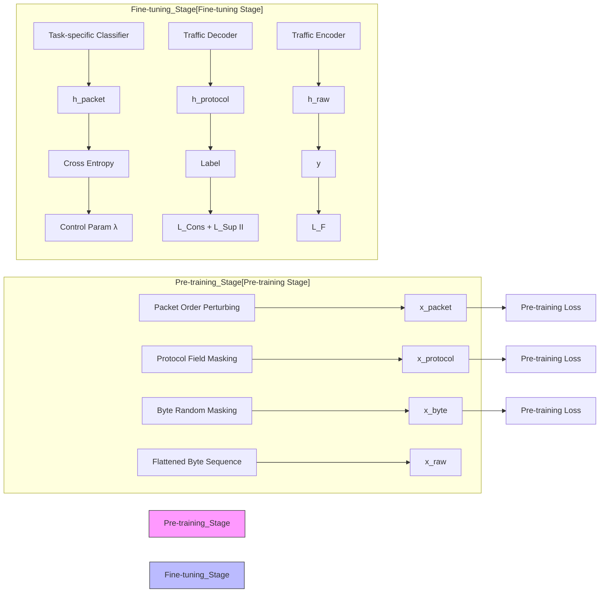

# NETHIRA: A HETEROGENEITY-AWARE HIERARCHICAL PRE-TRAINED MODEL FOR NETWORK TRAFFIC CLASSIFICATION

Chungang Lin†‡

Weiyao Zhang†

Haitong Luo†‡

Xuying Meng†⋆

Yujun Zhang†‡⋆

† Institute of Computing Technology, Chinese Academy of Sciences, Beijing, China ‡University of Chinese Academy of Sciences, Beijing, China.

## ABSTRACT

Network traffic classification is vital for network security and management. The pre-training technology has shown promise by learning general traffic representations from raw byte sequences, thereby reducing reliance on labeled data. However, existing pre-trained models struggle with the gap between traffic heterogeneity (i.e., hierarchical traffic structures) and input homogeneity (i.e., flattened byte sequences). To address this gap, we propose Nethira, a heterogeneityaware pre-trained model based on hierarchical reconstruction and augmentation. In pre-training, Nethira introduces hierarchical reconstruction at multiple levels—byte, protocol, and packet—capturing comprehensive traffic structural information. During fine-tuning, Nethira proposes a consistencyregularized strategy with hierarchical traffic augmentation to reduce label dependence. Experiments on four public datasets demonstrate that Nethira outperforms seven existing pre-trained models, achieving an average F1-score improvement of 9.11%, and reaching comparable performance with only 1% labeled data on high-heterogeneity network tasks.

Index Terms— network traffic classification, pre-training technology, network traffic heterogeneity

## 1. INTRODUCTION

Network traffic classification, which aims to organize network traffic into different categories such as applications and services, is fundamental and vital for network security and management [1–8]. Traditional rule-based methods [3, 9] classify network traffic using manually defined rules by extracting basic attributes such as protocols and port numbers. With the widespread adoption of encryption protocols and the use of dynamic ports, these methods have become increasingly ineffective. To address these challenges, machine learning and deep learning techniques have emerged, offering the ability to automatically extract valuable features from raw traffic and substantially improving classification performance [4,10,11]. Nevertheless, their effectiveness is highly dependent on largescale labeled data, which are often impractical to obtain in real-world network environments [12].

Recent advances [5–7, 13–17] are leveraging pre-training technology to enable efficient network traffic classification with small-scale labeled data. This approach typically involves two stages: pre-training on large-scale unlabeled data for general traffic representations, and fine-tuning on small-scale labeled data for specific network tasks. Several studies [5, 6, 13, 15, 16] have demonstrated the potential of applying pre-training techniques for network traffic classification. For instance, ET-BERT [5] flattens network traffic into byte sequences analogous to text sentences, leveraging masked language modeling and next-sentence prediction to capture byte-level representations. NetGPT [16] also relies on flattened byte sequences, but uses language modeling during pre-training. Subsequent works [7, 17] regard “flattened byte sequence” as the de facto choice, and on this basis, enhance the model’s ability to further capture traffic byte characteristics. For example, TraGe [17] introduces a header–payload differentiation pre-training task that exploits the distinct byte distributions of headers and payloads, while TrafficFormer [7] proposes a protocol-field randomization strategy to help the model focus on key byte information during fine-tuning.

Although flattening network traffic into byte sequences enables pre-trained models to learn fundamental byte-level representations, this choice forces model inputs into a homogeneous form. Such homogeneous input (i.e., flattened byte sequence) fails to effectively represent the inherent heterogeneity of network traffic—where discriminative features arise at different levels (e.g., byte, protocol, packet)—which is critical for network tasks. For instance, in network attack detection, attackers may hide payloads through byte obfuscation, whereas abnormal protocol fields and excessive packet fragmentation remain revealing of malicious activity [18]. Despite this, existing pre-trained models have no specialized built-in mechanisms to characterize these hierarchical traffic structures (i.e., heterogeneity unawareness).

In this paper, we aim to equip the model with awareness of hierarchical heterogeneity in network traffic under homogeneous inputs (i.e., flattened byte sequences), thereby improving classification performance and reducing reliance on labeled data. Our contributions are summarized as follows:

• We propose Nethira, a heterogeneity-aware hierarchical pre-trained model for network traffic classification.

flowchart

Fig. 1. The framework of Nethira.

Nethira can form a general traffic representation by modeling its heterogeneity via hierarchical reconstruction and augmentation, thus reducing label dependence.

• We design a pre-training task based on hierarchical reconstruction that masks and perturbs bytes, protocols, and packets, explicitly guiding the model to be aware of hierarchical traffic heterogeneity and ultimately forming a general traffic representation.  
• We introduce a fine-tuning strategy based on hierarchical augmentation that applies multi-level traffic data augmentation with consistency regularization, enhancing model generalization against heterogeneous traffic data and reducing reliance on labeled data.  
• We evaluate Nethira against state-of-the-art methods on four public datasets. Nethira achieves an average F1- score improvement of 9.11% compared to seven pretraining models, and reaches comparable performance with only 1% labeled data on high-heterogeneity tasks.

## 2. METHOD

## 2.1. Framework

The overall framework of Nethira is illustrated in Fig. 1, and consists of two stages: pre-training and fine-tuning. In the pre-training stage, network traffic is first transformed into a flattened byte sequence. Then, we apply hierarchical perturbations at three levels: byte random masking, protocol field masking, and packet order perturbing. Using a Transformerbased encoder–decoder architecture, the model is then pretrained through byte sequence reconstruction. To address the significant traffic heterogeneity during the fine-tuning stage, we employ a consistency regularization strategy based on hierarchical traffic data augmentation. This strategy enhances the model’s ability to capture traffic heterogeneity while reducing its label dependence.

## 2.2. The Pre-training Stage

During the pre-training stage, the model is trained on largescale unlabeled traffic data. The traffic data is first transformed into byte sequences, which serve as the input for pretraining. Then, the model is pre-trained through hierarchical sequence reconstruction, capturing traffic characteristics across multiple levels—byte, protocol, and packet.

## 2.2.1. Traffic Data Preprocessing

Raw network traffic is first segmented into flows defined by the five-tuple (IPsrc:PORTsrc, IPdst:PORTdst, Protocol). We preprocess each network flow to remove address bias and ensure length consistency. Specifically, we set the Ethernet address, IP address, and TCP/UDP port fields to zero to eliminate address-related bias information. Then, to manage variability in packet size within a flow, we select the first M packets. Each packet’s byte sequence is standardized to a fixed length L: sequences longer than L are truncated, while shorter sequences are zero-padded. The byte sequences of the first M packets $p _ { i }$ in the network flow are concatenated into a flattened byte sequence to construct the model input x:

$$
x = \operatorname{Concat} (p _ {1}, p _ {2}, \dots , p _ {M}) = (b _ {1}, b _ {2}, \dots , b _ {M \times L}) \tag {1}
$$

where $b _ { i }$ denotes the i-th byte, with $M = 5$ and $L = 1 2 8 .$

## 2.2.2. Model Pre-training

We first present the model structure of Nethira, then introduce the three pre-training tasks for Nethira separately.

Model Structure. Nethira adopts an encoder–decoder structure consisting of three components: byte embedding, traffic encoder, and traffic decoder. The byte embedding layer transforms raw bytes into high-dimensional vectors. The traffic encoder, composed of stacked Transformer [19] encoders, captures global byte-level representations via self-attention. The Transformer-based traffic decoder autoregressively reconstructs byte sequences to model contextual dependencies and enable pre-training through sequence reconstruction.

Byte-level Reconstruction. Byte sequences in network traffic encode critical information like encryption. Modeling these sequences enhances the ability to capture traffic patterns and improves generalization. Therefore, we propose a byte-level reconstruction task: a set of byte positions $\mathcal { M } _ { \mathrm { b y t e } }$ is randomly sampled from the input sequence, the corresponding bytes $\tilde { b } _ { t } ^ { \mathrm { { b y t e } } }$ are replaced with a special token [MASK], and the model is pre-trained to reconstruct the original bytes.

$$
\mathcal {L} _ {\text { byte }} = - \sum_ {t \in \mathcal {M} _ {\text { byte }}} \log P _ {\theta} \left(b _ {t} \mid \tilde {b} _ {1} ^ {\text { byte }}, \dots , \tilde {b} _ {M \times L} ^ {\text { byte }}\right) \tag {2}
$$

where $( \tilde { b } _ { 1 } ^ { \mathrm { b y t e } } , \ldots , \tilde { b } _ { M \times L } ^ { \mathrm { b y t e } } )$ is the byte-level masked sequence, and θ is the model parameter of Nethira.

Protocol-level Reconstruction. Network packet headers comprise multiple protocol fields (e.g., total length, TTL), represented as fixed-length consecutive byte sequences that encode transmission status and control information. To model their sequential structure, we design a protocol-level reconstruction task that masks contiguous byte spans aligned with or contained within protocol fields. Specifically, we mask k consecutive bytes starting from positions restricted to field boundaries or their near vicinity, forming the masked byte position set $\mathcal { M } _ { \mathrm { p r o t o c o l } }$ . This design ensures that most masked spans correspond to entire fields or substantial portions of them, rather than random byte fragments, thereby enhancing the model’s ability to learn general representations across different network protocols. The model is pre-trained by reconstructing masked bytes $\tilde { b } _ { t } ^ { \mathrm { p r o t o c o l } }$ from $\mathcal { M } _ { \mathrm { p r o t o c o l } } \colon$

$$
\mathcal {L} _ {\text { protocol }} = - \sum_ {t \in \mathcal {M} _ {\text { protocol }}} \log P _ {\theta} \left(b _ {t} \mid \tilde {b} _ {1} ^ {\text { protocol }}, \dots , \tilde {b} _ {M \times L} ^ {\text { protocol }}\right) \tag {3}
$$

Packet-level Reconstruction. Packet sequences in network flows exhibit dynamic behaviors such as disorder and attack patterns. Models relying solely on byte-level features fail to capture these cross-packet dependencies, necessitating explicit modeling of inter-packet structures. We therefore propose a packet-level reconstruction task. Specifically, the original packet order is perturbed to form a new packet sequence $( p _ { \pi ( 1 ) } , \ldots , p _ { \pi ( M ) } )$ , after which several byte positions are randomly masked to construct ${ \mathcal { M } } _ { \mathrm { p a c k e t } } .$ The model is pre-trained to reconstruct the masked bytes $\tilde { b } _ { t } ^ { \mathrm { p a c k e t } }$ , thereby learning packet-order variations and associated behavioral patterns. This process can be formally expressed as follows:

$$
(\bar {b} _ {1}, \bar {b} _ {2}, \dots , \bar {b} _ {M \times L}) = \operatorname{Concat} (p _ {\pi (1)}, \dots , p _ {\pi (M)}) \tag {4}
$$

$$
\mathcal {L} _ {\text { packet }} = - \sum_ {t \in \mathcal {M} _ {\text { packet }}} \log P _ {\theta} \left(\bar {b} _ {t} \mid \tilde {b} _ {1} ^ {\text { packet }}, \dots , \tilde {b} _ {M \times L} ^ {\text { packet }}\right) \tag {5}
$$

The pre-training objective $\mathcal { L } _ { \mathrm { P } }$ is defined as the sum of the three reconstruction losses above:

$$
\mathcal {L} _ {\mathrm{P}} = \mathcal {L} _ {\text { byte }} + \mathcal {L} _ {\text { protocol }} + \mathcal {L} _ {\text { packet }} \tag {6}
$$

## 2.3. The Fine-tuning Stage

During the fine-tuning stage, we introduce a consistencyregularized strategy based on hierarchical traffic data augmentation. The objective is to improve Nethira’s generalization by enforcing prediction consistency under different levels of traffic heterogeneity augmentations. Given an input byte sequence xraw, two augmentation schemes are applied:

• Protocol-level augmentation $x ^ { \mathrm { p r o t o c o l } }$ : We randomize the protocol field arrangement, preventing reliance on fixed orders and encouraging the model to learn full field distributions, thus improving generalization to unseen protocols.  
• Packet-level augmentation $x ^ { \mathrm { p a c k e t } }$ : We perturb network packet sequences, simulating network dynamics such as reordering and partial loss. This training strategy enhances model generalization to dynamic network conditions.

Next, the three byte sequences ${ x ^ { \mathrm { { r a w } } } , \ x ^ { \mathrm { { p r o t o c o l } } } , \ x ^ { \mathrm { { p a c k e t } } } }$ are processed by the pre-trained traffic encoder, traffic decoder, and the task-specific classifier (a multi-layer MLP), yielding deep traffic representations $h ^ { \mathrm { r a w } } , h ^ { \mathrm { p r o t o c o l } } , h ^ { \mathrm { p a c k e t } }$ .

For labeled samples with ground-truth label y, the supervised loss is defined as the standard cross-entropy:

$$
\mathcal {L} _ {\sup} = \mathrm{CE} (h ^ {\text { raw }}, y) \tag {7}
$$

To enhance consistency under traffic heterogeneity, we further minimize the divergence between the deep traffic representations of the original input and its augmented variants. With Kullback–Leibler divergence as the metric:

$$
\mathcal {L} _ {\text { cons }} = D _ {K L} (h ^ {\text { raw }} \parallel h ^ {\text { protocol }}) + D _ {K L} (h ^ {\text { raw }} \parallel h ^ {\text { packet }}) \tag {8}
$$

The fine-tuning loss $\mathcal { L } _ { \mathrm { F } }$ combines the two terms above:

$$
\mathcal {L} _ {\mathrm{F}} = \mathcal {L} _ {\sup} + \lambda \mathcal {L} _ {\text { cons }} \tag {9}
$$

where λ is a constant weight that balances the contribution of consistency regularization during the fine-tuning stage.

## 3. EVALUATION

## 3.1. Experimental Settings

Pre-training and Fine-tuning Dataset. To ensure a fair comparison among pre-trained models, we adopt the opensource corpus from ET-BERT [5] for pre-training. For downstream evaluation, we employ four datasets: ISCX-VPN (App) [20], ISCX-VPN (Service) [20], USTC-TFC [21], and CIC-IoT [18]. The ISCX-VPN [20] dataset captures encrypted traffic from various applications and services, and we further split it into ISCX-VPN (App) and ISCX-VPN (Service) for application and service identification, respectively. The USTC-TFC [21] dataset, comprising 10 types of malicious traffic mainly from smart grid infrastructures, is used for malware classification. The CIC-IoT [18] dataset, designed for attack identification in IoT environments, exhibits highly heterogeneous traffic patterns, as attackers often exploit diverse devices and adopt varied attack strategies. Following existing pre-trained models [5, 16], we randomly select at most 5000 flows per class, and split each dataset into training, validation, and testing sets in an 8:1:1 ratio.

Implementation Details and Baselines. We conduct experiments using Python 3.10 and CUDA 12.4. Nethira consists of six encoder and six decoder layers. We pre-train Nethira for 100,000 steps with a learning rate of 1e-4. During fine-tuning, we run 10 epochs, and set parameter λ to 0.1. We use three typical metrics: Precision (PR), Recall (RC), and F1-score (F1). We select twelve baselines, including (1) two statistics features based models, i.e., FlowPrint [3] and AppScanner [9]; (2) three deep learning based models, i.e., FSNet [10], EBSNN [11], TFE-GNN [4]; and (3) seven pre-trained models, i.e., NetMamba [13], YaTC [6], PERT [15], NetGPT [16], ET-BERT [5], TraGe [17], and TrafficFormer [7].

## 3.2. Overall Classification Performance

Table 1 presents the classification performance of Nethira compared to all baselines across four network traffic datasets. Nethira consistently outperforms all baselines, achieving an average F1-score improvement of 9.11% over seven pretrained models. Specifically, Nethira achieves improvements of 11.49%, 5.36%, 1.52%, and 18.05% on ISCX-VPN (App), ISCX-VPN (Service), USTC-TFC, and CIC-IoT, respectively. Overall, the results demonstrate that Nethira surpasses all baselines by a substantial margin. Specifically, Nethira’s superior performance stems from its ability to learn general representations of heterogeneous traffic through hierarchical reconstruction during pre-training and hierarchical augmentation during fine-tuning. In comparison, existing pre-trained models that emphasize byte-level features show slight improvements. For instance, TrafficFormer reports an average F1-score improvement of 0.37% compared to ET-BERT.

Table 1. Overall classification performance (%) comparison of different methods on four network traffic datasets.

<table><tr><td rowspan="2">Method</td><td colspan="3">ISCX-VPN(App)</td><td colspan="3">ISCX-VPN(Service)</td><td colspan="3">USTC-TFC</td><td colspan="3">CIC-IoT</td><td rowspan="2">Avg. F1</td></tr><tr><td>PR</td><td>RC</td><td>F1</td><td>PR</td><td>RC</td><td>F1</td><td>PR</td><td>RC</td><td>F1</td><td>PR</td><td>RC</td><td>F1</td></tr><tr><td>FlowPrint</td><td>59.04</td><td>43.04</td><td>44.94</td><td>70.21</td><td>66.62</td><td>64.51</td><td>69.76</td><td>70.16</td><td>68.81</td><td>14.73</td><td>20.46</td><td>15.70</td><td>48.49</td></tr><tr><td>AppScanner</td><td>72.89</td><td>53.61</td><td>58.03</td><td>85.99</td><td>75.67</td><td>79.13</td><td>75.58</td><td>57.72</td><td>62.77</td><td>35.27</td><td>23.86</td><td>25.45</td><td>56.35</td></tr><tr><td>FS-Net</td><td>49.90</td><td>39.96</td><td>40.60</td><td>71.61</td><td>63.63</td><td>64.18</td><td>90.74</td><td>89.66</td><td>89.39</td><td>37.24</td><td>35.39</td><td>32.61</td><td>56.70</td></tr><tr><td>EBSNN</td><td>66.07</td><td>61.53</td><td>62.05</td><td>89.84</td><td>89.69</td><td>89.53</td><td>93.48</td><td>91.29</td><td>90.10</td><td>88.92</td><td>87.29</td><td>85.37</td><td>81.76</td></tr><tr><td>TFE-GNN</td><td>67.20</td><td>60.60</td><td>61.80</td><td>85.97</td><td>80.95</td><td>82.14</td><td>95.91</td><td>95.68</td><td>95.63</td><td>67.05</td><td>66.90</td><td>64.29</td><td>75.97</td></tr><tr><td>NetMamba</td><td>67.17</td><td>58.05</td><td>60.32</td><td>86.01</td><td>78.31</td><td>80.27</td><td>95.85</td><td>94.90</td><td>94.83</td><td>68.18</td><td>70.39</td><td>67.55</td><td>75.74</td></tr><tr><td>YaTC</td><td>70.03</td><td>58.73</td><td>62.33</td><td>81.06</td><td>78.37</td><td>78.06</td><td>95.77</td><td>94.96</td><td>94.87</td><td>74.28</td><td>75.07</td><td>72.36</td><td>76.91</td></tr><tr><td>PERT</td><td>72.16</td><td>70.26</td><td>70.80</td><td>91.42</td><td>90.43</td><td>90.86</td><td>93.24</td><td>93.00</td><td>92.95</td><td>89.58</td><td>89.47</td><td>88.23</td><td>85.71</td></tr><tr><td>NetGPT</td><td>69.86</td><td>71.48</td><td>69.40</td><td>91.94</td><td>92.20</td><td>91.92</td><td>96.16</td><td>95.98</td><td>96.00</td><td>90.48</td><td>90.19</td><td>89.08</td><td>86.60</td></tr><tr><td>ET-BERT</td><td>72.00</td><td>70.36</td><td>70.94</td><td>91.40</td><td>91.58</td><td>91.47</td><td>95.21</td><td>95.20</td><td>95.18</td><td>91.29</td><td>89.93</td><td>88.91</td><td>86.63</td></tr><tr><td>TraGe</td><td>71.38</td><td>71.10</td><td>70.93</td><td>91.75</td><td>91.72</td><td>91.68</td><td>95.94</td><td>95.90</td><td>95.91</td><td>89.02</td><td>90.04</td><td>88.61</td><td>86.78</td></tr><tr><td>TrafficFormer</td><td>72.32</td><td>71.56</td><td>71.69</td><td>92.15</td><td>91.94</td><td>91.97</td><td>95.17</td><td>94.98</td><td>95.01</td><td>91.25</td><td>90.10</td><td>89.12</td><td>86.95</td></tr><tr><td>Nethira</td><td>77.33</td><td>74.58</td><td>75.55</td><td>92.35</td><td>92.44</td><td>92.34</td><td>96.62</td><td>96.42</td><td>96.40</td><td>97.26</td><td>97.40</td><td>97.29</td><td>90.40</td></tr></table>

  
Fig. 2. Comparison results of classification performance on four network traffic datasets with limited labeled data.

## 3.3. Performance Under Limited Labeled Data

We evaluate Nethira under limited labeled data by reducing the labeled training set to 1–10% of its original size, as shown in Fig. 2. The results show that Nethira significantly reduces reliance on labeled data compared to baseline methods. For example, on the CIC-IoT dataset, Nethira achieves an F1- score of 0.9452 with only 1% labeled data, outperforming all pre-trained models and even surpassing several models trained with 100% labels, such as TrafficFormer (0.8912 in Table 1). In addition, on ISCX-VPN (App) under the same limited-label setting, Nethira delivers performance comparable to existing pre-trained models rather than significant improvements. We attribute this cross-dataset difference to traffic heterogeneity. Using the average number of packets per flow (ANPF) as a metric, the ANPFs of the CIC-IoT and ISCX-VPN (App) datasets are 12 and $^ { 2 , }$ respectively. A higher ANPF increases protocol diversity and amplifies the influence of network dynamics on packet order—conditions under which Nethira is particularly effective. Overall, these results demonstrate that with just 1% labeled data, Nethira can match or even surpass models trained with 100% labeled data, highlighting its reduced dependence on labeled data.

## 3.4. Ablation Study

We conduct ablation studies on Nethira using the CIC-IoT dataset. First, removing the pre-training stage and training the model from scratch results in a 4.78% performance drop, underscoring its role in learning general traffic representations. Second, substituting our hierarchical reconstruction-based pre-training with a basic byte-mask prediction task $( \mathcal { L } _ { \mathrm { b y t e } }$ only) reduces performance by 1.71%, showing that hierarchical reconstruction better captures traffic heterogeneity and improves model performance. Third, replacing our hierarchical augmentation-based fine-tuning with standard supervised fine-tuning $( \mathcal { L } _ { \mathrm { s u p } }$ only) causes a 7.84% performance decline, demonstrating that our fine-tuning strategy significantly enhances model learning from heterogeneous traffic, thereby improving downstream classification performance.

## 4. CONCLUSION

In this paper, we propose Nethira, a heterogeneity-aware hierarchical pre-trained model for network traffic classification. Nethira consists of hierarchical reconstruction-based pre-training and hierarchical augmentation-based fine-tuning. Experiments on four datasets show Nethira outperforms stateof-the-art baselines and reduces reliance on labeled data.

## 5. ACKNOWLEDGMENT

We thank all the anonymous reviewers. This work was supported in whole or in part, by the Strategic Priority Research Program of Chinese Academy of Sciences under Grant No.XDB0500103, by the National Natural Science Foundation of China under Grant Nos. U24B6012, U2333201, and 62372429, and in part by the Innovation Funding of ICT, CAS under Grant No. E461040.

## 6. REFERENCES

[1] Bo Pang, Yongquan Fu, Siyuan Ren, Siqi Shen, Ye Wang, Qing Liao, and Yan Jia, “A multi-modal approach for context-aware network traffic classification,” in ICASSP 2023-2023 IEEE International Conference on Acoustics, Speech and Signal Processing (ICASSP). IEEE, 2023, pp. 1–5.  
[2] Heng Zhang, Ziqian Chen, Wei Xia, Gang Xiong, Gaopeng Gou, Zhen Li, Guangyan Huang, and Yunpeng Li, “Anasetc: Automatic neural architecture search for encrypted traffic classification,” in ICASSP 2025-2025 IEEE International Conference on Acoustics, Speech and Signal Processing (ICASSP). IEEE, 2025, pp. 1–5.  
[3] Thijs Van Ede, Riccardo Bortolameotti, Andrea Continella, Jingjing Ren, Daniel J Dubois, Martina Lindorfer, David Choffnes, Maarten van Steen, and Andreas Peter, “Flowprint: Semi-supervised mobile-app fingerprinting on encrypted network traffic,” in Network and distributed system security symposium, 2020, vol. 27.  
[4] Haozhen Zhang, Le Yu, Xi Xiao, Qing Li, Francesco Mercaldo, Xiapu Luo, and Qixu Liu, “Tfe-gnn: A temporal fusion encoder using graph neural networks for fine-grained encrypted traffic classification,” in Proceedings of the ACM Web Conference, 2023.  
[5] Xinjie Lin, Gang Xiong, Gaopeng Gou, Zhen Li, Junzheng Shi, and Jing Yu, “Et-bert: A contextualized datagram representation with pre-training transformers for encrypted traffic classification,” in Proceedings of the ACM Web Conference, 2022, pp. 633–642.  
[6] Ruijie Zhao, Mingwei Zhan, Xianwen Deng, Yanhao Wang, Yijun Wang, Guan Gui, and Zhi Xue, “Yet another traffic classifier: A masked autoencoder based traffic transformer with multi-level flow representation,” in Proceedings of the AAAI Conference on Artificial Intelligence, 2023, vol. 37, pp. 5420–5427.  
[7] Guangmeng Zhou, Xiongwen Guo, Zhuotao Liu, Tong Li, Qi Li, and Ke Xu, “Trafficformer: an efficient pretrained model for traffic data,” in 2025 IEEE Symposium on Security and Privacy. IEEE, 2025, pp. 1844–1860.  
[8] Linghao Wang, Miao Wang, Chungang Lin, and Yujun Zhang, “Accelerating traffic engineering optimization for segment routing: A recommendation perspective,” Computer Networks, vol. 264, pp. 111224, 2025.  
[9] Vincent F Taylor, Riccardo Spolaor, Mauro Conti, and Ivan Martinovic, “Appscanner: Automatic fingerprinting of smartphone apps from encrypted network traffic,” in 2016 IEEE European Symposium on Security and Privacy (EuroS&P). IEEE, 2016, pp. 439–454.  
[10] Chang Liu, Longtao He, Gang Xiong, Zigang Cao, and Zhen Li, “Fs-net: A flow sequence network for encrypted traffic classification,” in IEEE INFOCOM 2019-IEEE Conference On Computer Communications. IEEE, 2019, pp. 1171–1179.  
[11] Xi Xiao, Wentao Xiao, Rui Li, Xiapu Luo, Haitao Zheng, and Shutao Xia, “Ebsnn: Extended byte segment neural network for network traffic classification,” IEEE Transactions on Dependable and Secure Computing, vol. 19, no. 5, pp. 3521–3538, 2021.  
[12] Alireza Bahramali, Ardavan Bozorgi, and Amir Houmansadr, “Realistic website fingerprinting by augmenting network traces,” in Proceedings of the 2023 ACM SIGSAC Conference on Computer and Communications Security, 2023, pp. 1035–1049.  
[13] Tongze Wang, Xiaohui Xie, Wenduo Wang, Chuyi Wang, Youjian Zhao, and Yong Cui, “Netmamba: Efficient network traffic classification via pre-training unidirectional mamba,” in 32nd International Conference on Network Protocols. IEEE, 2024, pp. 1–11.  
[14] Chungang Lin, Weiyao Zhang, Tianyu Zuo, Chao Zha, Yilong Jiang, Ruiqi Meng, Haitong Luo, Xuying Meng, and Yujun Zhang, “Convolutions are competitive with transformers for encrypted traffic classification with pretraining,” arXiv preprint arXiv:2508.02001, 2025.  
[15] Hong Ye He, Zhi Guo Yang, and Xiang Ning Chen, “Pert: Payload encoding representation from transformer for encrypted traffic classification,” in ITU K. IEEE, 2020, pp. 1–8.  
[16] Xuying Meng, Chungang Lin, Yequan Wang, and Yujun Zhang, “Netgpt: Generative pretrained transformer for network traffic,” arXiv preprint arXiv:2304.09513, 2023.  
[17] Chungang Lin, Yilong Jiang, Weiyao Zhang, Xuying Meng, Tianyu Zuo, and Yujun Zhang, “Trage: A generic packet representation for traffic classification based on header-payload differences,” in 2025 IEEE/ACM 29th International Symposium on Quality of Service (IWQOS). IEEE, 2025, pp. 1–6.  
[18] Sajjad Dadkhah, Hassan Mahdikhani, Priscilla Kyei Danso, Alireza Zohourian, Kevin Anh Truong, and Ali A Ghorbani, “Towards the development of a realistic multidimensional iot profiling dataset,” in PST. IEEE, 2022, pp. 1–11.  
[19] Ashish Vaswani, Noam Shazeer, Niki Parmar, Jakob Uszkoreit, Llion Jones, Aidan N Gomez, Lukasz Kaiser, and Illia Polosukhin, “Attention is all you need,” NeurIPS, vol. 30, 2017.  
[20] Gerard Draper-Gil, Arash Habibi Lashkari, Mohammad Saiful Islam Mamun, and Ali A Ghorbani, “Characterization of encrypted and vpn traffic using time-related,” in ICISSP, 2016, pp. 407–414.  
[21] Wei Wang, Ming Zhu, Xuewen Zeng, Xiaozhou Ye, and Yiqiang Sheng, “Malware traffic classification using convolutional neural network for representation learning,” in International conference on information networking. IEEE, 2017, pp. 712–717.