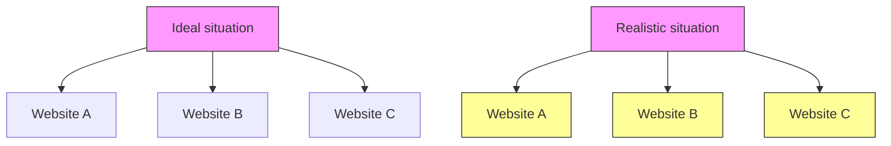
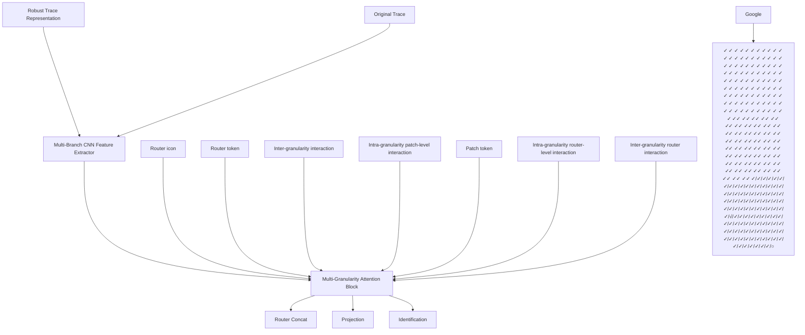

# PrismWF: A Multi-Granularity Patch-Based Transformer for Robust Website Fingerprinting Attack

Yuhao Pan ID , Wenchao Xu ID , Member, IEEE, Fushuo Huo ID , Haozhao Wang ID , Member, IEEE, Xiucheng Wang ID , Graduate Student Member, IEEE, Nan Cheng ID , Senior Member, IEEE

Abstract—Tor is a low-latency anonymous communication network that protects user privacy by encrypting website traffic. However, recent website fingerprinting (WF) attacks have shown that encrypted traffic can still leak users’ visited websites by exploiting statistical features such as packet size, direction, and inter-arrival time. Most existing WF attacks formulate the problem as a single-tab classification task, which significantly limits their effectiveness in realistic browsing scenarios where users access multiple websites concurrently, resulting in mixed traffic traces. To this end, we propose PrismWF, a multi-granularity patch-based Transformer for multi-tab WF attack. Specifically, we design a robust traffic feature representation for raw web traffic traces and extract multi-granularity features using convolutional kernels with different receptive fields. To effectively integrate information across temporal scales, the proposed model refines features through three hierarchical interaction mechanisms: inter-granularity detail supplementation from fine to coarse granularities, intra-granularity patch interaction with dedicated router tokens, and router-guided dual-level intra- and crossgranularity fusion. This design aligns with the cognitive logic of global coarse-grained reconnaissance and local fine-grained querying, enabling effective modeling of mixed traffic patterns in WF attack scenarios. Extensive experiments on various datasets and WF defenses demonstrate that our method achieves stateof-the-art performance compared to existing baselines.

Index Terms—Tor, Website Fingerprint, Multi-tab Attack, Multi-Granularity.

# I. INTRODUCTION

In recent years, the rapid growth of the Internet has intensified concerns over user privacy during web browsing. To mitigate these risks, anonymous communication systems have been widely deployed to conceal users’ identities and browsing behaviors. Among them, the Tor network is one of the most widely used low-latency anonymity systems, serving millions of users worldwide [1], [2]. Tor achieves anonymity by routing

Yuhao Pan and Wenchao Xu are with the Division of Integrative Systems and Design, Hong Kong University of Science and Technology, Hong Kong, China (e-mail: ypanca@connect.ust.hk, wenchaoxu@ust.hk). Wenchao Xu is the corresponding author.

Xiucheng Wang and Nan Cheng are with the State Key Laboratory of ISN and School of Telecommunications Engineering, Xidian University, Xi’an 710071, China (e-mail: xcwang 1@stu.xidian.edu.cn, dr.nan.cheng@ieee.org).

Fushuo Huo is with the School of Cyber Science and Engineering, Southeast University, Nanjing, China (e-mail: fushuohuo@seu.edu.cn).

Haozhao Wang is with the School of Computer Science and Technology, Huazhong University of Science and Technology, Wuhan, 430068, China (email: hz wang@hust.edu.cn).

encrypted traffic through a multi-hop overlay network of relay nodes, such that no single relay can associate a user with their destination. While this design provides strong anonymity guarantees against network-level adversaries, it also gives rise to distinctive traffic patterns that can be exploited by website fingerprinting attacks.

Although Tor provides strong anonymity guarantees at the network layer, the encrypted traffic between the Tor client and the entry node remains observable to a local adversary. By analyzing observable traffic characteristics, such as packet sizes, packet directions, and inter-packet timing patterns, a local adversary can still infer sensitive information about users’ web activities. Early website fingerprinting (WF) attacks primarily relied on expert knowledge to manually design discriminative traffic features, which were then fed into traditional machine learning classifiers (e.g., random forests, support vector machines, and k-nearest neighbors) for website identification [3]–[5]. With the rapid advancement of deep learning (DL) [6], subsequent studies have proposed endto-end neural network–based models that automatically learn discriminative representations directly from raw traffic traces, significantly improving attack performance [7]–[9]. Moreover, as various mechanisms for defense against WF have been proposed, robust attack models (e.g., Deep Fingerprinting [10] and Robust Fingerprinting [11]) have been developed to maintain effectiveness under defended traffic conditions. These models are designed to mitigate performance degradation caused by traffic obfuscation and defense strategies, enabling more resilient WF attacks.

Despite their effectiveness, existing single-tab WF attack methods still suffer from notable limitations. Most prior approaches are developed under the core assumption that users access only one website at a time, where traffic from different domains is not interleaved. However, in realistic browsing scenarios, users frequently visit multiple websites concurrently, resulting in mixed traffic traces with interleaved packets from different websites. As a result, single-tab attack models are inherently limited and often struggle to achieve reliable performance under such traffic mixing conditions. To address this gap, a number of multi-tab WF attack methods have been proposed to identify multiple coexisting websites from a single mixed traffic trace. Nevertheless, existing multitab approaches still exhibit critical limitations that hinder their practical deployment and effectiveness. On the one hand, some methods lack robust traffic representation design and directly leverage raw traffic traces as input, which renders them incapable of accurately modeling the complex interleaving patterns of multi-tab traffic [12], [13]. On the other hand, other approaches adopt general DL architectures without adequately considering the mixed traffic traces of multi-tab browsing, leading to suboptimal performance. Furthermore, a subset of multi-tab WF attacks requires a priori knowledge of the exact number of concurrent websites present in the traffic trace, which is an unrealistic assumption in practical attack scenarios, undermining the methods’ real-world applicability [12], [14].

Motivated by these limitations, we propose PrismWF, a multi-granularity patch-based transformer tailored to the mixed characteristics of unidentified WF traffic, which explicitly models cross-temporal information interactions for robust multi-tab WF attacks. Concretely, we first transform raw website traffic traces into a more robust representation that captures essential traffic characteristics. Based on this representation, multi-granularity traffic features are extracted via parallel convolutional branches, yielding both coarsegrained global features and fine-grained local features. To model the intrinsic information flow of website traffic, we design a traffic-aware interaction mechanism that enables structured information exchange across granularities. Coarsegrained features capture broader contextual patterns of traffic segments, while fine-grained features preserve detailed temporal variations, allowing complementary information to be effectively integrated across scales. In addition, we introduce granularity-specific routers to aggregate semantic information within each granularity, and concatenate router representations from all granularities for final website identification. This design substantially mitigates information loss caused by traffic mixing in multi-tab browsing scenarios, leading to improved robustness and accuracy in WF attacks.

Extensive experiments demonstrate that PrismWF consistently achieves state-of-the-art performance under multi-tab WF settings. Moreover, PrismWF remains robust under various WF defenses, maintains stable performance as the number of concurrently opened tabs increases, and generalizes well to more realistic mixed-tab scenarios where the number of visited websites is unknown a priori. The main contributions of this paper are summarized as follows:

1) We propose PrismWF, a robust multi-tab WF attack model explicitly designed to address traffic mixing caused by concurrent multi-tab browsing.

2) We introduce a novel transformer-based architecture built upon Multi-Granularity Attention Blocks, which jointly model inter-granularity and intra-granularity traffic patterns across fine-to-coarse temporal scales. A dedicated router mechanism is further introduced to aggregate cross-granularity traffic cues, effectively mitigating performance degradation caused by traffic mixing in multi-tab scenarios.

3) We conduct extensive experiments on large-scale public datasets under closed-world, open-world, and mixed-tab settings, and evaluate PrismWF against multiple stateof-the-art WF defense mechanisms. The experimental results show that PrismWF consistently achieves stateof-the-art performance in multi-tab WF attacks and

demonstrates strong robustness under realistic deployment conditions.

The remainder of the paper is organized as follows. We first introduce the related work in Section II and the threat model in Section III. We present concrete design of PrismWF in Section IV from robust trace representation, website feature extraction, multi-granularity attention block, and website identification. Next, we conduct a comprehensive evaluation on the performance of PrismWF in Section V. We discuss relevant issues in Section VI and conclude this paper in Section VII.

# II. RELATED WORK

# A. WF Attack

Single-tab WF attacks. Early WF attacks primarily relied on expert prior knowledge to transform raw traffic traces into hand-crafted features, followed by traditional machine learning techniques for website identification [4], [15]–[17]. Wang et al. [3] extracted a large set of statistical features and improved k-NN classification through a weighted distance metric. Panchenko et al. [4] proposed CUMUL, which uses cumulative packet size features to represent traffic traces and employs an SVM classifier. To improve robustness against noise and traffic perturbations, Hayes et al. [5] introduced the k-fingerprinting approach, which maps hand-crafted features into fingerprint representations via random forests and performs website identification using k-NN.

With the strong capability of DL models for end-to-end feature learning, Rimmer et al. [7] first introduced the AWF framework, enabling WF attacks without manual feature engineering. Building upon this direction, Sirinam et al. [10] proposed DF, which adopts a deeper and more expressive CNN architecture. The DF model achieves nearly 98% classification accuracy in the closed-world setting and maintains around 90% accuracy even under the WTF-PAD defense. Bhat et al. [8] presented Var-CNN, a dual-branch residual convolutional network. The two branches independently model packet direction sequences and temporal traffic variations, and their features are fused to improve WF performance, particularly under limited training data. To further enhance portability and practical applicability, Sirinam et al. [9] explored an n-shot learning framework based on triplet loss. By performing metric learning in the feature space, this approach pulls traffic traces from the same website closer together while pushing those from different websites farther apart, enabling more flexible and transferable WF. Recently, Shen et al. [11] proposed the Traffic Aggregation Matrix (TAM) traffic representation, which aggregates uplink and downlink packets within fixed time slots to construct a robust traffic representation, enabling robust WF attacks. Deng et al. [18] proposed an early-stage WF attack based on spatio-temporal distribution analysis. By aligning features extracted from early traffic and adopting supervised contrastive learning, their method enables accurate website identification at the early stage of page loading.

Multi-tab WF attacks. Most existing WF methods rely on a single-tab assumption, where users are presumed to access only one website at a time. This assumption does not hold in practice, as multi-tab browsing generates mixed traffic traces that substantially degrade the effectiveness of single-tab models. To bridge this gap, researchers have started exploring multi-tab WF attacks, which aim to identify multiple website labels from a single mixed traffic trace.


<details>
<summary>flowchart</summary>


</details>

Fig. 1. Illustration of Traffic Mixing Caused by Concurrent Multi-Tab Browsing.

In the field of multi-tab WF attacks, Guan et al. [12] proposed BAPM, one of the first deep-learning-based endto-end multi-tab WF attack models. BAPM performs blocklevel modeling on mixed traffic traces to learn tab-aware representations and employs a self-attention mechanism to adaptively fuse information across traffic blocks. Jin et al. [13] introduced a Transformer-based WF attack model inspired by the DETR-style encoder–decoder architecture [19]. Their method adopts the feature extraction module from DF [10] as a backbone to preprocess raw traffic traces into feature sequences. A Transformer encoder is then used to capture global traffic context, while tab-aware query vectors in the decoder interact with encoded features to enable multi-tab website identification. Deng et al. [20], [21] proposed ARES, which first transforms multi-tab website traffic into the MTAF feature representation. Subsequently, multi-head attention is employed to capture global traffic dependencies, together with a Top-K sparse attention mechanism that focuses on traffic patterns most relevant to target labels. More recently, Deng et al. [22] proposed CountMamba, which employs a causal CNN to extract traffic features and leverages a Mamba state space model for multi-tab website fingerprinting attacks.

# B. WF Defense

To defend against WF attacks in Tor, researchers have proposed to obfuscate traffic traces by delaying real packets and injecting dummy packets, thereby effectively degrading the performance of WF attack models [23], [24]. Existing defenses can be broadly categorized into regularization-based WF defenses and adversarial example(AE)–based WF defenses.

Regularization-based WF Defenses. Early WF defenses obfuscate traffic fingerprints by enforcing fixed-time-interval transmissions with uniform packet sizes. BuFLO [25] adopts a strict constant sending interval, pads all packets to a uniform size, and extends transmissions to a predefined maximum duration—effectively eliminating timing and size-based discriminative features. Tamaraw [26] improves upon BuFLO by supporting asymmetric constant rates for upstream and downstream traffic, which better matches the inherent asymmetry of web communications and reduces overhead. Despite this optimization, both approaches incur non-trivial bandwidth and latency overhead, severely limiting their practical deployment in real-world scenarios. To improve deployability, Juarez et ´ al. [27] propose WTF-PAD, an adaptive padding defense that leverages statistical models of traffic bursts to obfuscate website fingerprints without enforcing constant-rate transmission. Gong et al. propose FRONT, a zero-delay and lightweight WF defense that injects dummy packets during idle periods. The padding intervals are randomly sampled from a Rayleigh distribution to obfuscate timing patterns.

AE-based WF Defenses. Recently, AE-based techniques have been integrated into WF defenses, by injecting dummy packets to balance defensive efficacy and bandwidth overhead without additional latency. Mockingbird [28] employs a targeted strategy that iteratively perturbs traffic traces toward a selected target to reduce distinguishability. Sadeghzadeh et al. [29] introduce AWA, constructing perturbations based on pairwise website relationships with two variants: NUAWA, which derives sample-specific perturbations, and UAWA, which learns a universal noise-driven perturbation for cross-website reuse. More recently, ALERT [30] utilizes a generator to produce targeted adversarial traffic, not only weakening adversarially trained attack models but also achieving state-of-the-art defense performance. However, as these methods often suffer from degraded effectiveness in model transfer scenarios, we focus on evaluating WF attacks under regularization-based defense settings.

# C. WF Trace Representation

WF attacks identify target websites solely through traffic analysis based on packet-level metadata, such as packet direction and timestamps. Early WF attack methods, including AWF [7] and DF [10], primarily relied on packet direction sequences (i.e., +1 for outgoing packets and −1 for incoming packets). Subsequent work, such as Tik-Tok [31], incorporated temporal information by jointly modeling packet directions and timestamps, leading to improved classification performance. Building on this line of research, Shen et al. [11] argued that transforming raw traffic traces into coarsegrained temporal representations can yield more robust attack performance, and proposed the TAM representation— which segments traffic into fixed-length time windows to form a 2 × N matrix $( N = \lceil T / d \rceil$ , with T as maximum page loading time and d as window size)—for recording incoming and outgoing packet counts. Following this paradigm, a variety of window-based and statistical representations have been explored. For example, LASERBEAK [32] employed multidimensional statistical feature vectors, WFCAT [33] captured temporal characteristics using logarithmically binned interarrival time (IAT) histograms, and ARES [21] proposed the MTAF representation, which extracts window-level features to jointly model cell-level and burst-level traffic patterns.

# III. THREAT MODEL

As illustrated in Fig. 2, users achieve anonymous web browsing via the Tor network, where traffic is routed through a circuit of three randomly selected relay nodes—this multihop mechanism prevents destination websites from directly identifying users during access. In the WF threat model, the adversary is assumed to be positioned between the user and the Tor entry node. Due to end-to-end encryption, the adversary cannot decrypt packet payloads and can only leverage traffic metadata (e.g., packet timing, size, and direction) to infer the user’s visited websites, formulating WF attacks as a traffic classification task. Following prior WF studies [9], [10], [13], [22], the adversary is restricted to passive observation, with no ability to modify, inject, or drop network packets.


<details>
<summary>flowchart</summary>

```mermaid
graph LR
    User --> Adversary
    Adversary --> Middle
    Middle --> Entry
    Entry --> TorNetwork
    TorNetwork --> Exit
    Exit --> Websites
    Middle --> TikTok, Instagram, YouTube, Google, and YouTube
```
</details>

Fig. 2. Illustration of Tor network.

In a typical WF attack pipeline, the adversary first collects encrypted traffic traces by visiting a set of monitored websites via the Tor network to construct a labeled training dataset. A WF attack model is then trained to associate encrypted traffic patterns with website identities. During deployment, the adversary passively observes the target user’s encrypted traffic and uses the trained model to infer visited websites.

This study considers a more realistic and challenging WF attack scenario where users access multiple websites concurrently. Such concurrent access causes traffic mixing in aggregated traces, significantly degrading traditional single-tab WF attack performance. We further consider a practical mixedtab setting, where the adversary has no prior knowledge of the number of concurrently accessed websites in collected traces. We also account for WF defense mechanisms: given the high cost of customized defenses, users typically rely on publicly available alternatives in practice.

WF attacks are commonly evaluated under two standard settings [7], [10], [20], [22], [33]: the closed-world and openworld scenarios. Given the vast number of websites on the Internet, attackers typically monitor only a subset of websites of specific interest. In the closed-world scenario, the attack task is formulated as classifying traffic traces exclusively into the predefined set of monitored websites. In the more realistic open-world scenario, users may also visit a large number of websites outside the monitored set, referred to as unmonitored websites. To distinguish between monitored and unmonitored traffic, prior work typically aggregates all unmonitored websites into an additional class, constructing a practical open-world evaluation setting.

# IV. METHODOLOGY

In this section, we first introduce the overall architecture of PrismWF and then detail each component. The pipeline of PrismWF is presented in Algorithm 2.

# A. Overall Architecture of PrismWF

As illustrated in Fig. 3, PrismWF first transforms raw website traffic into a robust trace representation by partitioning each trace into fixed-length time slots and extracting an $M -$ dimensional feature matrix that captures both packet-level statistics and temporal interval characteristics. A multi-branch CNN feature extractor then models traffic patterns at different temporal granularities, where branches with distinct kernel sizes generate patch tokens covering coarse-grained contextual patterns and fine-grained local details. To refine these multigranularity representations, we introduce a traffic-aware Multi-Granularity Attention Block with a dedicated router token for each granularity. Each block incorporates three complementary mechanisms: inter-granularity interaction for information exchange across temporal scales, intra-granularity interaction for patch-level semantic aggregation, and inter-granularity router interaction for fusing semantic summaries across granularities. Finally, router tokens from all granularities are concatenated into a unified representation and fed into a linear classifier for multi-tab website identification.

# B. Robust Trace Representation

Extracting effective traffic representations from interleaved website traces is critical for downstream WF attack models, as raw traffic is often contaminated by packets from concurrent websites and obfuscation mechanisms. In such settings, website-specific identity features are hard to isolate due to severe temporal noise and traffic interleaving. Existing representations based on global traffic statistics tend to overlook finegrained temporal structures, making them vulnerable to WF defenses. Moreover, representations that rely solely on packet direction sequences fail to capture time-slot-level temporal dynamics, thereby limiting their ability to identify the injection timestamps of newly opened websites in multi-tab scenarios. To address these challenges, we adopt a fixed-size time-slot strategy that abstracts raw packet events into structured local temporal segments. Specifically, the time axis of each traffic trace is partitioned into equal-length intervals with duration $\Delta t ,$ , enabling localized modeling of traffic dynamics.

Let a raw traffic trace collected from the Tor network be denoted as

$$
\mathbf {x} = \left\{f _ {1}, f _ {2}, \dots , f _ {N} \right\}, \tag {1}
$$

where each packet event $f _ { i } ~ = ~ \langle d _ { i } , t _ { i } \rangle$ consists of a packet direction $d _ { i }$ and its corresponding timestamp $t _ { i } .$ . Here, $d _ { i } \in$ {+1, −1} indicates outgoing (+1) or incoming (−1) packets. Accordingly, the traffic trace can be represented as a matrix $\mathbf { x } \in \mathbb { R } ^ { 2 \times N }$ , where the first row encodes packet directions and the second row records timestamp information. Given a predefined maximum page loading time T , the total number of time slots is computed as $\begin{array} { r } { \boldsymbol { L } = \left\lceil \frac { \boldsymbol { T } } { \Delta t } \right\rceil } \end{array}$ .

For each time interval, we extract a six-dimensional feature vector to characterize the traffic pattern within that slot. These features consist of two categories: packet-level statistics (4 dimensions) and time-interval features (2 dimensions). Specifically, the packet-level statistics include (i) the numbers of incoming and outgoing packets, and (ii) the counts of direction transitions from outgoing to incoming and from incoming to outgoing packets. The time-interval features capture the temporal gaps between consecutive outgoing-to-incoming and incoming-to-outgoing packet transitions within each time slot. By aggregating these features across all time intervals, we construct a unified traffic feature matrix:


<details>
<summary>flowchart</summary>


</details>

Fig. 3. Overview of the PrismWF.

$$
\mathbf {M} = \phi (\mathbf {x}) \in \mathbb {R} ^ {6 \times L}, \tag {2}
$$

where $\phi ( \cdot )$ denotes the traffic feature construction function. In practice, the actual number of intervals is truncated to L if it exceeds the predefined value, or padded with zeros if it is insufficient to reach L. The detailed robust trace feature construction steps are presented in Algorithm 1.

# C. Multi-Granularity Feature Extraction

Website traffic traces are long temporal sequences containing patterns at multiple time scales. To capture traffic characteristics at different temporal resolutions, we employ G parallel CNN branches with distinct kernel sizes to extract multi-granularity features from the robust traffic representation M. Each branch focuses on a specific temporal granularity and projects the extracted features into a shared embedding space. For the i-th branch with kernel size $k _ { i } ,$ a CNN feature extractor is applied to obtain:

$$
\mathbf {F} _ {i} = \mathrm{CNN} _ {i} (\mathbf {M}) \in \mathbb {R} ^ {d \times N _ {i}}, \tag {3}
$$

where d denotes the unified embedding dimension and $N _ { i }$ represents the number of patch tokens produced at the corresponding granularity. Each $\mathrm { C N N } _ { i }$ consists of three stacked convolutional blocks, inspiring by the design of the DF feature extractor. Each ConvBlock includes two 1D convolutional layers with batch normalization and ReLU activation, followed by a max-pooling layer for temporal downsampling and a dropout layer for regularization. Due to the use of different kernel sizes and pooling operations, each branch produces a

Algorithm 1 Robust Trace Feature Construction $\mathbf { M } = \phi ( \mathbf { x } )$   
Input: Traffic trace x; max loading time T; time slot size $\Delta t$ Output: Feature matrix $M \in R^{6 \times L}$ 1: $L \leftarrow \left\lceil \frac{T}{\Delta t} \right\rceil$ $\triangleright$ Total time slots

2: $M \leftarrow 0_{6 \times L}$ 3: for j = 1 to L do

4: $I_j \leftarrow \{i \mid (j - 1)\Delta t \leq t_i < j\Delta t\}$ $\triangleright$ Packet indices in j-th slot

5: if $I_j = \emptyset$ then

6: continue

7: end if

8: Extract ordered subsequence $\{(t_k, d_k)\}_{k=1}^n$ from $\{(t_i, d_i)\}_{i \in I_j}$ , where $n \leftarrow |I_j|$ 9: $c^+ \leftarrow \sum_{k=1}^n I(d_k = +1)$ , $c^- \leftarrow \sum_{k=1}^n I(d_k = -1)$ 10: $n^{+-} \leftarrow 0$ , $n^{-+} \leftarrow 0$ , $s^{+-} \leftarrow 0$ , $s^{-+} \leftarrow 0$ 11: for k = 1 to n - 1 do

12: if $d_k = +1 \wedge d_{k+1} = -1$ then

13: $n^{+-} \leftarrow n^{+-} + 1$ , $s^{+-} \leftarrow s^{+-} + (t_{k+1} - t_k)$ 14: else if $d_k = -1 \wedge d_{k+1} = +1$ then

15: $n^{-+} \leftarrow n^{-+} + 1$ , $s^{-+} \leftarrow s^{-+} + (t_{k+1} - t_k)$ 16: end if

17: end for

18: $s^{+-} \leftarrow I(n^{+-} > 0) \cdot \frac{s^{+-}}{n^{+-}}$ 19: $s^{-+} \leftarrow I(n^{-+} > 0) \cdot \frac{s^{-+}}{n^{-+}}$ 20: $M[:, j] \leftarrow [c^+, c^-, n^{+-}, n^{-+}, s^{+-}, s^{-+}]^\top$ 21: end for

22: return M

feature sequence of length $N _ { i }$ , corresponding to a specific temporal granularity.

The final ConvBlock in each branch outputs d-dimensional features, thus ensuring all branches generate tokens in the pre-defined unified embedding space. We then transpose the feature matrix to obtain the patch token sequence for each

granularity:

$$
\mathbf {u} _ {i} = \mathbf {F} _ {i} ^ {\top} \in \mathbb {R} ^ {N _ {i} \times d}. \tag {4}
$$

This design enables seamless interaction among tokens from different granularities in subsequent attention layers, while $N _ { i }$ varies across branches due to the different downsampling rates induced by distinct kernel sizes.

# D. Multi-Granularity Attention Block

After obtaining the multi-granularity representations of website traffic features, we further refine these features using the proposed Multi-Granularity Attention Block, which is designed to enable structured information interaction across temporal scales. The model stacks B identical blocks, each consisting of three attention-based interaction layers that jointly support intra-granularity feature modeling and inter-granularity semantic aggregation. Specifically, intragranularity interactions capture temporal dependencies within each granularity, while inter-granularity interactions fuse complementary semantic information across different granularities. Through this hierarchical, attention-driven refinement process, the model progressively enhances the discriminability of traffic representations, facilitating more accurate WF attack. The detailed design of each interaction layer is described below.

Router Token Injection. To obtain compact and comparable representations across different temporal granularities, we introduce a learnable router token for each granularity level. The router token serves as a granularity-level semantic proxy that summarizes patch-level features into a fixed-dimensional representation, which is amenable to downstream projection and classification. Specifically, for the i-th granularity, a router token is defined as

$$
\mathbf {v} _ {i} \in \mathbb {R} ^ {1 \times d}. \tag {5}
$$

The router token is appended to the corresponding patch token sequence,

$$
\tilde {\mathbf {u}} _ {i} = \left[ \mathbf {u} _ {i}; \mathbf {v} _ {i} \right] \in \mathbb {R} ^ {(N _ {i} + 1) \times d}, \tag {6}
$$

enabling the router token to interact with patch tokens within the same granularity and progressively aggregate granularityspecific semantic information. As a result, the router tokens yield compact granularity-wise representations that are concatenated for final classifier prediction, while enabling crossgranularity information interaction via a shared projection space.

Inter-granularity Interaction. To enable effective information exchange across different temporal granularities, we adopt a coarse-to-fine interaction paradigm where coarse-grained representations query and retrieve complementary information from finer-grained representations. This design is motivated by the inherent characteristics of website traffic traces, where traffic mixing frequently arises. Traffic segments from different websites may dominate different portions of a traffic sequence or become temporally interleaved, resulting in mixed traffic patterns. Coarse-grained tokens provide a global and robust contextual perspective, while fine-grained tokens preserve detailed temporal variations. Our inter-granularity interaction mechanism leverages this duality to guide finegrained feature retrieval under macroscopic coarse-grained context, thereby mitigating the impact of traffic mixing. During inter-granularity interaction, only patch tokens participate in cross-granularity information exchange, while router tokens are excluded.

Let ui $\mathbf { u } _ { i } ^ { ( b - 1 ) } ~ \in ~ \mathbb { R } ^ { N _ { i } \times d }$ (b−1) denote the patch token sequence of the i-th granularity at the (b − 1)-th Multi-Granularity Attention Block. For two adjacent granularities, we employ a local coarse-to-fine cross-attention mechanism to realize information interaction. Specifically, each coarse-grained patch token is aligned with a corresponding temporal region in the fine-grained sequence, so that fine-grained features can be selectively queried from the relevant time span. Assume the coarse-grained sequence contains $N _ { c }$ patch tokens and the corresponding fine-grained sequence contains $N _ { f }$ patch tokens. For the n-th coarse-grained patch token (with zerobased indexing) acting as the query, we compute the center index of its corresponding region in the fine-grained sequence as

$$
c _ {n} = \left\lfloor (n + 0. 5) \frac {N _ {f}}{N _ {c}} \right\rfloor , \tag {7}
$$

where offset +0.5 aligns the coarse-grained token with the temporal center (rather than left boundary) of its corresponding fine-grained region, enabling more accurate coarse-to-fine feature matching.

We then perform multi-head cross-attention (MHCA), which follows the standard attention formulation with queries and key–value pairs drawn from different token sequences. Specifically, coarse-grained patch tokens act as queries, while fine-grained patch tokens serve as keys and values within a local temporal window to preserve alignment and suppress irrelevant interference. Let $\mathbf { \bar { u } } _ { f } ~ \in ~ \mathbb { R } ^ { N _ { f } \times d }$ denote the finegrained patch token sequence. For the n-th coarse-grained patch token, we select a local subset of fine-grained patch tokens centered at $c _ { n } ,$ with the window size controlled by the hyper-parameter w, which specifies the maximum number of fine-grained tokens attended by each coarse-grained token:

$$
\mathbf {u} _ {f} ^ {(c _ {n}, w)} = \left\{\mathbf {u} _ {f} [ k ] \mid k \in \left[ \max \left(0, c _ {n} - \left\lfloor \frac {w}{2} \right\rfloor\right), \right. \right. \tag {8}
$$

$$
\left. \min \bigl (N _ {f} - 1, c _ {n} + \left\lfloor \frac {w}{2} \right\rfloor) \bigr ] \right\}.
$$

Within this local window, MHCA is applied to update the coarse-grained representations:

$$
\mathbf {u} _ {c} ^ {\prime} = \mathrm{MHCA} \left(\mathbf {u} _ {c}, \mathbf {u} _ {f} ^ {(c _ {n}, w)}, \mathbf {u} _ {f} ^ {(c _ {n}, w)}\right), \tag {9}
$$

where $\mathbf { u } _ { c }$ denotes the coarse-grained patch token sequence. This coarse-to-fine local cross-attention enables coarse-grained representations to selectively aggregate informative finegrained temporal details while suppressing interference from unrelated or mixed traffic segments, which is critical for robust multi-tab WF attacks.

Intra-granularity Interaction. Within each temporal granularity, we design an intra-granularity interaction module to model local temporal dependencies among patch tokens and global semantic context summarized by the router token. To this end, a hybrid attention mechanism with two complementary branches is adopted: patch-level local interaction and router-level global aggregation.

(1) Patch-level local interaction. Patch tokens exchange information via local multi-head self-attention to capture shortrange temporal dependencies within the same granularity. Given the patch token sequence $\mathbf { u } _ { i } ^ { \prime } \in \mathbb { R } ^ { N _ { i } \times d }$ of the $_ { i - }$ th granularity, the locally refined patch representations are computed as

$$
\mathbf {u} _ {i} ^ {\text { loc }} = \mathrm{MHA} _ {\text { local }} (\mathbf {u} _ {i} ^ {\prime}, \mathbf {u} _ {i} ^ {\prime}, \mathbf {u} _ {i} ^ {\prime}). \tag {10}
$$

where $\mathrm { M H A } _ { \mathrm { l o c a l } } ( \cdot )$ denotes multi-head self-attention restricted to a local temporal neighborhood to preserve temporal coherence while suppressing interference from distant segments.

(2) Router-level global interaction. In parallel, the router token acts as a granularity-level semantic aggregator that summarizes global information within the same granularity. By attending to all locally refined patch tokens, the router token captures holistic traffic semantics that complement patchlevel representations. The aggregated router representation is obtained via multi-head cross-attention:

$$
\mathbf {v} _ {i} ^ {\text { glob }} = \text { MHCA } \left(\mathbf {v} _ {i} ^ {\prime}, \mathbf {u} _ {i} ^ {\text { loc }}, \mathbf {u} _ {i} ^ {\text { loc }}\right), \tag {11}
$$

where $\mathbf { v } _ { i } ^ { \prime } ~ \in ~ \mathbb { R } ^ { 1 \times d }$ denotes the router token of the i-th granularity.

Together, these two interaction branches enable effective intra-granularity feature refinement by integrating fine-grained local temporal structures with global semantic context. Finally, the updated intra-granularity token sequence u˜′′i = [uloci ; vglobi ] $\tilde { \mathbf { u } } _ { i } ^ { \prime \prime } = [ \mathbf { u } _ { i } ^ { \mathrm { l o c } } ; \mathbf { v } _ { i } ^ { \mathrm { g l o b } } ]$ serves as the input to subsequent interaction modules.

Inter-granularity Router Interaction. To enable global information exchange across different granularities within each Multi-Granularity Attention Block, we perform global attention among router tokens from all granularities. This design allows each router token to aggregate complementary global semantic information captured at other temporal scales. Specifically, the router token of the i-th granularity is extracted from the corresponding token sequence $\widetilde { \mathbf { u } } _ { i } ^ { \prime \prime } ,$ , which consists of $N _ { i }$ patch tokens followed by one router token:

$$
\mathbf {r} _ {i} ^ {\prime \prime} = \tilde {\mathbf {u}} _ {i} ^ {\prime \prime} [ N _ {i} + 1 ] \in \mathbb {R} ^ {1 \times d}, \tag {12}
$$

where the (Ni + 1)-th position corresponds to the router token under 1-based indexing. All router tokens are concatenated to form a router-level sequence

$$
\mathbf {R} = [ \mathbf {r} _ {1} ^ {\prime \prime}; \mathbf {r} _ {2} ^ {\prime \prime}; \dots ; \mathbf {r} _ {G} ^ {\prime \prime} ] \in \mathbb {R} ^ {G \times d}, \tag {13}
$$

which is updated via global multi-head self-attention:

$$
\mathbf {R} ^ {\prime} = \mathrm{MHA} _ {\text { global }} (\mathbf {R}, \mathbf {R}, \mathbf {R}). \tag {14}
$$

The updated router tokens $\mathbf { R } ^ { \prime }$ are then redistributed to their corresponding granularities and written back to the token sequences for the next block:

$$
\tilde {\mathbf {u}} _ {i} ^ {(b)} = \text { ReplaceRouter } (\tilde {\mathbf {u}} _ {i} ^ {\prime \prime}, \mathbf {R} ^ {\prime} [ i ]), \tag {15}
$$

where ReplaceRouter(·) replaces the router token in $\tilde { \mathbf { u } } _ { i } ^ { \prime \prime }$ with $\mathbf { R } ^ { \prime } [ i ]$ while keeping all patch tokens unchanged.

Algorithm 2 Pipeline of PrismWF for WF Attack   
Input: Raw traffic trace x; slot size $\Delta t$ ; maximum loading time T; branch kernels $\{k_{i}\}_{i=1}^{G}$ ; number of attention blocks B; local attention windows ( $w_{intra}, w_{inter}$ ); (training only) website label y (single-/multi-tab)

Output: Predicted website labels $\hat{y}$ 1: Robust Trace Representation

2: $M \leftarrow \phi(x; \Delta t, T) \quad \triangleright M \in \mathbb{R}^{M \times L}$ : slot-based traffic features

3: Multi-Granularity Feature Extraction

4: for i = 1 to G do

5: $U_{i} \leftarrow \text{BranchCNN}_{i}(M; k_{i}) \quad \triangleright \text{patch tokens}$ $U_{i} \in R^{N_{i} \times d}$ 6: $r_{i} \leftarrow \text{InitRouter}(d) \quad \triangleright \text{router token } r_{i} \in \mathbb{R}^{1 \times d}$ 7: $\tilde{U}_{i} \leftarrow [U_{i}; r_{i}] \quad \triangleright \text{append router token}$ 8: end for

9: 3) Stacked Multi-Granularity Attention Blocks

10: for b = 1 to B do

11: Inter-Granularity Interaction (coarse → fine)

12: $\{\tilde{U}_{i}\}_{i=1}^{G} \leftarrow \text{InterGranularityInteraction}(\{\tilde{U}_{i}\}_{i=1}^{G}, w_{\text{inter}})$ 13: Intra-Granularity Interaction (patch-local + router-global)

14: $\{\tilde{U}_{i}\}_{i=1}^{G} \leftarrow \text{IntraGranularityInteraction}(\{\tilde{U}_{i}\}_{i=1}^{G}, w_{\text{intra}})$ 15: Inter-Granularity Router Interaction (router fusion)

16: $\{\tilde{U}_{i}\}_{i=1}^{G} \leftarrow \text{RouterInteract}(\{\tilde{U}_{i}\}_{i=1}^{G})$ 17: end for

18: Website Identification

19: z ← ConcatRouters( $\{\tilde{U}_{i}\}_{i=1}^{G}$ )

20: $\hat{y} \leftarrow f(z) \quad \triangleright \text{website prediction (single-/multi-tab)}$ 21: if training then

22: $L \leftarrow L(\hat{y}, y)$ 23: update model parameters by minimizing L

24: end if

25: return $\hat{y}$

# E. Website Identification

After refining traffic representations across multiple temporal granularities via the router mechanism, we perform website identification by aggregating global semantic information. Specifically, the final router tokens from all granularities are concatenated to form a unified global traffic representation $\textbf { z } \in \mathbb { R } ^ { G d }$ , where each router token summarizes granularityspecific semantics produced by the last Multi-Granularity Attention Block. The global representation z is then fed into the website identification classifier $f ,$ which applies a linear projection to produce classification logits o over $C$ website categories. Depending on the task setting, the model supports both single-tab and multi-tab website fingerprinting. For model optimization, we adopt task-specific loss functions:

$$
\mathcal {L} = \left\{ \begin{array}{l l} \mathrm{CE} (\mathbf {o}, y), & \text { single - tab   setting }, \\ \mathrm{BCEWithLogits} (\mathbf {o}, \mathbf {y}), & \text { multi - tab   setting }, \end{array} \right. \tag {16}
$$

where $y$ is a one-hot label in the single-tab case and ${ \textbf { y } } \in$ $\{ 0 , 1 \} ^ { \dot { C } }$ is a multi-hot label vector for the multi-tab case. Accordingly, cross-entropy (CE) loss is utilized for singletab case, while binary cross-entropy (BCE) with logits is employed for the multi-tab.

# V. EXPERIMENTS

In this section, we conduct extensive experiments on largescale datasets to evaluate the proposed PrismWF. We first describe the experimental setup in Section V-A, including datasets, evaluation metrics, baselines, and implementation details. Section V-B evaluates PrismWF under both closedworld and open-world multi-tab WF scenarios. We further investigate the impact of the mixed-tab setting in Section V-C and assess the robustness of PrismWF against representative WF defenses in Section V-D. Finally, we conduct ablation studies in Section V-E to validate the effectiveness of each key component.

# A. Experimental Setup

1) Multi-tab Datasets: We perform multi-tab WF attacks on the multi-tab datasets [20], [21], which model realistic multitab browsing behavior and include sub-datasets with different numbers of concurrently opened tabs (2-tab, 3-tab, 4-tab, and 5-tab). In each sub-dataset, each traffic trace contains mixed traffic generated by the corresponding number of browser tabs. ARES provides both closed-world and open-world evaluation scenarios. In the closed-world setting, each sub-dataset contains traffic traces from 100 monitored website classes, with over 58,000 instances. In the open-world setting, unmonitored traffic is additionally included while the number of monitored classes remains 100, resulting in 64,000 traffic instances per sub-dataset.   
2) Multi-tab evaluation metrics: For the multi-tab WF task, we follow prior work [20]–[22] and adopt Precision@K (P@K) and Mean Average Precision@K (MAP@K) to evaluate classification performance [34]. Let y denote the groundtruth multi-tab vector associated with a traffic instance x, where $y _ { i } = 1$ if x contains traffic from the i-th website and $y _ { i } = 0$ otherwise. Let yˆ denote the predicted confidence scores produced by the model over all monitored website labels. Both P@K and MAP@K are computed based on the top-K website labels ranked by prediction confidence. P@K measures the precision among the top-K predicted website labels for each instance, defined as

$$
\mathrm{P} @ \mathrm{K} (x) = \frac {1}{K} \sum_ {i \in r _ {K} (\hat {\mathbf {y}})} y _ {i}, \tag {17}
$$

where $r _ { K } ( \hat { \mathbf { y } } )$ denotes the set of website labels with the top-K highest predicted confidence scores. MAP@K extends P@K by further evaluating the ranking quality of predicted labels within the top-K results. Specifically, it quantifies whether true website labels tend to rank higher than non-relevant ones by averaging the precision values at different cutoff positions:

$$
\mathrm{MAP@K} (x) = \frac {1}{K} \sum_ {i = 1} ^ {K} \mathrm{P@i} (x). \tag {18}
$$

The final MAP@K score is obtained by averaging over all testing instances.

3) Baselines: In this work, we adopt DF [10], AWF [7], Var-CNN [8], TikTok [31], Holmes [18], RF [11], BAPM [12], TMWF [13], ARES [20], [21] and CountMamba [22] as baseline methods for both single-tab and multi-tab WF evaluation. For traditional single-tab attack methods adapted for deployment in multi-tab scenarios, we follow the experimental setup of prior work and modify the classification head’s output layer by removing the softmax activation and retaining the raw logit outputs [20]–[22]. Subsequently, we employ the binary cross-entropy loss with logits (BCEWithLogitsLoss) as the loss function to train these models, thereby facilitating their deployment in multi-tab classification tasks.

TABLE I PARAMETER SETTINGS FOR PRISMWF. 

<table><tr><td>Model Part</td><td>Details</td><td>Value</td></tr><tr><td rowspan="4">Multi-Branch CNN</td><td>Embedding Dimension</td><td>256</td></tr><tr><td>Branch Number</td><td>4</td></tr><tr><td>Kernel Sizes</td><td>[15, 11, 7, 5]</td></tr><tr><td>ConvBlocks per Branch</td><td>3</td></tr><tr><td rowspan="5">Multi-Granularity Block</td><td>Block Number</td><td>3</td></tr><tr><td>Attention Head Number</td><td>8</td></tr><tr><td>Intra-Granularity Window</td><td>5</td></tr><tr><td>Inter-Granularity Window</td><td>3</td></tr><tr><td>FFN Dimension</td><td>1024</td></tr><tr><td>Classification Head</td><td>Router Fusion Dimension</td><td> $256 \times 4$ </td></tr></table>

4) Implementation detail: We train the PrismWF model in an environment with Python 3.10.19 and PyTorch 2.1.2, with the implementation consisting of over 2,000 lines of code. All experiments are conducted on NVIDIA A800-SXM4-80GB GPUs. For single-tab WF tasks, each model is trained for 50 epochs, while for multi-tab tasks, all models are trained for 80 epochs. More detailed deployment configurations of PrismWF are provided in Table I.

# B. Multi-Tab Attack Performance

In this section, we evaluate the performance of WF attack models in multi-tab scenarios under both closed-world and open-world settings. For baseline methods originally designed for single-tab WF (e.g., AWF, DF, Tik-Tok, Var-CNN, and RF), we adopt the same multi-tab adaptation strategy described in Section V-A3, following the standard practice of prior multitab WF attacks. For representative multi-tab WF methods (BAPM, TMWF, ARES, and CountMamba), we directly use their publicly released codes for training and testing without modifications.

1) Closed-world scenario: Experimental results demonstrate that the proposed PrismWF consistently outperforms all baseline methods across both P@k and MAP@k evaluation metrics, achieving a new state of the art, as shown in Table II. Traditional single-tab attack methods, including AWF, DF, Tik-Tok, Var-CNN, and RF, exhibit significantly inferior performance compared to recent representative multitab approaches such as TMWF, CountMamba, ARES, and PrismWF. Among these multi-tab baselines, BAPM shows relatively limited effectiveness compared to the stronger recent methods.

TABLE II COMPARISON WITH EXISTING METHODS UNDER MULTI-TAB BROWSING: CLOSED-WORLD AND OPEN-WORLD SCENARIOS. 

<table><tr><td>Scenario</td><td># of tabs</td><td>Metrics</td><td>AWF</td><td>DF</td><td>Tik-Tok</td><td>Var-CNN</td><td>RF</td><td>BAPM</td><td>TMWF</td><td>CountMamba</td><td>ARES</td><td>PrismWF</td></tr><tr><td rowspan="8">Closed-world</td><td rowspan="2">2-tab</td><td>P@2</td><td>15.66</td><td>63.01</td><td>70.47</td><td>72.94</td><td>64.66</td><td>57.22</td><td>78.24</td><td>87.33</td><td>87.78</td><td>89.46</td></tr><tr><td>MAP@2</td><td>17.93</td><td>72.64</td><td>78.87</td><td>81.16</td><td>73.13</td><td>66.38</td><td>83.20</td><td>91.89</td><td>92.00</td><td>93.10</td></tr><tr><td rowspan="2">3-tab</td><td>P@3</td><td>11.67</td><td>45.62</td><td>53.51</td><td>56.32</td><td>47.24</td><td>43.09</td><td>67.02</td><td>81.52</td><td>84.56</td><td>87.01</td></tr><tr><td>MAP@3</td><td>13.93</td><td>58.57</td><td>65.91</td><td>69.93</td><td>59.44</td><td>53.52</td><td>73.87</td><td>87.76</td><td>90.09</td><td>91.48</td></tr><tr><td rowspan="2">4-tab</td><td>P@4</td><td>11.49</td><td>43.15</td><td>49.60</td><td>40.35</td><td>44.25</td><td>41.23</td><td>65.97</td><td>81.26</td><td>85.59</td><td>88.38</td></tr><tr><td>MAP@4</td><td>13.64</td><td>55.32</td><td>61.87</td><td>55.62</td><td>56.69</td><td>51.04</td><td>72.52</td><td>87.41</td><td>90.49</td><td>92.34</td></tr><tr><td rowspan="2">5-tab</td><td>P@5</td><td>10.84</td><td>35.48</td><td>41.34</td><td>38.75</td><td>34.60</td><td>34.67</td><td>64.00</td><td>73.89</td><td>83.27</td><td>87.54</td></tr><tr><td>MAP@5</td><td>12.24</td><td>46.90</td><td>52.94</td><td>51.25</td><td>44.63</td><td>42.88</td><td>70.83</td><td>81.46</td><td>88.38</td><td>91.63</td></tr><tr><td rowspan="8">Open-world</td><td rowspan="2">2-tab</td><td>P@2</td><td>17.59</td><td>60.77</td><td>69.04</td><td>70.46</td><td>62.63</td><td>55.65</td><td>73.98</td><td>85.02</td><td>86.17</td><td>87.83</td></tr><tr><td>MAP@2</td><td>20.32</td><td>70.21</td><td>77.23</td><td>79.27</td><td>71.64</td><td>64.71</td><td>79.97</td><td>90.09</td><td>90.91</td><td>91.97</td></tr><tr><td rowspan="2">3-tab</td><td>P@3</td><td>12.13</td><td>45.56</td><td>53.35</td><td>57.89</td><td>47.32</td><td>42.07</td><td>66.47</td><td>81.17</td><td>83.69</td><td>86.03</td></tr><tr><td>MAP@3</td><td>14.62</td><td>58.43</td><td>66.18</td><td>71.61</td><td>60.41</td><td>52.50</td><td>73.58</td><td>87.86</td><td>89.45</td><td>91.36</td></tr><tr><td rowspan="2">4-tab</td><td>P@4</td><td>11.90</td><td>42.19</td><td>49.02</td><td>40.32</td><td>43.25</td><td>40.20</td><td>67.08</td><td>79.98</td><td>85.04</td><td>88.11</td></tr><tr><td>MAP@4</td><td>14.35</td><td>54.62</td><td>61.20</td><td>53.41</td><td>56.14</td><td>50.39</td><td>73.54</td><td>86.40</td><td>90.01</td><td>92.08</td></tr><tr><td rowspan="2">5-tab</td><td>P@5</td><td>11.96</td><td>36.74</td><td>42.74</td><td>39.39</td><td>36.93</td><td>35.65</td><td>64.21</td><td>75.60</td><td>84.11</td><td>88.52</td></tr><tr><td>MAP@5</td><td>14.04</td><td>48.47</td><td>54.99</td><td>52.03</td><td>47.79</td><td>44.38</td><td>71.06</td><td>83.09</td><td>89.11</td><td>92.33</td></tr></table>

Specifically, under the 2-tab setting, PrismWF achieves a P@2 score of 89.46%, outperforming BAPM, TMWF, Count-Mamba, and ARES by 32.24%, 11.22%, 2.13%, and 1.68%, respectively. In terms of MAP@2, PrismWF attains 93.10%, exceeding the same baselines by 26.72%, 9.90%, 1.21%, and 1.10%, respectively. Under the more challenging 5-tab setting, the performance of existing multi-tab baselines (including BAPM, TMWF, CountMamba, and ARES) degrades substantially compared to their 2-tab results. In contrast, PrismWF maintains stable and superior performance, highlighting its robustness to severe traffic mixing. This advantage stems from the carefully designed traffic-aware attention mechanism, which enables effective information querying from coarsegrained traffic patches to fine-grained patches across multiple temporal granularities. As a result, PrismWF achieves a P@5 of 87.54% and a MAP@5 of 91.63%, surpassing BAPM by 52.87% and 48.75%, TMWF by 23.54% and 20.80%, CountMamba by 13.65% and 10.17%, and ARES by 4.27% and 3.25%. These results clearly demonstrate that PrismWF is significantly more effective at identifying mixed traffic traces under multi-tab browsing scenarios.

2) Open-world scenario: Consistent with prior work [10], [13], [20], [22], all unmonitored websites are grouped into a single class—introducing an additional label compared to the closed-world setting and substantially increasing classification difficulty, especially under multi-tab traffic mixing. This setting reflects a more realistic, challenging threat model, as attackers must handle unknown background traffic.

As shown in Table II, PrismWF consistently outperforms all baselines across multi-tab configurations in the open-world setting. In the 2-tab scenario, it achieves a P@2 of 87.83% and a MAP@2 of 91.97%, demonstrating strong discrimination between monitored and unmonitored traffic under mild mixing. Notably, PrismWF maintains stable performance as the number of concurrent tabs increases: in the challenging 5-tab setting, it attains a P@5 of 88.52% and a MAP@5 of 92.33%, indicating robust performance under heavy traffic interleaving. Its advantages over representative multi-tab baselines become more pronounced with severe mixing—in the 5-tab open-world scenario, PrismWF outperforms BAPM by 52.87% in P@5 and 47.95% in MAP@5, TMWF by 24.31% in P@5 and 21.27% in MAP@5, CountMamba by 12.92% in P@5 and 9.24% in MAP@5, and ARES by 4.41% in P@5 and 3.22% in MAP@5. This trend suggests that the proposed multigranularity representation and router-based semantic aggregation effectively isolate website-specific fingerprint patterns from unmonitored background traffic and interleaved multitab flows. Overall, these results demonstrate PrismWF’s strong generalization to open-world settings and superior robustness under the combined challenges of unknown websites and severe multi-tab traffic mixing.

# C. Multi-Tab Attack Performance under Varying Numbers of Tabs

To better reflect realistic WF attack scenarios, we evaluate the cross-tab generalization capability of different WF attack models under mixed-tab training and arbitrary-tab testing. In this setting, the number of concurrently opened tabs in captured traffic is unknown a priori; we refer to it as the mixed-tab setting. Unlike prior evaluations that train and test models under fixed tab-count settings [22], this setup more closely aligns with practical multi-tab browsing behaviors. Specifically, we randomly sample 30% of traffic traces from each of the 2-tab, 3-tab, 4-tab, and 5-tab datasets and merge them into a unified mixed-tab training set. Models trained on this heterogeneous dataset are then evaluated on test sets with different fixed numbers of tabs, enabling a comprehensive assessment of multi-tab WF performance under realistic and varying traffic mixing.

TABLE IIIPERFORMANCE UNDER MIXED-TAB TRAINING AND DIFFERENT TESTING TAB SETTINGS (%).

<table><tr><td rowspan="2">Method</td><td colspan="2">2-tab (Test)</td><td colspan="2">3-tab (Test)</td><td colspan="2">4-tab (Test)</td><td colspan="2">5-tab (Test)</td></tr><tr><td>P@2</td><td>MAP@2</td><td>P@3</td><td>MAP@3</td><td>P@4</td><td>MAP@4</td><td>P@5</td><td>MAP@5</td></tr><tr><td>TMWF</td><td>60.50</td><td>70.09</td><td>48.30</td><td>61.64</td><td>44.99</td><td>58.01</td><td>38.56</td><td>50.93</td></tr><tr><td>CountMamba</td><td>78.00</td><td>86.35</td><td>67.54</td><td>80.63</td><td>63.86</td><td>77.91</td><td>54.63</td><td>69.50</td></tr><tr><td>ARES</td><td>80.93</td><td>88.08</td><td>72.67</td><td>83.81</td><td>71.11</td><td>82.69</td><td>63.99</td><td>77.05</td></tr><tr><td>PrismWF</td><td>82.01</td><td>88.81</td><td>75.77</td><td>85.90</td><td>74.59</td><td>85.32</td><td>68.12</td><td>79.87</td></tr></table>

As shown in Table III, the proposed PrismWF consistently achieves state-of-the-art performance across all testing tab settings. On the 2-tab test set, PrismWF attains a P@2 of 82.01% and a MAP@2 of 88.81%, outperforming CountMamba by 4.01% and 2.46%, and surpassing ARES by 1.08% and 0.73%, respectively. More importantly, PrismWF maintains strong performance advantages under heavier traffic mixing. On the most challenging 5-tab test set, PrismWF achieves a P@5 of 68.12% and a MAP@5 of 79.87%, exceeding CountMamba by 13.49% and 10.37%, and outperforming ARES by 4.13% and 2.82%, respectively. We observe a consistent decline in P@K and MAP@K as the number of concurrent tabs increases, as expected: identifying all target websites grows more difficult with stronger temporal interleaving and feature mixing in traffic traces. Nevertheless, PrismWF exhibits superior robustness and stability compared to existing methods, proving that its multi-granularity representation learning and router-based interaction mechanisms effectively handle severe traffic mixing under heterogeneous multi-tab conditions.

# D. Multi-Tab Attack against WF Defenses

In this section, we select three representative WF defense mechanisms (WTF-PAD [27], Front [35], and RegulaTor [36]) to evaluate their effectiveness against WF attacks in multitab browsing scenarios. Tamaraw [26] is excluded due to its prohibitively high bandwidth overhead and latency for practical deployment. WTF-PAD adaptively injects dummy packets into raw traffic traces to perturb original website traffic, disrupting salient statistical features exploited by fingerprinting attacks. Front targets information leakage in the initial phase of website access and adopts a Rayleigh-distributionbased random dummy packet padding strategy to obfuscate front-end traffic patterns. RegulaTor combines packet delay manipulation with dummy packet injection to effectively blur burst-level statistical characteristics of website traffic. We evaluate multi-tab WF attacks under these defenses in two representative settings: a 2-tab scenario and a more challenging 5-tab scenario. As shown in Table IV and V, PrismWF consistently achieves state-of-the-art performance across all six dataset–defense combinations.

In the 2-tab setting, Table IV summarizes the performance of different multi-tab WF attacks under three representative defense mechanisms. Overall, the proposed PrismWF consistently achieves the best performance across all defenses in terms of both P@2 and MAP@2. Under the WTF-PAD defense, PrismWF attains a P@2 of 84.72% and a MAP@2 of 89.70%, outperforming ARES by 2.01% in P@2 and 1.92% in MAP@2, and surpassing CountMamba by 5.64% and 4.34%, respectively. Compared with TMWF, PrismWF exhibits substantial improvements of 24.54% in P@2 and 22.71% in MAP@2, demonstrating superior discriminative capability under moderate packet padding. Among the three defenses, Front is relatively weaker, under which all multitab WF attacks achieve their highest accuracy. Nevertheless, PrismWF still delivers the best performance under Front, achieving 86.76% P@2 and 91.22% MAP@2, consistently outperforming all baseline methods. RegulaTor provides the strongest defense among the three by manipulating packet delays and injecting dummy packets at the burst level, which significantly disrupts coarse-grained traffic patterns. Despite this challenge, PrismWF remains the most effective method, achieving a P@2 of 72.18% and a MAP@2 of 78.29%. In contrast, CountMamba suffers a dramatic performance collapse under RegulaTor, with both P@2 and MAP@2 reduced to approximately 2.7%, likely due to its reliance on causal CNNs and state-space models that are sensitive to burst-level perturbations.

TABLE IV COMPARISON OF WF ATTACKS ON THREE REPRESENTATIVE DEFENSES IN THE 2-TAB SETTING. 

<table><tr><td rowspan="2">Attack</td><td colspan="2">WTF-PAD</td><td colspan="2">Front</td><td colspan="2">RegulaTor</td></tr><tr><td>P@2</td><td>MAP@2</td><td>P@2</td><td>MAP@2</td><td>P@2</td><td>MAP@2</td></tr><tr><td>TMWF</td><td>60.18</td><td>66.99</td><td>64.73</td><td>72.92</td><td>41.49</td><td>48.08</td></tr><tr><td>CountMamba</td><td>79.08</td><td>85.36</td><td>83.97</td><td>89.29</td><td>2.69</td><td>2.70</td></tr><tr><td>ARES</td><td>82.71</td><td>87.78</td><td>85.53</td><td>90.39</td><td>71.09</td><td>77.53</td></tr><tr><td>PrismWF</td><td>84.72</td><td>89.70</td><td>86.76</td><td>91.22</td><td>72.18</td><td>78.29</td></tr></table>

In the 5-tab setting, we observe that all attack metrics (i.e., P@5 and MAP@5) decrease compared to those in the 2-tab setting. This degradation can be attributed to more intricate traffic mixing and interleaving dynamics, which substantially increase the difficulty of multi-tab WF attack. Despite this elevated complexity, the proposed PrismWF model maintains relatively stable performance across all three representative defense mechanisms. More importantly, PrismWF exhibits more pronounced advantages over competing baselines in the 5-tab setting than in the 2-tab setting. As shown in Table V, PrismWF achieves the highest P@5 and MAP@5 values under all defense scenarios, with P@5 scores of 77.94% (WTF-PAD), 83.92% (Front), and 53.49% (RegulaTor). Compared with the second-best baseline (ARES), PrismWF improves P@5 by 4.05%, 5.92%, and 0.87% under the three WF defenses, respectively. These results clearly demonstrate the superior robustness of PrismWF in complex multi-tab browsing environments.


<details>
<summary>line</summary>

| Maximum Loading Time (s) | P@2   | MAP@2 |
| ------------------------ | ----- | ----- |
| 80                       | 88.34 | 92.08 |
| 120                      | 88.18 | 92.35 |
| 160                      | 89.46 | 93.10 |
| 200                      | 88.85 | 92.79 |
| 240                      | 89.45 | 93.21 |
</details>

(a) Maximum Loading Time


<details>
<summary>line</summary>

| Time Slot Interval (ms) | P@2   | MAP@2 |
| ----------------------- | ----- | ----- |
| 10                      | 89.42 | 93.12 |
| 20                      | 89.46 | 93.10 |
| 30                      | 88.82 | 92.64 |
| 40                      | 88.27 | 92.21 |
| 50                      | 87.91 | 92.17 |
</details>

(b) Time Slot Interval


<details>
<summary>line</summary>

| Number of Blocks | P@2   | MAP@2 |
| ---------------- | ----- | ----- |
| 1                | 87.51 | 91.52 |
| 2                | 88.70 | 92.73 |
| 3                | 89.46 | 93.10 |
| 4                | 89.34 | 93.12 |
| 5                | 90.03 | 93.50 |
</details>

(c) Number of Blocks   
Fig. 4. Ablation study of different hyperparameter settings on WF attack performance.

TABLE V COMPARISON OF WF ATTACKS ON THREE REPRESENTATIVE DEFENSES IN THE 5-TAB SETTING. 

<table><tr><td rowspan="2">Attack</td><td colspan="2">WTF-PAD</td><td colspan="2">Front</td><td colspan="2">RegulaTor</td></tr><tr><td>P@5</td><td>MAP@5</td><td>P@5</td><td>MAP@5</td><td>P@5</td><td>MAP@5</td></tr><tr><td>TMWF</td><td>42.45</td><td>49.66</td><td>39.50</td><td>47.12</td><td>19.16</td><td>22.01</td></tr><tr><td>CountMamba</td><td>59.86</td><td>69.00</td><td>65.48</td><td>74.58</td><td>5.69</td><td>5.77</td></tr><tr><td>ARES</td><td>73.89</td><td>80.69</td><td>78.00</td><td>84.20</td><td>52.62</td><td>58.93</td></tr><tr><td>PrismWF</td><td>77.94</td><td>83.99</td><td>83.92</td><td>88.90</td><td>53.49</td><td>59.67</td></tr></table>

# E. Ablation Study

In this section, we conduct systematic ablation studies on the proposed model to evaluate the contributions of each core component to the overall WF attack performance, and further investigate the sensitivity of key hyperparameters.

1) Design of Trace Feature Representation: The proposed trace feature representation comprises six channels, constructed by integrating three types of traffic statistical features. Each traffic statistic is further split into incoming and outgoing packet streams, resulting in a total of 3 × 2 = 6 feature channels. For ablation experiments, we isolate each type of traffic statistic (i.e., its corresponding incoming and outgoing channels) individually, along with the full fused feature set, yielding four distinct experimental configurations to quantify the contribution of each feature component.


<details>
<summary>bar</summary>

| Setting | Whole (%) | packet count (%) | transition count (%) | time interval (%) |
| :--- | :--- | :--- | :--- | :--- |
| 2-tab setting | 93.10 | 92.23 | 86.21 | 84.32 |
| 5-tab setting | 91.63 | 89.24 | 73.18 | 73.06 |
</details>

Fig. 5. Ablation study on different trace feature representations.

As shown in Fig. 5, the fused (Whole) feature set achieves the best attack performance across both 2-tab and 5-tab settings, with MAP@2 reaching 93.10% and 91.63% respectively. Among single-feature settings, packet count yields the highest performance, confirming its status as the most discriminative feature for WF attacks—a finding consistent with prior work [10], [11]. Although the time interval feature exhibits relatively low performance when used in isolation, it provides complementary temporal information that is critical for enhancing the accuracy of the fused feature input.

2) Impact of Maximum Loading Time: We analyze the impact of the maximum loading time used in robust trace construction. The maximum loading time determines how much traffic is retained from each trace and thus directly affects the completeness of temporal information available for WF attack.

As shown in Fig. 4a, we evaluate four different maximum loading times: 80 s, 120 s, 160 s, and 240 s, while keeping all other settings unchanged. The results show that performance improves significantly when increasing the loading time from 80 s to 160 s, indicating that longer observation windows provide more discriminative traffic patterns. Specifically, PrismWF achieves a P@2 of 89.46% and a MAP@2 of 93.10% at 160 s. Further increasing the loading time to 240 s brings only marginal gains (P@2 = 89.45%, MAP@2 = 93.21%), suggesting diminishing returns. Therefore, we adopt 160 s as the default maximum loading time, which offers a favorable trade-off between attack effectiveness and practical inference efficiency.

3) Impact of Time Slot Interval: We next explore the effect of time slot interval on trace discretization, a key parameter that controls the temporal resolution of robust trace representations and dictates the input sequence length of the model.

As shown in Fig. 4b, we vary the time slot interval from 10 ms to 50 ms under a fixed maximum loading time of 160 s. A smaller interval results in finer-grained temporal features but longer input sequences, whereas a larger interval leads to coarser representations with reduced sequence length. Experimental results demonstrate a consistent decline in attack performance as the interval increases. In particular, the optimal performance is observed at 20 ms, where PrismWF attains a P@2 of 89.46% and a MAP@2 of 93.10%. When the interval exceeds 30 ms, both P@2 and MAP@2 drop noticeably, suggesting that overly coarse temporal aggregation erodes the model’s capability to capture fine-grained traffic dynamics. Based on this trade-off analysis, we set the default time slot interval to 20 ms, which effectively balances temporal resolution, attack performance, and computational efficiency.

4) Impact of Number of Blocks: We investigate the influence of the number of stacked Multi-Granularity Attention Blocks on WF attack performance. Specifically, we vary the number of blocks from 1 to 5 while keeping all other settings unchanged. As shown in Fig. 4c, performance consistently improves as more blocks are stacked, indicating that deeper multi-granularity interaction enables more effective refinement of traffic representations. With only one block, the model achieves the lowest performance, with $\mathrm { P } @ 2 \ : = \ : 8 7 . 5 1 \%$ and $\Delta \mathrm { A P @ 2 } ~ = ~ 9 1 . 5 2 \%$ . As the number of blocks increases, both metrics steadily improve, reaching the best performance at 5 blocks (P@2 = 90.03%, MAP@2 = 93.50%). These results show that stacking multiple Multi-Granularity Attention Blocks improves the model’s ability to capture complex temporal dependencies and cross-granularity interactions. However, more blocks also introduce higher computational cost. Therefore, the number of blocks should be chosen by balancing performance gains and computational efficiency.

5) Sensitivity Analysis of Model Architecture: The core component of PrismWF is the Multi-Granularity Attention Block, which integrates three complementary interaction mechanisms for multi-tab WF attacks. To quantify the contribution of each component, we conduct ablation studies by selectively removing individual modules under the most challenging setting, i.e., the 5-tab scenario with representative WF defenses. Specifically, we evaluate three variants: (i) removing router interaction (RI), (ii) removing fine-to-coarse cross-granularity interaction (GI), and (iii) replacing the multi-granularity design with a single-granularity CNN equipped only with intragranularity attention. These variants are compared against the full PrismWF model to assess the effectiveness of each architectural component.

TABLE VI SENSITIVITY ANALYSIS OF MODEL ARCHITECTURE. 

<table><tr><td rowspan="2">Attack</td><td colspan="2">WTF-PAD</td><td colspan="2">Front</td><td colspan="2">RegulaTor</td></tr><tr><td>P@5</td><td>MAP@5</td><td>P@5</td><td>MAP@5</td><td>P@5</td><td>MAP@5</td></tr><tr><td>PrismWF (w/o RI + GI)</td><td>69.24</td><td>79.13</td><td>76.49</td><td>84.66</td><td>43.26</td><td>50.10</td></tr><tr><td>PrismWF (w/o RI)</td><td>75.80</td><td>83.17</td><td>80.60</td><td>87.08</td><td>50.89</td><td>59.18</td></tr><tr><td>PrismWF (Single-G)</td><td>73.89</td><td>82.02</td><td>79.41</td><td>86.66</td><td>48.89</td><td>57.49</td></tr><tr><td>PrismWF (Full)</td><td>77.94</td><td>83.99</td><td>83.92</td><td>88.90</td><td>53.49</td><td>59.67</td></tr></table>

As shown in Table VI, the full PrismWF model consistently achieves the best performance across all WF defenses. In particular, PrismWF attains P@5/MAP@5 scores of 77.94%/83.99% under WTF-PAD, 83.92%/88.90% under Front, and 53.49%/59.67% under RegulaTor, demonstrating the effectiveness of the proposed architecture under different WF defenses. Removing router interaction leads to noticeable degradation under all defenses. For example, under RegulaTor, PrismWF (w/o RI) achieves a P@5 of 50.89%, which is 2.60% lower than the full model, indicating that router-level interaction provides consistent performance gains by aggregating global semantic information across temporal scales. The largest drop occurs when both router interaction and crossgranularity interaction are removed. PrismWF (w/o RI + GI) suffers P@5 reductions of 8.70%, 7.43%, and 10.23% under WTF-PAD, Front, and RegulaTor, respectively, suggesting that multi-granularity feature extraction alone is insufficient under severe traffic mixing and defense-induced obfuscation. The single-granularity variant also exhibits inferior performance relative to the full model. Under RegulaTor, PrismWF (Single-G) achieves a P@5 of 48.89%, which is 4.60% lower than the full model, further confirming the importance of multi-granularity modeling. Overall, these results highlight that router interaction and cross-granularity interaction play complementary and indispensable roles. Router interaction facilitates global semantic fusion across temporal scales, while cross-granularity interaction enables effective fine-to-coarse information alignment. Together with multi-branch CNNs for extracting temporal features at different resolutions, the proposed architecture significantly enhances robustness against complex traffic mixing and strong WF defenses.

# VI. DISCUSSION

In this section, we discuss the limitations of the proposed method and outline promising directions for future work.

Multi-Tab WF Attacks for Large-Scale Monitoring. In this work, we consider a moderate-scale setting with approximately 100 monitored websites. Scaling multi-tab WF attacks to much larger monitored sets (e.g., hundreds or thousands of websites) remains a challenging problem. As the number of target websites increases, traffic patterns become more diverse and label ambiguity becomes more severe, which may degrade classification performance. A potential future direction is to incorporate structured relationships among websites (e.g., user browsing preferences or co-visitation patterns), which may further enhance scalability and robustness in large-scale multitab scenarios [37], [38].

Designing WF defenses tailored for multi-tab scenarios. Most existing WF defense mechanisms are designed under the single-tab assumption [27], [35], [36], [39]. Their effectiveness may degrade in multi-tab settings, where traffic mixing and interleaving introduce more complex temporal dynamics. Given that multi-tab browsing represents a more realistic and challenging threat model, it is important to design WF defenses that explicitly account for concurrent website access. Future work may explore defense mechanisms that leverage inter-tab traffic interactions or dynamically adapt padding and scheduling strategies based on multi-tab traffic characteristics.

Evaluation in Real-World Defense Deployments. Consistent with prior works [10], [11], [22], [40], this paper evaluates the proposed method using simulated defense mechanisms. However, simulated environments often overlook practical factors such as deployment costs, network latency, and dynamic traffic variations in real-world scenarios—factors that may lead to discrepancies between simulated and real-world defense performance. In future work, we will deploy representative WF defenses in real-world environments and evaluate both attack effectiveness and defense cost under realistic operational settings.

# VII. CONCLUSION

In this paper, we propose PrismWF, a high-performance multi-tab WF attack method tailored for traffic mixing scenarios in realistic multi-tab browsing environments. Specifically, PrismWF first constructs a robust traffic feature representation, then leverages a multi-branch CNN to extract traffic features at different granularities, and finally employs a multi-granularity attention block—custom-designed to capture the inherent characteristics of real-world multi-tab mixed traffic—to refine feature representations, thereby enabling effective website identification. Extensive experiments demonstrate that PrismWF achieves state-of-the-art performance with remarkable stability across three challenging scenarios: closed-world settings, open-world settings, and environments with representative WF defense mechanisms deployed. For future work, we plan to extend the proposed method to support large-scale monitored website sets and to explore dedicated defense mechanisms targeting multi-tab WF attacks.

# REFERENCES

[1] R. Dingledine, N. Mathewson, and P. Syverson, “Tor: The {Second-Generation} onion router,” in 13th USENIX Security Symposium (USENIX Security 04), 2004.   
[2] A. Mani, T. Wilson-Brown, R. Jansen, A. Johnson, and M. Sherr, “Understanding tor usage with privacy-preserving measurement,” in Proceedings of the Internet Measurement Conference 2018, 2018, pp. 175–187.   
[3] T. Wang, X. Cai, R. Nithyanand, R. Johnson, and I. Goldberg, “Effective attacks and provable defenses for website fingerprinting,” in 23rd USENIX Security Symposium (USENIX Security 14), 2014, pp. 143– 157.   
[4] A. Panchenko, F. Lanze, J. Pennekamp, T. Engel, A. Zinnen, M. Henze, and K. Wehrle, “Website fingerprinting at internet scale.” in NDSS, vol. 1, 2016, p. 23477.   
[5] J. Hayes and G. Danezis, “k-fingerprinting: A robust scalable website fingerprinting technique,” in 25th USENIX Security Symposium (USENIX Security 16), 2016, pp. 1187–1203.   
[6] K. He, X. Zhang, S. Ren, and J. Sun, “Deep residual learning for image recognition,” in Proceedings of the IEEE conference on computer vision and pattern recognition, 2016, pp. 770–778.   
[7] V. Rimmer, D. Preuveneers, M. Juarez, T. Van Goethem, and W. Joosen, “Automated website fingerprinting through deep learning,” arXiv preprint arXiv:1708.06376, 2017.   
[8] S. Bhat, D. Lu, A. Kwon, and S. Devadas, “Var-cnn: A data-efficient website fingerprinting attack based on deep learning,” arXiv preprint arXiv:1802.10215, 2018.   
[9] P. Sirinam, N. Mathews, M. S. Rahman, and M. Wright, “Triplet fingerprinting: More practical and portable website fingerprinting with n-shot learning,” in Proceedings of the 2019 ACM SIGSAC Conference on Computer and Communications Security, 2019, pp. 1131–1148.   
[10] P. Sirinam, M. Imani, M. Juarez, and M. Wright, “Deep fingerprinting: Undermining website fingerprinting defenses with deep learning,” in Proceedings of the 2018 ACM SIGSAC conference on computer and communications security, 2018, pp. 1928–1943.   
[11] M. Shen, K. Ji, Z. Gao, Q. Li, L. Zhu, and K. Xu, “Subverting website fingerprinting defenses with robust traffic representation,” in 32nd USENIX Security Symposium (USENIX Security 23), 2023, pp. 607–624.   
[12] Z. Guan, G. Xiong, G. Gou, Z. Li, M. Cui, and C. Liu, “Bapm: block attention profiling model for multi-tab website fingerprinting attacks on tor,” in Proceedings of the 37th Annual Computer Security Applications Conference, 2021, pp. 248–259.   
[13] Z. Jin, T. Lu, S. Luo, and J. Shang, “Transformer-based model for multitab website fingerprinting attack,” in Proceedings of the 2023 ACM SIGSAC Conference on Computer and Communications Security, 2023, pp. 1050–1064.   
[14] Y. Xu, T. Wang, Q. Li, Q. Gong, Y. Chen, and Y. Jiang, “A multitab website fingerprinting attack,” in Proceedings of the 34th Annual Computer Security Applications Conference, 2018, pp. 327–341.   
[15] A. Panchenko, L. Niessen, A. Zinnen, and T. Engel, “Website fingerprinting in onion routing based anonymization networks,” in Proceedings of the 10th annual ACM workshop on Privacy in the electronic society, 2011, pp. 103–114.

[16] X. Cai, X. C. Zhang, B. Joshi, and R. Johnson, “Touching from a distance: Website fingerprinting attacks and defenses,” in Proceedings of the 2012 ACM conference on Computer and communications security, 2012, pp. 605–616.   
[17] T. Wang and I. Goldberg, “Improved website fingerprinting on tor,” in Proceedings of the 12th ACM workshop on Workshop on privacy in the electronic society, 2013, pp. 201–212.   
[18] X. Deng, Q. Li, and K. Xu, “Robust and reliable early-stage website fingerprinting attacks via spatial-temporal distribution analysis,” in Proceedings of the 2024 on ACM SIGSAC Conference on Computer and Communications Security, 2024, pp. 1997–2011.   
[19] N. Carion, F. Massa, G. Synnaeve, N. Usunier, A. Kirillov, and S. Zagoruyko, “End-to-end object detection with transformers,” in European conference on computer vision. Springer, 2020, pp. 213– 229.   
[20] X. Deng, Q. Yin, Z. Liu, X. Zhao, Q. Li, M. Xu, K. Xu, and J. Wu, “Robust multi-tab website fingerprinting attacks in the wild,” in 2023 IEEE symposium on security and privacy (SP). IEEE, 2023, pp. 1005– 1022.   
[21] X. Deng, X. Zhao, Q. Yin, Z. Liu, Q. Li, M. Xu, K. Xu, and J. Wu, “Towards robust multi-tab website fingerprinting,” IEEE Transactions on Networking, 2026.   
[22] X. Deng, R. Zhao, Y. Wang, M. Zhan, Z. Xue, and Y. Wang, “Countmamba: A generalized website fingerprinting attack via coarse-grained representation and fine-grained prediction,” in 2025 IEEE Symposium on Security and Privacy (SP). IEEE, 2025, pp. 1419–1437.   
[23] N. Mathews, J. K. Holland, S. E. Oh, M. S. Rahman, N. Hopper, and M. Wright, “Sok: A critical evaluation of efficient website fingerprinting defenses,” in 2023 IEEE Symposium on Security and Privacy (SP). IEEE, 2023, pp. 969–986.   
[24] Y. Cui, G. Wang, K. Vu, K. Wei, K. Shen, Z. Jiang, X. Han, N. Wang, Z. Lu, and Y. Liu, “A comprehensive survey of website fingerprinting attacks and defenses in tor: Advances and open challenges,” arXiv preprint arXiv:2510.11804, 2025.   
[25] K. P. Dyer, S. E. Coull, T. Ristenpart, and T. Shrimpton, “Peek-a-boo, i still see you: Why efficient traffic analysis countermeasures fail,” in 2012 IEEE symposium on security and privacy. IEEE, 2012, pp. 332–346.   
[26] X. Cai, R. Nithyanand, T. Wang, R. Johnson, and I. Goldberg, “A systematic approach to developing and evaluating website fingerprinting defenses,” in Proceedings of the 2014 ACM SIGSAC conference on computer and communications security, 2014, pp. 227–238.   
[27] M. Juarez, M. Imani, M. Perry, C. Diaz, and M. Wright, “Toward an efficient website fingerprinting defense,” in European Symposium on Research in Computer Security. Springer, 2016, pp. 27–46.   
[28] M. S. Rahman, M. Imani, N. Mathews, and M. Wright, “Mockingbird: Defending against deep-learning-based website fingerprinting attacks with adversarial traces,” IEEE Transactions on Information Forensics and Security, vol. 16, pp. 1594–1609, 2020.   
[29] A. M. Sadeghzadeh, B. Tajali, and R. Jalili, “Awa: Adversarial website adaptation,” IEEE Transactions on Information Forensics and Security, vol. 16, pp. 3109–3122, 2021.   
[30] L. Qiao, B. Wu, H. Li, C. Gao, W. Yuan, and X. Luo, “Trace-agnostic and adversarial training-resilient website fingerprinting defense,” in IEEE INFOCOM 2024-IEEE Conference on Computer Communications. IEEE, 2024, pp. 211–220.   
[31] M. S. Rahman, P. Sirinam, N. Mathews, K. G. Gangadhara, and M. Wright, “Tik-tok: The utility of packet timing in website fingerprinting attacks,” arXiv preprint arXiv:1902.06421, 2019.   
[32] N. Mathews, J. K. Holland, N. Hopper, and M. Wright, “Laserbeak: Evolving website fingerprinting attacks with attention and multi-channel feature representation,” IEEE Transactions on Information Forensics and Security, 2024.   
[33] J. Gong, W. Cai, S. Liang, Z. Guan, T. Wang, and E.-C. Chang, “Wfcat: Augmenting website fingerprinting with channel-wise attention on timing features,” IEEE Transactions on Dependable and Secure Computing, 2025.   
[34] J. Liu, W.-C. Chang, Y. Wu, and Y. Yang, “Deep learning for extreme multi-label text classification,” in Proceedings of the 40th international ACM SIGIR conference on research and development in information retrieval, 2017, pp. 115–124.   
[35] J. Gong and T. Wang, “Zero-delay lightweight defenses against website fingerprinting,” in 29th USENIX Security Symposium (USENIX Security 20), 2020, pp. 717–734.   
[36] J. K. Holland and N. Hopper, “Regulator: A straightforward website fingerprinting defense,” arXiv preprint arXiv:2012.06609, 2020.   
[37] Z.-M. Chen, X.-S. Wei, P. Wang, and Y. Guo, “Multi-label image recognition with graph convolutional networks,” in Proceedings of the

IEEE/CVF conference on computer vision and pattern recognition, 2019, pp. 5177–5186.   
[38] T. Ridnik, E. Ben-Baruch, N. Zamir, A. Noy, I. Friedman, M. Protter, and L. Zelnik-Manor, “Asymmetric loss for multi-label classification,” in Proceedings of the IEEE/CVF international conference on computer vision, 2021, pp. 82–91.   
[39] M. Shen, K. Ji, J. Wu, Q. Li, X. Kong, K. Xu, and L. Zhu, “Realtime website fingerprinting defense via traffic cluster anonymization,” in 2024 IEEE Symposium on Security and Privacy (SP). IEEE, 2024, pp. 3238–3256.   
[40] M. Shen, J. Wu, J. Ai, Q. Li, C. Ren, K. Xu, and L. Zhu, “Swallow: A transfer-robust website fingerprinting attack via consistent feature learning,” in Proceedings of the 2025 ACM SIGSAC Conference on Computer and Communications Security, 2025, pp. 1574–1588.