# Key Framework & Architecture Figures

> 自动生成的关键框架图/方法流程图集合。删除不需要的图后，再次运行不会重复添加。
> 每篇论文选取 1-2 张核心框架图，基于 caption 关键词、图片类型和尺寸三层评分筛选。

---

## 2008-ICC-Detection_of_Encrypted_Tunnels_Across_Network_Boundaries

**Fig. 1** — Fig. 1. How tunnels work: high-level scheme.
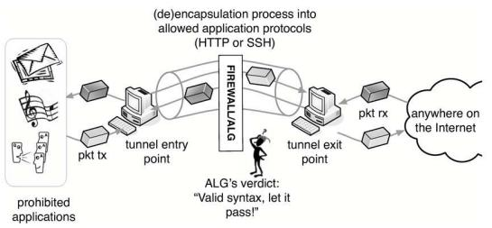

---

## 2017-TIFS-Classification_of_Encrypted_Traffic_With_Second-Order_Markov_Chains_and_Application_Attribute_Bigrams

**Fig. 4** — Fig. 4. System Overview.
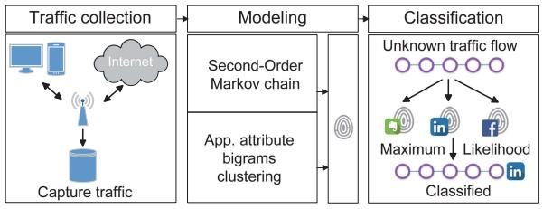

---

## 2018-CCS-Deep_Fingerprinting_Undermining_Website_Fingerprinting_Defenses_with_Deep_Learning

**Figure 2** — A basic architecture of convolutional neural networks (CNN)
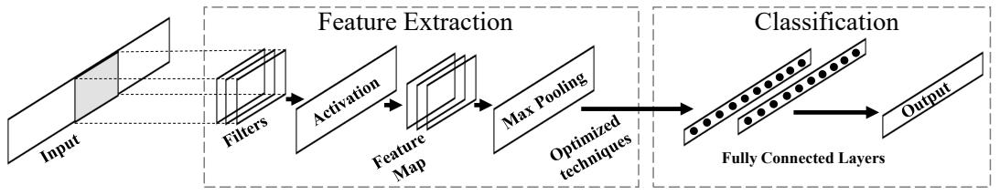

---

## 2018-CS-An_Efficient_Feature_Generation_Approach_Based_on_Deep_Learning_and_Feature_Selection_Techniques_for_Traffic_Classification

**Fig. 4** — Fig. 4. The deep architecture of RFGM.
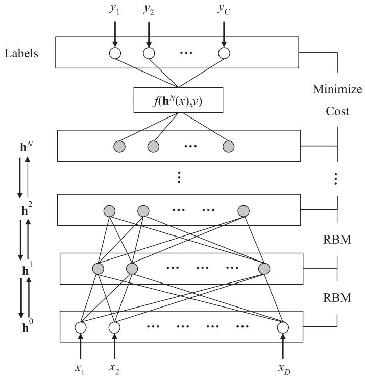

**Fig. 2** — Fig. 2. Overview of ML based traffic classification system.
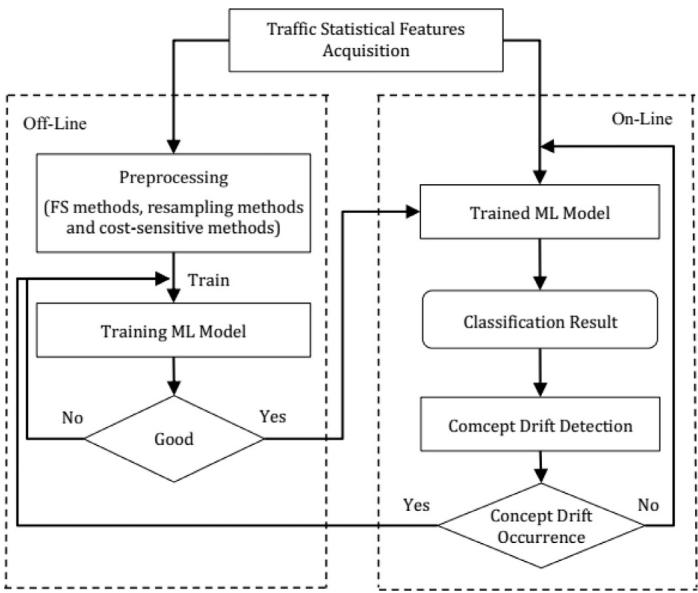

---

## 2018-Trans_IFS-Robust_Smartphone_App_Identification_via_Encrypted_Network_Traffic_Analysis

**Fig. 1** — Fig. 1. High-level representation of classifier training, and a visualisation of bursts and flows within network traffic. (a) Equipment setup. (b) Network trace capture. (c) Traffic burstification. (d) Flow separation. (e) Ambiguity detection. (f) Classifier training. (g) Trained classifiers.
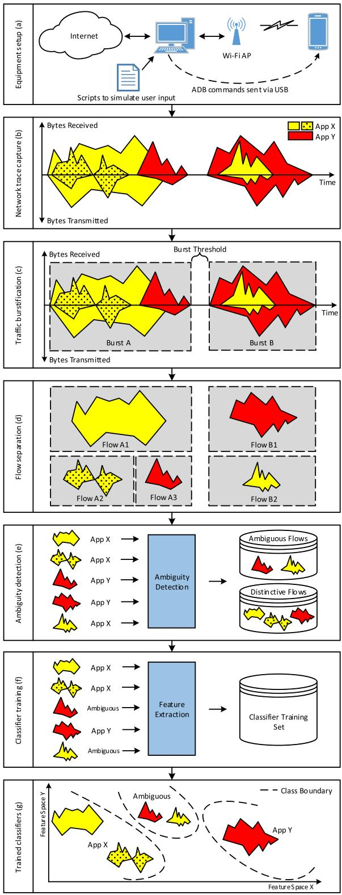

**Fig. 2** — Fig. 2. Generating features from flows for classifier training.
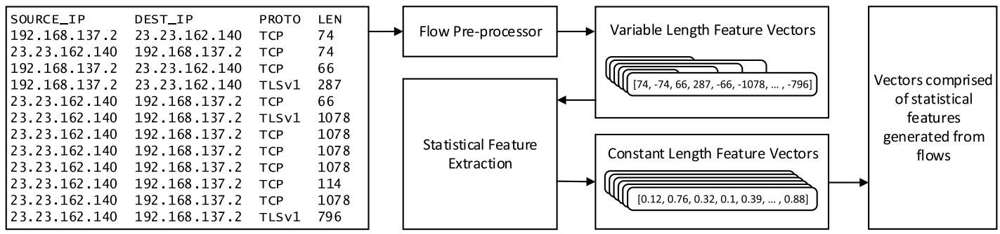

---

## 2019-INFOCOM-FS-Net__A_Flow_Sequence_Network_For_Encrypted_Traffic_Classification

**Fig. 2** — Fig. 2. The system overview of the FS-Net.
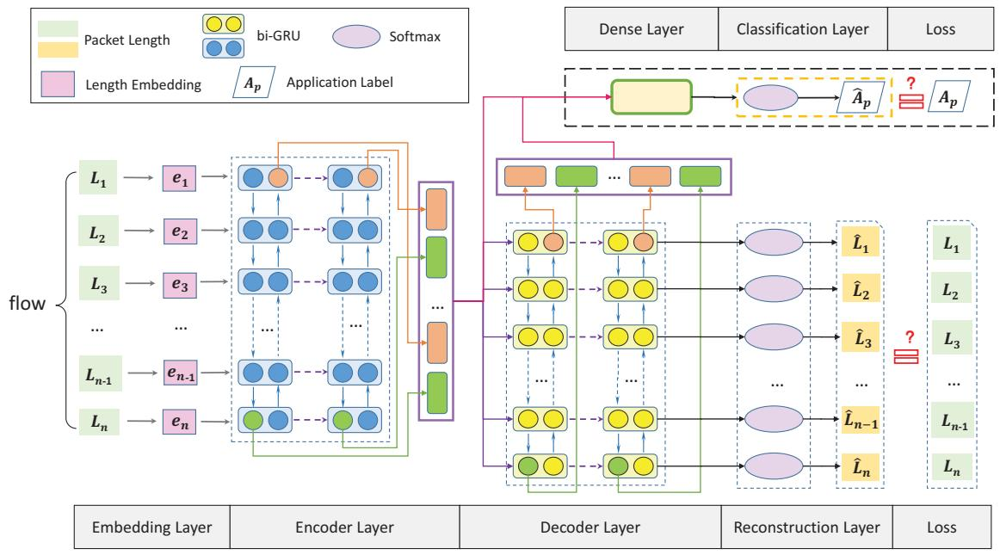

**Figure** — (b)  Fig. 1. 1(a) shows the architecture of gated recurrent unit, and 1(b) shows the basic structure of autoencoder.
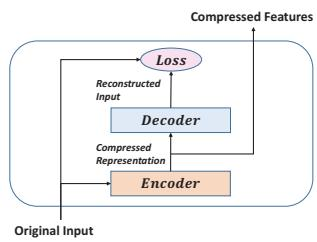

---

## 2019-INFOCOM-FlowPic__Encrypted_Internet_Traffic_Classification_is_as_Easy_as_Image_Recognition

**Figure 3** — An illustration of the architecture of our LeNet-5 style CNN.
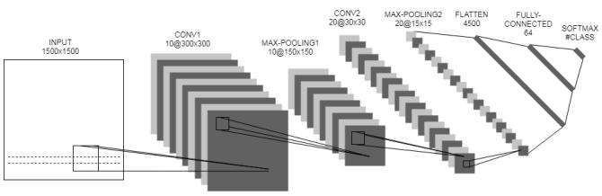

---

## 2020-NDSS-Flowprint__Semi-Supervised_Mobile-App_Fingerprinting_on_Encrypted_Network_Traffic

**Fig. 1** — Fig. 1. Overview of the creation and matching of app fingerprints. (A) We extract features from the network traces. (B) We cluster the flows from each device per network destination. (C) We detect and isolate browsers. (D) We discover correlations between network destinations. (E) We create fingerprints based on strong correlations. (F) We match newly found fingerprints against previously generated fingerprints and update them accordingly.
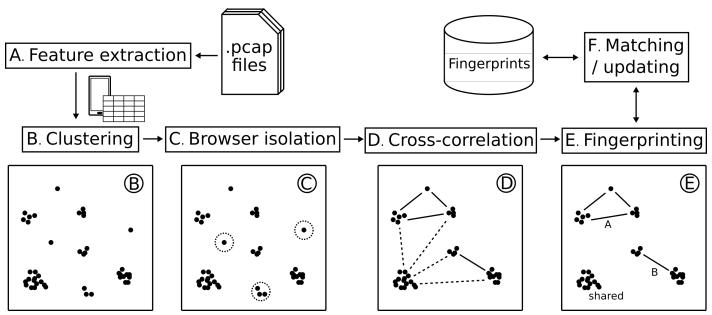

---

## 2020-TIFS-Fine-Grained_Webpage_Fingerprinting_Using_Only_Packet_Length_Information_of_Encrypted_Traffic

**Fig. 2** — Fig. 2. Overview of FineWP.
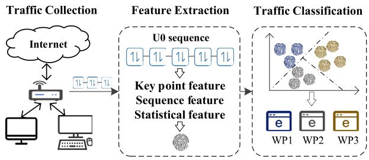

---

## 2021-CCS-Realtime_Robust_Malicious_Traffic_Detection_via_Frequency_Domain_Analysis

**Figure 1** — High-level design of Whisper.
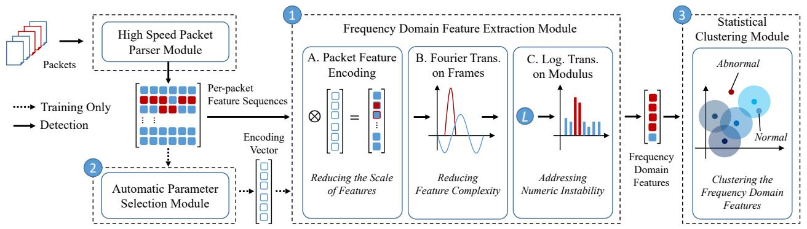

---

## 2021-NDSS-Detecting_Tor_Bridge_from_Sampled_Traffic_in_Backbone_Networks

**Fig. 4** — The architecture of the detection method
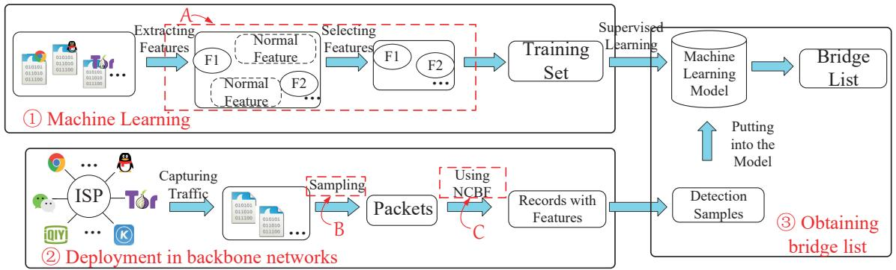

**Fig. 2** — Tor network architecture with bridge
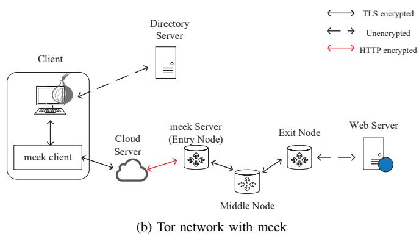

---

## 2021-TIFS-Accurate_Decentralized_Application_Identification_via_Encrypted_Traffic_Analysis_Using_Graph_Neural_Networks

**Fig. 5** — Fig. 5. Structure of Neural Networks in GraphDApp.
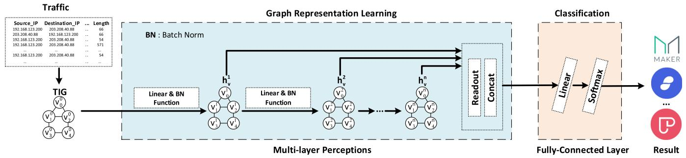

**Fig. 1** — Fig. 1. Typical Workflow of DApps on Ethereum.
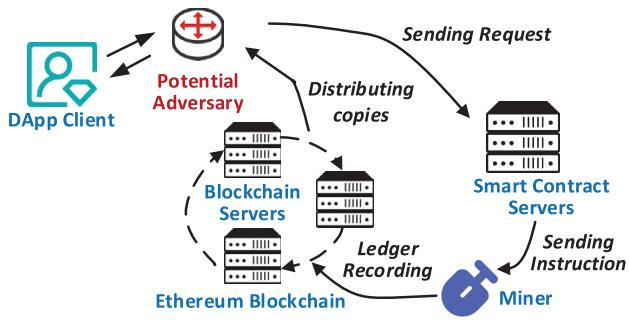

---

## 2022-COMST-Machine_Learning-Powered_Encrypted_Network_Traffic_Analysis_A_Comprehensive_Survey

**Fig. 4** — Fig. 4. A general workflow of encrypted traffic analysis.
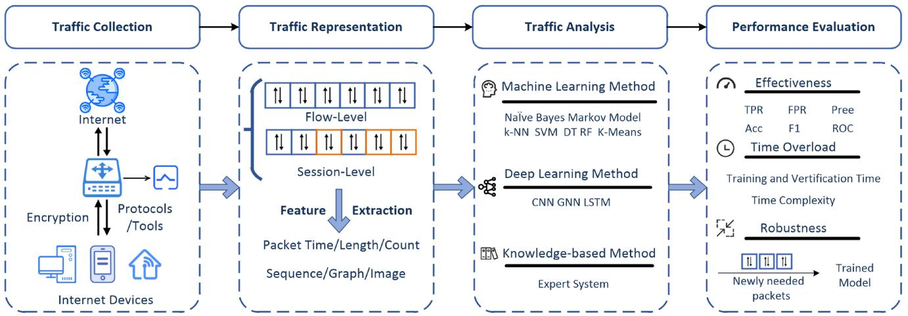

**Fig. 5** — Fig. 5. Mechanisms in the network model.
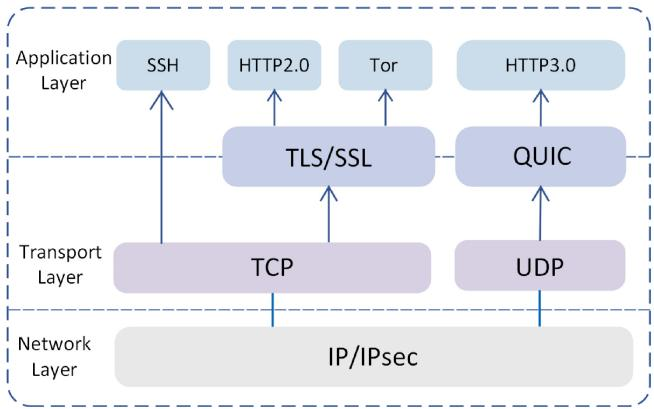

---

## 2022-EITCE-An_Encrypted_Traffic_Classification_Model_Based_on_the_Raw_Traffic_and_Spationtemporal_Characteristics

**Figure 1** — Framework of encrypted traffic classification model based on raw traffic and its spatiotemporal characteristics
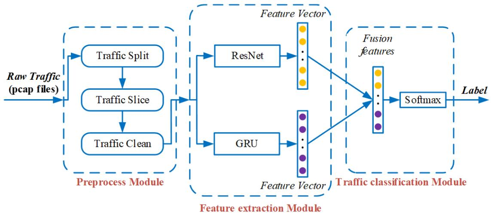

**Figure 2** — Data pre-processing steps
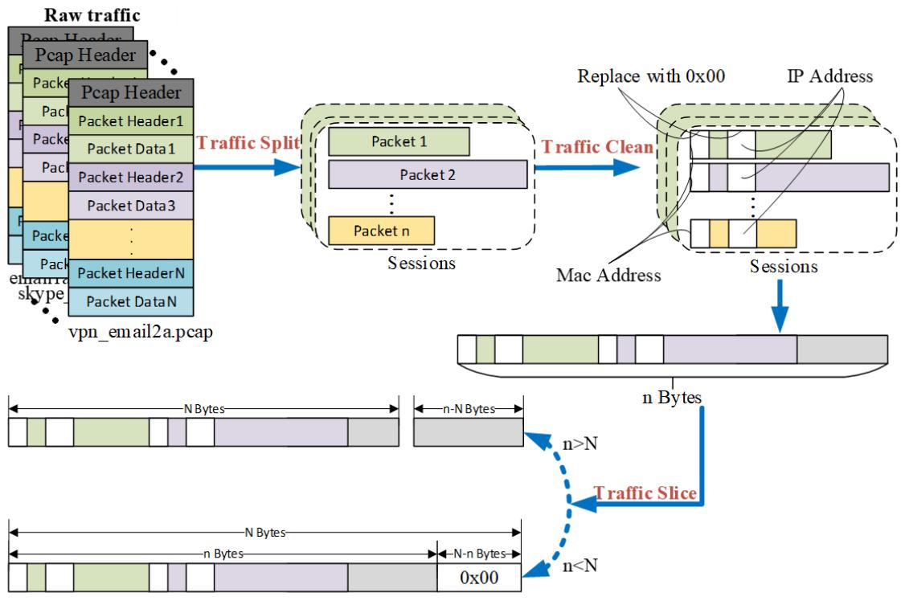

---

## 2022-HPCC-MTBD_HTTPS_Tunnel_Detection_Based_on_Multi-dimension_Traffic_Behaviors_Decision

**Fig. 2** — Fig. 2. The Framework of MTBD
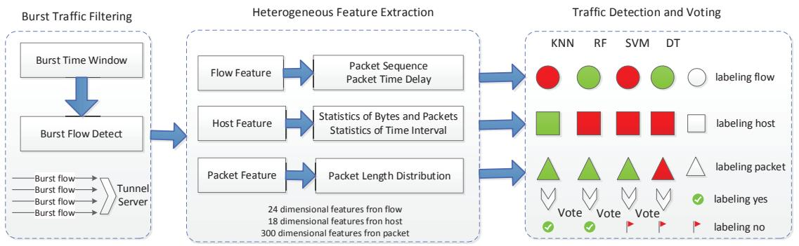

---

## 2022-ICMLA-Separating_Flows_in_Encrypted_Tunnel_Traffic

**Fig. 2** — Fig. 2. The architecture of our deep learning model.
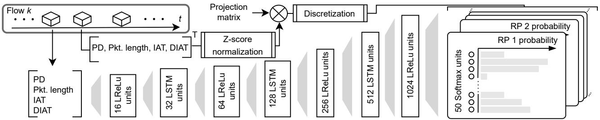

---

## 2022-TBD-Identification_of_Encrypted_Traffic_Through_Attention_Mechanism_Based_Long_Short_Term_Memory

**Fig. 6** — Fig. 6. The architecture diagram of HAN model.
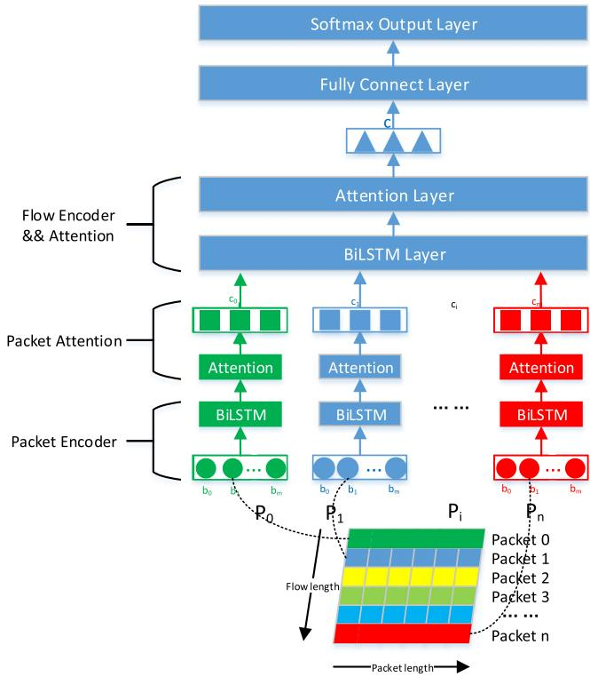

**Fig. 5** — Fig. 5. The architecture diagram of the attention based LSTM model.
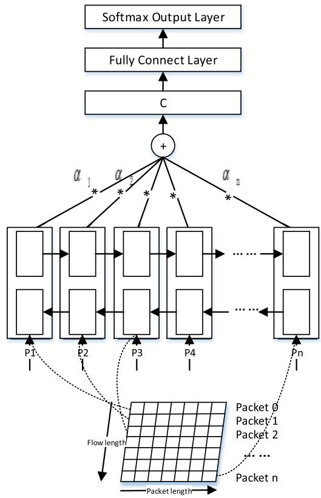

---

## 2022-USENIX-off-path_network_traffic_manipulation_via_revitalized_ICMP_redirect_attacks

**Figure 6** — Overview of DoS attacks.
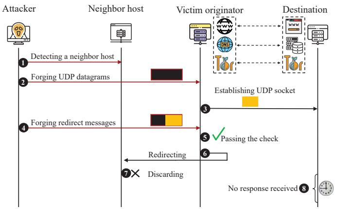

**Figure 10** — Off-path DNS requests hijacking in NAT networks.
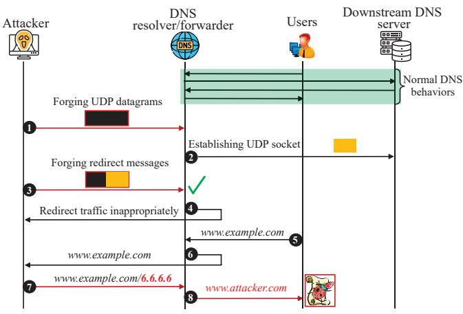

---

## 2022-WWW-ET-BERT__A_Contextualized_Datagram_Representation_with_Pre-training_Transformers_for_Encrypted_Traffic_Classification

**Figure 2** — Overview of ET-BERT Framework.
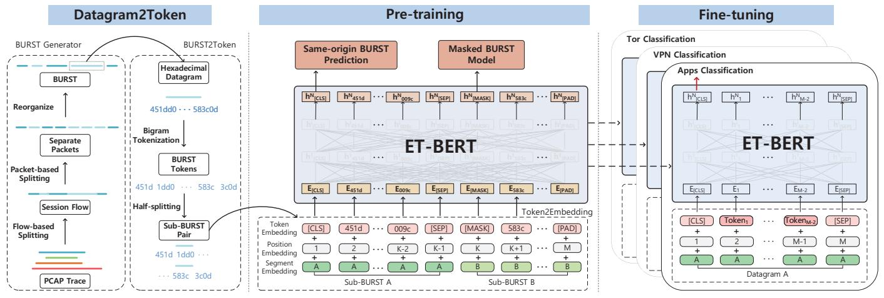

---

## 2023-AAAI-Yet_Another_Traffic_Classifier_a_Masked_Autoencoder_Based_Traffic_Transformer_With_Multi-level_Flow_Representation

**Figure 2** — The schematic illustration of YaTC.
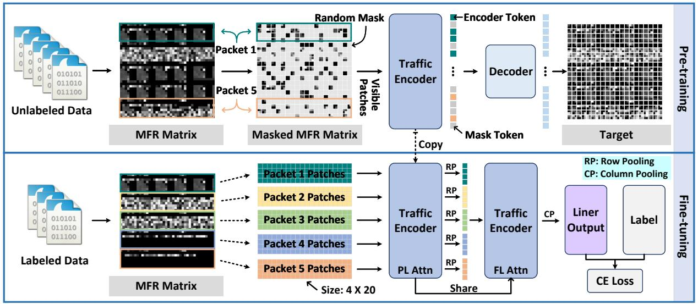

**Figure 1** — The schematic illustration of multi-level fow representation (MFR).
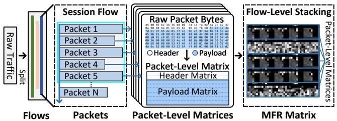

---

## 2023-CCS-Point_cloud_analysis_for_ML-based_malicious_traffic_detection_Reducing_majorities_of_false_positive_alarms

**Figure 3** — The overview of pVoxel.
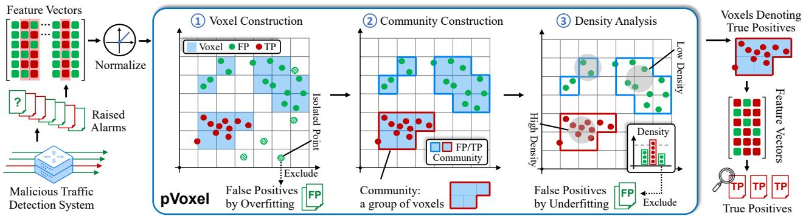

---

## 2023-ComputerNetworks-Few-shot_encrypted_traffic_classification_via_multi-task_representation_enhanced_meta-learning

**Fig. 1** — Fig. 1. The whole architecture of the MetaMRE model.
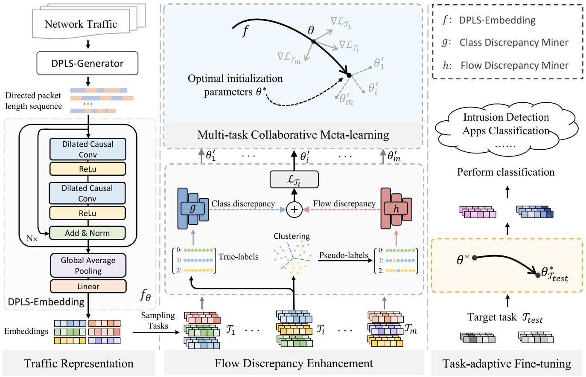

---

## 2023-NDSS-Detecting_unknown_encrypted_malicious_traffic_in_real_time_via_flow_interaction_graph_analysis

**Fig. 1** — Fig. 1. The overview of HyperVision.
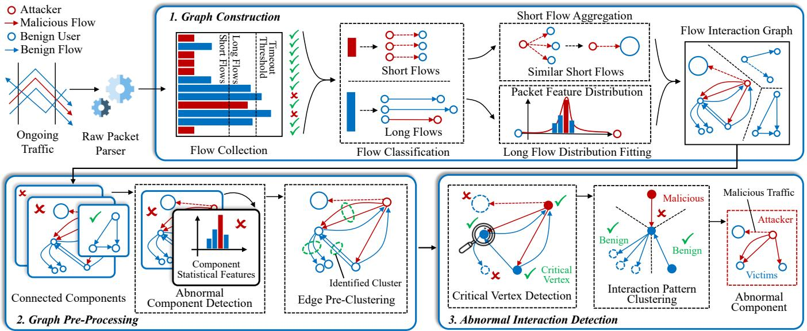

---

## 2023-S&P-Robust_Multi-tab_Website_Fingerprinting_Attacks_in_the_Wild

**Fig. 2** — The overview of our generic robust WF attack ARES. ARES is based on multi-tab WF architecture with multiple Trans-WF, and each Trans-WF identifies a specific website. Trans-WF consists of three module: traffic division module, local profiling module and website identification module.
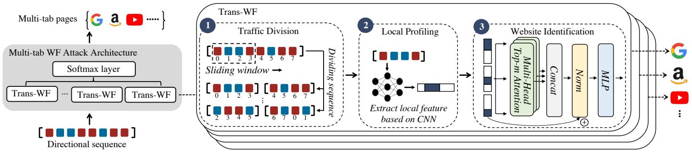

**Fig. 4** — The multi-head top-m attention method correlates local traffic patterns for website fingerprinting even in the presence of noise interference. Different from the full connection of the original Transformer, Trans-WF keeps only the top-m attention.
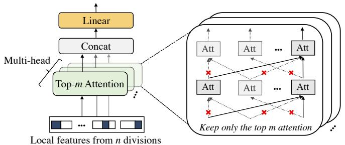

---

## 2023-SIGKDD-A_lightweight__efficient_and_explainable__by__design_convolutional_neural_network_for_internet_traffic_classification

**Figure 3** — The prototype block of ProtoPNet and the new Lightweight Prototype Layer of LEXNet (LProto) with its contributions in red. Sim. M. - similarity matrix.
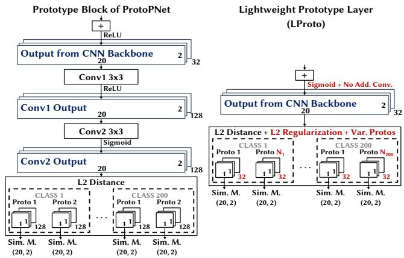

**Figure 2** — ResNet original residual block (Res) and our new Lightweight and Efficient Residual block (LERes) with its contributions in red.
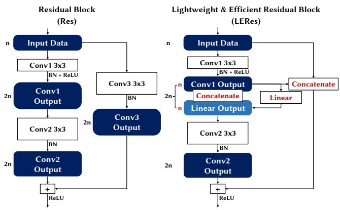

---

## 2023-TIFS-Exploring_Uncharted_Waters_of_Website_Fingerprinting

**Fig. 3** — Fig. 3. Overview of the research. We collect five datasets representing five distinct scenarios and evaluate them using seven WF techniques, including two novel techniques and five state-of-the-art techniques.
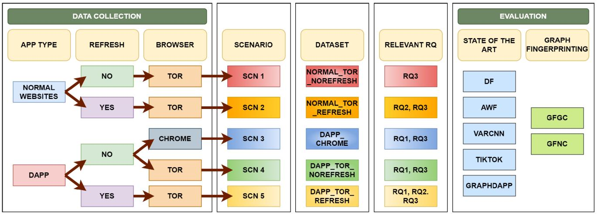

**Fig. 7** — Fig. 7. GFGC model architecture.
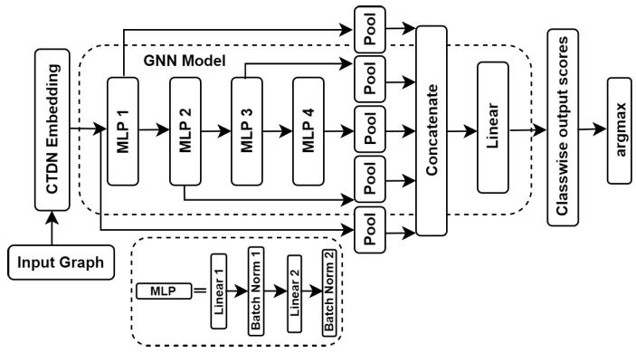

---

## 2023-TNET-Frequency_Domain_Feature_Based_Robust_Malicious_Traffic_Detection

**Fig. 1** — Fig. 1. High-level design of Whisper.
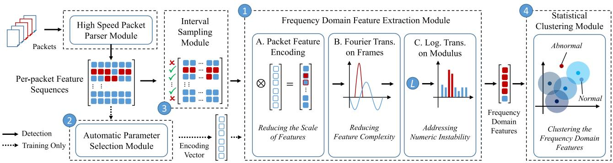

---

## 2023-USENIX-Subverting_Website_Fingerprinting_Defenses_with_Robust_Traffic_Representation

**Figure 7** — The detail RF model’s architecture
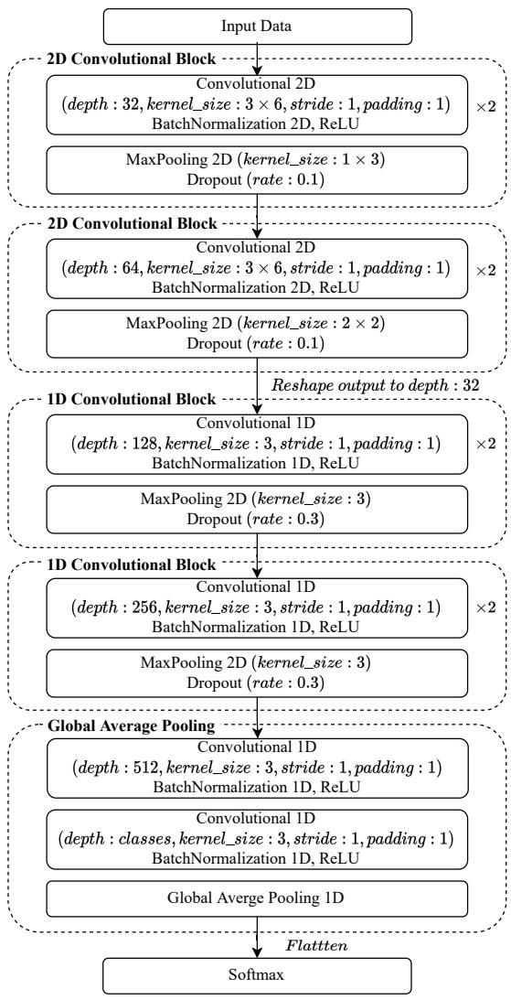

---

## 2024-CCS-Detecting_tunneled_flooding_traffic_via_deep_semantic_analysis_of_packet_length_patterns

**Figure 5** — High-level architecture of Exosphere.
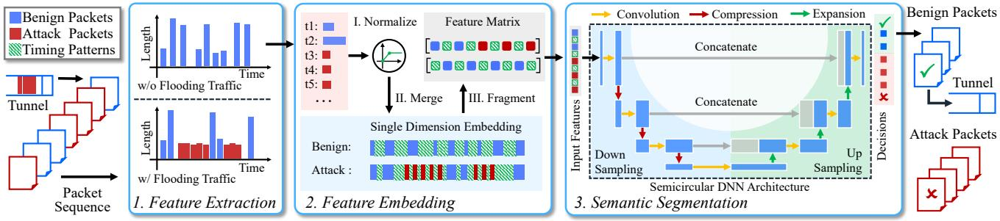

**Figure 8** — Architecture of the semicircular DNN model $\left( D = 3 \right)$ .
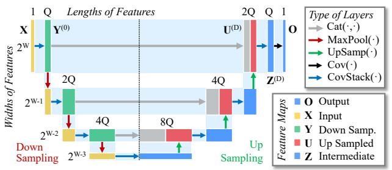

---

## 2024-CCS-Robust_and_reliable_early-stage_website_fingerprinting_attacks_via_spatial-temporal_distribution_analysis

**Figure 5** — The overview of Holmes.
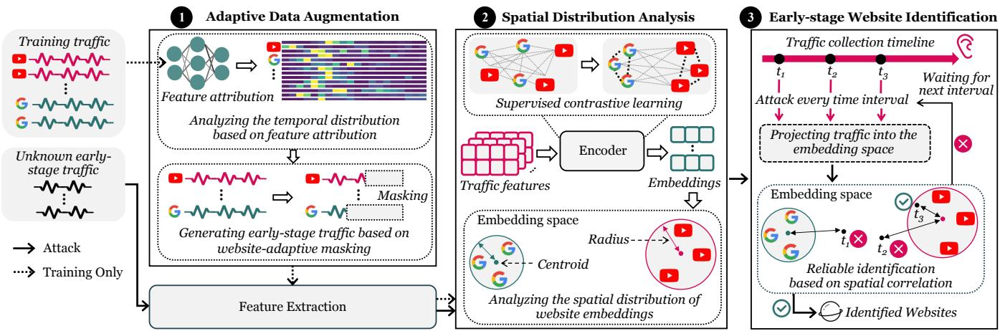

**Figure 7** — The Encoder of Holmes.
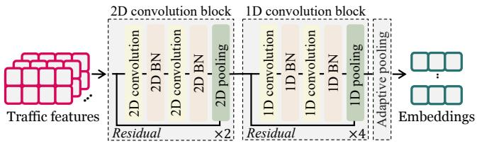

---

## 2024-CCS-Towards_fine-grained_webpage_fingerprinting_at_scale

**Figure 3** — Design overview of Oscar, which consists of three modules: Data Augmentation module, Feature Transformation Original Samples Diversmodule and Webpage Identification module.
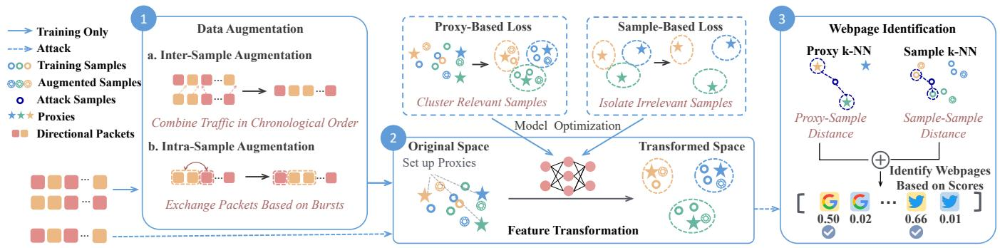

**Figure 6** — Details of the Feature Transformation module, which comprises a DF-based model and a multi-label metric learning loss function. We display the samples and their correlated proxies in the same color.
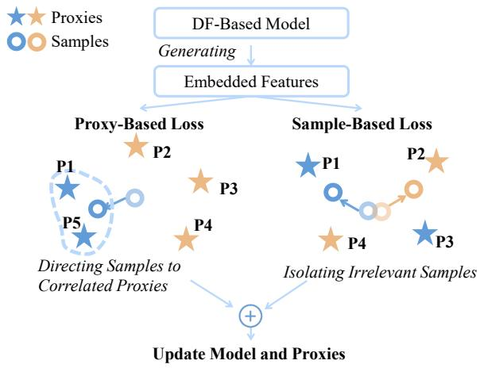

---

## 2024-CNSM-Experience__Report_Using_JA4_Fingerprints_for_Malware_Detection_in_Encrypted_Traffic

**Figure** — (c) Malware JA4+JA4X fingerprints
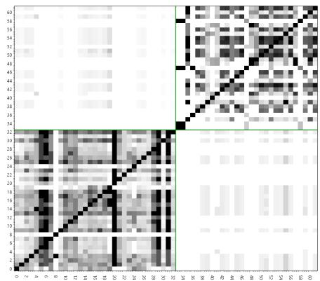

---

## 2024-INFOCOM-Causality_Correlation_and_Context_Learning_Aided_Robust_Lightweight_Multi-Tab_Website_Fingerprinting_Over_Encrypted_Tunnel

**Fig. 2** — Fig. 2. The architecture of our website fingerprinting attack
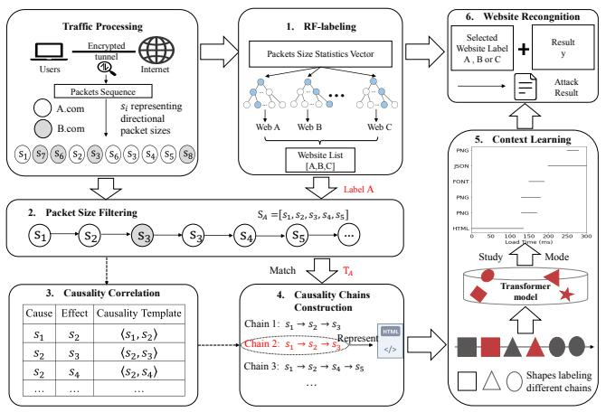

**Fig. 1** — Fig. 1. Illustration of multi-tab web accessing.
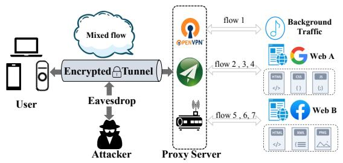

---

## 2024-NDSS-Flow_Correlation_Attacks_on_Tor_Onion_Service_Sessions_with_Sliding_Subset_Sum

**Figure 2** — The SUMo pipeline comprising two online phases – filtering and matching phase – and one offline training phase.
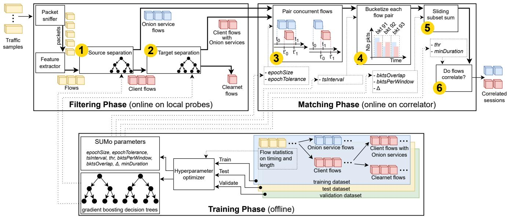

---

## 2024-NDSS-Low-quality_training_data_only__A_robust_framework_for_detecting_encrypted_malicious_network_traffic

**Fig. 1** — The overview of our robust encrypted malicious traffic detection system RAPIER.
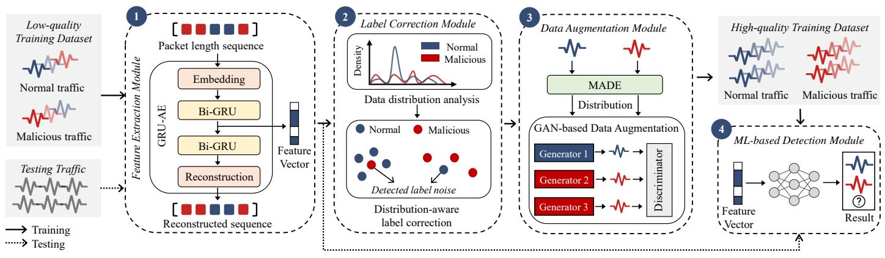

**Fig. 5** — The overview of our data augmentation module. We use three generators to generate samples $( G _ { M B } , G _ { M O } , G _ { N B } )$ based on three strategies $( M _ { B } , \ M _ { O } , \ N _ { B } ) .$ , respectively. The $\sim M _ { B }$ indicates the generator that fits the target distribution region of $M _ { B }$ , and the same goes for $\sim M _ { O }$ and $\sim N _ { B }$ .
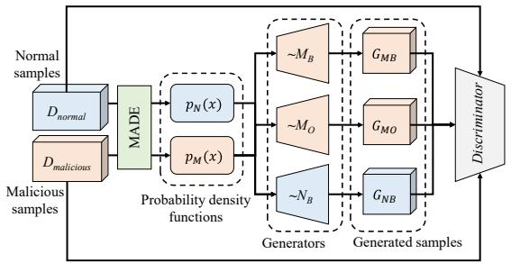

---

## 2024-NDSS-MirageFlow__A_New_Bandwidth_Inflation_Attack_on_Tor

**Fig. 1** — C-MirageFlow: MirageFlow with Co-Resident Relays.
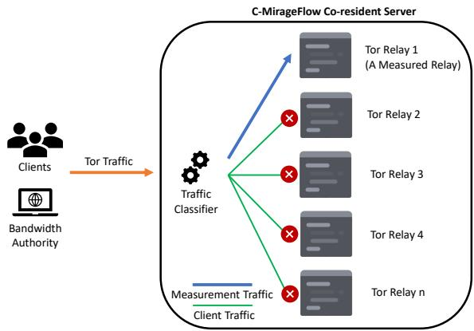

---

## 2024-S&P-Real-Time_Website_Fingerprinting_Defense_via_Traffic_Cluster_Anonymization

**Figure 2** — Palette overview: 1) Generate anonymity sets and corresponding super-matrices through website clustering. 2) Refine super-matrices using historical traces to lower overhead. 3) Use refined super-matrices for online trace regularization.
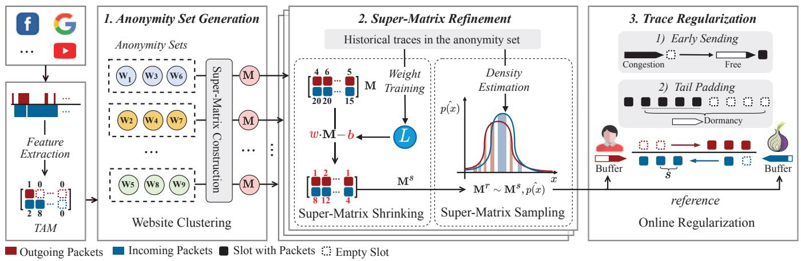

---

## 2024-TNET-Flow_Interaction_Graph_Analysis_Unknown_Encrypted_Malicious_Traffic_Detection

**Fig. 1** — Fig. 1. The overview of HyperVision.
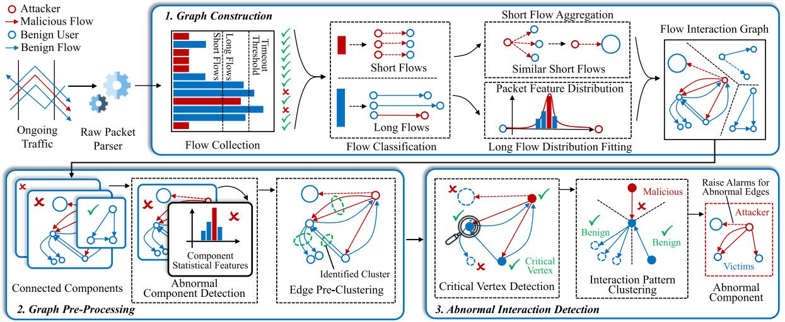

---

## 2024-USENIX-Fingerprinting_Obfuscated_Proxy_Traffic_with_Encapsulated_TLS_Handshakes

**Figure 5** — Detection Framework in Merit. For TLS flows, we remove the handshake of the cover TLS layer before feature extraction in order to only identify handshakes that are encapsulated.⋄
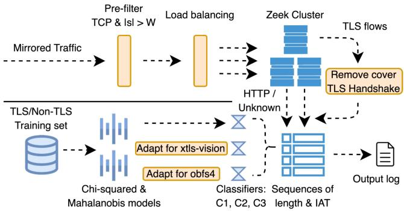

---

## 2024-USENIX-OpenVPN_is_Open_to_VPN_Fingerprinting

**Figure 2** — Framework Deployment on Merit Steps: (1) Client connects to VPN servers. (2) VPN connections, along with passing traffic, are being mirrored to the Filter. (3) Filter forwards server IP of suspected connections to the probing system. (4) Targets are sent to each dedicated Probers. (5) Probers send probes asynchronously. (6) Connections confirmed by probing are logged.
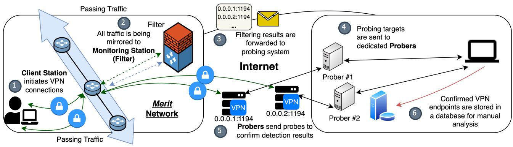

**Figure** — A Appendix  Figure 11: Evaluation Process for Active Server Fingerprinting.
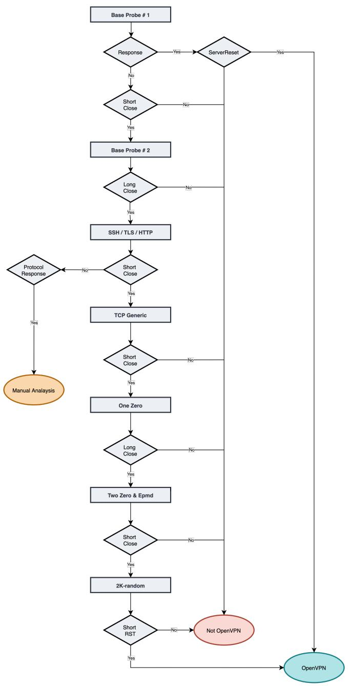

---

## 2024-WWW-AN-Net__an_Anti-Noise_Network_for_Anonymous_Traffic_Classification

**Figure 3** — Overview of AN-Net Framework.
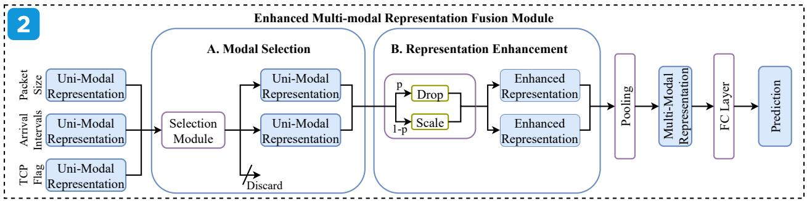

**Figure 1** — Threat models of encrypted network traffic classification and anonymous network traffic classification.
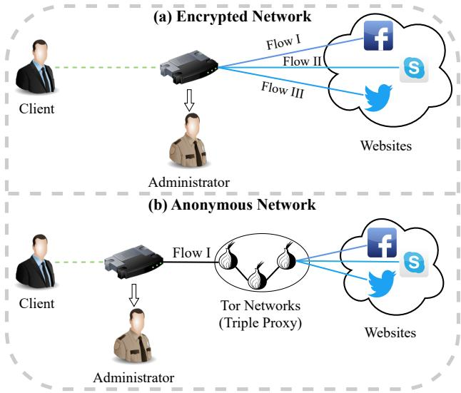

---

## 2024-arXiv-NetMamba__Efficient_Network_Traffic_Classification_via_Pre-training_Unidirectional_Mamba

**Fig. 1** — Fig. 1. Overview of NetMamba Framework
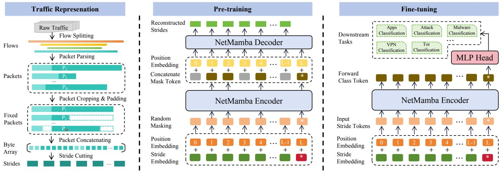

**Fig. 2** — Fig. 2. NetMamba Encoder (Decoder)
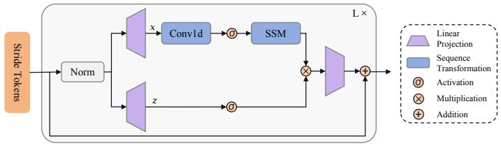

---

## 2024-arXiv-TrafficGPT__Breaking_the_Token_Barrier_for_Efficient_Long_Traffic_Analysis_and_Generation

**Fig. 1** — Fig. 1. The framework of TrafficGPT.
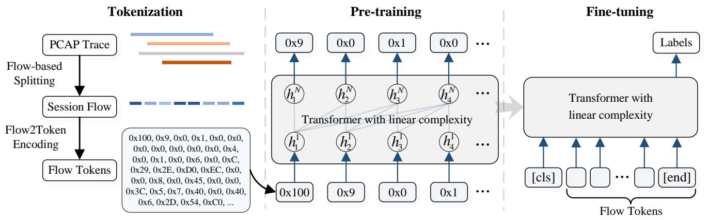

**Fig. 2** — Fig. 2. The structure of flow tokens.
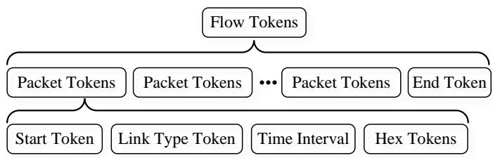

---

## 2025-AAAI-MIETT__Multi-Instance_Encrypted_Traffic_Transformer_for_Encrypted_Traffic_Classification

**Figure 3** — Overall architecture of the Multi-Instance Encrypted Traffc Transformer (MIETT). After passing through the MIETT encoder, the fow representation is processed by M Two-Level Attention (TLA) layers, each comprising a packet attention mechanism and a fow attention mechanism.
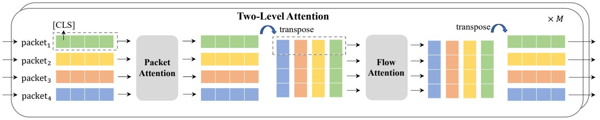

**Figure** — Flow Contrastive Learning (FCL) Task (c) Figure 4: Overview of pre-training tasks. (a) Masked Flow Prediction (MFP) Task: The model is tasked with predicting the original content of masked tokens using the context provided by the unmasked tokens. (b) Packet Relative Position Prediction (PRPP) Task: The model’s objective is to determine, for each pair of packets (i, j), whether packet i precedes packet j. (c) Flow Contrastive Learning (FCL) Task: The goal is to ensure that packets within the same fow (positive pairs) are more similar in the embedding space, while packets from different fows (negative pairs) are less similar.
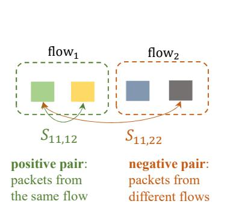

---

## 2025-AIA-Enhancing DNS-over-HTTPS_Traffic_Classification_in_Heterogeneous_Networks_Through_Latent_Space_Analysis_with_a_Tabular-Variational_Autoencoder_and_Self-Attention_Classifier_Model

**Figure 3** — Figure 3 Tab-VAE architecture
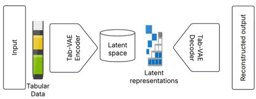

**Figure 1** — Figure 1 Process diagram of Tab-VAE model
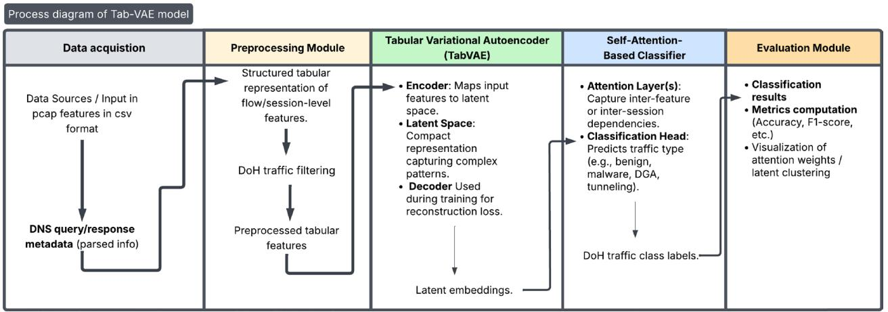

---

## 2025-CCS-MM4flow__A_Pre-trained_Multi-modal_Model_for_Versatile_Network_Traffic_Analysis

**Figure 2** — The overview of MM4flow. It consists of four modules: (1) data collection, (2) tokenization, (3) uni-modal pre-training, and (4) multi-modal fine-tuning. BERT-bytes and BERT-ps are applied to represent two modalities of network flows, that is, the payload byte stream (raw byte stream) and packet length sequence (transmission pattern), respectively.
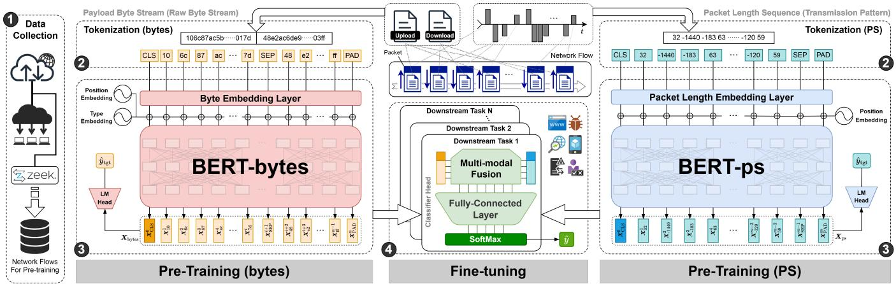

**Figure 3** — At the network gateway, it is the the architecture for real-time network traffic capture, whose configuration primarily consists of port mirroring and the Zeek cluster.
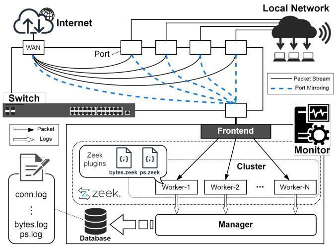

---

## 2025-CCS-Swallow__A_Transfer-Robust_Website_Fingerprinting_Attack_via_Consistent_Feature_Learning

**Figure 5** — The overview of Swallow.
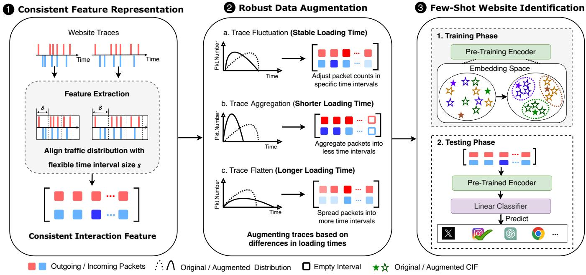

**Figure 7** — The pre-training phase of Swallow, which is based on a self-supervised learning framework BYOL [11].
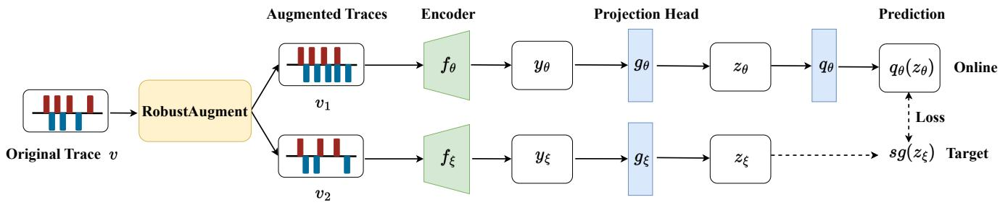

---

## 2025-CCS-Training_Robust_Classifiers_for_Classifying_Encrypted_Traffic_under_Dynamic_Network_Conditions

**Figure 2** — The overview of MetaTraffic.
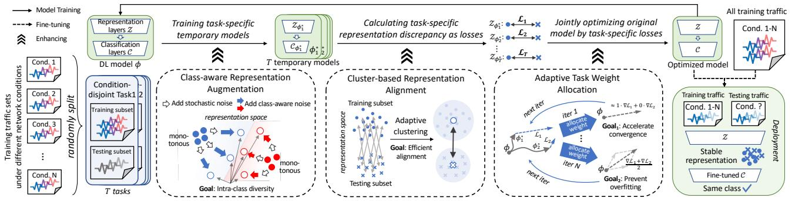

**Figure 5** — The performance of our framework and baselines under dynamic network conditions of different multiple types. The upper and lower subfigures show the original ?????? and $F 1 _ { m a c r o }$ of DF and ARES under dynamic conditions across the datasets, respectively, as well as the performance improvements after applying our framework and baselines. HOS, ENV, and OBF represent host, network environment, and obfuscation conditions, respectively.
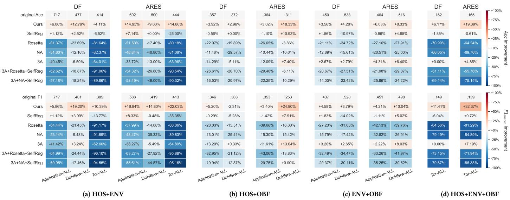

---

## 2025-CCS-Training_with_Only_1.0 ‰_Samples__Malicious_Traffic_Detection_via_Cross-Modality_Feature_Fusion

**Figure 2** — High-level architecture of tFusion malicious traffic detection system.
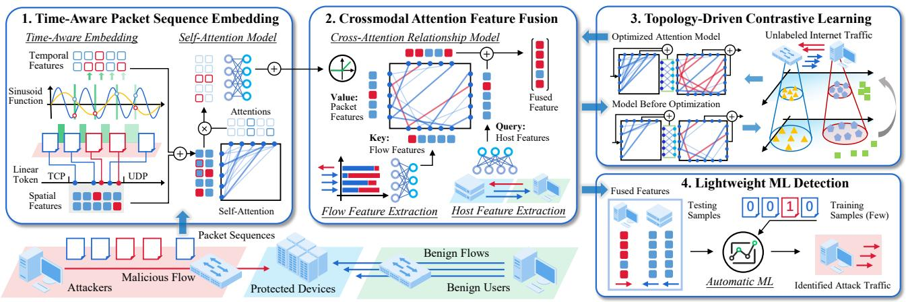

**Figure 8** — Network topology of deployment.
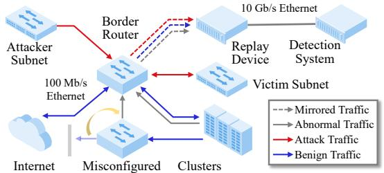

---

## 2025-ESA-MET-LLM__Enhancing_Large_Language_Models_for_Malicious_Encrypted_Traffic_Detection

**Figure 2** — The architectural overview of our proposed MET-LLM. Our MET-LLM comprises of three primary components: traffic embedding, pretrained LLM, and DATA. The first component transforms heterogeneous network data into LLM-compatible representations. The second leverages domainadapted contextual modeling. The third enables efficient parameter updates and adaptation to the evolving threats.
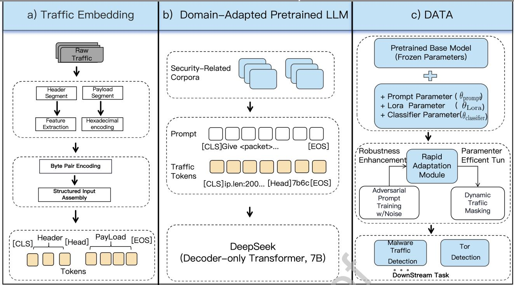

**Figure 3** — The illustration of traffic vocabulary construction.
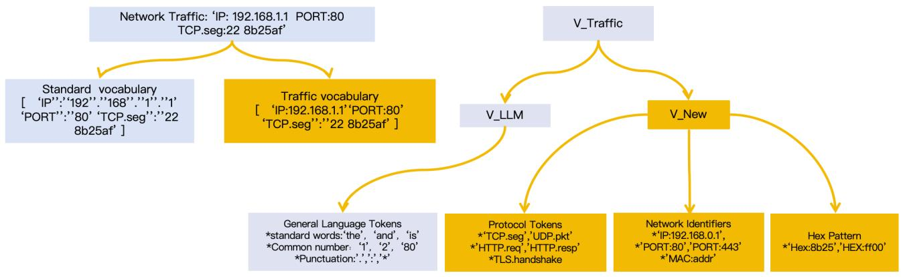

---

## 2025-ICAACE-A_Semi-Supervised_Learning_Framework_for_Encrypted_Traffic_Classification_Based_on_Supervised_Contrastive_Learning_and_Masked_Sequence_Prediction_Tasks

**Figure 1** — Figure 1. CoMask Framework
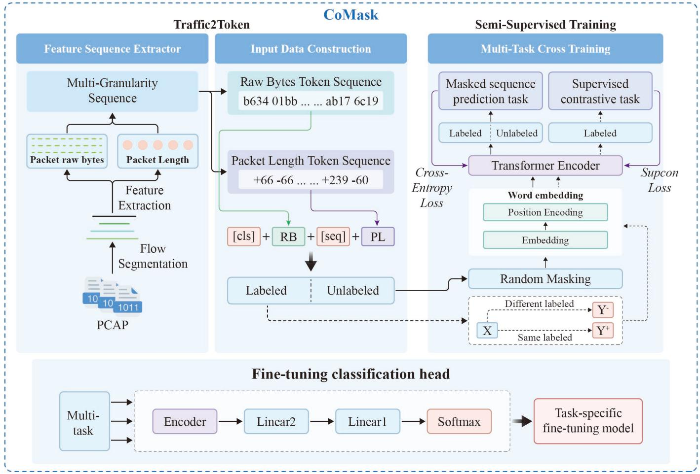

---

## 2025-INCAS-Malicious_QUIC_C2_Traffic_Detection_based_on_Random_Forest_in_Programmable_Data_Plane

**Figure 1** — System architecture for real-time QUIC C2 detection using programmable data planes.
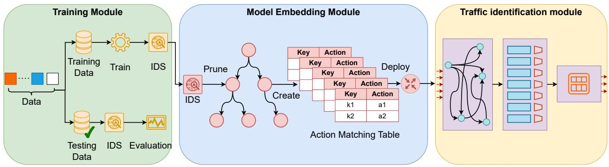

**Figure 2** — Example deployment of a two-tree Random Forest model in P4 switch using encoded match-action tables.
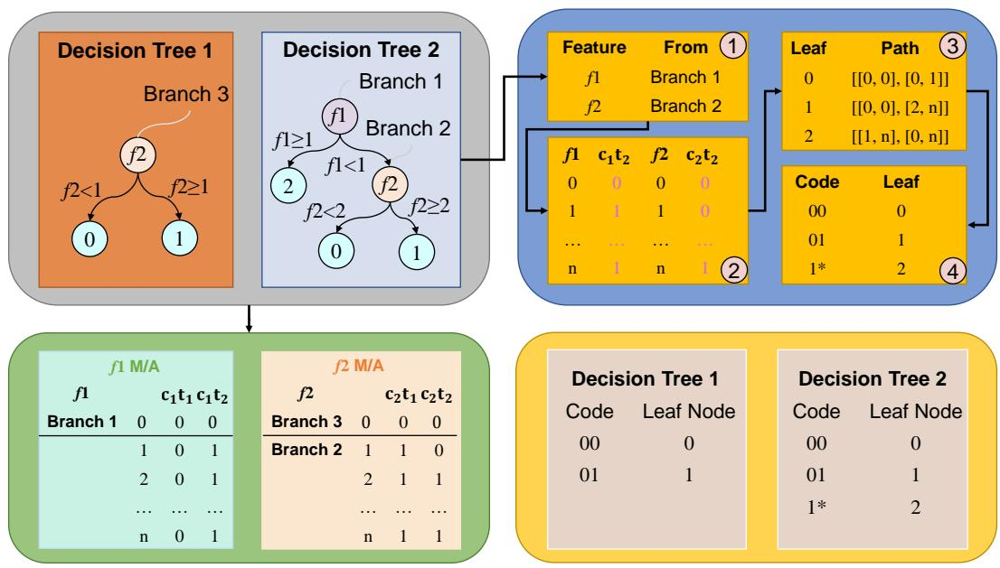

---

## 2025-IWQoS-MOTA_Mixture_of_Traffic_Agents_for_Robust_Network_Traffic_Classification

**Fig. 1** — An illustration of the MoA architecture.
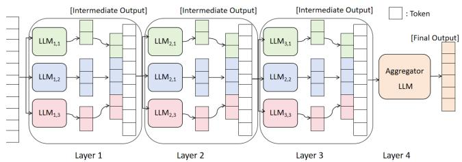

**Fig. 4** — Design of MOTA
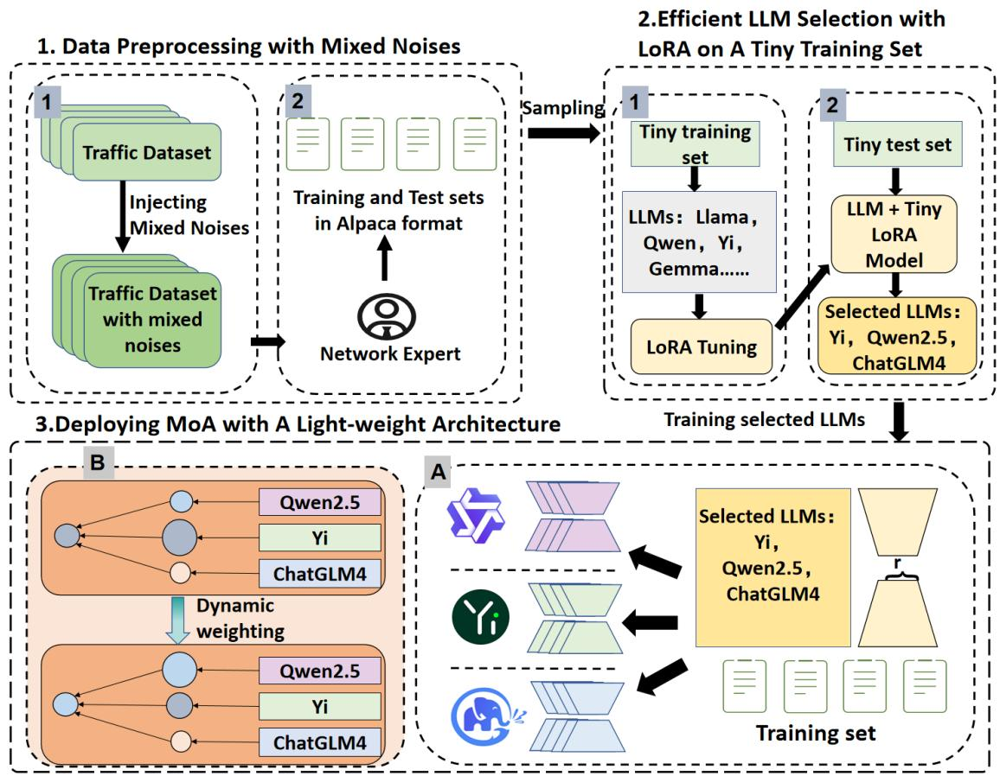

---

## 2025-IWQoS-TraGe_A_Generic_Packet_Representation_for_Traffic_Classification_Based_on_Header-Payload_Differences

**Fig. 1** — Fig. 1. The framework of TraGe.
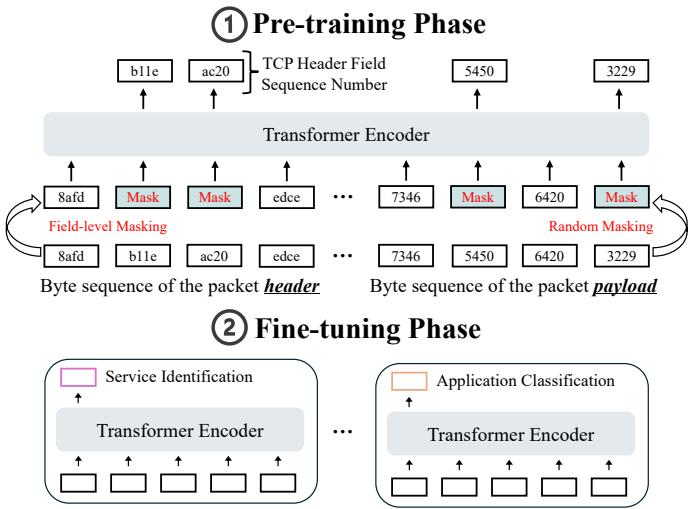

---

## 2025-JIoT-A_Detection_Method_for_Malware_Communication_Traffic_via_Encrypted_Traffic_Analysis

**Fig. 2** — Fig. 2. Overall structure of the method. (a) Data Preprocessing Module. (b) Transformer Module. (c) Classification and Evaluation Module.
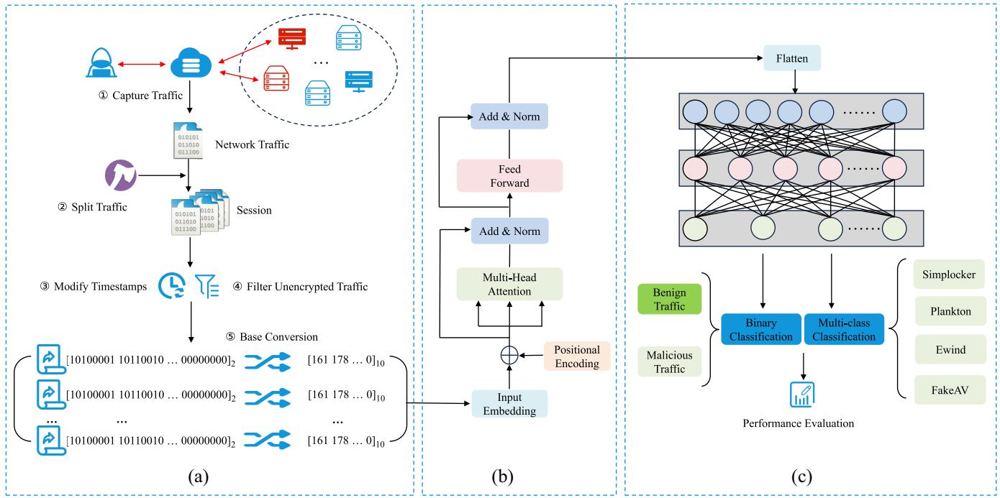

**Fig. 3** — Fig. 3. Structure of PCAPNG.
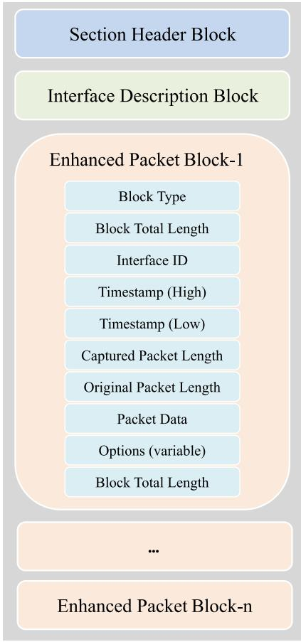

---

## 2025-JPDC-Multi-ARCL__Multimodal_adaptive_relay-based_distributed_continual_learning_for_encrypted_traffic_classification

**Fig. 2** — Fig. 2. The framework of the proposed method.
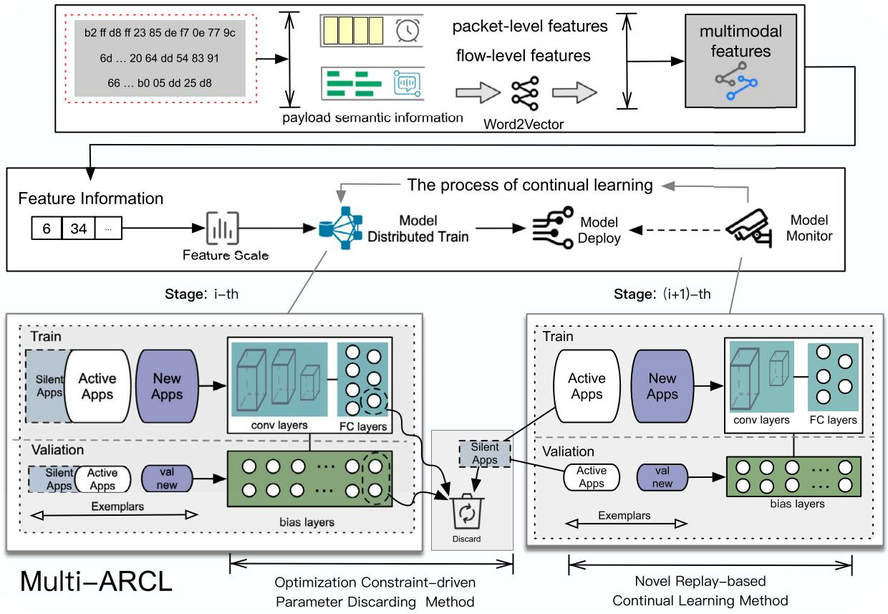

**Fig. 3** — Fig. 3. Comparison of model structures before and after classes change.
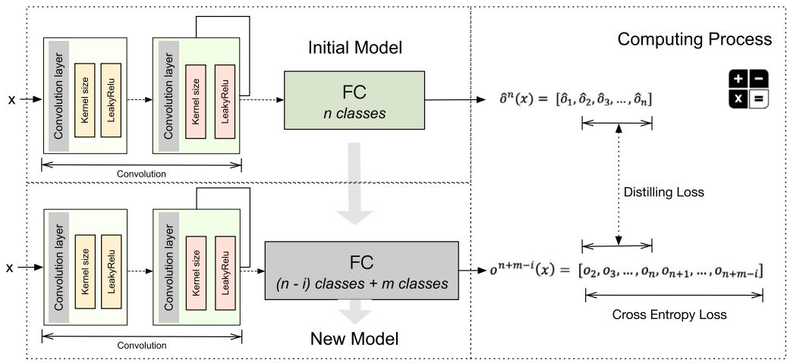

---

## 2025-KDD-Wedjat_Detecting_Sophisticated_Evasion_Attacks_via_Real-time_Causal_Analysis

**Figure 1** — The overview of Wedjat.
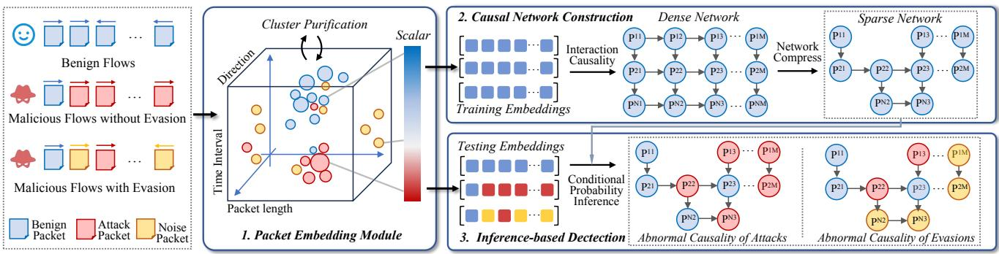

---

## 2025-NIPS-FlowRefiner__A_Robust_Traffic_Classification_Framework_against_Label_Noise

**Figure 1** — The overview of FLOWREFINER.
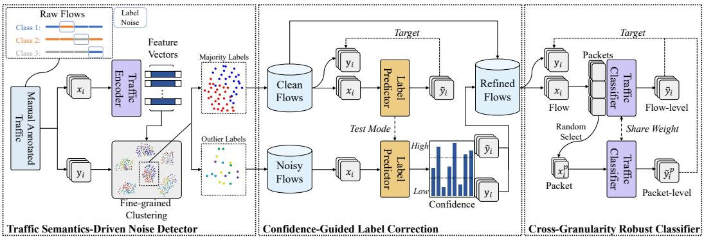

**Figure 5** — The pre-training paradigm of masked autoencoder for building traffic semantics-oriented encoder.
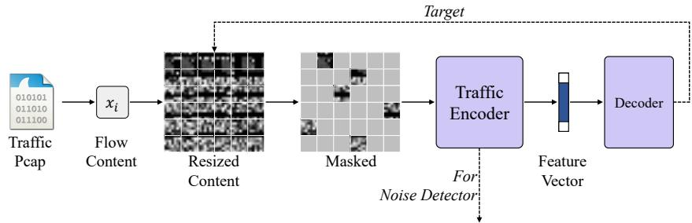

---

## 2025-NIPS-Gated_Attention_for_Larg

**Figure**

---

## 2025-S&P-SoK_Decoding_the_Enigma_of_Encrypted_Network_Traffic_Classifiers

**Figure 1** — Figure 1. Taxonomy of design choices in raw information based NTC
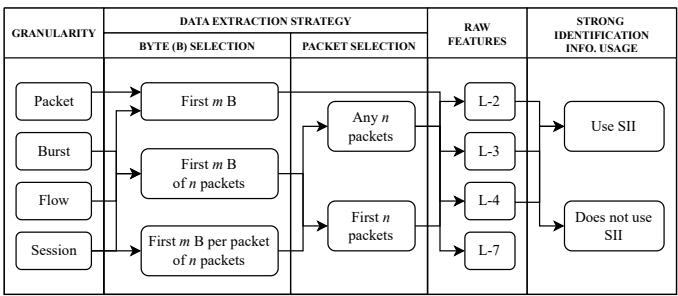

---

## 2025-S&P-TrafficFormer_An_Efficient_Pre-trained_Model_for_Traffic_Data

**Figure 1** — The framework of TrafficFormer.
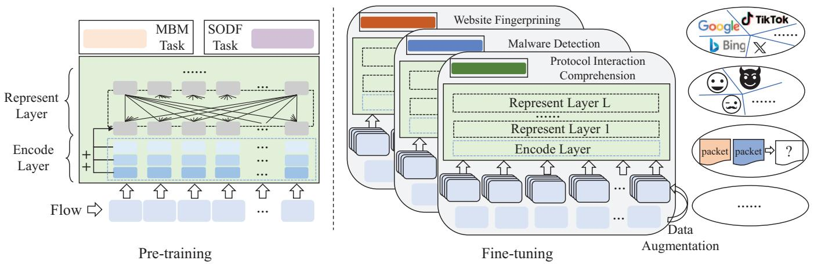

**Figure 2** — An illustration of the MBM task.
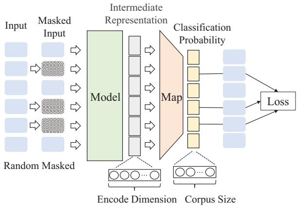

---

## 2025-SIGCOMM-The_Sweet_Danger_of_Sugar_Debunking_Representation_Learning_for_Encrypted_Traffic_Classification

**Figure 2** — Schema of Pcap-Encoder, our proposal.
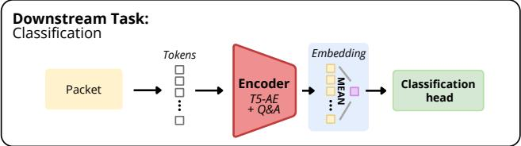

---

## 2025-TDSC-DAIR-FedMoE__Hierarchical_MoE_for_Federated_Encrypted_Traffic_Classification_under_Compound_Drift

**Fig. 2** — Overview of the DAIR-FedMoE framework. (a) GShard Transformer backbone in which each MoE layer is replaced by a hierarchical Mixture-of-Experts (HMoE) sublayer. (b) Server-side HMoE pipeline, where encrypted-flow embeddings are scored for drift, smoothed, and routed by a root gate to stable or drift-specialist experts; model updates are aggregated federatively and expert spawning, pruning, and merging are controlled by a PPO-based policy. (c) Client-side workflow, where local drift scores guide hierarchical routing, adaptive confidence-based loss reweighting is applied during training, and differentially private expert and gate updates with confidence summaries are returned to the server.
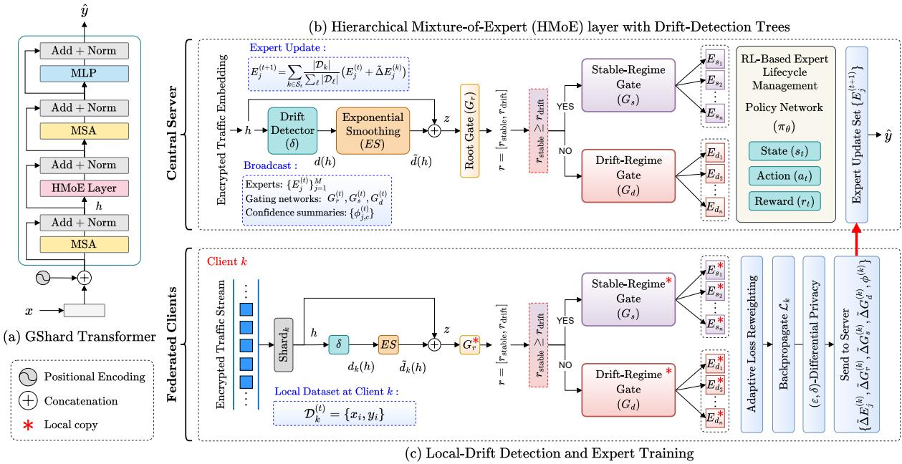

---

## 2025-TIFS-Bottom_Aggregating_Top_Separating_An_Aggregator_and_Separator_Network_for_Encrypted_Traffic_Understanding

**Fig. 2** — Fig. 2. The overview of ASNet. Note: in the solid blue boxes in the lower left corner of the figure, to highlight the aggregation process of word sense, we represent them as characters, which are actually vector representations after encoding.
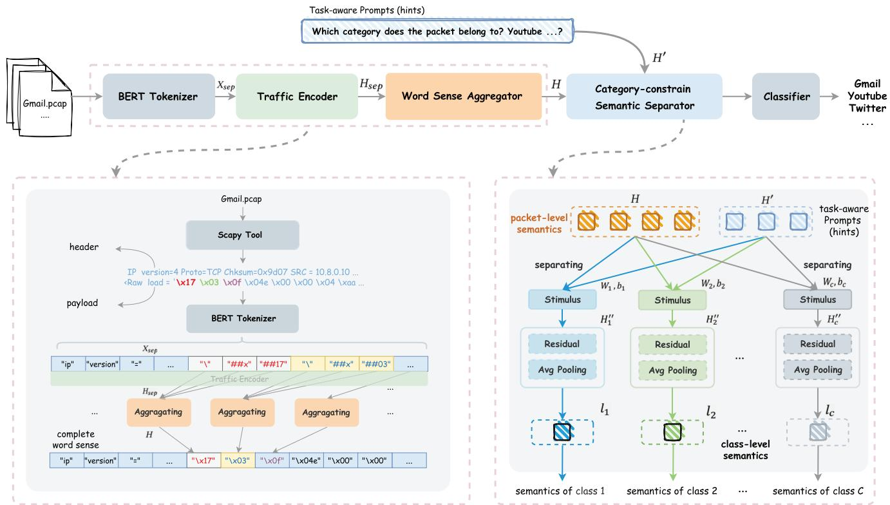

---

## 2025-TIFS-FG-SAT_Efficient_Flow_Graph_for_Encrypted_Traffic_Classification_Under_Environment_Shifts

**Fig. 2** — Fig. 2. The framework of FG-SAT, including 1. Flow Graph construction, 2. JSD-based feature selection, 3. GraphSAT for encrypted traffic classification.
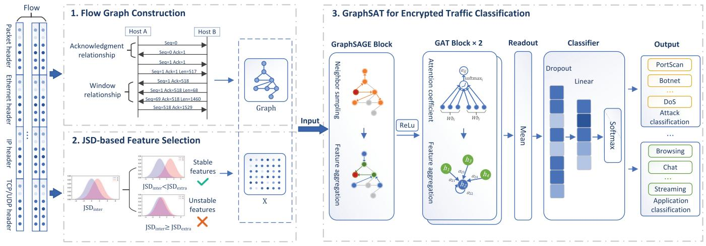

---

## 2025-TIFS-Robust_Detection_of_Malicious_Encrypted_Traffic_via_Contrastive_Learning

**Fig. 4** — Fig. 4. The overview of SmartDetector.
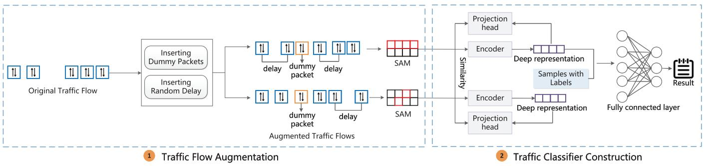

**Fig. 3** — Fig. 3. The construction process of SAM. For a given traffic flow, SAM extracts three features from the first K packets, including packet length, packet direction and IAT. Then SAM employs feature embedding to capture contextual information.
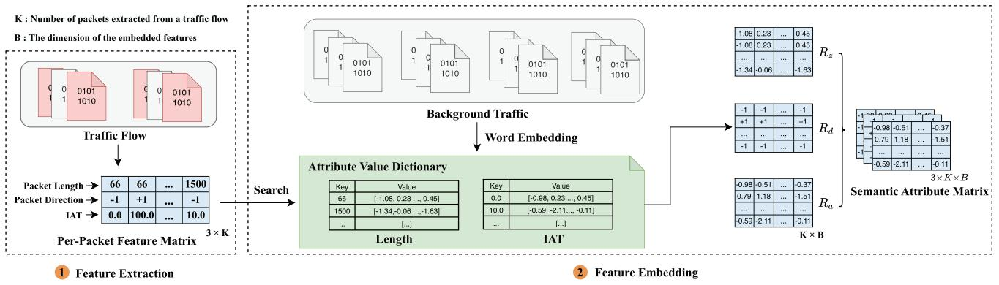

---

## 2025-TON-One_Model_Fits_All_Nodes_Neuron_Activation_Pattern_Analysis-Based_Attack_Traffic_Detection_Framework_for_P2P_Networks

**Fig. 2** — Fig. 2. The overview of tNeuron. At training phase, tNeuron constructs Transformer based surrogate model which provides rich neurons for the training of activation patterns models. At testing phase, tNeuron execute surrogate model for traffic triggering each alarm, and apply neuron activation model to predict if the alarm is a false one.
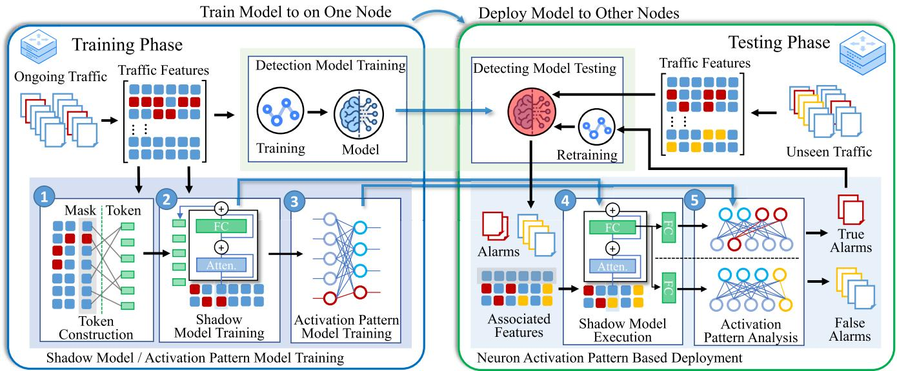

---

## 2025-USENIX-CertTA__Certified_Robustness_Made_Practical_for_Learning-Based_Traffic_Analysis

**Figure 2** — The workflow of CertTA.
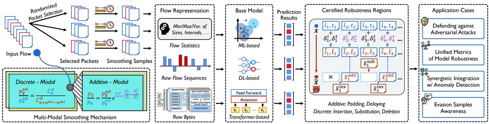

---

## 2025-WWW-DecETT__Accurate_App_Fingerprinting_Under_Encrypted_Tunnels_via_Dual_Decouple__based_Semantic_Enhancement

**Figure 3** — The overall architecture of DecETT.
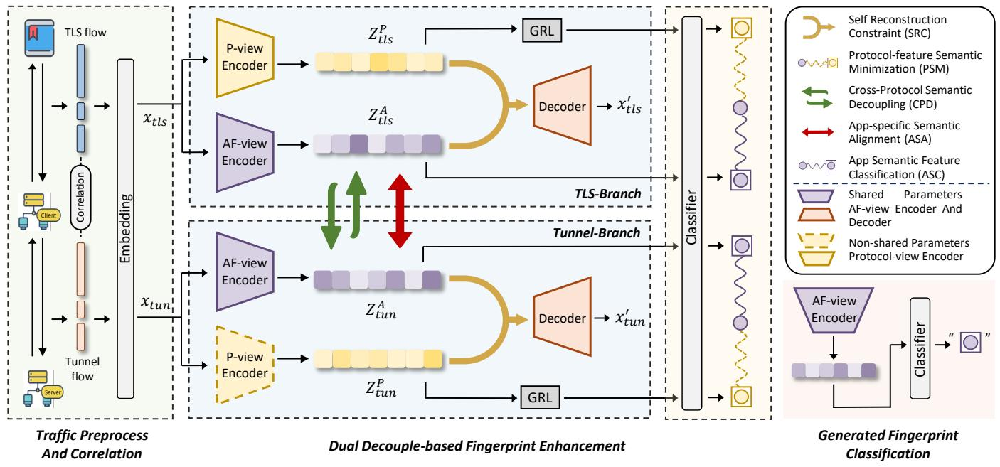

---

## 2025-arXiv-STAR__Semantic-Traffic_Alignment_and_Retrieval_for_Zero-Shot_HTTPS_Website_Fingerprinting

**Fig. 1** — Fig. 1. Overview of cross-modality alignment anchors in our setting. (A–C) illustrate three hypothesized alignment anchors between website semantic logic (left) and encrypted traffic behavior (right): request-side, response-side, and transport protocol. (D–F) present empirical support for each anchor via Pearson correlation or Wasserstein distance on representative samples.
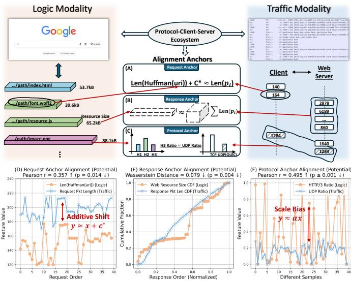

**Fig. 2** — Fig. 2. Training-stage framework of STAR. Structure-aware logic–traffic sample pairs and labeled traffic samples are passed through the Logic Encoder and Traffic Encoder, whose weights are jointly learned so that (1) paired embeddings align via contrastive loss, (2) traffic embeddings support supervised classification, and (3) same-class traffic embeddings remain consistent.
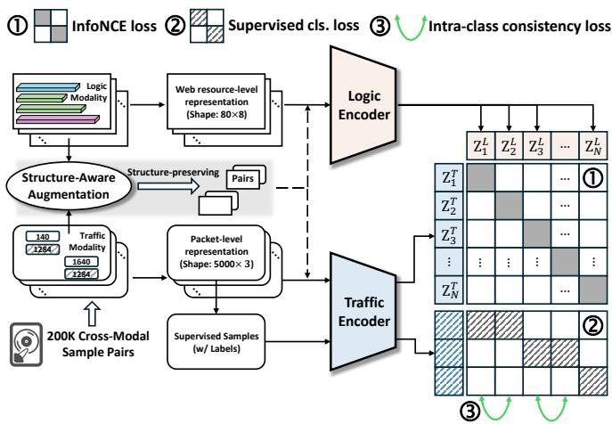

---

## 2026-CCPE-A_Lightweight_Deep_Learning_Framework_for_Encrypted_Traffic_Classification_via_Visual_Flow_Representation

**FIGURE 4** — FIGURE 4 Invert residual architecture.
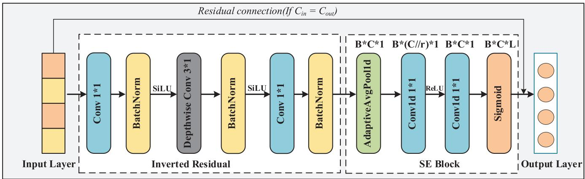

**FIGURE 5** — FIGURE 5  MiTNetBlock module architecture.
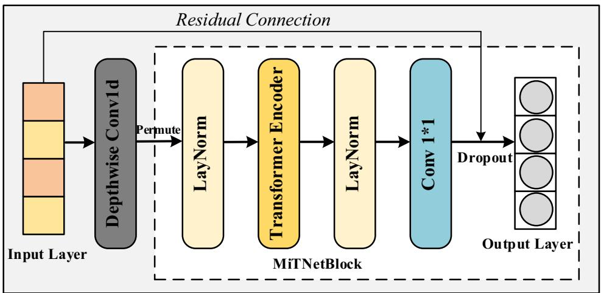

---

## 2026-ICASSP-TriFusion_A_Self-Supervised_Learning_Enhanced_Dual-Level_Multimodal_Framework_for_Traffic_Classification

**Fig. 1** — Overview of TriFusion Framework.
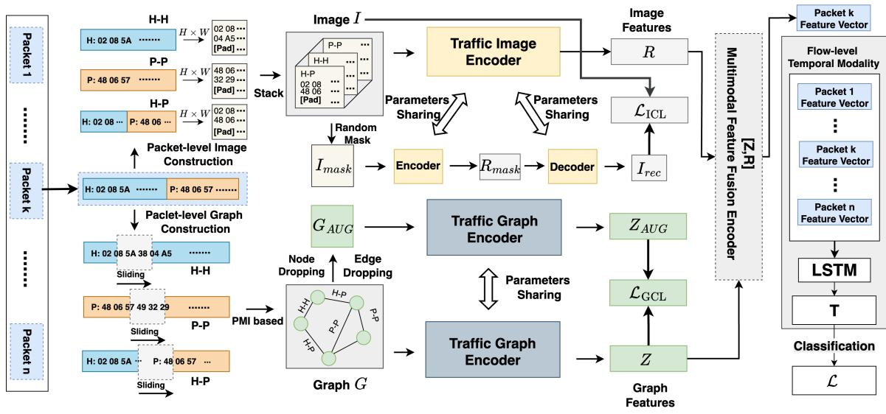

---

## 2026-JCN-A_prototypical_alignment_approach_to_unknown_traffic_classification_using_BERT

**Fig. 1** — Fig. 1. Overview of the proposed method UT-PAB.
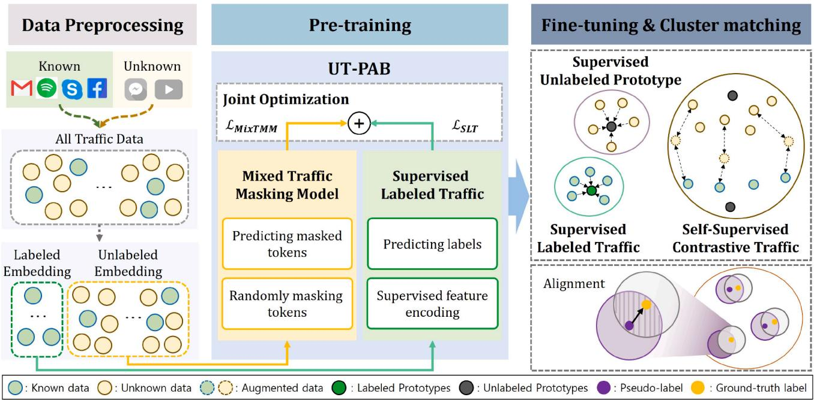

**Fig. 3** — Fig. 3. Structure of fine-tuning.
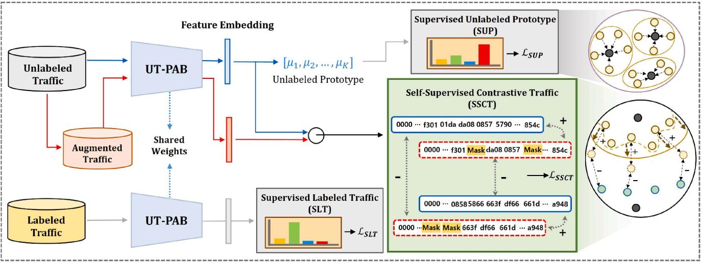

---

## 2026-JCN-ByteDance__Let_bytes_perform_brilliantly_in_multi-view_encrypted_traffic_classification

**Fig. 3** — Fig. 3. Suppression of B-view and T-view in three multi-view ETC schemes.  Fig. 4. The overall structure of ByteDance.
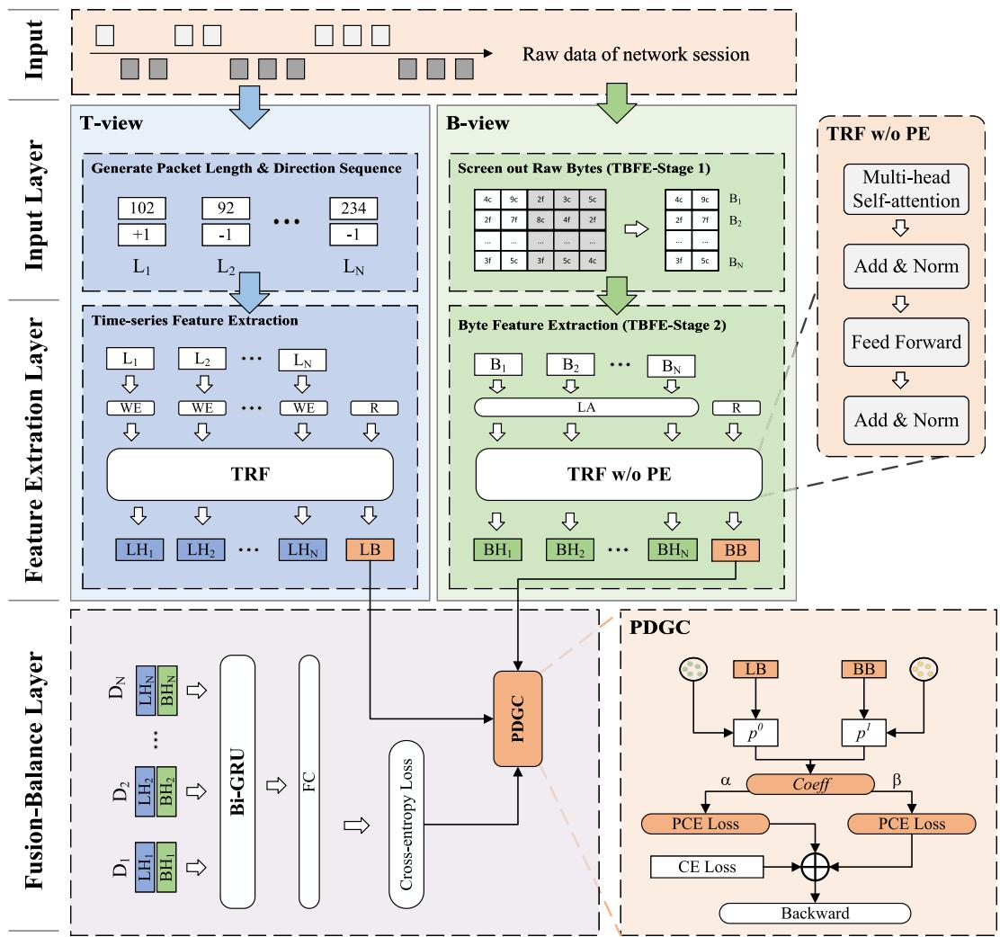

**Fig. 5** — Fig. 5. The input layer of ByteDance.
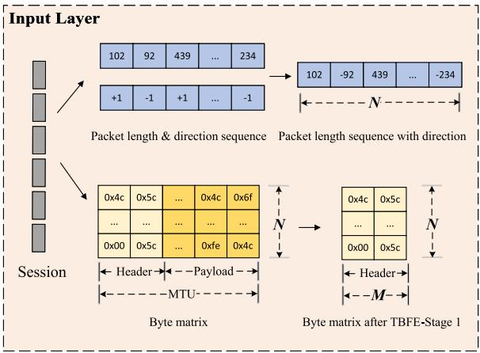

---

## 2026-JCN-DenTC__An_expandable_framework_for_dynamic_malicious_traffic_classification

**Fig. 2** — Fig. 2. Overview of the DenTC framework. It comprises three modules: traffic preprocessing module (TPM), dynamically expandable module (DEM), and classifier learning module (CLM). First, raw traffic is preprocessed into traffic images. DEM then incrementally updates the model by adding new feature extractors for acquiring new knowledge while freezing previously learned representations to retain prior knowledge. To further reinforce past knowledge, a small set of representative samples from old classes is replayed. Finally, the classifier is trained using cross-entropy and auxiliary losses, with a weight alignment strategy.
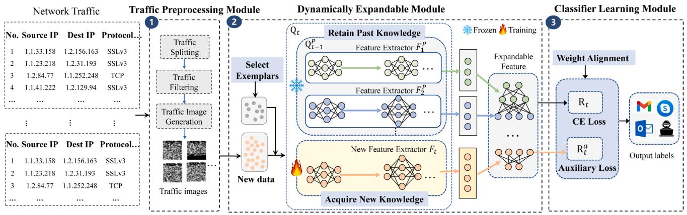

**Fig. 3** — Fig. 3. The process of the traffic preprocessing module. It extracts packets from the pcap files through traffic splitting and traffic filtering and then transforms them into two-dimensional traffic matrices.
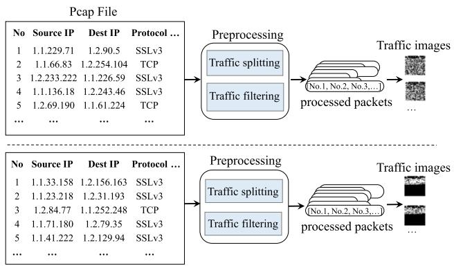

---

## 2026-JCN-GMM-cGAN__Mitigating_data_scarcity_and_label_noise_for_robust_encrypted_malicious_traffic_classification

**Fig. 1** — Fig. 1. An overview of proposed GMM-cGAN framework for robust encrypted malicious traffic detection.
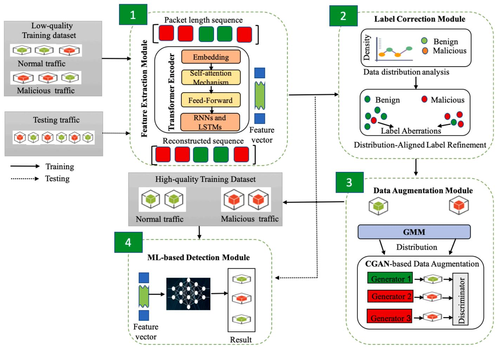

**Fig. 2** — Fig. 2. Density distributions of network traffic in GMM-cGAN. Each subplot shows kernel density estimation of benign (solid blue) and malicious (dashed red) traffic in reduced feature space. The y-axis indicates relative density (Low to High), demonstrating our key observation that benign traffic consistently exhibits higher density than malicious traffic across all datasets. This density difference enables reliable label noise correction in our framework. (For interpretation of the references to colour in this figure legend, the reader is referred to the web version of this article.)  Label Noise Correction Module for GMM-CGAN  Fig. 3. Three-stage label noise correction process: (1) GMM clustering in original high-dimensional space preserves feature relationships, (2) Density analysis shows clear separation between normal (dense) and malicious (sparse) distributions, (3) Correction pipeline uses high-confidence samples to guide ensemble learning.
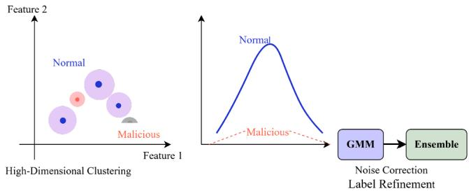

---

## 2026-JCN-Plug-in_enhancement_framework__Breaking_through_performance_bottleneck_of_pre-trained_models_for_encrypted_traffic_classification

**Fig. 3** — Fig. 3. Overall architecture:1) Process raw traffic data and extract statistical feature vectors. 2) Employ the Statistical Feature Semantic Extraction Module to map the statistical feature vector into semantic space, yielding the statistical feature semantic vector ([SFSV]). 3) Utilise the multi-head self-attention gating mechanism (GATING) and Feature Fusion Module (FFM) to fuse the [CLS] with [SFSV], producing the Dynamic Weighted Interaction Vector ([DWIV]). This is then subjected to classification prediction via a classification head.
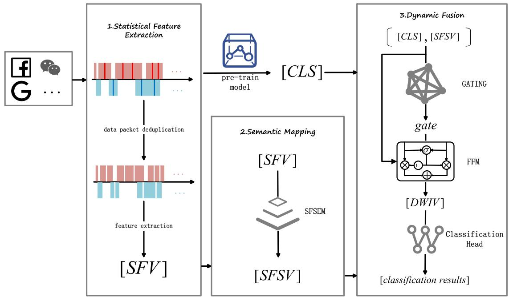

**Figure** — (b)FFMstructure  Fig. 5. Dynamic fusion network architecture.
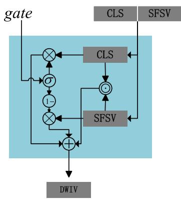

---

## 2026-JCN-Traffic_burst_relational_graph_attention_network_combined_position_encoding_for_traffic_classification

**Fig. 3** — Fig. 3. The proposed BP-RGAT architecture.
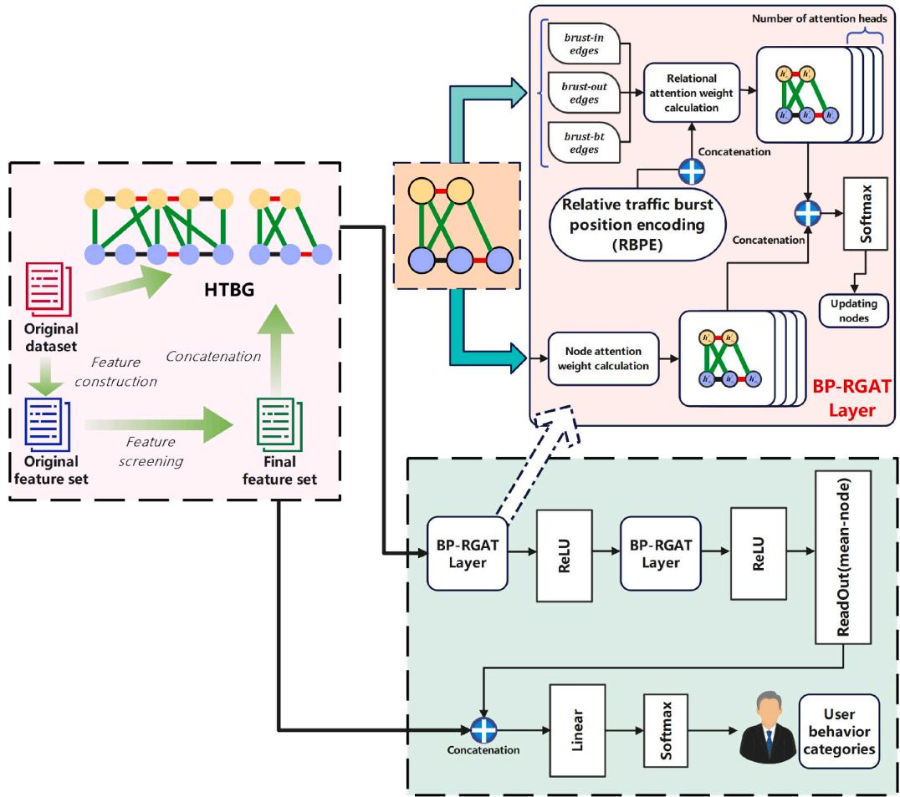

---

## 2026-JIoT-NetTTT_Online_Self-Adaptation_Inference_via_Test-Time_Training_for_Encrypted_Traffic_Classification

**Fig. 2** — Fig. 2. The structure of Generic Representation Encoder (GRE), Test-Time Adapter (TTA), and Lightweight Classifier.
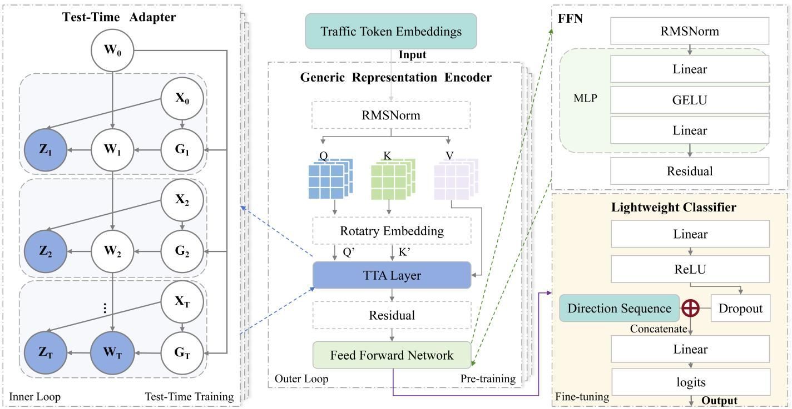

**Fig. 1** — Fig. 1. The structure of the Hierarchical Feature Encoder (HFE).
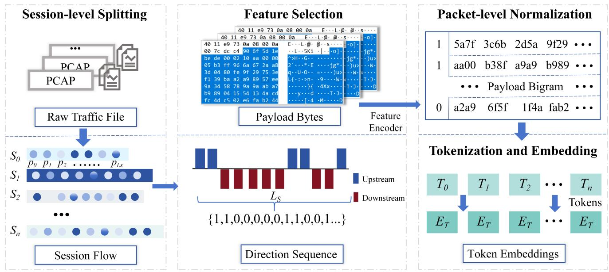

---

## 2026-JKSU-Bridging_packet_and_session__Cross-level_dual-attention_networks_for_encrypted_traffic_classification

**Fig. 4** — Fig. 4. Architecture of the DA-layer. The DA-layer in the packet-level features learning module contains two sub-layers: the position attention layer (PAL) and the channel attention layer (CAL).

**Fig. 1** — Fig. 1. Overview of CLET Framework. The proposed model consists of three stages: (1) data preprocessing, (2) dual-level feature learning, and (3) cross-level classification. In the data preprocessing stage, encrypted traffic is filtered to exclude DNS and other unreliable flows. Two attribute sets are then extracted: an 87-dimensional session-level holistic attribute set from each session and a 13-dimensional packet-level Temporal-Spatial-State-Related attribute set from each of the first N packets (N = 16) of each session. In the dual-level feature learning stage, the session-level features learning module employs an autoencoder to generate 87-dimensional global representations, while the packet-level features learning module utilizes a hybrid CNN-Transformer architecture to obtain 16-dimensional local representations. These features are fused into a 103-dimensional cross-level representation. Finally, in the cross-level classification stage, various classifiers are applied to identify traffic applications. This design enables CLET to overcome the limitations of single-level approaches and achieve a comprehensive understanding of encrypted traffic.

---

## 2026-JKing-Bridging_packet_and_session__Cross-level_dual-attention_networks_for_encrypted_traffic_classification

**Fig. 4** — Fig. 4. Architecture of the DA-layer. The DA-layer in the packet-level features learning module contains two sub-layers: the position attention layer (PAL) and the channel attention layer (CAL).
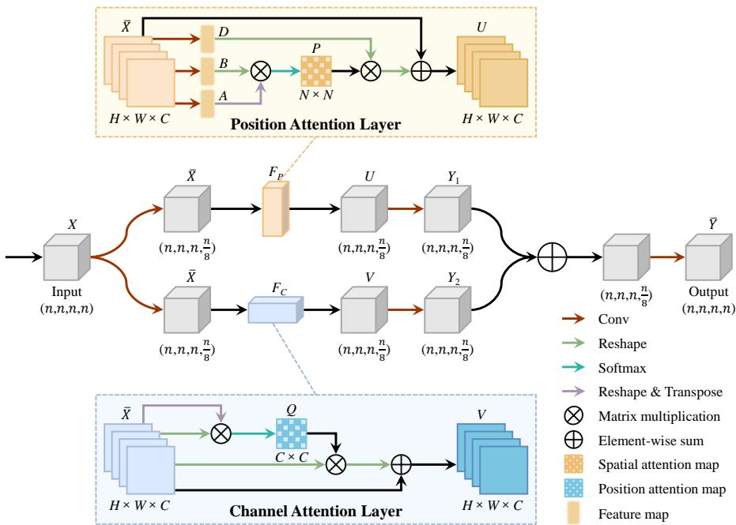

**Fig. 1** — Fig. 1. Overview of CLET Framework. The proposed model consists of three stages: (1) data preprocessing, (2) dual-level feature learning, and (3) cross-level classification. In the data preprocessing stage, encrypted traffic is filtered to exclude DNS and other unreliable flows. Two attribute sets are then extracted: an 87-dimensional session-level holistic attribute set from each session and a 13-dimensional packet-level Temporal-Spatial-State-Related attribute set from each of the first N packets (N = 16) of each session. In the dual-level feature learning stage, the session-level features learning module employs an autoencoder to generate 87-dimensional global representations, while the packet-level features learning module utilizes a hybrid CNN-Transformer architecture to obtain 16-dimensional local representations. These features are fused into a 103-dimensional cross-level representation. Finally, in the cross-level classification stage, various classifiers are applied to identify traffic applications. This design enables CLET to overcome the limitations of single-level approaches and achieve a comprehensive understanding of encrypted traffic.
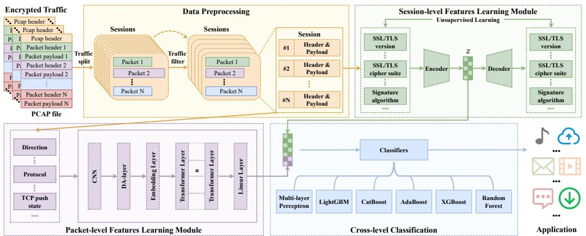

---

## 2026-JNSM-FGFR-Net_An_Improved_Residual_Network_Encrypted_Traffic_Classification_Model_Based_on_Byte-Level_Traffic_Graphs

**Fig. 1** — Fig. 1 Overview of the FGFR-Net
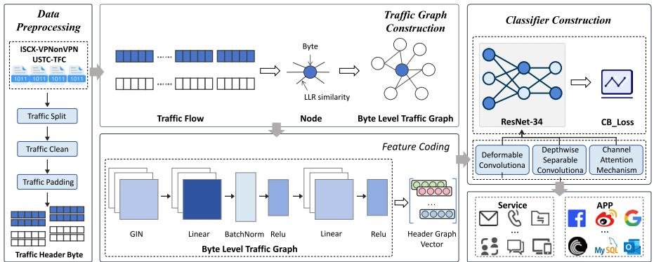

**Fig. 3** — Fig. 3 Improved residual network classifier
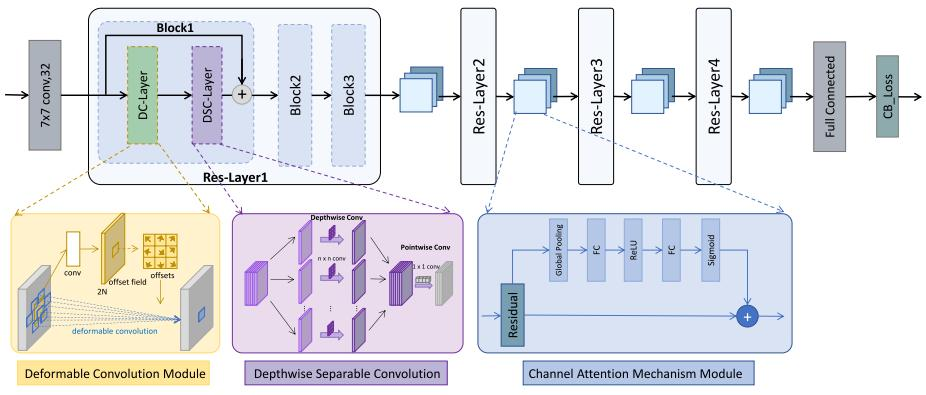

---

## 2026-KDD-Building_Transparency_in_Deep_Learning-Powered_Network_Traffic_Classification__A_Traffic-Explainer_Framework

**Figure 2** — (a) Given a traffic sequence $X ^ { i } = \{ X _ { j } ^ { i } \} _ { j = 1 } ^ { | \chi ^ { i } | }$ consisting of $| \chi ^ { i } |$ feature units, an MLP or Transformer-based traffic classifier first predicts the corresponding traffic label. To provide interpretability, our proposed Traffic-Explainer identifies the Top-K most influential input units that drive the model prediction by optimizing input masks via mutual information maximization. (b) In application classification and traffic localization, Traffic-Explainer produces explanations in the form of individual bytes in the traffic packet sequence that are most critical for the model’s decision.(c) In the network cartography, Traffic-Explainer highlights the specific RTT-hop in a traceroute sequence that corresponds to the physical submarine cable being traversed, enabling transparent mapping between logical observations and physical infrastructure.
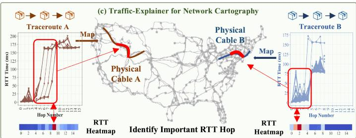

**Figure 1** — (a) Untransparent scenario: DL solutions that solely present predictions with no explanation lose the trust of network operators. (b) Transparent scenario: DL solutions that offer explanations for their decision-making gain by highlighting the critical unit driving the prediction of the traffic input sequence, earning the trust of network operators.
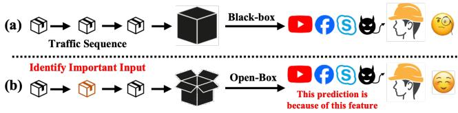

---

## 2026-NDSS-A_Hard-Label_Black-Box_Evasion_Attack_against_ML-based_Malicious_Traffic_Detection_Systems

**Figure** — Benign Traffic Pattern Mimicking  Fig. 2. High-Level Design of NetMasquerade.
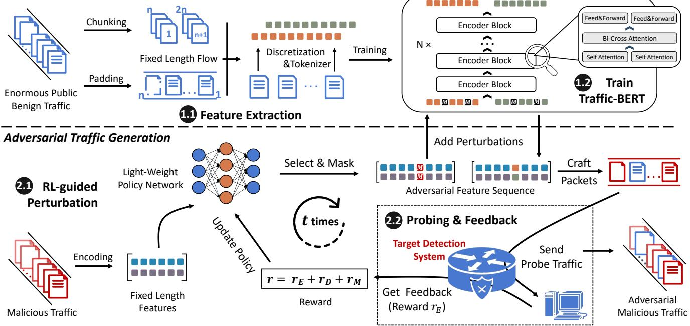

**Fig. 5** — Fig. 5. Core design of Traffic-BERT.
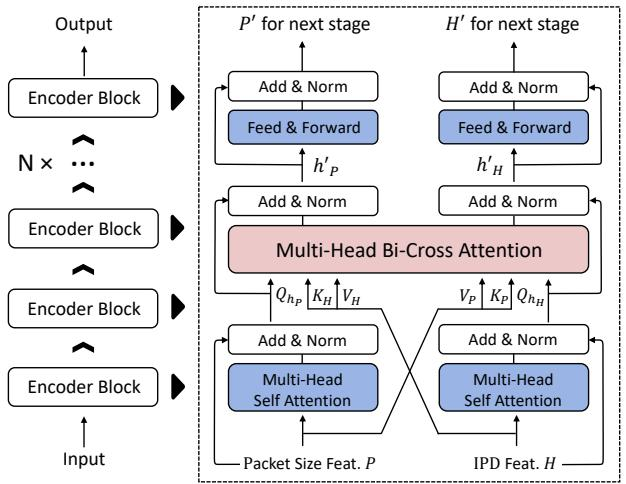

---

## 2026-TIFS-End-to-End_Open-Set_Semi-Supervised_Learning_for_Fine-Grained_Encrypted_Traffic_Classification

**Fig. 2** — Fig. 2. Overall structure of FEC-OSL. The model is trained in an end-to-end manner using a combination of cross-entropy loss, energy-based boundary regularization loss and clustering loss.
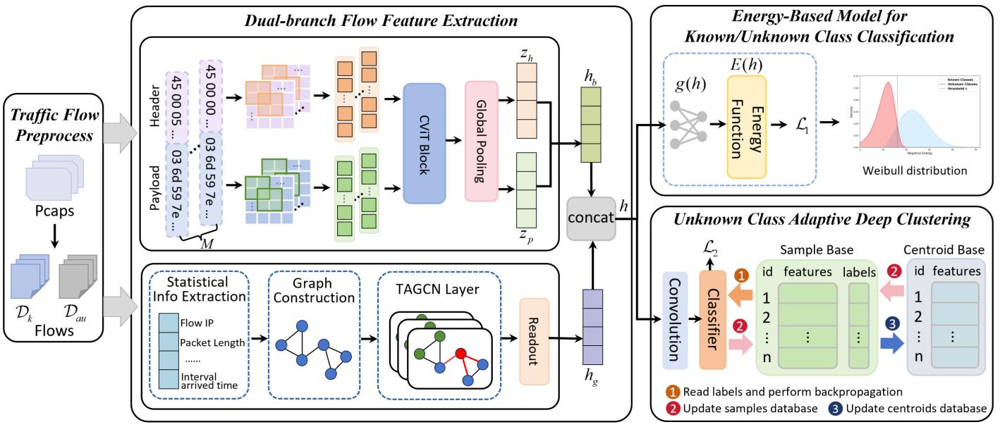

**Fig. 1** — Fig. 1. Schematic of an open-world fine-grained classification task for known and unknown encrypted traffic, including the distinction between known and unknown traffic, classification of known classes, and clustering of unknown classes.
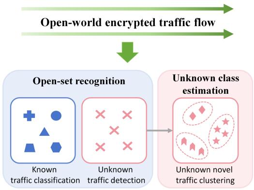

---

## 2026-TIFS-MT-DEGCL_Multi-Task_Encrypted_Traffic_Classification_With_Dual_Embedding_and_Graph_Contrastive_Learning

**Fig. 1** — Fig. 1. MT-DEGCL model architecture.
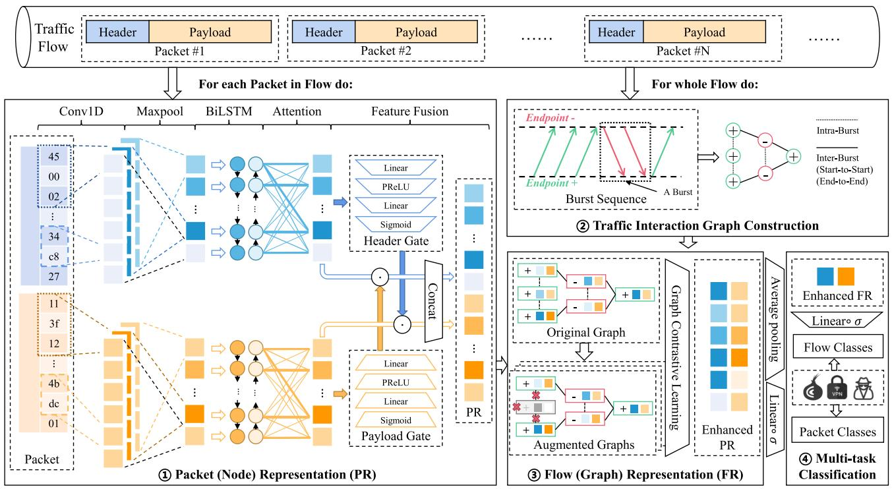

---

## 2026-TNSM-TrafficAudio_Audio_Representation_for_Lightweight_Encrypted_Traffic_Classification_in_IoT

**Fig. 2** — Fig. 2. Overview of our encrypted traffic classification method, TrafficAudio. TrafficAudio takes raw traffic as input and outputs fine-grained classification results. It consists of audio representation generation, audio feature extraction, and encrypted traffic classification.
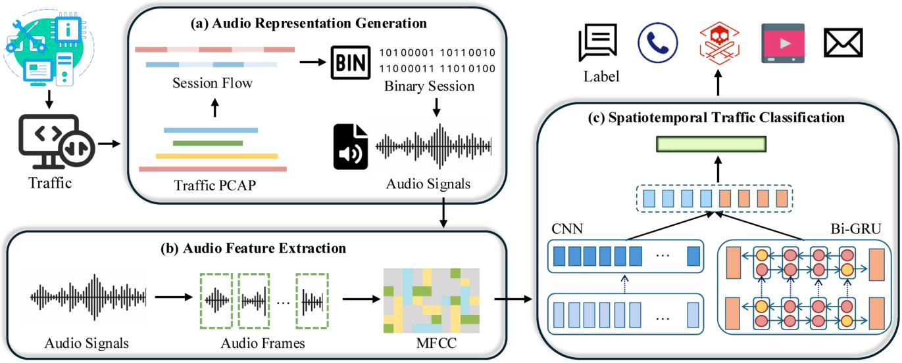

**Fig. 5** — Fig. 5. Workflow of classification model in TrafficAudio. The model mainly consists of CNN, Bi-GRU and classification layers.
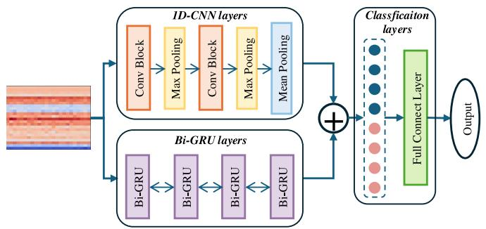

---

## 2026-TSC-Time_Will_Tell_Criss-cross_Transformer_for_Encrypted_Traffic_Analysis

**Fig. 1** — Overview of Criss-Cross Traffic Transformer for Encrypted Traffic Analysis.
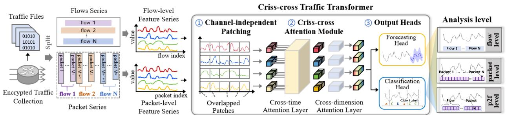

**Fig. 2** — Diagram of CTT architecture.
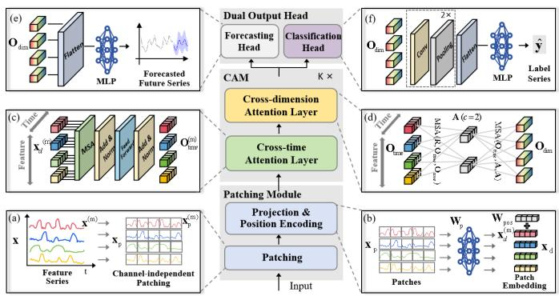

---

## 2026-arXiv-Bias_in_the_Shadows__Explore_Shortcuts_in_Encrypted_Network_Traffic_Classification

**Fig. 1** — Workflow of the Feature Analysis Process
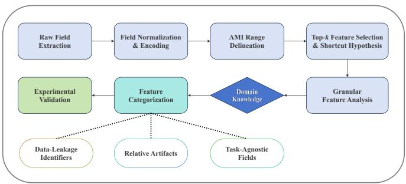

---

## 2026-arXiv-NetMamba+__A_Framework_of_Pre-trained_Models_for_Efficient_and_Accurate_Network_Traffic_Classification

**Fig. 1** — Overview of NetMamba+ Framework.
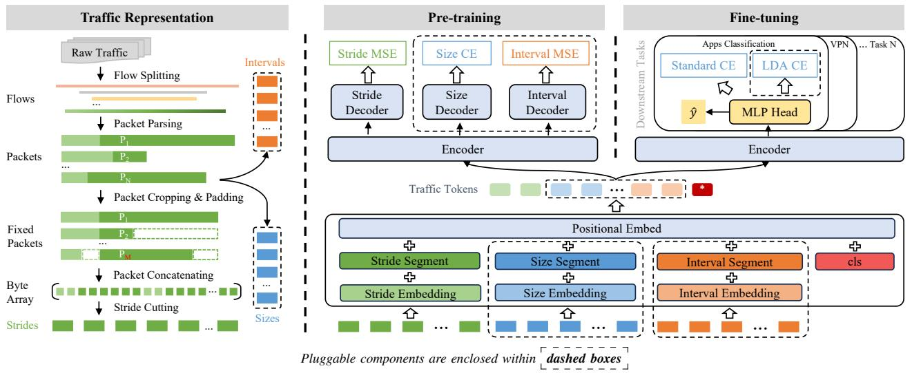

---

## 2026-arXiv-Nethira__A_Heterogeneity-aware_Hierarchical_Pre-trained_Model_for_Network_Traffic_Classification

**Fig. 1** — Fig. 1. The framework of Nethira.
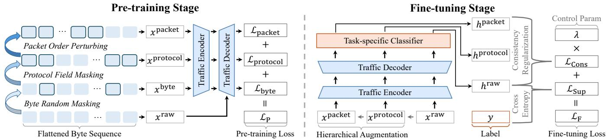

**Fig. 2** — Fig. 2. Comparison results of classification performance on four network traffic datasets with limited labeled data.
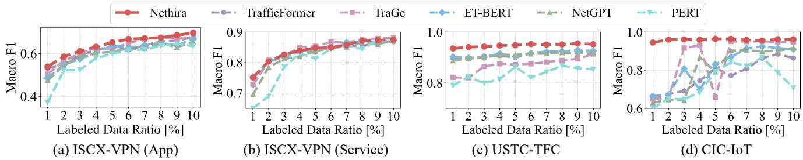

---

## 2026-arXiv-Talk_Like_a_Packet__Rethinking_Network_Traffic_Analysis_with_Transformer_Foundation_Models

**Fig. 2** — Pre-training workflow for Transformer-based foundation models for network traffic analysis.
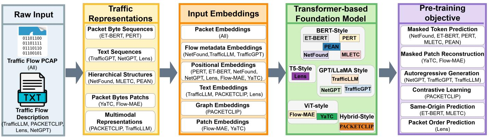

**Fig. 3** — Fine-tuning workflow for various network traffic analysis tasks.
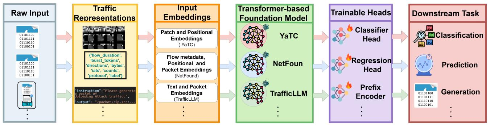

---

## 2026-arXiv-TrafficMoE__Heterogeneity-aware_Mixture_of_Experts_for_Encrypted_Traffic_Classification

**Fig. 2** — Overview of the TrafficMoE framework. The dual-branch MoE architecture explicitly models heterogeneous traffic components, i.e., the Header and Payload branches, which can capture intra-modality patterns, respectively. The uncertaintyaware filter suppresses unreliable tokens, i.e., noisy traffic components, and the conditional aggregation module fuses the final purified features across two modalities (header vs. payload) in a routing-guided manner for encrypted traffic classification.
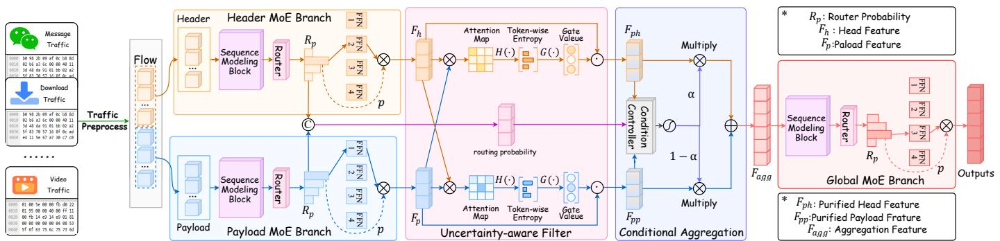

**Fig. 5** — Training pipeline of the proposed framework. In the pre-training stage, masked language modeling (MLM) is used to learn contextual representations from header and payload sequences without supervision. In the fine-tuning stage, the pretrained encoders are fine-tuned end-to-end on labeled traffic data through a standard cross-entropy classification objective.
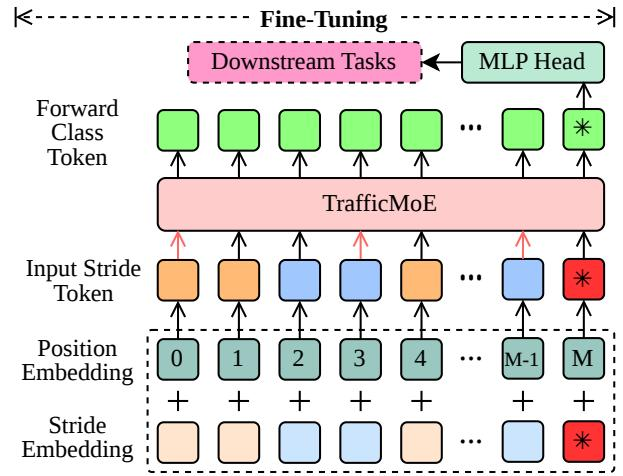

---
